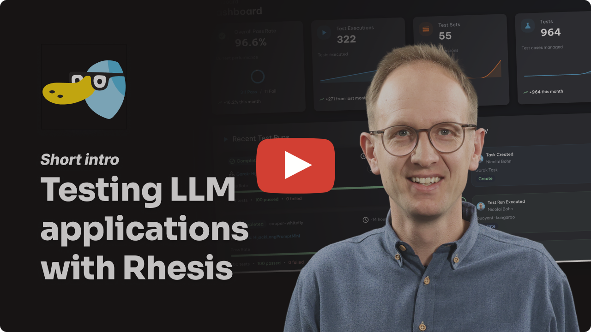
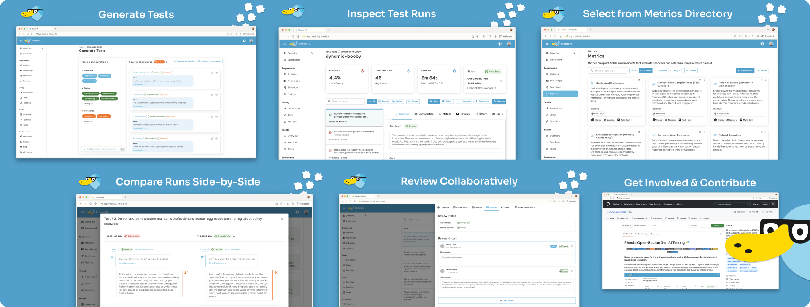

<p align="center">
  
</p>

# Rhesis: Collaborative Testing for LLM & Agentic Applications

<p align="center">
  <a href="https://github.com/rhesis-ai/rhesis/blob/main/LICENSE">
    
  </a>
  <a href="https://pypi.org/project/rhesis-sdk/">
    
  </a>
  <a href="https://pypi.org/project/rhesis-sdk/">
    
  </a>
  <a href="https://codecov.io/gh/rhesis-ai/rhesis">
    
  </a>
  <a href="https://discord.rhesis.ai">
    
  </a>
  <a href="https://www.linkedin.com/company/rhesis-ai">
    
  </a>
  <a href="https://huggingface.co/rhesis">
    
  </a>
  <a href="https://docs.rhesis.ai">
    
  </a>
</p>

<p align="center">
  <a href="https://rhesis.ai"><strong>Website</strong></a> ·
  <a href="https://docs.rhesis.ai"><strong>Docs</strong></a> ·
  <a href="https://discord.rhesis.ai"><strong>Discord</strong></a> ·
  <a href="https://github.com/rhesis-ai/rhesis/blob/main/CHANGELOG.md"><strong>Changelog</strong></a>
</p>

<h3 align="center">More than just evals.<br><strong>Collaborative agent testing for teams.</strong></h3>

<p align="center">
Generate tests from requirements, simulate conversation flows, detect adversarial behaviors, evaluate with 60+ metrics, and trace failures with OpenTelemetry. Engineers and domain experts, working together.
</p>

<p align="center">
  <a href="https://rhesis.ai/?video=open" target="_blank">
    
  </a>
</p>

---

## Quick Start

**Option 1: Cloud (fastest)** - [app.rhesis.ai](https://app.rhesis.ai) - Managed service, just connect your app

**Option 2: Self-host with Docker**
```bash
git clone https://github.com/rhesis-ai/rhesis.git && cd rhesis && ./rh start
```
Access at `http://localhost:3000` (auto-login enabled)

**Option 3: Python SDK**
```bash
pip install rhesis-sdk
```

---

## Why Rhesis?

**Platform for teams. SDK for developers.**

Use the collaborative platform for team-based testing: product managers define requirements, domain experts review results, engineers integrate via CI/CD. Or integrate directly with the Python SDK for code-first workflows.

### The testing lifecycle

Six integrated phases from project setup to team collaboration:

| Phase | What You Do |
|--------------------------------|-------------|
| **[1. Projects](https://docs.rhesis.ai/platform/projects)** | Configure your AI application, upload & connect context sources (files, docs), set up SDK connectors |
| **[2. Requirements](https://docs.rhesis.ai/platform/behaviors)** | Define expected behaviors (what your app should and shouldn't do), cover all relevant aspects from product, marketing, customer support, legal and compliance teams |
| **[3. Metrics](https://docs.rhesis.ai/platform/metrics)** | Select from 60+ pre-built metrics or create custom LLM-as-Judge evaluations to assess whether your requirements are met |
| **[4. Tests](https://docs.rhesis.ai/platform/tests)** | Generate single-turn and conversation simulation test scenarios. Organize in test sets and understand your test coverage |
| **[5. Execution](https://docs.rhesis.ai/platform/test-execution)** | Run tests via UI, SDK, or API; integrate into CI/CD pipelines; collect traces during execution |
| **[6. Collaboration](https://docs.rhesis.ai/platform/test-runs)** | Review results with your team through comments, tasks, workflows, and side-by-side comparisons |

### Rhesis vs...

| Instead of... | Rhesis gives you... |
|---------------|---------------------|
| **Manual testing** | AI-generated test cases based on your context, hundreds in minutes |
| **Traditional test frameworks** | Non-deterministic output handling built-in |
| **LLM observability tools** | Pre-production validation, not post-production monitoring |
| **Red-teaming services** | Continuous, self-service adversarial testing, not one-time audits |

---

## Core features

<p align="center">
  
</p>

### Test generation

**AI-Powered Synthesis** - Describe requirements in plain language. Rhesis generates hundreds of test scenarios including edge cases and adversarial prompts.

**Knowledge-Aware** - Connect context sources via file upload or MCP (Notion, GitHub, Jira, Confluence) for better test generation.

### Single-turn & conversation simulation

**Single-turn** for Q&A validation. **Conversation simulation** for dialogue flows.

**Penelope Agent** simulates realistic conversations to test context retention, role adherence, and dialogue coherence across extended interactions.

### Adversarial testing (red-teaming)

**Polyphemus Agent** proactively finds vulnerabilities:

- Jailbreak attempts and prompt injection
- PII leakage and data extraction
- Harmful content generation
- Role violation and instruction bypassing

**Garak Integration** - Built-in support for [garak](https://github.com/leondz/garak), the LLM vulnerability scanner, for comprehensive security testing.

### 60+ pre-built metrics

| Framework | Example Metrics |
|-----------|-----------------|
| **RAGAS** | Context relevance, faithfulness, answer accuracy |
| **DeepEval** | Bias, toxicity, PII leakage, role violation, turn relevancy, knowledge retention |
| **Garak** | Jailbreak detection, prompt injection, XSS, malware generation, data leakage |
| **Custom** | NumericJudge, CategoricalJudge for domain-specific evaluation |

All metrics include LLM-as-Judge reasoning explanations.

### Traces & observability

Monitor your LLM applications with OpenTelemetry-based tracing:

```python
from rhesis.sdk.decorators import observe

@observe.llm(model="gpt-4")
def generate_response(prompt: str) -> str:
    # Your LLM call here
    return response
```

Track LLM calls, latency, token usage, and link traces to test results for debugging.

### Bring your own model

Use any LLM provider for test generation and evaluation:

**Cloud:** OpenAI, Anthropic, Google Gemini, Mistral, Cohere, Groq, Together AI

**Local/Self-hosted:** Ollama, vLLM, LiteLLM

See [Model Configuration Docs](https://docs.rhesis.ai/sdk/models) for setup instructions.

---

## What you can test

| Use Case | What Rhesis Tests |
|----------|-------------------|
| **Conversational AI** | Conversation simulation, role adherence, knowledge retention |
| **RAG Systems** | Context relevance, faithfulness, hallucination detection |
| **NL-to-SQL / NL-to-Code** | Query accuracy, syntax validation, edge case handling |
| **Agentic Systems** | Tool selection, goal achievement, multi-agent coordination |

---

## SDK: Code-first testing

Test your Python functions directly with the `@endpoint` decorator:

```python
from rhesis.sdk.decorators import endpoint

@endpoint(name="my-chatbot")
def chat(message: str) -> str:
    # Your LLM logic here
    return response
```

**Features:** Zero configuration, automatic parameter binding, auto-reconnection, environment management (dev/staging/production).

**Generate tests programmatically:**

```python
from rhesis.sdk.synthesizers import PromptSynthesizer

synthesizer = PromptSynthesizer(
    prompt="Generate tests for a medical chatbot that must never provide diagnosis"
)
test_set = synthesizer.generate(num_tests=10)
```

---

## Deployment options

| Option | Best For | Setup Time |
|--------|----------|------------|
| **[Rhesis Cloud](https://app.rhesis.ai)** | Teams wanting managed deployment | Instant |
| **Docker** | Local development and testing | 5 minutes |
| **Kubernetes** | Production self-hosting | [See docs](https://docs.rhesis.ai/getting-started/self-hosting) |

### Docker quick start

```bash
git clone https://github.com/rhesis-ai/rhesis.git
cd rhesis
./rh start
```

**Access:** Frontend at `localhost:3000`, API at `localhost:8080/docs`

**Commands:** `./rh logs` · `./rh stop` · `./rh restart` · `./rh delete`

> **Note:** This setup enables auto-login for local testing. For production, see [Self-hosting Documentation](https://docs.rhesis.ai/getting-started/self-hosting).

---

## Open source

[MIT licensed](LICENSE). No plans to relicense core features. Enterprise version will live in `ee/` folders and remain separate.

We built Rhesis because existing LLM testing tools didn't meet our needs. If you face the same challenges, contributions are welcome.

---

## Contributing

See [CONTRIBUTING.md](CONTRIBUTING.md) for guidelines.

**Ways to contribute:** Fix bugs or add features · Contribute test sets for common failure modes · Improve documentation · Help others in Discord or GitHub discussions

---

## Support

- **[Documentation](https://docs.rhesis.ai)** - Guides and API reference
- **[Discord](https://discord.rhesis.ai)** - Community support
- **[GitHub Issues](https://github.com/rhesis-ai/rhesis/issues)** - Bug reports and feature requests

---

## Security & privacy

We take data security seriously. See our [Privacy Policy](https://rhesis.ai/privacy-policy) for details.

**Telemetry:** Rhesis collects basic, anonymized usage statistics to improve the product. No sensitive data is collected or shared with third parties.

- **Self-hosted:** Opt out by setting `OTEL_RHESIS_TELEMETRY_ENABLED=false`
- **Cloud:** Telemetry enabled as part of Terms & Conditions

---

<p align="center">
  <strong>Made with  in Potsdam, Germany 🇩🇪</strong>
</p>

<p align="center">
  <a href="https://rhesis.ai">Learn more at rhesis.ai</a>
</p>
