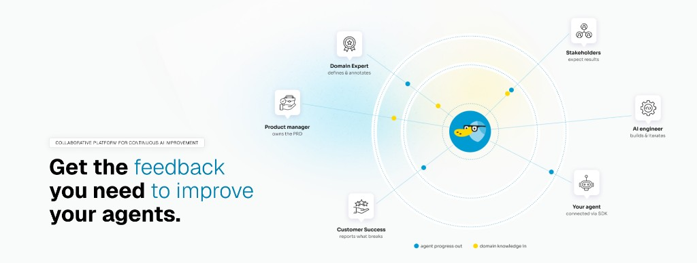
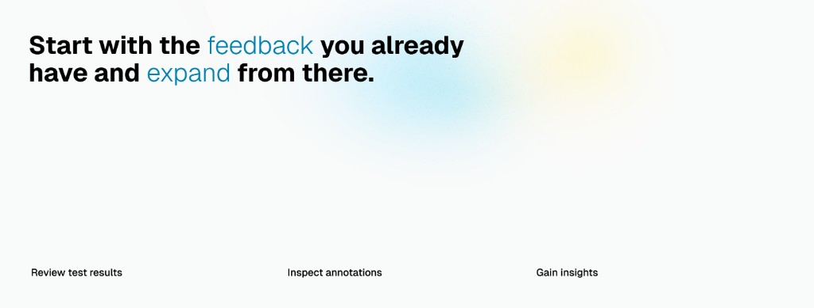
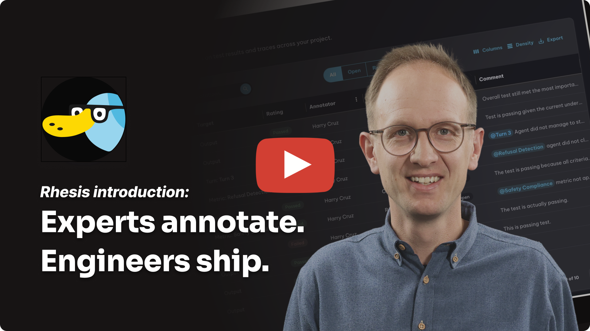

<p align="center">
  
</p>

<p align="center">
  <a href="https://github.com/rhesis-ai/rhesis/blob/main/LICENSE">
    
  </a>
  <a href="https://pypi.org/project/rhesis-sdk/">
    
  </a>
  <a href="https://pypi.org/project/rhesis-sdk/">
    
  </a>
  <a href="https://codecov.io/gh/rhesis-ai/rhesis">
    
  </a>
  <a href="https://discord.rhesis.ai">
    
  </a>
  <a href="https://www.linkedin.com/company/rhesis-ai">
    
  </a>
  <a href="https://huggingface.co/rhesis">
    
  </a>
  <a href="https://docs.rhesis.ai">
    
  </a>
</p>

<p align="center">
  <a href="https://rhesis.ai"><strong>Website</strong></a> ·
  <a href="https://docs.rhesis.ai"><strong>Docs</strong></a> ·
  <a href="https://discord.rhesis.ai"><strong>Discord</strong></a> ·
  <a href="https://github.com/rhesis-ai/rhesis/blob/main/CHANGELOG.md"><strong>Changelog</strong></a>
</p>

<h3 align="center">Structured feedback and evals for AI agents.<br>
<strong>Open source · SaaS or self-hosted · UI, SDK, and MCP</strong></h3>

<p align="center">
Connect the agent you are building, share the link with your team, and get structured feedback from the people who know the right answers.
</p>

---

## Why Rhesis?

Most tools start with tests or traces. Rhesis starts one step earlier: the people who know what the
agent should answer are not the people building it, and their feedback rarely arrives in a form you
can act on.

- **Feedback that stays attached** — Every review sits on the test case and the agent version that produced it, not in a Slack thread
- **One pass/fail bar** — The whole team reviews against the same tests, and you measure against them
- **UI for reviewers, SDK and MCP for builders** — Same data, three ways in
- **From feedback to CI** — Recurring feedback becomes tests and metrics that run on every change

---

## How it works

**1. Connect the agent you are building.** If it already serves a public REST endpoint, paste the
URL and you are done. Otherwise, and for most projects, use the SDK connector: your process opens
an outbound WebSocket, so the agent works from your laptop or your VPC with no public URL.

**2. Share the Rhesis link with your stakeholders.** Domain experts, product managers, and
reviewers open it in a browser. Nothing to install, no code.

**3. They put the agent to work.** In the playground they chat with the live agent and turn
interesting conversations into tests. They create and run test sets, simulate multi-turn
conversations, and leave structured feedback on what came back: pass/fail verdicts and comments,
down to the individual metric or conversation turn.

**4. Pull that feedback back into development.** Read it from the SDK or the REST API, or work
with it from Cursor, Claude Code, and other MCP clients through the Rhesis skill. Fix the agent,
run the same tests again.

**5. Agree on what the agent has to get right.** Each cycle, feedback that arrived as prose becomes
tests and metrics that check the same thing automatically. Reviews on a handful of cases end up as
evals that run on every change.

---

## Who it’s for

| Role | How they use Rhesis |
|------|---------------------|
| **AI engineers** | Connect the agent, pull feedback and reviewed test sets into the SDK, CI, and MCP while you build |
| **Domain experts** | Try the agent, review its answers, say what is wrong and what a correct answer looks like. UI, no code |
| **Product managers** | Turn scattered feedback into tests, and see whether the agent improves against the PRD. UI or MCP |

---

## Connect your agent

Rhesis needs a way to invoke the agent under test. Two ways to do it: we recommend the SDK
connector, but if your agent already has a public REST endpoint, that is the fastest way to get
started.

### SDK connector (recommended)

Your process opens a persistent outbound WebSocket. Rhesis sends test inputs down that connection,
so the agent needs no public URL and can stay on your laptop or inside your VPC. You write a
function instead of describing a payload, and the same SDK carries tracing.

```python
from rhesis.sdk.decorators import endpoint

@endpoint(name="my-chatbot")
def chat(message: str) -> str:
    # Call your agent here
    return my_agent(message)
```

Run it, and the endpoint registers itself in Rhesis. See the [SDK README](sdk/README.md) for
install, environments, and tracing.

### Your agent's REST endpoint (fastest start if it is public)

Already serving HTTP on a reachable URL? Register it in the UI, no code and nothing to deploy. You
supply auth headers plus request and response mapping, or let Rhesis derive the configuration from
an OpenAPI spec or by exploring the endpoint. See
[Creating endpoints](https://docs.rhesis.ai/docs/endpoints/creating-endpoints).

Either way, the next step is the same: share the link, and let your team start using the agent
through the [playground](https://docs.rhesis.ai/docs/playground) and test runs.

---

## Work from your own tools

Feedback lands in Rhesis, but you do not have to leave your editor to act on it.

### MCP and skills

Use Rhesis from MCP-capable clients (Cursor, Claude Code, and others): design suites, pull sets and
results, trigger runs, and read the feedback in the tools you already work in. Install with the
[skills](https://github.com/vercel-labs/skills) CLI:

```bash
npx skills add rhesis-ai/rhesis
```

See the [skills README](skills/rhesis/README.md).

### SDK and REST API

Pull test runs, results, and the reviews attached to them from Python, or hit the API directly from
CI in any language: [OpenAPI spec](https://api.rhesis.ai/docs).

> Tracing (OpenTelemetry) and LLM providers for synthesis and judges are documented separately. See
> [Tracing](https://docs.rhesis.ai/docs/tracing) and [Models](https://docs.rhesis.ai/sdk/models).
> Neither is how you connect the agent under test.

---

## Capabilities

<p align="center">
  
</p>

Nobody can review every case by hand. Once the first feedback is in, you can grow coverage from it:

- **Test generation** from your requirements, a PRD, or an uploaded file
- **Conversation simulation** with Penelope; **adversarial probing** with Polyphemus and [garak](https://github.com/leondz/garak)
- **60+ metrics** — RAGAS, DeepEval, garak, and custom LLM-as-Judge evaluators
- **Traces** linked to test results via OpenTelemetry

Generated tests are only as good as the requirements behind them. Instead of retyping a spec into a
prompt, connect the tools your requirements already live in (Notion, GitHub, Jira, Confluence) and
Rhesis writes tests from the real thing. See [Tools](https://docs.rhesis.ai/docs/tools).

| Use case | What you validate |
|----------|-------------------|
| **Conversational & support agents** | Role adherence, policy citation, escalation |
| **RAG / document Q&A** | Faithfulness, grounding, retrieval quality |
| **Tool-using & multi-agent systems** | Tool choice, goal completion, handoffs |
| **Regulated / high-stakes domains** | Must and must-not behaviors your reviewers defined |

Details: [docs.rhesis.ai](https://docs.rhesis.ai)

<p align="center">
  <a href="https://rhesis.ai/?video=open" target="_blank">
    
  </a>
</p>

---

## Get started

### Cloud

[app.rhesis.ai](https://app.rhesis.ai) — managed service, connect your agent and invite your team.

### Local (Docker)

```bash
git clone https://github.com/rhesis-ai/rhesis.git && cd rhesis && ./rh start
```

`./rh start` pulls prebuilt images from GHCR. To build from the repo instead, use `./rh start --build` (and `./rh restart --build` after local Dockerfile changes).

**Access:** Frontend at `localhost:3000`, API at `localhost:8080/docs`

**Commands:** `./rh logs` · `./rh stop` · `./rh restart` · `./rh delete`

> This setup enables auto-login for local testing. For production self-hosting, see [Deployment docs](https://docs.rhesis.ai/docs/deployment).

Once the platform is running, connect your agent with the SDK:

```bash
pip install rhesis-sdk
```

See [sdk/README.md](sdk/README.md).

| Option | Best for |
|--------|----------|
| **[Rhesis Cloud](https://app.rhesis.ai)** | Managed deployment |
| **Local Docker (`./rh start`)** | Development and trying the platform |
| **Self-hosted** | Production deployment — [docs](https://docs.rhesis.ai/docs/deployment) |

---

## In this repo

| Path | What it covers |
|------|----------------|
| [`sdk/`](sdk/README.md) | Python SDK — connector, synthesizers, metrics, tracing |
| [`skills/rhesis/`](skills/rhesis/README.md) | Agent skill + MCP workflows for Cursor, Claude Code, and others |
| [`apps/backend/`](apps/backend/README.md) | API and workers |
| [`apps/frontend/`](apps/frontend/README.md) | Web UI |
| [`docs/`](docs/README.md) | Documentation site source |

---

## Open source

[MIT licensed](LICENSE). No plans to relicense core features. Enterprise features live in `ee/` and remain separate.

We built Rhesis because the feedback that mattered most kept getting stuck outside the development loop. If you face the same problem, contributions are welcome.

---

## Contributing

See [CONTRIBUTING.md](CONTRIBUTING.md) for guidelines.

**Ways to contribute:** Fix bugs or add features · Contribute test sets for common failure modes · Improve documentation · Help others in Discord or GitHub discussions

---

## Support

- **[Documentation](https://docs.rhesis.ai)** — Guides and API reference
- **[Discord](https://discord.rhesis.ai)** — Community support
- **[GitHub Issues](https://github.com/rhesis-ai/rhesis/issues)** — Bug reports and feature requests

---

## Security & privacy

We take data security seriously. See our [Privacy Policy](https://rhesis.ai/privacy-policy) for details.

**Telemetry:** Rhesis collects basic, anonymized usage statistics to improve the product. No sensitive data is collected or shared with third parties.

- **Self-hosted:** Opt out by setting `OTEL_RHESIS_TELEMETRY_ENABLED=false`
- **Cloud:** Telemetry enabled as part of Terms & Conditions

---

<p align="center">
  <strong>Made with  in Potsdam, Germany 🇩🇪</strong>
</p>

<p align="center">
  <a href="https://rhesis.ai">Learn more at rhesis.ai</a>
</p>
