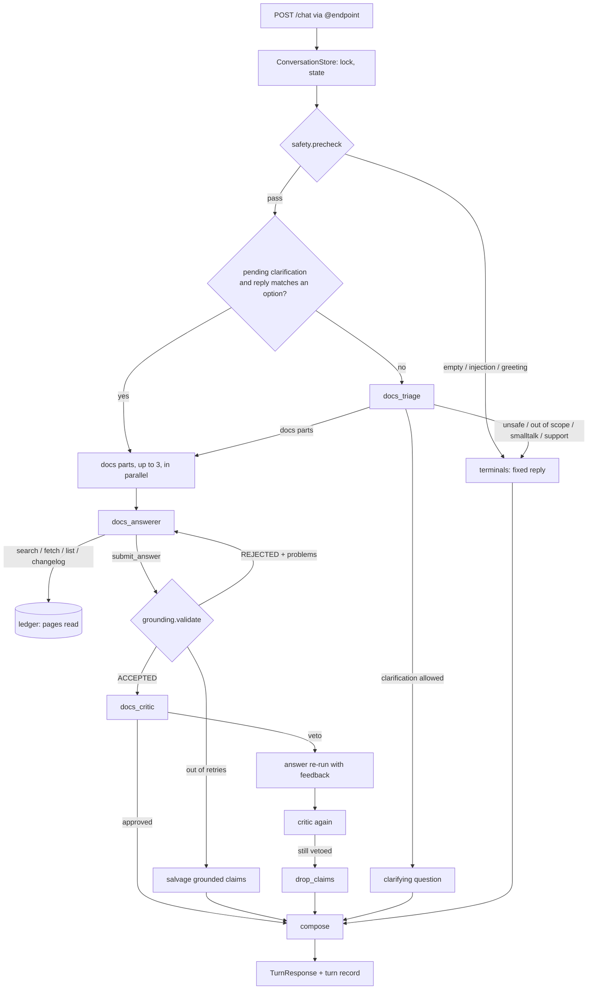

# Docs Assistant Architecture

The Docs Assistant answers Rhesis questions from the live docs. The models propose; Python
decides what reaches the user. Every citation has to point at a page the model read this turn,
every quote has to be on that page, and every turn ends in exactly one typed route.

## Overview



| Piece | Kind | Does |
|---|---|---|
| `safety.precheck` | Python | Empty input, injection battery, plain greetings and thanks; no model call |
| `docs_triage` | LLM, `output_type`, no tools | Parts, kind, surface, language, scope doubt, troubleshooting wish, clarification |
| `docs_answerer` | LLM, function tools | Searches, reads, drafts; hands in through `submit_answer` |
| `grounding.validate` | Python | Rules 1–8 below; the retry cap and salvage |
| `docs_critic` | LLM, `output_type`, no tools | Checks each claim against its quote and the text around it |
| `runner` | Python | Order of steps, the turn deadline, parallel parts, the veto, fallbacks |
| `compose` | Python | Turn route, reply markdown, numbered sources, footer, Heads-up, notes |

There are no handoffs and no agents-as-tools: handoffs would give the route to a model, and the
critic must not be skippable.

## Why the draft is a tool call

The answer agent hands in its draft by calling `submit_answer(draft: AnswerDraft)`, not through
`output_type`:

- Gemini rejects requests that combine tools with `response_format` structured output (openai-
  agents issues #236 and #2257); a tool argument with a strict JSON schema works on every provider
  with function calling.
- Output guardrails can only trip, not retry. A tool can return `REJECTED: <problems>` and let
  the model fix them, which is the retry loop we want.
- `stop_on_accept` ends the run on `ACCEPTED` (or `STOPPED` once retries run out) and returns the
  accepted draft stored on the turn context, so what the user sees is the draft that passed the
  checks. An output guardrail re-runs the checks on it as a backstop.

Triage and the critic have no tools, so plain `output_type` is safe for them.

## Package Layout

| Module | Role |
|---|---|
| `app.py` | FastAPI, `@endpoint`, Rhesis client gate, conversation endpoints |
| `runner.py` | One turn: precheck, triage, clarification, parts, critic, compose, turn record |
| `safety.py` | Prechecks, clipping, prompt-leak check, status-word filter |
| `terminals.py` | Fixed replies and labels in en and de, support links |
| `agents/triage.py` | Triage instructions and the docs scope view built from `llms.txt` |
| `agents/answerer.py` | Answer instructions, the per-question prompt, stop rule, budget hook, backstop |
| `agents/critic.py` | Critic instructions, its input (claims with quote context), feedback text |
| `tools.py` | The five tools; plain `*_impl` functions plus `@function_tool` wrappers |
| `grounding.py` | The draft checks, `salvage`, `drop_claims` |
| `compose.py` | Citations, turn-route rule, reply markdown, footer, Heads-up, clarification |
| `session.py` | `ConversationStore`; `traced_turn`, the turn root span |
| `state.py` | `ConversationState`, turn records, pending clarification, option matching |
| `tracing.py` | Agents SDK `TracingProcessor` → Rhesis OpenTelemetry spans |
| `context.py` | `TurnContext` per part: ledger, budgets, accepted draft, shared token meter |
| `models.py` | Provider presets, per-role models, `AgentModels` |
| `corpus/` | `fetcher`, `parser`, `index`, `changelog`, `cache`, `mirror` |

## Request Flow

1. `/chat` calls the `@endpoint` function, which opens the Rhesis turn root when a client is
   configured. `ConversationStore.turn()` takes the conversation's lock, so turns on one
   conversation run one at a time; `traced_turn` and an Agents SDK trace wrap the rest.
2. `CorpusCache.get()` returns the snapshot. The first call loads it and raises `DocsUnavailable`
   (→ 503) if the site is down and nothing is cached.
3. **Precheck.** The message is clipped to `MAX_INPUT_CHARS`. Empty input, an injection pattern
   (unless the message is about testing for one) or a plain greeting or thanks ends the turn in a
   fixed reply with no model call. A rough word check picks German or English for it.
4. **Clarification reply.** If the last turn asked a clarifying question and the message picks an
   option by number or by its words, the original question plus that option goes straight to the
   answer agent, without triage.
5. **Triage** sees the message, the last six turn records (question, route, cited URLs) and any
   pending clarification. It returns parts with a kind and a standalone question, the language,
   and possibly a clarification. If triage fails, the whole message goes to the answer agent:
   wrongly declining a Rhesis question is worse than checking the docs for nothing.
6. **Kinds.** Any unsafe part ends the turn in the decline. With no docs part, the most severe of
   support, out of scope and smalltalk wins. Support with `wants_troubleshooting` runs the answer
   agent in a troubleshooting-only mode and lists its pages; the route stays `account_or_support`.
7. **Clarify.** Triage's clarification is used only for a single docs part, with 2–4 options, and
   only if the previous turn didn't clarify (`MAX_CLARIFY_STREAK`). Otherwise the answer agent is
   told to cover the likely readings instead.
8. **Parts.** Up to three docs parts run in parallel, each with its own ledger and tool budget,
   sharing the turn's deadline and token meter. Off-topic or support parts get their short fixed
   text; a greeting next to a real question is dropped.
9. **Answer run.** `Runner.run` drives the answer agent with `max_turns` and `BudgetHooks`. Read
   tools charge the budget; `fetch_page` and `get_changelog` add pages to the ledger. If the run
   ends in plain text, it gets one reminder; then the fallback.
10. **Critic** (answered, partial, false premise). A veto continues the answer run's conversation
    once with the critic's reasons; if the new draft is still vetoed, the vetoed claims are
    dropped.
11. **Compose.** Output checks (prompt leak, status words), then the turn route, the reply with
    numbered sources, the footer, and the turn record (unless the turn was unsafe).

## Routes

The turn route follows one rule: if all parts share a route, that one; any unsafe part makes
the turn unsafe; otherwise, if anything was answered or partly answered, `partially_answered`;
otherwise the most severe in this order: unsafe, support, out of scope, smalltalk, clarification,
false premise, not documented, partial, answered. Each part keeps its own route in `parts`.

| Route | Decided by | Enforced in code |
|---|---|---|
| `unsafe_or_injection` | precheck or triage | Fixed text; no docs read; the conversation state is untouched |
| `smalltalk` | precheck or triage | Template with four example questions |
| `out_of_scope` | triage | No tools called; template with example questions |
| `account_or_support` | triage | Support links always; docs pages only in troubleshooting mode |
| `needs_clarification` | triage or answer agent | One question, 2–4 options, no claims; at most one in a row |
| `false_premise` | answer agent | A correction plus a citation showing the premise is wrong |
| `answered` | answer agent | Claims with citations; nothing listed as not covered |
| `partially_answered` | answer agent, salvage or veto | Citations and a list of what isn't covered |
| `not_documented` | answer agent or fallback | No claims; related pages from the index; support links |

`response` is always the complete reply as markdown (clarification options as a numbered list),
so a simple client can show every route without reading the other fields.

## Retrieval and Freshness

The site publishes `llms.txt` (title, URL, description per page) and `llms-full.txt` (about
1.3 MB, ~330K tokens). Too large for a prompt, small enough to parse and index in memory.

- **Parsing.** Pages split into sections on `##`/`###` headings, outside code fences. Anchors
  use GitHub-style slugs, matching the ids Nextra puts on the HTML site. All URLs are
  canonicalised to `https://docs.rhesis.ai/<path>`.
- **Search.** BM25 over sections, with title, heading and description boosts. Each hit carries
  its section anchor; `fetch_page` on that URL reads just the section and its neighbours, which
  keeps turns small, since every model step resends what was read. Contributor docs are weighted
  lower. Index-only entries (the glossary pages `llms-full.txt` omits) are searchable by
  description and fetched live.
- **Cache.** One in-memory snapshot, TTL `DOCS_CACHE_TTL`. Past the TTL, a background refresh
  starts and the current snapshot keeps serving. If the refresh fails, the docs are marked stale
  and replies say so in their footer. `corpus mirror` serves a local copy to try this by hand.
- **Live pages.** `fetch_page` goes to `/api/md/<path>` when the snapshot is past its TTL, or for
  pages only the index lists, and falls back to the snapshot on failure.

## Grounding Model

Enforced in code (`grounding.validate`), on every `submit_answer`:

1. Every citation URL is a page in this turn's ledger. Search snippets don't count.
2. A citation's anchor is one of that page's headings.
3. A quote is at least 20 characters and appears on the page, after normalizing whitespace,
   markdown and case.
4. Every claim cites at least one citation; every cited id exists, also in the `[c1]` markers of
   the answer; conflicts cite two existing citations.
5. The route matches the draft's shape (table above), and a clarifying question is allowed only
   when the previous turn didn't ask one.
6. Every fenced code block is copied from a page read this turn, or listed in `adapted_code` with
   the page it came from; the reply then says "Adapted from <page>; not copied verbatim."
7. Every link in the answer is a known docs page, or appears on a page read this turn.
8. Related pages are in the docs index.

A rejected draft goes back to the model with numbered problems. After `MAX_RETRIES` (2) failed
resubmissions, `salvage` keeps only the claims whose every citation passes rules 1–3 and rebuilds
the answer from them as `partially_answered`; if none pass, the fallback reply is sent.

**Critic.** Its input is built in code: each claim with its quotes and up to 600 characters of
page text around each. It returns a verdict per claim and whether the route fits. On a veto the
answer run continues once, with the pages it read and the critic's reasons. Claims the critic
still vetoes are removed by `drop_claims`, which rebuilds the answer from the remaining claims
(the prose may mix kept and dropped ones), moves the dropped ones to "not covered" and makes the
route `partially_answered`, or `not_documented` when nothing is left. If the critic fails, the
draft that passed the code checks is kept. `DOCS_ASSISTANT_CRITIC=off` skips it.

**Trust signals in the reply:** a "Docs as of <time>" footer on every answer (with the stale
note when needed), a "Heads-up" block for conflicts with links to both pages, and the
adapted-code note.

## Conversations

`ConversationStore` keeps up to 256 conversations in memory, drops them after
`DOCS_ASSISTANT_SESSION_TTL` idle seconds, and holds one `asyncio.Lock` per conversation. Each
turn stores a short record (standalone question, route, cited URLs), not the transcript; triage
needs no more to rewrite follow-ups. A clarifying question is stored as pending until the next
turn. The store sits behind a small `Store` protocol so a shared store can replace it.

## Limits

| Limit | Default | When hit |
|---|---|---|
| Tool calls / pages / searches | 10 / 6 / 5 per part | The tool returns `BUDGET_EXHAUSTED`; the model submits |
| Token budget | 60 000 per turn | At 75%, read tools refuse so the model submits; past 100%, the run stops, except for a response that hands in a draft |
| `max_turns` | 12 per run | Fallback reply |
| Turn timeout | 45 s | Fallback reply (an accepted draft is kept) |
| Grounding retries | 2 | Salvage, else fallback |
| Clarify streak | 1 | Triage's question dropped; clarifying drafts rejected |
| Input | 2000 characters | Clipped, with a note |
| Parts | 3 | The rest dropped, with a note |

Every limit that fired is listed in `limits_hit` on the response. Provider errors during an
answer run end in the fallback with `model_error`.

## Tracing

`tracing.py` bridges the Agents SDK to Rhesis: a `TracingProcessor` opens an OpenTelemetry span
on the Rhesis tracer provider for each Agents SDK span and closes it when the SDK span ends.

| Agents SDK span | Rhesis span | Attributes |
|---|---|---|
| agent | `ai.agent.invoke` | `ai.agent.name` |
| generation | `ai.llm.invoke` | provider, model, tokens; `ai.prompt` / `ai.completion` events |
| function | `ai.tool.invoke` | `ai.tool.name`; `ai.tool.input` / `ai.tool.output` events |
| guardrail | `ai.guardrail` | type, result |
| custom `precheck` | `function.precheck` | result |
| custom `grounding` | `ai.guardrail` | result (accepted, rejected, salvaged, stopped), problems |
| custom `critic` | `ai.guardrail` | result (approved, vetoed, unavailable), unsupported claims |
| custom `route` | `function.route_decision` | route, part routes, surface, language, limits hit |

The SDK's own task and turn spans have no Rhesis equivalent; they are skipped and their children
attach to the nearest mapped ancestor. One turn looks like this:

```
function.docs_assistant_turn            (conversation_turn root, rhesis.conversation.id)
├─ function.precheck
├─ ai.agent.invoke docs_triage ─ ai.llm.invoke
├─ ai.agent.invoke docs_answerer
│   ├─ ai.llm.invoke, ai.tool.invoke search_docs / fetch_page …
│   ├─ ai.tool.invoke submit_answer ─ ai.guardrail grounding
│   └─ ai.guardrail grounding_backstop
├─ ai.guardrail critic ─ ai.agent.invoke docs_critic ─ ai.llm.invoke
└─ function.route_decision
```

`session.traced_turn` opens the root with `conversation_turn`, which stands down behind
`@endpoint` (the endpoint owns the root there). The bridge is installed only when
`RHESIS_API_KEY` and `RHESIS_PROJECT_ID` are set. `test_span_tree` checks this shape with an
in-memory exporter, and `test_tracing_isolation` keeps the Rhesis imports in `app.py`,
`tracing.py` and (the light telemetry package only) `session.py`.

`rhesis-sdk` asks for `litellm>=1.84`, whose releases pin `openai<3`, while `openai-agents` 0.22
needs `openai>=3`. Only the SDK's model providers use litellm, and this agent never calls them,
so `pyproject.toml` overrides litellm to 1.83.

## Provider Boundary

`models.py` is the only module that knows about providers. Non-OpenAI providers are reached
through `OpenAIChatCompletionsModel` with an `AsyncOpenAI` client pointed at the provider's
OpenAI-compatible endpoint (Gemini, Anthropic, anything self-hosted), or through `LitellmModel`.
Only function tools are used, so no OpenAI-hosted tool is needed.

The SDK uploads traces to OpenAI by default, which fails without an OpenAI key. `configure_sdk()`
turns that off once and sets the Chat Completions API; `tracing.install` then routes spans to
Rhesis when it is configured.

Streaming model output (`run_streamed`) is not used: with Gemini's thinking models it fails with
`400 INVALID_ARGUMENT` after the first tool call, because the stream drops the tool call's thought
signature. Progress updates for a streaming endpoint will come from `RunHooks` around a normal
`Runner.run`.
