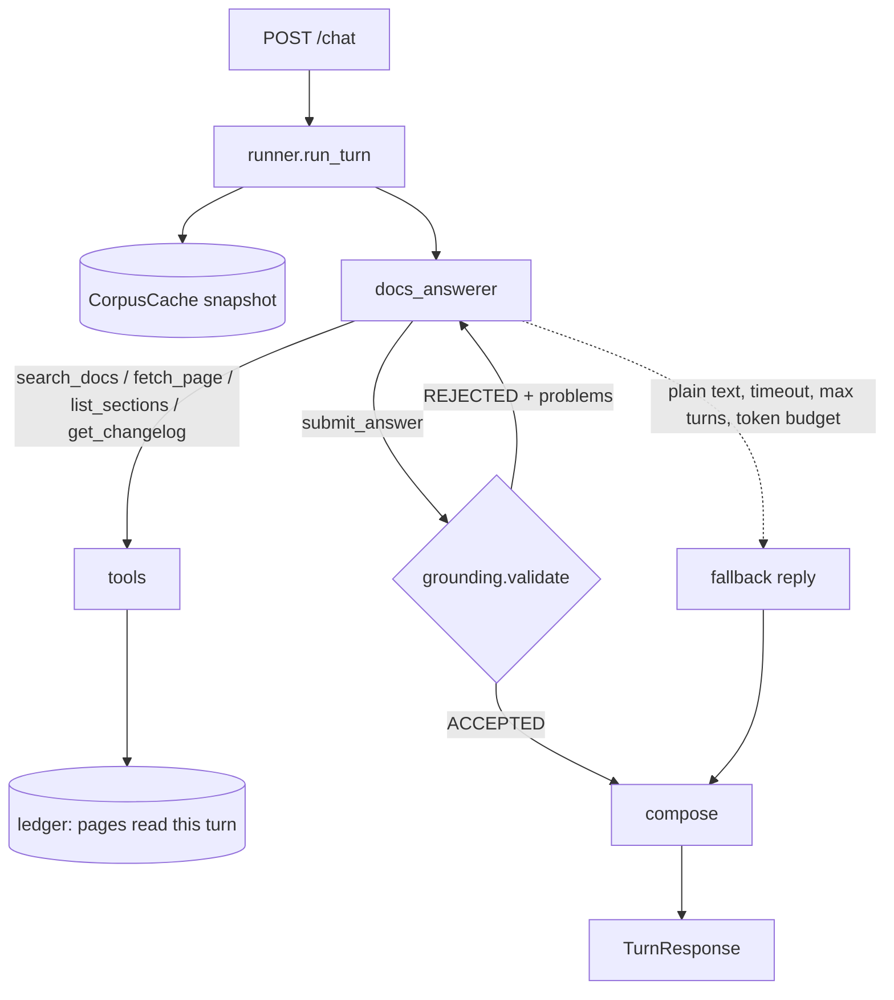

# Docs Assistant Architecture

The Docs Assistant answers Rhesis questions from the live docs. The model proposes; Python
decides what reaches the user. Every citation has to point at a page the model read this turn,
and every turn ends in exactly one typed route.

This document describes what is built. Triage, conversations, the critic and tracing are planned
and will be added here as they land.

## Agent Overview

| Piece | Kind | Does |
|---|---|---|
| `docs_answerer` | LLM agent | Searches, reads, drafts; hands in through `submit_answer` |
| `grounding.validate` | Python | Rejects drafts that cite unread pages, leave claims uncited, or don't match their route |
| `stop_on_accept` | Python | The agent's `tool_use_behavior`: the run ends only on an accepted draft |
| `runner` | Python | Timeout, `max_turns`, one nudge, the fallback reply |

Triage is still a stub: every message goes to the answer agent as one part. That is why greetings
and off-topic questions currently come back as `not_documented`.

## Why the draft is a tool call

The answer agent hands in its draft by calling `submit_answer(draft: AnswerDraft)`, not through
`output_type`:

- Gemini rejects requests that combine tools with `response_format` structured output (openai-
  agents issues #236 and #2257); a tool argument with a strict JSON schema works on every provider
  with function calling.
- Output guardrails can only trip, not retry. A tool can return `REJECTED: <problems>` and let
  the model fix them, which is the retry loop we want.
- `stop_on_accept` ends the run on `ACCEPTED` and returns the accepted draft stored on the turn
  context, so what the user sees is the draft that passed the checks, byte for byte.

## Package Layout

| Module | Role |
|---|---|
| `app.py` | FastAPI: `/`, `/health`, `/chat`; loads the docs at startup |
| `runner.py` | One turn: answer agent, nudge, fallback, response |
| `agents/answerer.py` | Instructions, stop rule, token-budget hook |
| `tools.py` | The five tools; plain `*_impl` functions plus `@function_tool` wrappers |
| `grounding.py` | Deterministic checks on a draft |
| `compose.py` | Numbered citation links, sources and related pages |
| `context.py` | `TurnContext`: snapshot, ledger, budget, accepted draft, limits hit |
| `models.py` | Provider presets and per-role models |
| `corpus/` | `fetcher`, `parser`, `index`, `changelog`, `cache` |

## Request Flow

1. `CorpusCache.get()` returns the snapshot. The first call loads it and raises `DocsUnavailable`
   (→ 503) if the site is down and nothing is cached.
2. `Runner.run` drives the answer agent with a `TurnContext`, `max_turns` and `BudgetHooks`,
   inside `asyncio.wait_for(turn_timeout)`.
3. Read tools charge the budget. `fetch_page` and `get_changelog` add pages to the ledger;
   `search_docs` only records hits (used for the fallback's related pages).
4. `submit_answer` runs `grounding.validate`. Problems go back to the model as a numbered list.
5. If the run ends without an accepted draft (plain-text reply), the runner replays the history
   with one reminder. If that fails too, or the turn hit a limit, the fallback draft is used:
   route `not_documented`, a fixed reply, up to three related pages from the searches.
6. `compose` turns `[c1]` markers into numbered links, lists sources with page and heading
   titles, and keeps only related pages the index knows.

## Retrieval and Freshness

The site publishes `llms.txt` (284 entries: title, URL, description) and `llms-full.txt` (about
1.3 MB, ~330K tokens, every page behind a `url`/`title` block). Too large for a prompt, small
enough to parse and index in memory at startup.

- **Parsing.** Pages split into sections on `##`/`###` headings, outside code fences. Anchors
  use GitHub-style slugs, matching the ids Nextra puts on the HTML site
  (`When to use ["Single-Turn"]` → `#when-to-use-single-turn`). All URLs are canonicalised to
  `https://docs.rhesis.ai/<path>`, whatever form they arrive in (`.md`, `/api/md/`, mirror host).
- **Search.** BM25 over sections. Page title, heading and index description are boosted; a
  page's intro section also carries its headings, so a question that spans sections finds the
  page. `MultiTurnMetric`, `max_turns` and `Single-Turn` also match their parts. Contributor docs
  are weighted 0.6 unless the question is about contributing. Index-only entries (glossary terms
  that `llms-full.txt` currently omits) are searchable by description.
- **Why not embeddings yet.** Docs questions hinge on exact names, the corpus is small, and BM25
  needs no second provider or key. The eval set is the place to show otherwise.
- **Cache.** One in-memory snapshot, TTL `DOCS_CACHE_TTL` (default 3600 s, matching the site's
  `s-maxage`). Past the TTL, the next request starts a background refresh and is served from the
  current snapshot. The site sends no ETag, so a content hash skips rebuilding unchanged docs. If
  the refresh fails, the snapshot is marked stale and answers say so (`docs_stale`).
- **Live pages.** `fetch_page` goes to `/api/md/<path>` when the snapshot is past its TTL, or for
  pages the index lists but the full corpus lacks, and falls back to the snapshot on failure.

## Grounding Model

Enforced in code today (`grounding.py`):

- **Rule 1.** Every citation URL is a page in this turn's ledger.
- **Rule 4.** Every claim cites at least one citation, and every id exists (ids are unique).
- **Rule 5.** The route matches the draft: `answered` has claims and citations and no gaps;
  `partially_answered` has citations and lists gaps; `not_documented` makes no claims;
  `false_premise` has a correction and a citation.

Planned: quotes must appear on the cited page, anchors must exist, code blocks must come from the
docs, links in the answer must be known pages, a retry cap with a deterministic downgrade, and an
independent critic with a veto.

## Limits

| Limit | Default | When hit |
|---|---|---|
| Tool calls / pages / searches | 10 / 6 / 5 | The tool returns `BUDGET_EXHAUSTED`; the model is told to submit |
| `max_turns` | 12 | Fallback reply |
| Turn timeout | 45 s | Fallback reply |
| Token budget | 60 000 | Fallback reply |

Every limit that fired is listed in `limits_hit` on the response.

## Provider Boundary

`models.py` is the only module that knows about providers. Non-OpenAI providers are reached
through `OpenAIChatCompletionsModel` with an `AsyncOpenAI` client pointed at the provider's
OpenAI-compatible endpoint (Gemini, Anthropic, anything self-hosted), or through `LitellmModel`
when installed. Only function tools are used, so no OpenAI-hosted tool is needed.

The SDK uploads traces to OpenAI by default, which fails without an OpenAI key.
`configure_sdk()` turns that off and sets the Chat Completions API. Tracing to Rhesis comes with
the platform integration.

Streaming model output (`run_streamed`) is not used: with Gemini's thinking models it fails with
`400 INVALID_ARGUMENT` after the first tool call, because the stream drops the tool call's thought
signature. Progress updates will come from `RunHooks` around a normal `Runner.run`.
