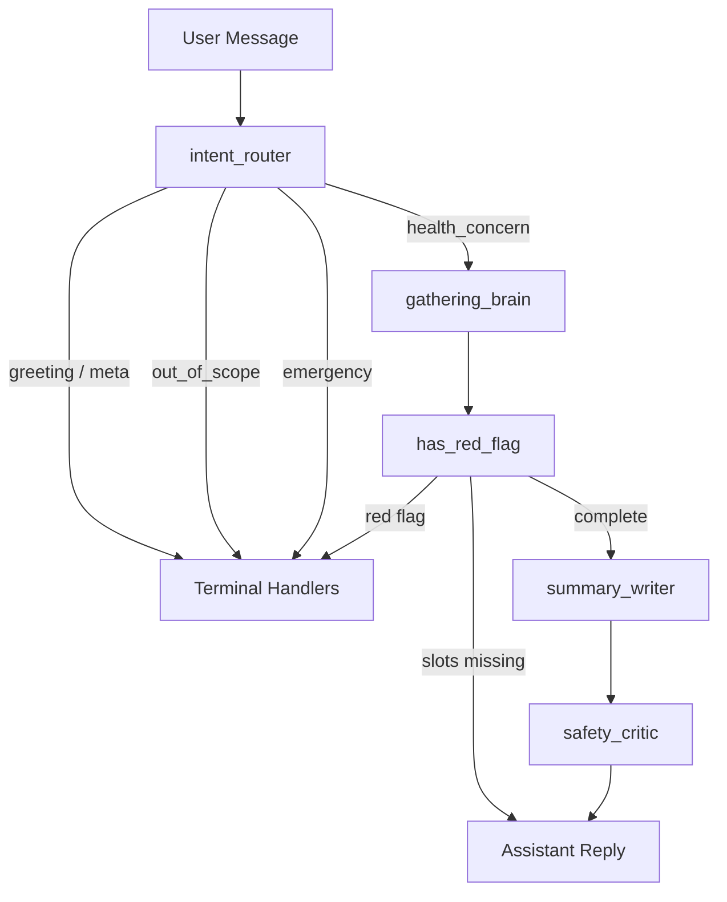
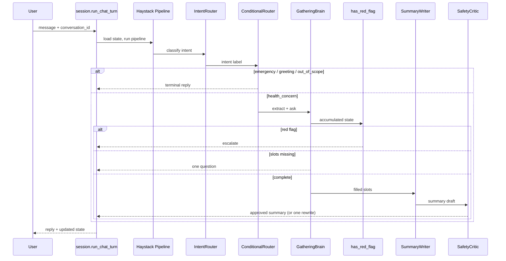

# Dr-Rhesis Architecture

Dr-Rhesis is a multi-agent system built on **Haystack 2.x**. It helps a person prepare for a doctor's appointment by collecting a structured clinical history (OPQRST / SOCRATES slots), then producing a symptom timeline and questions to ask a clinician. It does not diagnose or recommend treatment.

## Agent Overview

| Subagent | Responsibility |
|---|---|
| `intent_router` | Classifies every message: greeting, meta, out_of_scope, emergency, health_concern. |
| `gathering_brain` | Extracts slot updates, then asks one question about the next missing slot. |
| `summary_writer` | Produces timeline + clinician questions from filled slots only. |
| `safety_critic` | Independent reviewer with veto power; triggers one summary rewrite on rejection. |

## Package Layout

| File | Responsibility |
|---|---|
| `app.py` | FastAPI surface, Rhesis `@endpoint` tracing (serving boundary). |
| `pipeline.py` | Builds the per-turn Haystack `Pipeline` + `ConditionalRouter`. |
| `session.py` | `StateStore` + `run_chat_turn` for multi-turn continuity. |
| `client.py` | Single Gemini `GoogleGenAIChatGenerator` factory. |
| `state.py` | `DrRhesisState`, `Slots`, `Phase`. |
| `safety.py` | Rule-based `has_red_flag` checker. |
| `terminals.py` | Templated greet, redirect, and escalate responses. |
| `agents/` | Router, gathering, summary, and critic subagents. |
| `tools.py` | Future escalation-only tool extension point (empty in draft). |

## Request Flow

## State and Completeness

- One `DrRhesisState` object per conversation, owned by `session.py`.
- Core slots: onset, location, character, severity, timing, aggravating, relieving, associated.
- `context` (meds, conditions, recent changes) is **optional** in this draft.
- "Complete" means all core slots are filled; then the finish path runs.

## Safety Model

1. Never diagnose or recommend treatment (prompt constraints + safety critic).
2. Red-flag phrases trigger immediate escalation on **every** turn, not only at the end.
3. Summary writer and safety critic are separate components; the critic has veto power.
4. No external medical lookup tools in the first draft.

## Rhesis Integration

Rhesis imports (`RhesisClient`, `@endpoint`, `auto_instrument`) live only in `app.py` and `examples/serve_playground.py`. Haystack SDK auto-instrumentation is enabled in `app.py` via `auto_instrument("haystack")` once the `RhesisClient` is constructed.

## Trace Surface

| Span | Source |
|---|---|
| `ai.endpoint.invoke` | Rhesis `@endpoint` on `/chat` |
| `ai.agent.invoke` / `ai.llm.invoke` / `ai.retrieval` / `ai.transform` | Haystack pipeline + component spans via `auto_instrument("haystack")` |

Multi-turn grouping uses `session.run_chat_turn` + conversation id context, which the Haystack instrumentation ties to the active trace.
