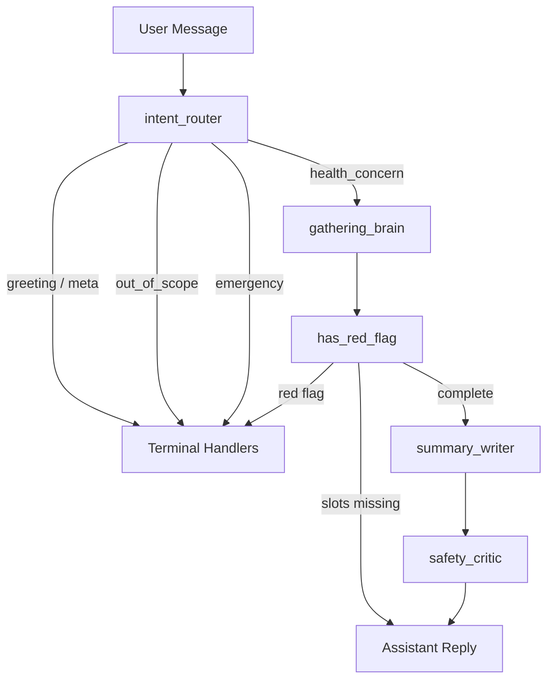

# Dr-Rhesis Architecture

Dr-Rhesis is a multi-agent system built on **Haystack 2.x**. It helps a person prepare for a doctor's appointment by collecting a structured clinical history (OPQRST / SOCRATES slots), then producing a symptom timeline and questions to ask a clinician. It does not diagnose or recommend treatment.

## Agent Overview

```mermaid
flowchart TB
    UserMessage[User Message]
    IntentRouter[intent_router]
    Terminals[Terminal Handlers]
    Gathering[gathering_brain]
    RedFlag[has_red_flag]
    Summary[summary_writer]
    Critic[safety_critic]
    Reply[Assistant Reply]

    UserMessage --> IntentRouter
    IntentRouter -->|greeting / meta| Terminals
    IntentRouter -->|out_of_scope| Terminals
    IntentRouter -->|emergency| Terminals
    IntentRouter -->|health_concern| Gathering
    Gathering --> RedFlag
    RedFlag -->|red flag| Terminals
    RedFlag -->|slots missing| Reply
    RedFlag -->|complete| Summary
    Summary --> Critic
    Critic --> Reply
```

| Subagent | Responsibility |
|---|---|
| `intent_router` | Classifies every message: greeting, meta, out_of_scope, emergency, health_concern. |
| `gathering_brain` | Extracts slot updates, then asks one question about the next missing slot. |
| `summary_writer` | Produces timeline + clinician questions from filled slots only. |
| `safety_critic` | Independent reviewer with veto power; a rejected summary gets one rewrite, which is re-reviewed — if that fails too, a deterministic slot recap ships instead. |

## Package Layout

| File | Responsibility |
|---|---|
| `app.py` | FastAPI surface, Rhesis `@endpoint` (traced server boundary). |
| `tracing.py` | Tracing gate + global Haystack tracer bootstrap; only `app.py` and traced scripts import it. |
| `pipeline.py` | Builds the per-turn Haystack `Pipeline` + `ConditionalRouter`. |
| `session.py` | `StateStore` + `run_chat_turn` for multi-turn continuity. |
| `client.py` | Single Gemini `GoogleGenAIChatGenerator` factory. |
| `state.py` | `DrRhesisState`, `Slots`, `Phase`. |
| `safety.py` | Rule-based `has_red_flag` checker. |
| `terminals.py` | Templated greet, redirect, and escalate responses. |
| `agents/` | Router, gathering, summary, and critic subagents. |
| `tools.py` | Future escalation-only tool extension point (empty in draft). |

## Request Flow

```mermaid
sequenceDiagram
    participant U as User
    participant S as session.run_chat_turn
    participant P as Haystack Pipeline
    participant R as IntentRouter
    participant CR as ConditionalRouter
    participant G as GatheringBrain
    participant RF as has_red_flag
    participant W as SummaryWriter
    participant C as SafetyCritic

    U->>S: message + conversation_id
    S->>P: load state, run pipeline
    P->>R: classify intent
    R->>CR: intent label
    alt emergency / greeting / out_of_scope
        CR-->>S: terminal reply
    else health_concern
        CR->>G: extract + ask
        G->>RF: accumulated state
        alt red flag
            RF-->>S: escalate
        else slots missing
            G-->>S: one question
        else complete
            G->>W: filled slots
            W->>C: summary draft
            C-->>S: approved summary (rewrite re-reviewed; templated recap if rejected twice)
        end
    end
    S-->>U: reply + updated state
```

## State and Completeness

- One `DrRhesisState` object per conversation, owned by `session.py`.
- Core slots: onset, location, character, severity, timing, aggravating, relieving, associated.
- `context` (meds, conditions, recent changes) is **optional** in this draft.
- "Complete" means all core slots are filled; then the finish path runs.

## Safety Model

1. Never diagnose or recommend treatment (prompt constraints + safety critic).
2. Red-flag phrases trigger immediate escalation on **every** turn, not only at the end. This is deterministic: `IntentRouter` runs the rule-based check on the raw message *before* the LLM classification, so escalation never depends on the model's intent label.
3. Summary writer and safety critic are separate components; the critic has veto power.
4. No external medical lookup tools in the first draft.

## Rhesis Integration

Tracing is opt-in at the entrypoint boundary — business modules never import Rhesis or Haystack tracing.

| Entrypoint | Tracing |
|---|---|
| `chat_terminal/chat.py`, `examples/run_scenarios.py` | None — runs standalone even when `RHESIS_*` creds are set |
| `python -m dr_rhesis`, `chat_terminal/chat_traced.py`, `examples/run_scenarios_traced.py` | `tracing.py` bootstraps the global `RhesisTracer` via `RhesisConnector.__init__` (not as a pipeline component) |

`app.py` imports `RhesisClient` and `@endpoint` for the served path. The FastAPI dev server (`python -m dr_rhesis`) registers the SDK endpoint and opens the WebSocket connector via uvicorn's event loop, so the Rhesis Playground can invoke `dr_rhesis_chat` without a separate serve script.

When the SDK Haystack integration lands (PR #2009), `enable_rhesis_tracing()` in `tracing.py` can be swapped for `auto_instrument("haystack")`.

## Trace Surface

| Span | Source |
|---|---|
| `ai.endpoint.invoke` | Rhesis `@endpoint` on `/chat` (served path only) |
| `function.haystack.pipeline.run` | Global `RhesisTracer` enabled at traced entrypoints |
| Haystack component spans | `router`, `gathering`, `summary`, `critic`, etc. |

Multi-turn grouping:

- **Served path** (`python -m dr_rhesis`): SDK `@endpoint` `session_id` mapping groups turns by `conversation_id`.
- **Script path** (`chat_traced.py`, `run_scenarios_traced.py`): `set_trace_session()` sets `ai.session.id` on the root span before each conversation or scenario.
