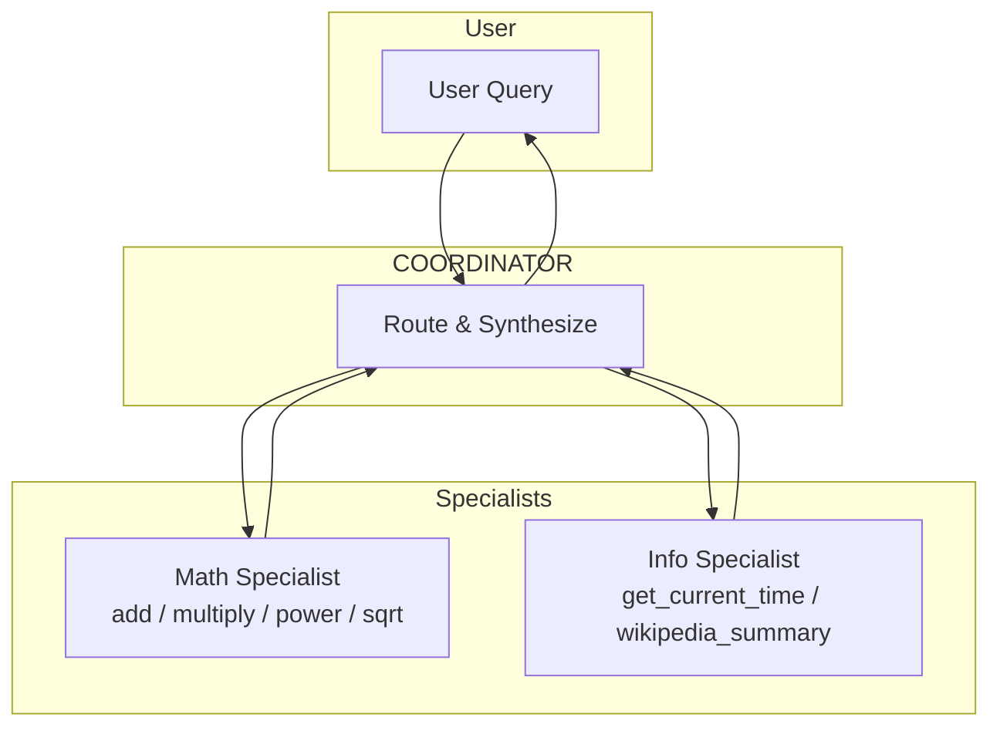

# Polymath

A small multi-agent demo built on **Microsoft Agent Framework (MAF)** that exists for one purpose: exercise the Rhesis SDK's `auto_instrument("agent_framework")` integration end-to-end and produce a rich, real trace tree (multiple agents, tool calls, LLM invocations, workflow spans) in the Rhesis backend.

## What is Polymath?

Polymath is a tiny "AI generalist" composed of three agents that hand off control to one another:

- A **Coordinator** routes the user's request
- A **Math Specialist** does arithmetic via local Python tools
- An **Info Specialist** fetches real-world data over HTTP (current time, Wikipedia summaries)

Together they generate the full surface area of MAF telemetry that the SDK translator covers (`ai.agent.invoke`, `ai.llm.invoke`, `ai.tool.invoke` with `ai.tool.input` / `ai.tool.output` events, and `function.workflow.*` spans).

## Multi-Agent Architecture

The system uses MAF's `HandoffBuilder` in **autonomous mode** so the workflow runs end-to-end without human-in-the-loop input.

> **Full architecture diagrams**: See [docs/architecture.md](docs/architecture.md).



### Agent Responsibilities

| Agent | Role | Tools |
|-------|------|-------|
| **Coordinator** | Routes queries to the right specialist; synthesises a final answer | (handoff tools auto-injected by MAF) |
| **Math Specialist** | Pure-Python arithmetic | `add`, `multiply`, `power`, `square_root` |
| **Info Specialist** | Real HTTP fetches that produce non-trivial tool spans | `get_current_time(timezone)` (worldtimeapi.org), `wikipedia_summary(topic)` (wikipedia REST) |

## Example Questions

- "Compute (3 + 5) * 2^4 and then take the square root."
- "What time is it in Tokyo, and give me a one-sentence summary of Tokyo."
- "What is 17 squared, and what's the current UTC minute right now?"

## Quick Start

### 1. Setup Environment

```bash
cd agents/polymath

# Copy environment variables
cp .env.example .env

# Edit .env and add your GOOGLE_API_KEY (and Rhesis vars to see traces)
```

### 2. Install Dependencies

```bash
uv sync
```

### 3. Generate Traces (CLI)

The fastest way to fire MAF traces at the Rhesis backend:

```bash
uv run python examples/run_traces.py
```

This sends three sample queries through the workflow and prints the per-agent transcript.

### 4. Or Run the API Server

```bash
uv run python -m polymath
```

Server defaults to port `8889` (research-assistant uses `8888`):

- **API Documentation**: http://localhost:8889/docs
- **Health Check**: http://localhost:8889/health
- **Chat Endpoint**: POST http://localhost:8889/chat

## API Usage

### Chat with Polymath

```bash
curl -X POST http://localhost:8889/chat \
  -H "Content-Type: application/json" \
  -d '{"message": "What is 17 squared, and what time is it in Berlin?"}'
```

Response includes the per-agent workflow and tool chain:

```json
{
  "response": "...",
  "conversation_id": "...",
  "agents_involved": ["coordinator", "math_specialist", "info_specialist"],
  "agent_workflow": "Coordinator -> Math -> Info -> Coordinator",
  "tools_called": [...],
  "tool_chain": "[math_specialist] power -> [info_specialist] get_current_time"
}
```

### Continue Conversation

```bash
curl -X POST http://localhost:8889/chat \
  -H "Content-Type: application/json" \
  -d '{"message": "Now divide that by 4.", "conversation_id": "your-conversation-id"}'
```

### List / Get / Delete Conversations

```bash
curl http://localhost:8889/conversations
curl http://localhost:8889/conversations/{conversation_id}
curl -X DELETE http://localhost:8889/conversations/{conversation_id}
```

## Environment Variables

| Variable | Description | Default |
|----------|-------------|---------|
| `GOOGLE_API_KEY` | Gemini API key (also accepts `GEMINI_API_KEY`) | Required |
| `POLYMATH_MODEL` | Gemini model id | `gemini-2.0-flash` |
| `RHESIS_API_KEY` | Rhesis API key for tracing | Optional |
| `RHESIS_PROJECT_ID` | Rhesis project ID | Optional |

`GOOGLE_API_KEY` is wired through MAF's `OpenAIChatClient` against Gemini's [OpenAI-compatible endpoint](https://ai.google.dev/gemini-api/docs/openai), so no extra Google SDK dependency is needed.

## Development

### Lint and Format

```bash
uvx ruff check src/
uvx ruff format src/
```

## Architecture

The application uses:

- **Microsoft Agent Framework**: Agents, tools, and the `HandoffBuilder` orchestration pattern
- **FastAPI**: REST API server (mirrors `agents/research-assistant/`)
- **Gemini**: As the underlying LLM via `OpenAIChatClient` + Gemini's OpenAI-compat endpoint
- **Rhesis SDK**: For testing, validation, and observability (`auto_instrument("agent_framework")`)

### How Polymath Exercises the SDK

When the workflow runs with a Rhesis `TracerProvider` active, every interaction emits MAF spans that the SDK's translator rewrites into the Rhesis schema:

- `ai.agent.invoke` (one per agent activation, from MAF `invoke_agent`)
- `ai.llm.invoke` (one per chat completion)
- `ai.tool.invoke` with `ai.tool.input` / `ai.tool.output` events (from `execute_tool`)
- `function.workflow.run` / `function.workflow.executor.process` / `function.workflow.edge_group.process`

The SDK's real-MAF integration tests live in [`tests/sdk/telemetry/integrations/test_agent_framework.py`](../../tests/sdk/telemetry/integrations/test_agent_framework.py) — they exercise the same translator end-to-end against real `Agent`, `BaseChatClient`, `@tool`, and `HandoffBuilder` types (with deterministic responses, no network). Polymath is the user-facing counterpart that produces full Gemini-backed traces in the Rhesis backend.

## License

MIT
