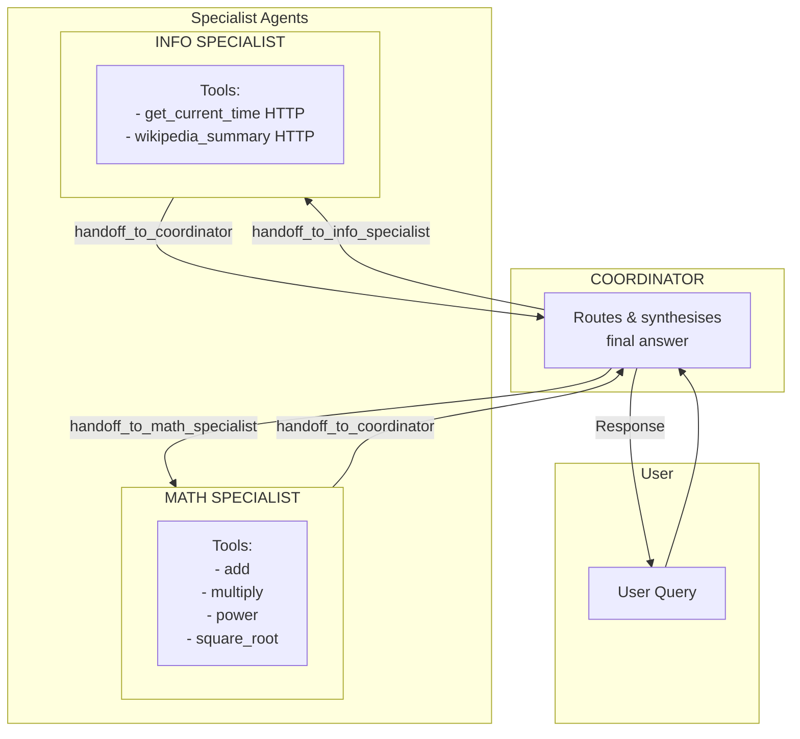
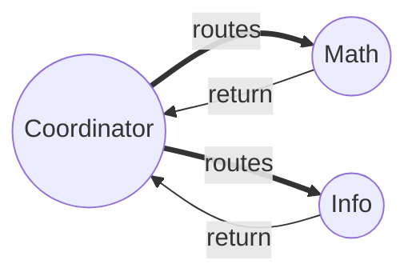
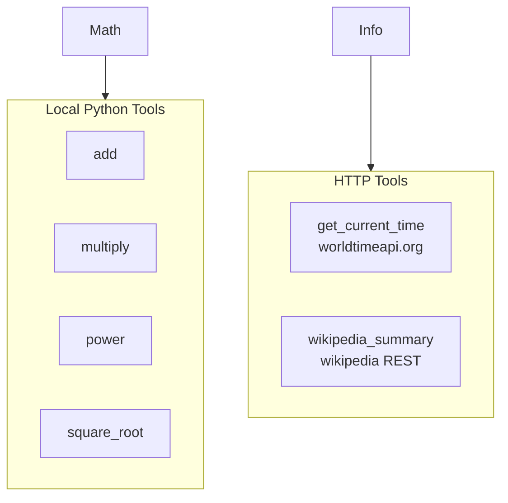
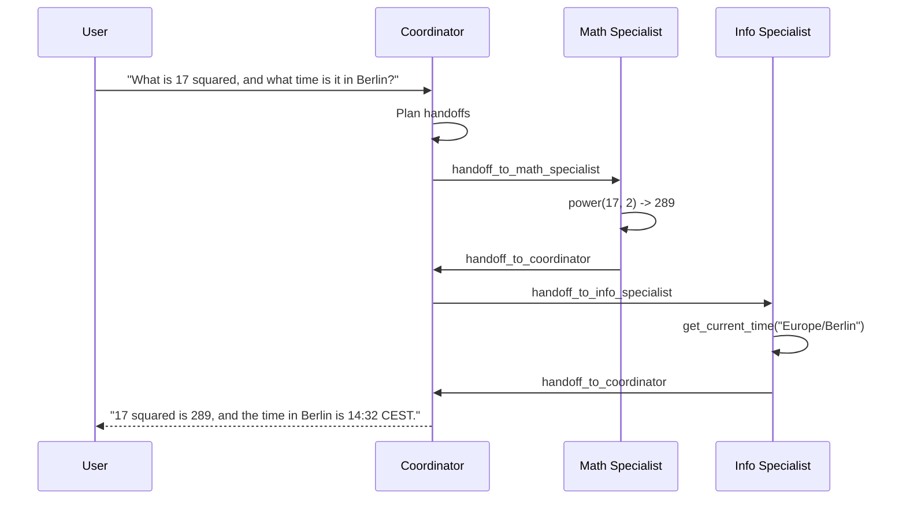

# Polymath Multi-Agent Architecture

Polymath is a three-agent system built on **Microsoft Agent Framework (MAF)** using `HandoffBuilder` in autonomous mode. Its sole purpose is to exercise the Rhesis SDK's `auto_instrument("agent_framework")` integration end-to-end.

## Agent Overview

## Handoff Topology

## Tool Layers

## Example Workflow: Mixed Query

## Trace Surface Generated

A single user query produces (per the SDK's [MAF translator](../../../sdk/src/rhesis/sdk/telemetry/integrations/agent_framework/mapping.py)):

| Rhesis span name | Source MAF operation |
|---|---|
| `function.workflow.run` | `workflow.run` |
| `function.workflow.executor.process` | `executor.process` |
| `function.workflow.edge_group.process` | `edge_group.process` |
| `ai.agent.invoke` | `invoke_agent` (one per agent activation) |
| `ai.llm.invoke` | `chat` (one per chat completion) |
| `ai.tool.invoke` (with `ai.tool.input` / `ai.tool.output` events) | `execute_tool` |

A "mixed" query that touches both specialists typically generates 1 workflow root span, ~6-10 executor spans, 4-6 agent-invoke spans, 4-6 LLM spans, and 2-4 tool-invoke spans. That's enough to make the Rhesis trace UI light up while staying easy to reason about.

## Agent Capabilities Summary

| Agent | Tools | Can Hand Off To |
|-------|-------|-----------------|
| **Coordinator** | (handoff tools auto-injected) | Math Specialist, Info Specialist |
| **Math Specialist** | `add`, `multiply`, `power`, `square_root` | Coordinator |
| **Info Specialist** | `get_current_time`, `wikipedia_summary` | Coordinator |
