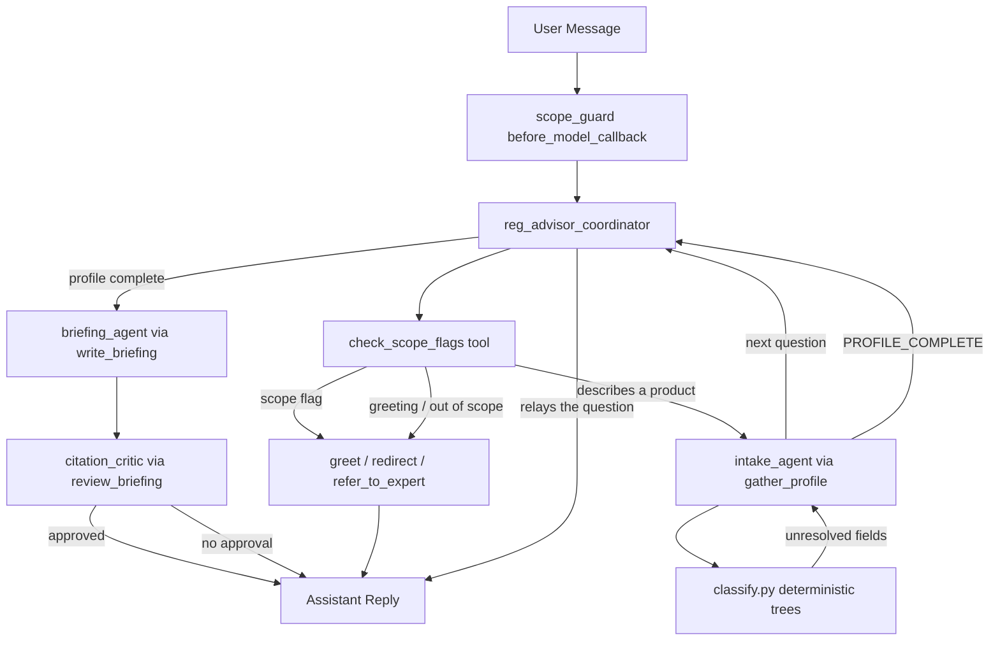
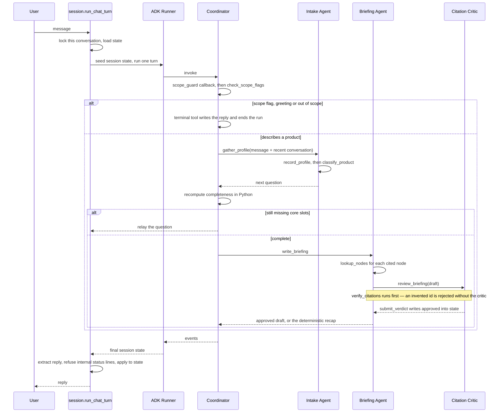

# Reg-Advisor Architecture

Reg-Advisor is a four-agent system built on Google ADK. It helps a founder or product lead work
out which EU and US health-product regulatory regime their product falls into, what pathway that
implies, and what obligations attach.

It does not give legal advice, does not issue compliance determinations, and never states a
regulatory fact that is not backed by a node in its knowledge base.

## Agent Overview



| Subagent | Role |
|---|---|
| `reg_advisor_coordinator` | Routes every turn: scope check first, then greet, redirect, refer, scope the product, or brief. Sees what each specialist returned and decides what comes next. |
| `intake_agent` | Fills the `ProductProfile` through `record_profile`, then asks **one** question about whatever the classifier could not settle. |
| `briefing_agent` | Writes the briefing from retrieved knowledge nodes only, then hands the draft to the critic. |
| `citation_critic` | Independent reviewer with a veto, exercised through `submit_verdict`. |

Specialists are reached with `AgentTool`, never with `sub_agents` transfer. The coordinator has
to see what a specialist returned in order to relay a question or move on to the briefing; a
transfer moves control and does not bring it back.

Only the three terminal tools end the run, because their templated return value *is* the reply.
Handoffs deliberately do not: a handoff that ended the run would hand the user the specialist's
internal status line instead of an answer.

## Package Layout

| File | Responsibility |
|---|---|
| `state.py` | `ProductProfile`, `RegAdvisorState`, and the conditional core-slot logic. No framework imports. |
| `knowledge.py` | Node schema, indexes, fail-loud validation, `verify_citations`, `staleness_warnings`. |
| `classify.py` | The nine decision trees, walked in Python. No LLM. |
| `safety.py` | Scope-flag rules over the user's own words. |
| `terminals.py` | Templated greet / redirect / refer replies, with the disclaimer appended. |
| `utils.py` | `as_text` and `as_slot_text` coercion, word-boundary matching, transcript rendering. |
| `client.py` | The one Gemini model every agent shares. |
| `tools.py` | Every tool the agents call. |
| `agents/` | The four agents, plus `budget.py` for per-agent step limits. |
| `runner.py` | Builds the coordinator, runs one turn, extracts the reply, produces the new state. |
| `session.py` | `StateStore`, the shared agent, and the per-turn runner. |
| `app.py` | FastAPI surface. |
| `knowledge/*.yaml` | The taxonomy, decision trees, comparisons, sources and gap log. |

## Request Flow



## State and Completeness

- `RegAdvisorState` is this package's own model. ADK's session service is separate scratch
  space, seeded per turn and discarded after it.
- `missing_core_profile_slots` is **conditional**. Specimen handling is only asked while the
  product could still be an IVD; invasiveness and duration of use only for something physical.
  Asking all twelve fields of every product wastes the user's time and produces worse answers.
- Completeness is recomputed in Python after the intake agent runs. The specialist's opinion
  that it is done is never taken on trust.
- `describe_profile` renders the picture that goes into a prompt.

**State is rendered into prompts by a Python callable, not by ADK's `{state_key}` templating.**
ADK does support the templating, and it was tested working — but the taxonomy is far too large
to dump into a prompt, a stray brace in a user's own wording raises `KeyError` mid-run, and
rendering in Python keeps the picture deterministic and unit-testable without a model. Both the
coordinator and the intake agent take an `InstructionProvider` callable.

## The Deterministic Classifier

`classify.py` walks nine decision trees and returns a `Determination`. No model is involved at
any point. The trees supply the branch catalogue, the prose and the terminal node ids;
`classify.py` supplies the predicate that picks a branch.

The walk **stops at the first tree it cannot settle**, naming the fields that would settle it.
Those become the intake agent's next question. This is why a well-described product often
finishes in four questions rather than twelve, and why an under-described one ends in a question
rather than a guess.

Two divergences fall out of the trees rather than out of a prompt:

- **MDR Rule 11 versus Cures Act §3060.** The same clinician-facing decision-support tool is
  Class IIa in the EU (`EU-MD-CLASS-011`) and not a device at all in the US
  (`US-SW-CDS-3060`). Criterion (i) of the US carve-out is what makes the PPG smartwatch case
  differ from the guideline-lookup case: analysing a signal makes it a device however
  transparent the rest of it is.
- **AI Act Article 6(1).** An AI system in a product that needs notified-body conformity
  assessment is additionally a high-risk AI system (`EU-AI-HIGHRISK-006`). It stacks — the MDR
  class does not move. A self-certified Class I product with AI in it escapes the trigger.

Where the profile genuinely cannot settle something, the tree says so rather than picking a
side. The `us_predicate_unknown` branch exists for exactly this: whether a legally marketed
predicate exists decides 510(k) versus De Novo, no profile field settles it, and naming the fork
with both fees beats guessing.

**Every slot the intake agent asks for changes an outcome.** `duration_of_use` is the clearest
case: MDR Annex VIII Rules 5–8 escalate an invasive device on duration, so the three bands —
transient, short term, long term or implantable — are three separate branches, and an invasive
device with no readable duration is reported unresolved rather than classified. A question we
ask and then ignore is worse than one we never ask.

Every branch has a test, and `test_every_branch_is_covered` fails if the knowledge base grows a
branch no case reaches.

## Safety Model

1. **Never gives legal advice or a compliance determination.** It describes what a regime
   requires; it does not certify that a product meets it.
2. **The scope check cannot be routed around.** `check_scope_flags` is an ordinary tool, so a
   coordinator that never called it would never be checked. `scope_guard` runs the same rules as
   a `before_model_callback` on every step, whatever the model chooses to call, and injects a
   `SCOPE OVERRIDE` instruction when they match. If the model ignores the override, the turn
   layer substitutes the referral itself — a prompt is not an enforcement mechanism.
3. **Referral is sticky.** The rules scan every user turn in the replayed conversation, so a
   flag raised earlier keeps firing and the agent does not quietly resume advising on a later
   benign message. `safety.first_scope_flag_text` takes user texts only, so the assistant's own
   referral copy can never re-trigger the check.

   The rules are also written to require an *event*, not a keyword. "We got a Form 483" is a
   flag; "what is a Form 483?" is a question about the regime. "We are being sued" is a flag;
   "we want to avoid litigation risk" is exactly the planning conversation this agent exists
   for. Over-referring is the worst failure this agent has — it shuts down the conversation it
   is for — so `tests/test_safety.py` carries a `NEAR_MISSES` battery of questions that share
   vocabulary with a flag category and must not trigger.
4. **The critic's veto is enforced outside the prompt.** `submit_verdict` writes a bool into
   state, and `run_briefing_with_fallback` reads that bool. The approved text is captured at
   review time, so a draft rewritten after approval cannot be passed off as reviewed.
5. **Citation integrity is enforced in Python.** `verify_citations` runs before the critic ever
   sees a draft. An unresolvable node id is an automatic rejection, not a model judgement.
6. **The disclaimer is appended deterministically** in the terminal and briefing layers, never
   left to the model to remember.
7. **Staleness is surfaced, not smoothed.** Any node with a live transition provision, `low`
   confidence, or a citation the gap log marks unverified carries its warning, appended in
   Python.
8. **No live web lookup and no external regulatory API.** Every answer comes from the loaded
   knowledge base, which carries a `verified_on` date the agent states when asked how current it
   is.

## Concurrency

`session.py` keeps one process-wide **agent tree** and builds a **fresh `Runner` and session
service per turn**. Concurrent turns share the agent with no run lock.

Dropping the run lock rests on ADK holding no per-run state in the shared object.
`Runner.run_async` makes no assignment to `self` — its bookkeeping lives in the per-invocation
`InvocationContext`. `LlmAgent` makes no assignment to `self` anywhere; `canonical_model` and
`canonical_tools` resolve on each call rather than caching onto the instance. The one mutation
is `Gemini.api_client`, a `cached_property`: two threads can race to build it, both get a valid
client and one wins. That client is `google-genai`'s, built on `httpx.Client`, which is safe to
share across threads.

The `Runner` and its `InMemorySessionService` are **not** shared, and that is deliberate. ADK's
in-memory session service is three plain nested dicts with no locking at all, so a shared one
would race on concurrent turns. It would also grow without bound, because every turn creates a
session that nothing deletes. Both problems disappear when the scratch space lives and dies with
the turn. The objects are cheap; the agent tree they wrap is what gets reused.

Turns on **one** conversation still serialize, or two overlapping turns would read the same
state and the second write would lose the first. The sync and async entry points cannot share
one lock for this: a `threading.Lock` held across an `await` blocks the event loop thread and the
coroutine holding it can never resume — a permanent hang, not a slow request. `StateStore`
therefore hands out a `threading.Lock` to `run_chat_turn` and an `asyncio.Lock` to
`run_chat_turn_async`. Measured: five turns on one conversation never overlap, five turns across
five conversations reach five concurrent model calls.

**Step budgets** work differently for the coordinator and its specialists. The coordinator gets
`RunConfig(max_llm_calls=10)`, which ADK enforces by *raising* `LlmCallsLimitExceededError`
mid-stream; the turn layer catches it and reports on its own terms. Specialists cannot use
`RunConfig` at all, because `AgentTool` builds its own sub-`Runner` with a default one — a child
will happily burn four model calls under a parent budget of two. So each specialist counts its
own calls in a `before_model_callback` that returns a short-circuit `LlmResponse` once the limit
is reached.

## Knowledge Base Maintenance

The knowledge base is five YAML files under `knowledge/`. It is structured lookup only: no
vector store, no embedding model, no live regulatory API. That is what makes every answer
traceable back to a node with a citation.

**Where the files live.** `knowledge/` sits at the project root, and `knowledge.py` looks there
first — so editing the YAML in a checkout takes effect without reinstalling. An installed wheel
has no project root, so hatchling force-includes a copy at `reg_advisor/_knowledge`, which is
the fallback. Edit the root copy; the packaged one is built from it.

**What `verified_on` means.** Every node carries `status.verified_on`, the date its citation was
last checked against the primary source. The whole base also carries a top-level `verified_on`,
which is what the agent states when asked how current it is. A missing node-level date fails
validation.

**Refreshing when the law moves.**

1. Edit the node in `taxonomy.yaml`: the citation, `status.applicable_from`,
   `status.transition_provisions`, `status.amended_by`, and `verified_on`.
2. If the change alters routing, update the branch in `decision_trees.yaml`. Branches carry the
   prose and the terminal node ids; the predicate that picks them lives in `classify.py`.
3. If a new branch appears, add a case to `CASES` in `tests/test_classify.py` —
   `test_every_branch_is_covered` fails until you do.
4. Add or update the entry in `gaps.yaml` if the change is not yet settled law.
5. Run `uv run pytest`. Validation fails loudly on a dangling `related_nodes` id, a dangling
   decision-tree terminal, a duplicate id, or a missing `verified_on`, and that failure stops
   the server starting rather than degrading quietly.

**What the gap log currently marks unverified.** One entry sets `citation_unverified: true`:
`ai-act-digital-omnibus`, covering `EU-AI-HIGHRISK-006`. The 2 Aug 2028 deferral date is
consistent across sources, but the final regulation citation could not be confirmed against
EUR-Lex. Any node named in an entry with that flag carries a `CITATION UNVERIFIED` warning into
every briefing that cites it.

Other entries are medium or low confidence rather than unverified: the MDR/IVDR simplification
proposal COM(2025) 1023 is a proposal only; notified-body dual designation under the AI Act is
contested; the exact IVDR legacy end dates are marked `low` confidence on `EU-IVD-TRANS-110`;
EUDAMED's remaining modules have no fixed date; and the national implementation layer is flagged
as a mechanism rather than built out.

## Framework Boundary

Business modules stay free of framework-boundary concerns, so tracing is added at the entrypoints
only — `app.py`, `chat_terminal/`, `examples/` — without touching `classify.py`, `knowledge.py`,
`state.py` or `safety.py`. None of those imports ADK at all.

`tests/test_tracing_isolation.py` enforces this: it fails if any business module imports
`rhesis.sdk`.

## Tracing

The Rhesis SDK's Google ADK integration is enabled in `app.py`, which is the only module that
imports `rhesis.sdk`:

```python
rhesis_client = RhesisClient.from_environment()   # or DisabledClient() with no credentials
auto_instrument("google_adk")
```

ADK emits OpenTelemetry spans unconditionally; the integration wraps the exporter and translates
them into Rhesis's `ai.*` schema. Nothing in this app calls into it, and removing those two lines
removes tracing entirely.

Only one place beyond `app.py` needs to know about tracing at all: `session.py` marks each turn
with `set_conversation_id`, which is what makes turns group into a conversation in the Rhesis UI.
It imports the light `rhesis.telemetry.context` module — a contextvar accessor with no client, no
HTTP and no provider ownership — not the SDK.

The two standalone entry points each have a traced twin that owns its own client construction:
`chat_terminal/chat_traced.py` and `examples/run_scenarios_traced.py`. Both wrap the plain
version's `main()` rather than duplicating it, so the untraced path stays the one under test and
neither copy can drift.

### What the trace looks like

Reg-Advisor delegates exclusively through `AgentTool`, never `transfer_to_agent`. ADK models an
`AgentTool` call by nesting a whole inner `Runner` beneath an `execute_tool` span, so the trace is
deep rather than wide:

```
function.google_adk.invocation            turn root: input, output, conversation id
└─ ai.agent.invoke  reg_advisor_coordinator
   └─ ai.llm.invoke                       prompts, completion, token counts
      └─ ai.tool.invoke  intake_agent     the AgentTool call itself
         └─ function.google_adk.invocation  the inner Runner's own root
            ├─ ai.agent.invoke  intake_agent
            └─ ai.agent.handoff            coordinator -> intake_agent
```

The `ai.agent.handoff` spans are synthesized by the SDK from that nesting; they are the only
source of the edges the Graph View draws, because this app emits no `transfer_to_agent` calls.
`tests/test_span_tree.py` asserts they are present, which is what catches a refactor that
flattens the graph.

One shape worth noting: ADK emits two spans per model call (`call_llm` wrapping
`generate_content {model}`). The SDK keeps the outer one as `ai.llm.invoke` and drops the inner
duplicate, re-pointing the tool spans ADK had parented on it so nothing orphans.
