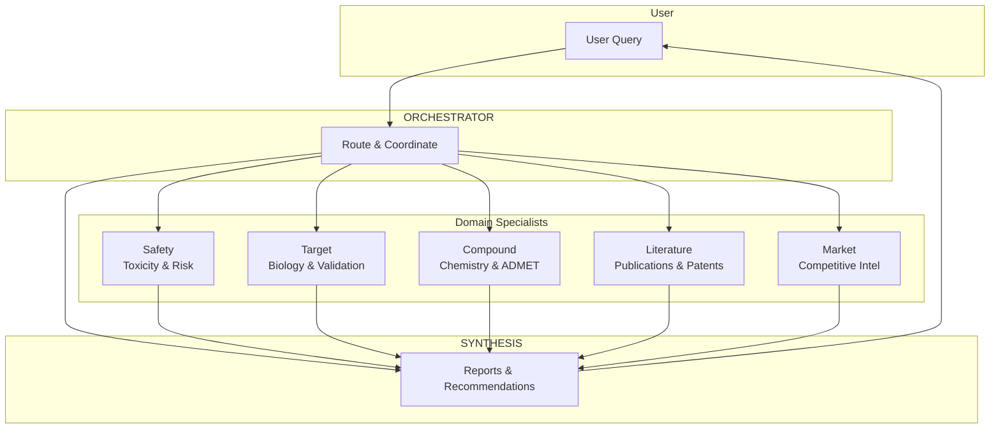

# Research Assistant

An advanced AI-powered multi-agent reasoning system designed to unify and leverage scattered knowledge, tools, methods, and models for scientific workflows.

## What is Research Assistant?

Research Assistant acts as an "AI colleague" that:

- Navigates structured and unstructured data sources
- Triggers computational tools and calculations
- Synthesizes actionable insights for scientific workflows
- Supports human interaction, intervention, and the ability to pivot

## Multi-Agent Architecture

The system uses specialized agents coordinated by an orchestrator using the **Handoffs** pattern.

> **Full architecture diagrams**: See [docs/architecture.md](docs/architecture.md) for detailed Mermaid diagrams.



### Agent Responsibilities

| Agent | Role |
|-------|------|
| **Orchestrator** | Routes queries to appropriate specialists, coordinates workflow |
| **Safety Specialist** | Safety/toxicity profiles, adverse events, risk assessment |
| **Target Specialist** | Target biology, validation, pathways, druggability |
| **Compound Specialist** | Chemical properties, ADMET, synthesis routes, SAR |
| **Literature Specialist** | Publications, patents, clinical trial data |
| **Market Specialist** | Market size, competitors, pipeline, business strategy |
| **Synthesis Agent** | Final reports, recommendations, summaries |

The orchestrator intelligently routes queries - simple questions may only involve one specialist, while complex analyses will coordinate multiple specialists.

## Example Questions

- "What are the known safety risks associated with target X?"
- "Summarize the competitive landscape for biostimulants in Brazil"
- "Rank these 10 targets based on druggability and safety profile"
- "Generate a target dossier for gene Y, focusing on cardiovascular indications"
- "What are the knowledge gaps for this target and what experiments would address them?"
- "Update the previous analysis excluding genetic-only evidence"
- "What are the most cost-effective synthesis routes for compound Z?"

## Quick Start

### 1. Setup Environment

```bash
cd agents/research-assistant

# Copy environment variables
cp .env.example .env

# Edit .env and add your GOOGLE_API_KEY
```

### 2. Install Dependencies

```bash
uv sync
```

### 3. Run the Application

```bash
uv run python -m research_assistant
```

Or using uvicorn directly:

```bash
uv run uvicorn research_assistant.app:app --reload --port 8888
```

### 4. Access the API

- **API Documentation**: http://localhost:8888/docs
- **Health Check**: http://localhost:8888/health
- **Chat Endpoint**: POST http://localhost:8888/chat

## API Usage

### Chat with Research Assistant

```bash
# Start a new conversation
curl -X POST http://localhost:8888/chat \
  -H "Content-Type: application/json" \
  -d '{"message": "What are the known safety risks associated with EGFR as a drug target?"}'

# Response includes agent workflow information
# {
#   "response": "...",
#   "conversation_id": "...",
#   "agents_involved": ["orchestrator", "safety_specialist"],
#   "agent_workflow": "Orchestrator → Safety",
#   "tools_called": [...],
#   "tool_chain": "[safety_specialist] retrieve_safety_data, analyze_and_score"
# }
```

### Continue Conversation

```bash
# Use the conversation_id from the previous response
curl -X POST http://localhost:8888/chat \
  -H "Content-Type: application/json" \
  -d '{"message": "Can you elaborate on the skin toxicity risks?", "conversation_id": "your-conversation-id"}'
```

### List Conversations

```bash
curl http://localhost:8888/conversations
```

### Get Conversation History

```bash
curl http://localhost:8888/conversations/{conversation_id}
```

## Environment Variables

| Variable | Description | Default |
|----------|-------------|---------|
| `GOOGLE_API_KEY` | Google API key for Gemini | Required |
| `RHESIS_API_KEY` | Rhesis API key for tracing | Optional |
| `RHESIS_PROJECT_ID` | Rhesis project ID | Optional |

## Development

### Run Tests

```bash
uv run pytest
```

### Lint and Format

```bash
uvx ruff check src/
uvx ruff format src/
```

## Architecture

The application uses:

- **LangGraph**: For building the multi-agent system with StateGraph and Handoffs
- **FastAPI**: For the REST API server
- **Gemini**: As the underlying LLM (via langchain-google-genai)
- **Rhesis SDK**: For testing, validation, and observability

### LangGraph Patterns Used

- **StateGraph**: For defining agent state and transitions
- **Handoffs**: For agent-to-agent transfers via tool calls
- **Conditional Routing**: For dynamic workflow based on agent decisions

## License

MIT
