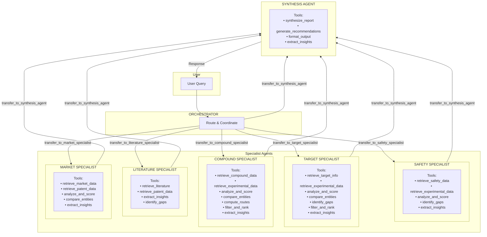
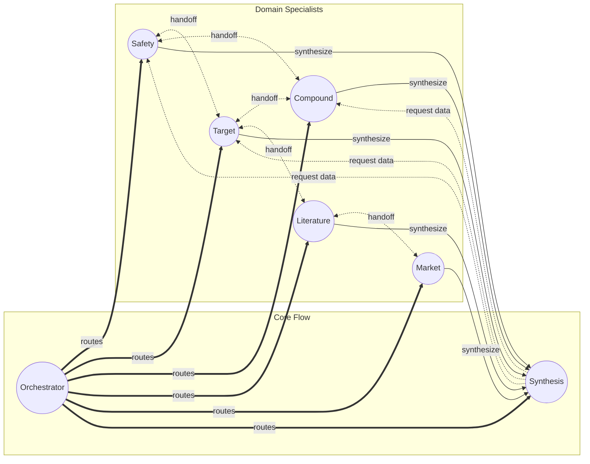
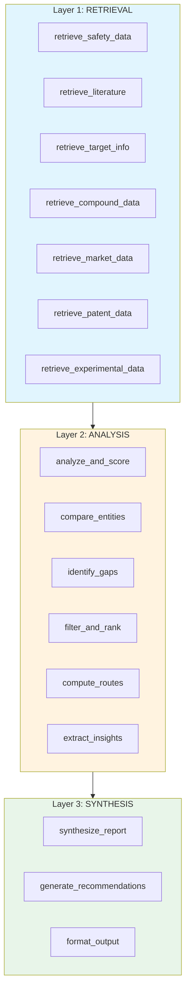
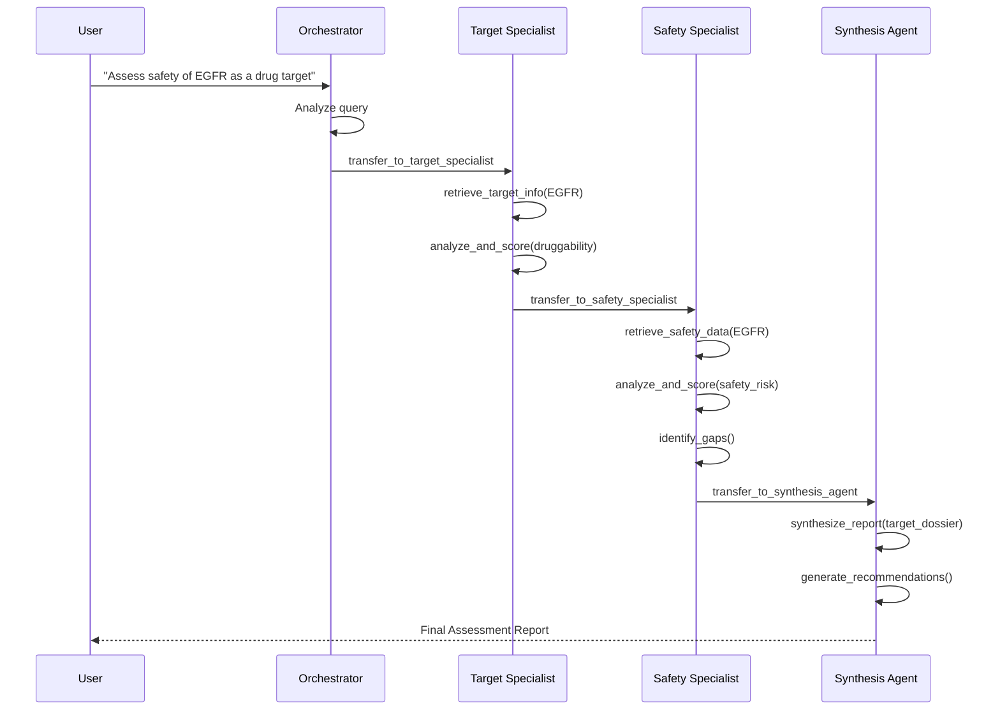

# Research Assistant Multi-Agent Architecture

## Agent Overview

## Agent Handoff Network

## Tool Layer Architecture

## Example Workflow: Target Safety Assessment

## Agent Capabilities Summary

| Agent | Domain Tools | Analysis Tools | Can Transfer To |
|-------|-------------|----------------|-----------------|
| **Orchestrator** | - | - | All Specialists, Synthesis |
| **Safety** | retrieve_safety_data, retrieve_experimental_data | analyze_and_score, identify_gaps, extract_insights | Orchestrator, Target, Compound, Synthesis |
| **Target** | retrieve_target_info, retrieve_experimental_data | analyze_and_score, compare_entities, identify_gaps, filter_and_rank, extract_insights | Orchestrator, Safety, Compound, Literature, Synthesis |
| **Compound** | retrieve_compound_data, retrieve_experimental_data | analyze_and_score, compare_entities, compute_routes, filter_and_rank, extract_insights | Orchestrator, Safety, Target, Synthesis |
| **Literature** | retrieve_literature, retrieve_patent_data | extract_insights, identify_gaps | Orchestrator, Target, Compound, Market, Synthesis |
| **Market** | retrieve_market_data, retrieve_patent_data | analyze_and_score, compare_entities, extract_insights | Orchestrator, Literature, Synthesis |
| **Synthesis** | synthesize_report, generate_recommendations, format_output | extract_insights | Orchestrator, Safety, Target, Compound |
