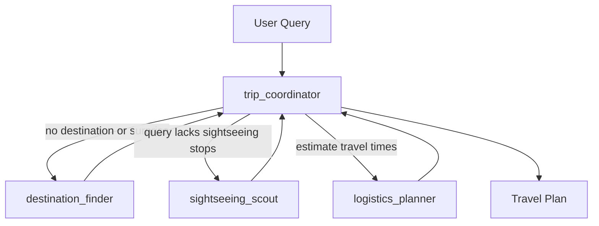

# Travel Agent

A small multi-agent demo built on **Microsoft Agent Framework (MAF)**. Its purpose is to exercise the Rhesis SDK's `auto_instrument("agent_framework")` integration end-to-end and produce realistic agent, LLM, tool, handoff, and endpoint traces in the Rhesis backend.

## What is Travel Agent?

Travel Agent is a MAF `HandoffBuilder` workflow with four agents:

| Agent | Purpose | Domain tools |
|---|---|---|
| `trip_coordinator` | Routes work to specialists and synthesizes the final trip plan. | None |
| `destination_finder` | Picks a random city when the user asks for a surprise or does not name a destination. | `get_random_destination` |
| `sightseeing_scout` | Suggests sightseeing stops when the query does not already include specific sights. | `find_sightseeing` |
| `logistics_planner` | Estimates relative distance and travel time from the city center, central station, and airport. | `estimate_travel` |

The specialist tools are intentionally simple and mock-like. The value of this agent is the trace shape: a single query can produce multiple `ai.agent.invoke`, `ai.llm.invoke`, `ai.tool.invoke`, and handoff-related events.

## Architecture

> Full architecture diagrams: See [docs/architecture.md](docs/architecture.md).



## Example Questions

- "Plan me a day trip."
- "Plan a family-friendly day trip at a random destination."
- "Plan me a relaxed day trip to Paris with cafes and art."
- "Plan a day trip to Barcelona visiting Sagrada Familia, Park Guell, and La Boqueria."

The last example already names sightseeing stops, so `sightseeing_scout` should not be invoked. The logistics planner should still estimate travel around those stops.

## Quick Start

### 1. Setup Environment

```bash
cd agents/travel-agent

# Copy environment variables
cp .env.example .env

# Edit .env and add your GOOGLE_API_KEY (and Rhesis vars to see traces)
```

### 2. Install Dependencies

```bash
uv sync
```

### 3. Generate Traces (CLI)

Run a minimal in-process `auto_instrument` smoke test: a batch of scenarios
that exercise the full multi-agent workflow. There is no manual tracing here —
the SDK produces and ships every span automatically. The only manual step is a
single `shutdown_tracer_provider()` at the end to flush the final batch before
this short-lived process exits. Each scenario is one-shot and single-turn: it
sets no conversation/session id, so it produces a single ordinary trace rooted
at MAF's `function.workflow.run` and shows up in the default Traces view (not as
a multi-turn conversation). Multi-turn grouping is exercised separately by the
chat session path (`travel_agent.session.run_chat_turn`) used by the app and
playground:

```bash
uv run python examples/run_traces.py
```

### 4. Serve the Agent to the Rhesis Playground (persistent connector)

The CLI examples above are one-shot: they fire a prompt (or a few) and exit.
To chat with the agent interactively from the **Rhesis playground**, keep a
long-lived connector open instead. This registers the workflow as an `@endpoint`
and holds a WebSocket to the Rhesis backend, so the playground can send queries
continuously (with per-conversation memory):

```bash
uv run python examples/serve_playground.py
```

Requires `RHESIS_API_KEY` and `RHESIS_PROJECT_ID` in your `.env`. The process
blocks until you press Ctrl+C.

### 5. Run the API Server

Starts a local FastAPI **development** server (auto-reload is on by default;
not intended for production):

```bash
uv run python -m travel_agent
```

Optional flags: `--host`, `--port`, and `--no-reload` (e.g.
`uv run python -m travel_agent --port 9000 --no-reload`).

Server defaults to host `0.0.0.0` and port `8890`:

- API Documentation: http://localhost:8890/docs
- Health Check: http://localhost:8890/health
- Chat Endpoint: POST http://localhost:8890/chat

## API Usage

### Chat with Travel Agent

```bash
curl -X POST http://localhost:8890/chat \
  -H "Content-Type: application/json" \
  -d '{"message": "Plan me a day trip to Paris with cafes and art"}'
```

Response includes the final answer, conversation id, tool calls, and the agents involved:

```json
{
  "response": "...",
  "conversation_id": "...",
  "tools_called": [
    {
      "tool_name": "find_sightseeing",
      "agent": "sightseeing_scout",
      "tool_args": {
        "destination": "Paris, France",
        "interests": "cafes and art"
      }
    },
    {
      "tool_name": "estimate_travel",
      "agent": "logistics_planner",
      "tool_args": {
        "destination": "Paris, France",
        "attractions": "..."
      }
    }
  ],
  "tool_chain": "[sightseeing_scout] find_sightseeing -> [logistics_planner] estimate_travel",
  "agents_involved": [
    "trip_coordinator",
    "sightseeing_scout",
    "logistics_planner"
  ],
  "agent_workflow": "Coordinator -> Sightseeing -> Logistics",
  "agent": "trip_coordinator"
}
```

### Continue Conversation

```bash
curl -X POST http://localhost:8890/chat \
  -H "Content-Type: application/json" \
  -d '{"message": "Make it more family friendly.", "conversation_id": "your-conversation-id"}'
```

### List / Get / Delete Conversations

```bash
curl http://localhost:8890/conversations
curl http://localhost:8890/conversations/{conversation_id}
curl -X DELETE http://localhost:8890/conversations/{conversation_id}
```

## Environment Variables

| Variable | Description | Default |
|---|---|---|
| `GOOGLE_API_KEY` | Gemini API key (also accepts `GEMINI_API_KEY`) | Required |
| `TRAVEL_AGENT_MODEL` | Gemini model id | `gemini-3.1-flash-lite` |
| `RHESIS_API_KEY` | Rhesis API key for tracing | See note |
| `RHESIS_PROJECT_ID` | Rhesis project ID | See note |

`GOOGLE_API_KEY` is wired through MAF's `OpenAIChatCompletionClient` against Gemini's [OpenAI-compatible endpoint](https://ai.google.dev/gemini-api/docs/openai), so no extra Google SDK dependency is needed.

`RHESIS_API_KEY` and `RHESIS_PROJECT_ID` are **required** to serve the Rhesis
playground connector (`examples/serve_playground.py`), which exits early
without them. For `examples/run_traces.py` and the API server
(`python -m travel_agent`) they are optional: when unset, the agent falls back
to a `DisabledClient` and traces are not shipped to the backend.

## Development

### Lint and Format

```bash
uvx ruff check src/ examples/
uvx ruff format src/ examples/
```

## How Travel Agent Exercises the SDK

Travel Agent uses only `@endpoint` + `auto_instrument("agent_framework")`. It
never creates a span, sets a span attribute, or flushes the tracer by hand —
every span and attribute is produced by the SDK. When the workflow runs with a
Rhesis `TracerProvider` active, MAF emits spans that the SDK translator rewrites
into the Rhesis schema:

- `ai.agent.invoke` for each agent activation (`trip_coordinator`, `destination_finder`, `sightseeing_scout`, `logistics_planner`)
- `ai.llm.invoke` for Gemini chat completions
- `ai.tool.invoke` with `ai.tool.input` / `ai.tool.output` events when domain tools run
- `ai.endpoint.invoke` from the Rhesis `@endpoint` decorator when using the FastAPI `/chat` route or playground connector

The SDK's real-MAF integration tests live in [`tests/sdk/telemetry/integrations/test_agent_framework.py`](../../tests/sdk/telemetry/integrations/test_agent_framework.py). Travel Agent is the user-facing counterpart that produces Gemini-backed traces in the Rhesis backend.

## License

MIT
