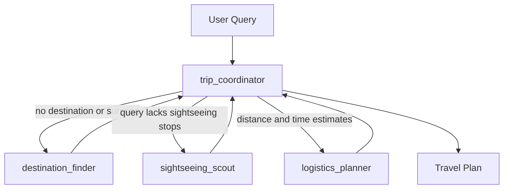
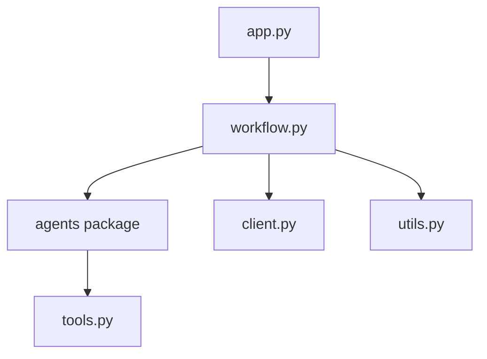
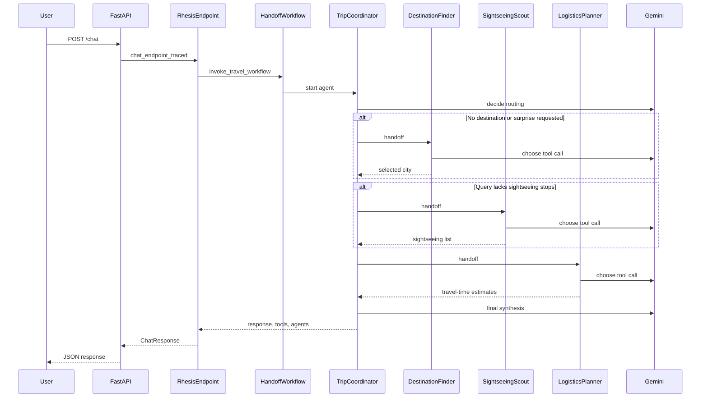
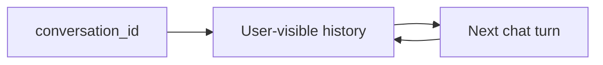

# Travel Agent Architecture

Travel Agent is a multi-agent system built on **Microsoft Agent Framework (MAF)**. It exists to exercise the Rhesis SDK's `auto_instrument("agent_framework")` integration with a small travel-planning workflow that shows agent handoffs, LLM calls, mock tools, and endpoint traces.

## Agent Overview

| Agent | Responsibility |
|---|---|
| `trip_coordinator` | Starts the workflow, decides which specialists to invoke, and writes the final answer. |
| `destination_finder` | Calls `get_random_destination` when the user wants a random city or omits the destination. |
| `sightseeing_scout` | Calls `find_sightseeing` only when the user did not already name sightseeing stops. |
| `logistics_planner` | Calls `estimate_travel` to add relative distance and travel-time guidance. |

## Package Layout

| File | Responsibility |
|---|---|
| `app.py` | FastAPI API surface, Rhesis `@endpoint` tracing, conversation history. |
| `workflow.py` | Builds the `HandoffBuilder` workflow and runs it, streaming events into a structured result. |
| `agents/` | Defines the coordinator and three specialist agent factories. |
| `client.py` | Builds the Gemini-backed OpenAI-compatible MAF chat client. |
| `tools.py` | Defines `get_random_destination`, `find_sightseeing`, and `estimate_travel`. |
| `utils.py` | Parses streamed events (tool calls, text segments, final answer) and formats the `agent_workflow` and `tool_chain` response fields. |

## Request Flow

## Conditional Handoffs

The coordinator prompt is the main control surface:

- If the user asks for a random destination or does not name a destination, it hands off to `destination_finder`.
- If the user already names specific sights, it skips `sightseeing_scout` and passes those sights directly to `logistics_planner`.
- If the user does not name sights, it hands off to `sightseeing_scout`.
- Once there is a destination and sightseeing list, it hands off to `logistics_planner`.

This keeps the behavior simple and traceable. The specialist tools are mock tools, not real city or routing APIs.

## Conversation Memory

The FastAPI app stores per-conversation **user-visible** MAF ``Message`` history in
memory (user turns plus the coordinator's final plan for each turn). Specialist
outputs stay inside the workflow run and are not persisted:

This is enough for a local trace-generation demo. A production deployment would
persist this state in a database.

## Trace Surface Generated

A single user query can produce the following Rhesis span shapes:

| Rhesis span name | Source operation |
|---|---|
| `ai.endpoint.invoke` | Rhesis SDK `@endpoint` decorator around `/chat` or the playground connector. |
| `ai.agent.invoke` | MAF activations for coordinator and invoked specialists. |
| `ai.llm.invoke` | Gemini chat completions through MAF. |
| `ai.tool.invoke` | Domain tool execution: `get_random_destination`, `find_sightseeing`, `estimate_travel`. |

The example scripts contain no manual tracing: every span and attribute is produced by the SDK via `auto_instrument`. The in-process `examples/run_traces.py` smoke test runs with no `@endpoint` and sets no conversation/session id, so each scenario is a one-shot single-turn run that produces a single ordinary trace rooted at MAF's `function.workflow.run` and appears in the default Traces view (not as a multi-turn conversation). Multi-turn conversation grouping is exercised separately by the chat session path (`travel_agent.session.run_chat_turn`): the FastAPI `/chat` route and the playground connector go through the `@endpoint` decorator, where that decorator's span is the turn root and conversation grouping is handled by the SDK request/response mapping plus backend backfill.
