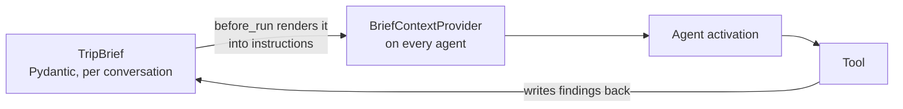
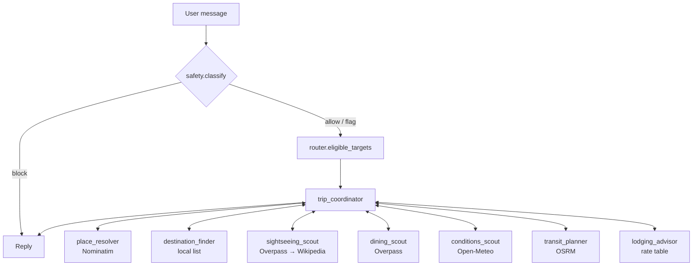
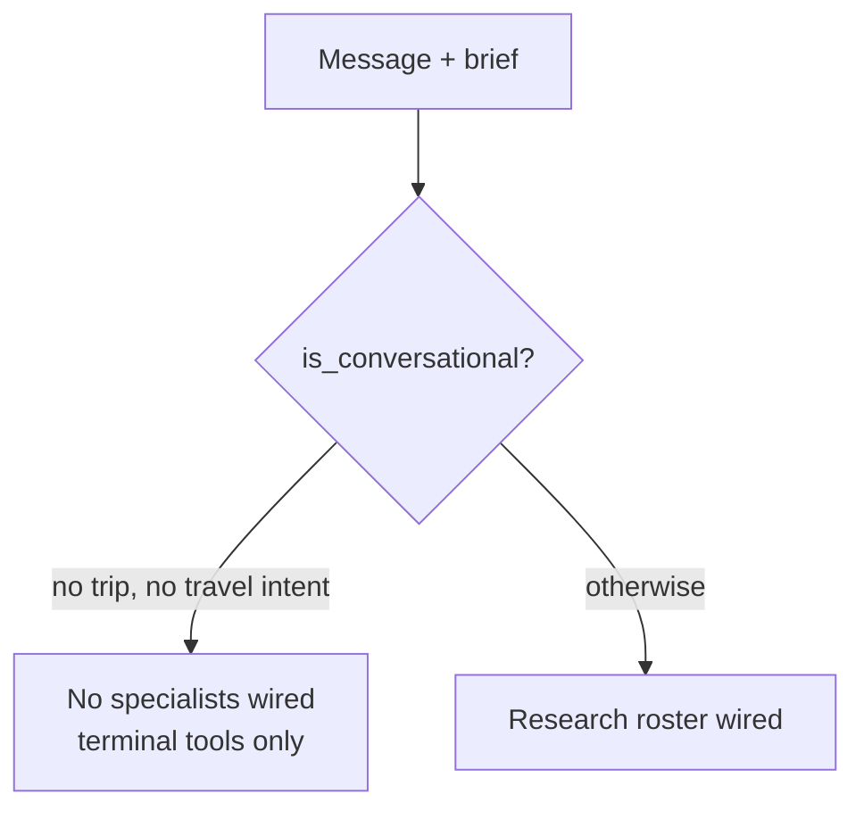
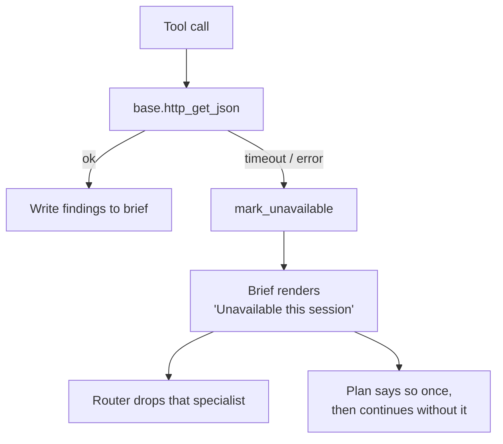
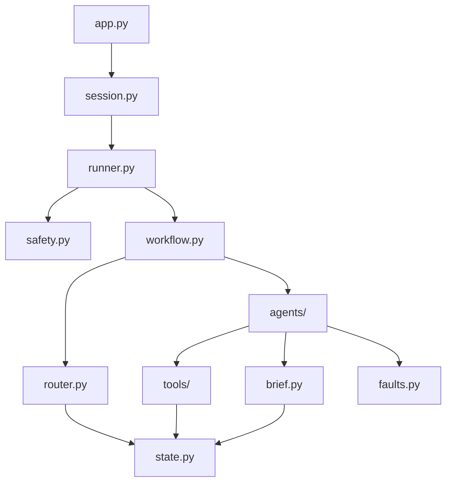

# Travel Agent Architecture

Travel Agent is a multi-agent system built on **Microsoft Agent Framework (MAF)**. It exists to exercise the Rhesis SDK's `auto_instrument("agent_framework")` integration with a travel planner that produces real agent handoffs, LLM calls, tool calls and endpoint traces — and to behave like a competent assistant while doing it.

## The core idea: state travels beside the handoff, not through it

MAF's `clean_conversation_for_handoff` strips every non-text content part when control passes between agents. Tool calls and their results do not survive a hop. An earlier version worked around this by asking each specialist to serialise its findings into labelled prose (`DESTINATION: <city>`) for the next agent to parse. On a small model those lines get dropped, and a single miss meant the coordinator had nothing to plan from.

The fix is to stop using the conversation as the data channel:

```mermaid
flowchart LR
    Brief[TripBrief<br/>Pydantic, per conversation]
    Provider[BriefContextProvider<br/>on every agent]
    Agent[Agent activation]
    Tool[Tool]

    Brief -->|before_run renders it<br/>into instructions| Provider
    Provider --> Agent
    Agent --> Tool
    Tool -->|writes findings back| Brief
```

A `ContextVar` holds the brief for the duration of a turn. Tools mutate it as a side effect of running, and a `ContextProvider` re-renders it into **every** agent's instructions on **every** activation. `HandoffBuilder._clone_chat_agent` forwards `context_providers` to the clones it builds, so this survives graph construction.

Handoffs still happen exactly as before — the trace graph is untouched — but they no longer carry the data.

## Agent Overview

```mermaid
flowchart TB
    User[User message]
    Safety{safety.classify}
    Router[router.eligible_targets]
    Coord[trip_coordinator]
    PR[place_resolver<br/>Nominatim]
    DF[destination_finder<br/>local list]
    SS[sightseeing_scout<br/>Overpass → Wikipedia]
    DS[dining_scout<br/>Overpass]
    CS[conditions_scout<br/>Open-Meteo]
    TP[transit_planner<br/>OSRM]
    LA[lodging_advisor<br/>rate table]
    Reply[Reply]

    User --> Safety
    Safety -->|block| Reply
    Safety -->|allow / flag| Router
    Router --> Coord
    Coord <--> PR
    Coord <--> DF
    Coord <--> SS
    Coord <--> DS
    Coord <--> CS
    Coord <--> TP
    Coord <--> LA
    Coord --> Reply
```

| Agent | Responsibility | Service |
|---|---|---|
| `trip_coordinator` | Talks to the user, keeps the brief, routes research, writes the plan. | — |
| `destination_finder` | Picks a surprise destination. | local list |
| `place_resolver` | Geocodes the destination, flags ambiguous names. | Nominatim |
| `sightseeing_scout` | Finds real landmarks. | Overpass, Wikipedia fallback |
| `dining_scout` | Finds restaurants by cuisine and diet. | Overpass |
| `conditions_scout` | Weather outlook and packing advice. | Open-Meteo |
| `transit_planner` | Measured travel times between sights. | OSRM |
| `lodging_advisor` | Nightly budget sanity check. | static rate table |

Every service is keyless, so the agent runs with only a Gemini key.

## Why a greeting cannot return an itinerary

The workflow is rebuilt per turn, so its shape can depend on the brief. `router.eligible_targets` returns **no specialists at all** for a conversational turn, which means the coordinator is built without any `handoff_to_*` tools. It is structurally incapable of starting research — not merely instructed not to.

```mermaid
flowchart TB
    Msg[Message + brief]
    Conv{is_conversational?}
    None[No specialists wired<br/>terminal tools only]
    All[Research roster wired]
    Msg --> Conv
    Conv -->|no trip, no travel intent| None
    Conv -->|otherwise| All
```

Once a trip exists, nothing is conversational — even a bare "ok" is a planning turn, which is what stops a short reply from dropping the trip.

## Phases and the directive

Phase is **derived** from the brief, never asserted by the model:

| Phase | Condition | Coordinator's next move |
|---|---|---|
| `GREETING` | no destination | greet, or record a named place |
| `RESOLVING` | ambiguous candidates | ask which one, naming all options |
| `GATHERING` | destination known, duration missing | ask one slot per turn |
| `BUILDING` | destination and duration known | hand off to the pending specialists in order |
| `PLANNED` | a plan exists | refine, re-running only what changed |

`DirectiveContextProvider` re-renders this on **every activation**, not once per turn. That matters: the brief changes as specialists report back, and a directive fixed at the start of the turn kept sending the coordinator to a specialist that had already finished, looping until the hop budget ran out.

## Fault tolerance

```mermaid
flowchart TB
    Call[Tool call]
    HTTP[base.http_get_json]
    OK[Write findings to brief]
    Fail[mark_unavailable]
    Brief[Brief renders<br/>'Unavailable this session']
    Router[Router drops that specialist]
    Plan[Plan says so once,<br/>then continues without it]

    Call --> HTTP
    HTTP -->|ok| OK
    HTTP -->|timeout / error| Fail
    Fail --> Brief
    Brief --> Router
    Brief --> Plan
```

- No tool ever raises. Every one returns a sentence the model can repeat.
- Per-service timeout and attempt budgets (`SERVICE_BUDGETS`); Overpass gets longer and one attempt, because retrying a slow query spends the budget twice.
- `ToolFaultMiddleware` is the last-resort net for a tool that crashes or hangs.
- A failed service is remembered on the brief, so it is not retried on every later turn.
- A name the geocoder cannot place is recorded in `resolution_attempts` and not retried.
- `TRAVEL_AGENT_FAULTS=weather:timeout,sights:empty` forces failures for testing.

## Safety

`safety.classify` runs in Python **before** the model sees anything:

- **block** — prompt injection, or an out-of-scope request with no travel content. Served deterministically; the workflow never runs, so it costs no LLM calls and cannot be talked past.
- **flag** — off-topic content alongside real planning content ("who won the World Cup? also I like modern art"). The coordinator is told to decline that part and continue.
- **allow** — everything else.

## Package Layout

```mermaid
flowchart TB
    App[app.py] --> Session[session.py]
    Session --> Runner[runner.py]
    Runner --> Safety[safety.py]
    Runner --> Workflow[workflow.py]
    Workflow --> Router[router.py]
    Workflow --> Agents[agents/]
    Router --> State[state.py]
    Agents --> Brief[brief.py]
    Agents --> Tools[tools/]
    Agents --> Faults[faults.py]
    Tools --> State
    Brief --> State
```

| File | Responsibility |
|---|---|
| `app.py` | FastAPI surface and Rhesis `@endpoint`. The only module importing `rhesis.sdk`. |
| `session.py` | `StateStore` (brief + transcript per conversation) and the turn wrapper. |
| `runner.py` | Runs one turn; resolves the single reply. |
| `workflow.py` | Builds this turn's `HandoffBuilder` graph. |
| `router.py` | Which specialists exist, and the per-activation directive. |
| `state.py` | `TripBrief` and pure functions over it. No framework imports. |
| `brief.py` | The `ContextVar` binding and `BriefContextProvider`. |
| `safety.py` | Scope and injection guard. |
| `terminals.py` | Coordinator state and turn-ending tools. |
| `faults.py` | Tool timeout/crash guard. |
| `client.py` | Gemini client, plus the message sanitising Gemini's stricter API needs. |
| `tools/` | One module per external service. |
| `utils.py` | Stream parsing and response formatting. |

## Gemini compatibility

Gemini's OpenAI-compatible surface enforces three rules the OpenAI API does not, and handoffs break all three. `client.py` sanitises every request:

- an orphaned tool result (its `function_call` stripped at the hop) → `function_response.name: Name cannot be empty`
- an empty message list → `contents is not specified`
- a list opening or closing on an assistant message → `function call turn must come after a user turn`

Padding costs no context, because the brief and the user's own words are re-rendered into the instructions on every activation.

## Conversation Memory

`StateStore` holds a `TripBrief` and the user-visible transcript per `conversation_id`, bounded and FIFO-evicted. Briefs are handed out as deep copies and written back only when a turn succeeds, so a turn that raises cannot leave half-applied state. Turns within one conversation are serialised by a lock keyed on the running event loop — the Rhesis connector runs each turn on a fresh loop.

## Trace Surface

| Rhesis span | Source |
|---|---|
| `ai.endpoint.invoke` | `@endpoint` around `/chat` or the playground connector |
| `ai.agent.invoke` | per agent activation |
| `ai.agent.handoff` | synthesized by the SDK from `handoff_to_*` calls in chat output — **these are the Graph View's edges** |
| `ai.llm.invoke` | Gemini chat completions |
| `ai.tool.invoke` | domain tool execution |

MAF short-circuits `handoff_to_*` tool calls, so no `execute_tool` span exists for them; the handoff is visible only in the chat span's output messages. `tests/test_span_tree.py` asserts those `ai.agent.handoff` spans still appear with the right `from`/`to`, so a refactor cannot flatten the graph unnoticed.
