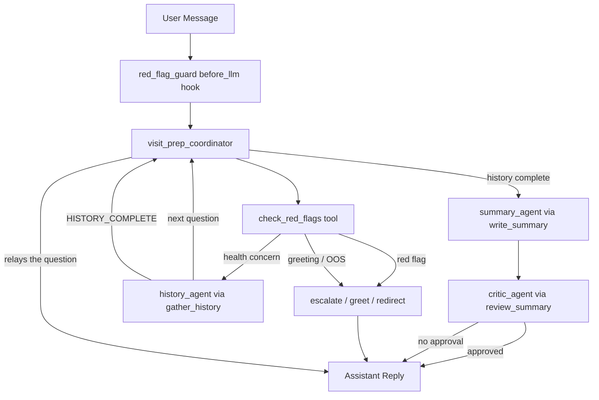
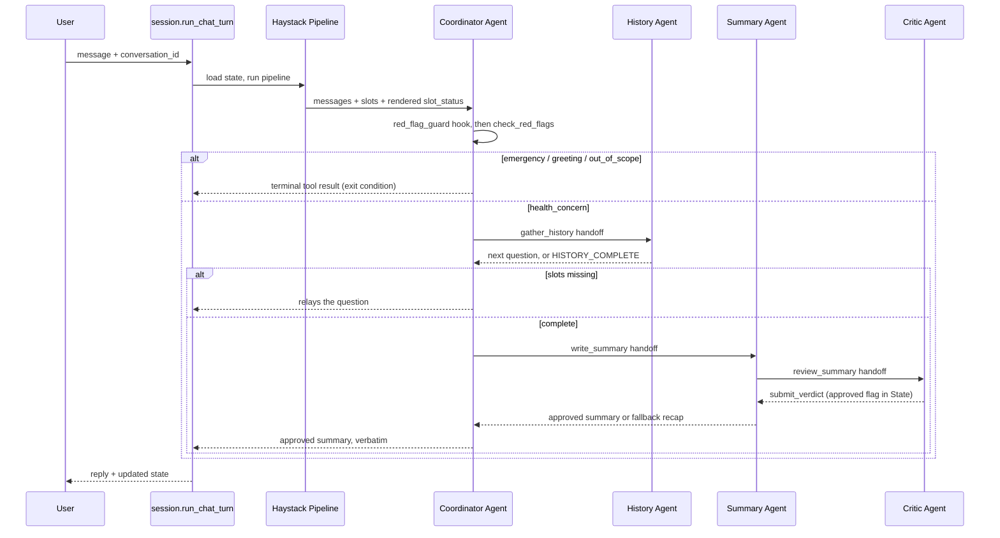

# Visit-Prep Architecture

Visit-Prep is a multi-agent system built on **Haystack 3.x**. It helps a person prepare for a doctor's appointment by collecting a structured clinical history (OPQRST / SOCRATES slots), then producing a symptom timeline and questions to ask a clinician. It does not diagnose or recommend treatment.

## Agent Overview

| Subagent | Responsibility |
|---|---|
| `visit_prep_coordinator` | Routes every turn via tools: red-flag check first, then greet / redirect / gather / summarize. |
| `history_agent` | Extracts slot updates with `record_slots`, then asks one question about the next missing slot. |
| `summary_agent` | Produces timeline + clinician questions from filled slots; hands off to the critic. |
| `critic_agent` | Independent reviewer with veto power via `submit_verdict`; without an approval the user gets a deterministic slot recap. |

Specialists are spawned as `Tool` handoffs from the coordinator (or from the summary agent for the critic). Haystack nests each specialist's `haystack.agent.run` under the caller's `haystack.agent.step.tool` span, which the Rhesis tracer promotes to `ai.agent.handoff`.

Only the three terminal tools are `exit_conditions`, because their templated return value *is* the reply. Handoffs deliberately are not: the coordinator has to see what a specialist returned in order to relay a question, or to move on to `write_summary` once the history is complete. A handoff listed as an exit condition ends the run the moment it returns, which hands the specialist's internal status line straight to the user.

## Package Layout

| File | Responsibility |
|---|---|
| `app.py` | FastAPI surface, Rhesis `@endpoint` (traced server boundary). |
| `pipeline.py` | Thin one-component `Pipeline` around the coordinator + turn orchestration. |
| `session.py` | `StateStore` + `run_chat_turn` / `run_chat_turn_async` for multi-turn continuity. |
| `client.py` | Single Gemini `GoogleGenAIChatGenerator` factory shared by all agents. |
| `state.py` | `VisitPrepState`, `Slots`, `Phase` (cross-turn persistence) and `describe_slots`. |
| `safety.py` | Rule-based `text_suggests_red_flag` / `first_red_flag_text`. |
| `terminals.py` | Templated greet, redirect, and escalate responses. |
| `tools.py` | `check_red_flags`, terminal tools, `record_slots`, `submit_verdict`. |
| `utils.py` | ChatMessage helpers for reading conversations out of Agent `State`. |
| `agents/` | Coordinator, history, summary, and critic agent factories. |

## Request Flow

## State and Completeness

- One `VisitPrepState` object per conversation, owned by `session.py` (Agent `State` is per-run only).
- Core slots: onset, location, character, severity, timing, aggravating, relieving, associated.
- `context` (meds, conditions, recent changes) is **optional** in this draft.
- "Complete" means all core slots are filled; then `write_summary` is allowed.

**Agent `State` is invisible to the model.** Haystack feeds a chat generator only messages and rendered prompt variables, so a value sitting in `state_schema` cannot influence a decision on its own — it reaches the model as a tool result, or as a prompt variable, or not at all. That is why `describe_slots` is rendered into the coordinator's and the history specialist's system prompts as `{{ slot_status }}`: without it neither can tell what is already known, and the coordinator cannot judge whether the history is complete. For the same reason `gather_history` forwards the recent conversation to the specialist, so a bare answer like "9" can be matched to the question that prompted it.

Completeness itself is decided in Python (`missing_core_slots`), not by a model emitting a sentinel.

## Safety Model

1. Never diagnose or recommend treatment (prompt constraints + safety critic).
2. **The red-flag check cannot be routed around.** `check_red_flags` is an ordinary tool, so it produces its own span, but a model that never calls it would never be checked. The `red_flag_guard` `before_llm` hook therefore runs the same rules on every step and injects a `SAFETY OVERRIDE` instruction when they match. The tool reads the latest user message from `State` rather than taking it as an argument, so the model cannot paraphrase away the wording the patterns match.
3. **Escalation is sticky.** The rules scan every user turn in the replayed conversation, so a red flag raised earlier keeps firing and visit prep does not quietly resume on a later benign message.
4. **The critic's veto is enforced outside the prompt.** `submit_verdict` writes a bool into `State`; `run_summary_with_fallback` ships the approved draft it finds there, or the deterministic recap. A draft that was never reviewed, or was rewritten after approval, cannot reach the user.
5. An approved summary reaches the user verbatim: `write_summary` stores it in the coordinator's `summary` state key and the turn layer prefers that over anything the coordinator says afterwards.
6. No external medical lookup tools in this draft.

## Concurrency

`session.py` keeps one process-wide pipeline. Concurrent turns share it safely, where the previous design serialized every turn behind a global run lock. Dropping that lock rests on all three shared objects holding no per-run state: `Pipeline.run` keeps its bookkeeping in locals, the Agent builds a fresh `State` per run and otherwise only flips idempotent warm-up flags, and `GoogleGenAIChatGenerator` assigns to `self` in `__init__` alone — its `run` reads configuration and calls the client. That client is `google-genai`'s, built on `httpx.Client`, which is safe to share across threads. If a future generator does carry per-run state, the lock belongs on the generator rather than the pipeline, so turns can still overlap everywhere else.

Threads are not incidental on the async path. `Tool.invoke_async` runs a sync tool `function` through `asyncio.to_thread`, so the handoffs — and the specialist `Agent.run` calls inside them — execute on worker threads sharing that one generator, which is what makes the paragraph above load-bearing rather than theoretical. The event loop itself is never blocked: `Agent.run_async` prefers the generator's `run_async`, which awaits `client.aio` on an `httpx.AsyncClient`, and any component without a `run_async` is offloaded to a thread rather than run inline.

Turns on **one** conversation still serialize, or two overlapping turns would read the same state and the second write would lose the first. The sync and async entry points cannot share one lock for this: a `threading.Lock` held across an `await` blocks the event loop thread, and the coroutine holding it can never resume — a permanent hang, not a slow request. `StateStore` therefore hands out a `threading.Lock` to `run_chat_turn` and an `asyncio.Lock` to `run_chat_turn_async`.

## Rhesis Integration

Tracing is opt-in at the entrypoint boundary — business modules never import Rhesis or Haystack tracing.

| Entrypoint | Tracing |
|---|---|
| `chat_terminal/chat.py`, `examples/run_scenarios.py` | None — runs standalone even when `RHESIS_*` creds are set |
| `python -m visit_prep`, `chat_terminal/chat_traced.py`, `examples/run_scenarios_traced.py` | `RhesisTracing` from `rhesis-haystack` enables the global tracer and, in the scripts, opens each turn's root span |

`app.py` imports `RhesisClient` and `@endpoint` for the served path. The FastAPI dev server (`python -m visit_prep`) registers the SDK endpoint and opens the WebSocket connector via uvicorn's event loop.

## Trace Surface

| Span | Source |
|---|---|
| `ai.endpoint.invoke` | Rhesis `@endpoint` on `/chat` (served path only) |
| `function.haystack.pipeline.run` | Root pipeline run (global `RhesisTracer`) |
| `function.haystack.coordinator` | Pipeline component wrapper (`type=Agent`) |
| `ai.agent.invoke` | Coordinator / history / summary / critic agent runs |
| `function.haystack.agent.step` | Agent loop iteration |
| `ai.llm.invoke` | `haystack.agent.step.llm` (in-agent LLM call) |
| `ai.tool.invoke` | `haystack.agent.step.tool` for ordinary tools |
| `ai.agent.handoff` | Tool span promoted when a nested Agent starts (`gather_history`, `write_summary`, `review_summary`) |

Multi-turn grouping:

- **Served path** (`python -m visit_prep`): SDK `@endpoint` `session_id` mapping groups turns by `conversation_id`.
- **Script path** (`chat_traced.py`, `run_scenarios_traced.py`): `RhesisTracing.start_conversation()` groups the turns and `RhesisTracing.turn()` opens the turn root carrying the message and the reply. All turns of one conversation share a trace.
