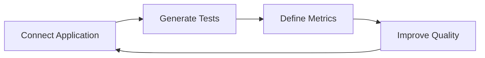

# Rhesis Documentation

**Gen AI Testing. Collaborative. Adaptive.**

From "I hope this works" to "I know this works." Rhesis brings your whole team together—developers, domain experts, legal, and marketing—to create comprehensive testing that ensures your Gen AI applications work exactly as intended before users see them.

  <a href="/getting-started" className="inline-flex items-center justify-center px-6 py-3 border border-transparent text-base font-medium rounded-md text-white bg-blue-600 hover:bg-blue-700 transition-colors">
    Get Started →
  </a>
  <a href="/getting-started/concepts" className="inline-flex items-center justify-center px-6 py-3 border border-gray-300 text-base font-medium rounded-md text-gray-700 bg-white hover:bg-gray-50 transition-colors">
    Learn Core Concepts
  </a>

## Why Rhesis?

You spent weeks or months building something innovative. Don't let inadequate testing ruin the release. Traditional testing approaches fail with Gen AI because responses are non-deterministic, quality is subjective, and edge cases are infinite. Rhesis brings together technical and domain expertise to create testing that's as sophisticated as your Gen AI architecture.

  

    <h3 className="text-lg font-semibold mb-3">🧪 Test Generation</h3>
    
Automated scenario creation at scale. Your domain experts define what matters, we generate thousands of relevant test cases automatically.

  

  
  

    <h3 className="text-lg font-semibold mb-3">🧠 Knowledge Sets</h3>
    
Domain-specific testing intelligence. Legal requirements, business rules, edge cases—all captured and used to ensure comprehensive coverage.

  

  
  

    <h3 className="text-lg font-semibold mb-3">⚡ Test Execution</h3>
    
Real-world simulation engine that tests your Gen AI under actual conditions. From simple chatbots to complex multi-agent architectures.

  

  
  

    <h3 className="text-lg font-semibold mb-3">📊 Metrics</h3>
    
Clear insights, actionable results. Track performance, safety, compliance, and user experience with analytics that matter to your team.

  

## Start Testing in Minutes

Choose how you want to work with Rhesis:

  

    <h3 className="text-xl font-bold mb-3">🖥️ Platform</h3>
    
Get your whole team involved with sophisticated tools that make testing everyone's responsibility.

    

      <a href="/getting-started" className="block text-blue-600 hover:text-blue-800 font-medium">→ Platform Quick Start</a>
      <a href="/platform/projects" className="block text-blue-600 hover:text-blue-800">→ Create Your First Project</a>
      <a href="/platform/tests-generation" className="block text-blue-600 hover:text-blue-800">→ Generate Test Scenarios</a>
      <a href="/platform/metrics" className="block text-blue-600 hover:text-blue-800">→ Define Quality Benchmarks</a>
    

  

  
  

    <h3 className="text-xl font-bold mb-3">💻 SDK</h3>
    
Test without leaving your IDE. Integrate directly into your development workflow.

    

      <a href="/getting-started/sdk" className="block text-blue-600 hover:text-blue-800 font-medium">→ SDK Quick Start</a>
      <a href="/development/sdk" className="block text-blue-600 hover:text-blue-800">→ Advanced SDK Usage</a>
      <a href="/platform/integrations/api-tokens" className="block text-blue-600 hover:text-blue-800">→ Authentication & API Tokens</a>
      <a href="/development/api-reference" className="block text-blue-600 hover:text-blue-800">→ API Reference</a>
    

  

## How It Works

Great AI teams know what they're shipping before users do. Turn testing from "crossing fingers" into something as sophisticated as your development process.

### 1. Connect Application

Our API and SDK work with any Gen AI system, from simple chatbots to complex multi-agent architectures. [Configure Endpoints →](/platform/endpoints)

### 2. Generate Tests

Your team defines what matters: legal requirements, business rules, edge cases. We automatically generate thousands of test scenarios based on their expertise. [Start Generating →](/platform/tests-generation)

### 3. Define Metrics

Set quality benchmarks that actually matter to your team. Track performance, safety, compliance, and user experience with clear analytics. [Create Metrics →](/platform/metrics)

### 4. Improve Quality

Receive detailed analysis that helps you understand exactly how your Gen AI performs before your users do. [View Results →](/platform/test-results)

## Built for Teams, Proven in Production

Advanced testing architecture, collaborative by design. Rhesis works with any Gen AI system and integrates seamlessly into your existing development workflow.

  

    <h3 className="font-semibold mb-2">🏥 Healthcare</h3>
    
HIPAA compliance testing

  

  
  

    <h3 className="font-semibold mb-2">🏦 Insurance</h3>
    
Policy accuracy validation

  

  
  

    <h3 className="font-semibold mb-2">⚖️ Legal Tech</h3>
    
Regulatory requirement checks

  

  
  

    <h3 className="font-semibold mb-2">💬 Customer Support</h3>
    
Response quality assurance

  

## Community & Support

  

    <h3 className="text-lg font-semibold mb-2">📚 Documentation</h3>
    
Comprehensive guides and API references

    <a href="/platform" className="text-blue-600 hover:text-blue-800">Browse Docs →</a>
  

  
  

    <h3 className="text-lg font-semibold mb-2">💬 Community</h3>
    
Join discussions and get help from the community

    <a href="https://github.com/rhesis-ai/rhesis/discussions" className="text-blue-600 hover:text-blue-800">GitHub Discussions →</a>
  

  
  

    <h3 className="text-lg font-semibold mb-2">🐛 Issues</h3>
    
Report bugs and request features

    <a href="https://github.com/rhesis-ai/rhesis/issues" className="text-blue-600 hover:text-blue-800">GitHub Issues →</a>
  

---

<Callout type="info">
  **From "It works on my machine" to production-ready.** Your Gen AI deserves testing that's as thoughtful as your architecture. [Get Started →](/getting-started)
</Callout>