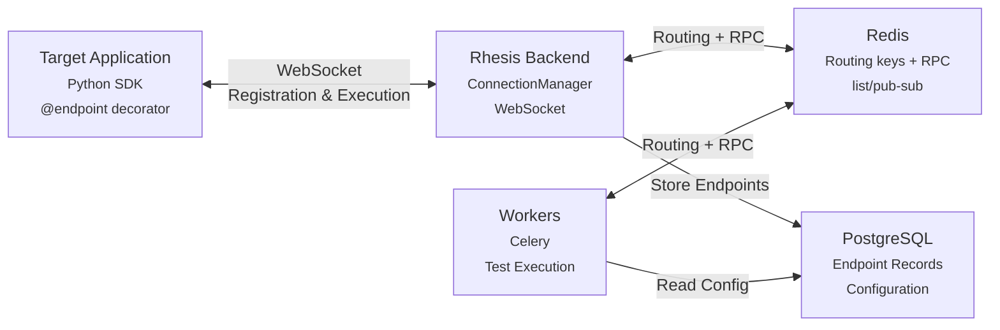

import { CodeBlock } from '@/components/CodeBlock'

# Connector

The connector enables bidirectional communication between your application (via the Rhesis SDK), the Rhesis backend, and worker processes. It allows remote function execution and automatic endpoint registration without manual configuration.

## System Architecture

The connector connects three main components: your target application (via the SDK), the Rhesis backend, and worker processes.

**Target Application (SDK)**:
- Decorates functions with `@endpoint`
- Maintains WebSocket connection to backend
- Executes functions when requested
- Sends results back via WebSocket

**Rhesis Backend**:
- Manages WebSocket connections from SDK clients
- Receives function registrations
- Creates/updates endpoint records in database
- Forwards test execution requests to SDK
- Publishes responses to Redis for workers

**Workers**:
- Execute tests asynchronously via Celery
- Use Redis RPC to invoke SDK functions
- Cannot directly access backend's in-memory WebSocket connections
- Subscribe to Redis channels for SDK responses

### Connection Flow

**Initial Connection**:
1. Target app starts → SDK initializes `RhesisClient` with `project_id` and `environment`
2. SDK establishes an authenticated WebSocket connection to the backend (`/connector/ws`) — project/environment binding happens later, not at connect time
3. SDK sends a `register` message with function metadata, binding the connection to `project_id`/`environment`
4. Backend stores the connection routing and creates endpoint records

**Test Execution Flow**:
1. Worker receives test execution task
2. Worker looks up which backend instance owns the connection (`ws:routing:{project_id}:{environment}`) and pushes the RPC request onto that instance's queue (`ws:rpc:{worker_id}`)
3. Backend pops the request and forwards it to the SDK via WebSocket
4. SDK executes the function in the target app
5. SDK sends the result back via WebSocket
6. Backend publishes the result to Redis (`ws:rpc:response:{test_run_id}`)
7. Worker subscribes to that channel and receives the result

### Connector hardening controls

The SDK connector WebSocket endpoint (`/connector/ws`) applies runtime safeguards configurable
with backend environment variables:

| Variable | Default | Behavior |
|---|---|---|
| `WS_MAX_MESSAGE_SIZE` | `1048576` (1 MiB) | Rejects oversized SDK connector WebSocket messages |
| `WS_IDLE_TIMEOUT` | `300` seconds | Closes inactive SDK connector WebSocket sessions |
| `WS_RATE_LIMIT` | `50` messages/second | Applies per-connection sliding-window rate limiting |

These limits apply specifically to SDK connector traffic, not to all platform WebSocket usage.

## Backend Components

### Connection Manager

Manages WebSocket connections and RPC routing:

<CodeBlock filename="connection-manager.py" language="python">
{`from rhesis.backend.app.services.connector.manager import connection_manager

# Register a connection (project/environment binding happens later, via "register")
await connection_manager.connect(connection_id, context, websocket)

# Check connection status
is_connected = await connection_manager.is_connected(project_id, environment)

# Listen for RPC requests from workers (per-instance Redis queue)
asyncio.create_task(connection_manager._listen_for_rpc_requests())`}
</CodeBlock>

### Message Handlers

`SDKMessageHandler` (`services/connector/handler.py`) dispatches each WebSocket message to a specialized handler:

- **`handlers/registration.py`**: processes SDK function registration, syncs endpoints and SDK-registered metrics
- **`handlers/test_result.py`**: handles test execution results; for validation runs, updates endpoint status (Active/Error)
- **`handlers/pong.py`**: keepalive message handling
- **`handlers/metric_sync.py`**: syncs SDK-registered metrics into the `Metric` table

`metric_result` messages are handled inline in `manager.py` rather than through a dedicated handler.

### Mapping System

4-tier priority for request/response mapping (`services/connector/mapping/mapper_service.py`):

1. **SDK Manual**: Explicit mappings from `@endpoint` decorator
2. **Existing DB**: Preserved manual edits from UI
3. **Auto-Mapping**: Pattern-based heuristics (confidence >= 0.7)
4. **LLM Fallback**: Uses the user's configured generation model (confidence < 0.7)

<CodeBlock filename="mapping-service.py" language="python">
{`from rhesis.backend.app.services.connector.mapping import MappingService

mapping_service = MappingService()
result = mapping_service.generate_or_use_existing(
    db=db,
    user=user,
    endpoint=endpoint,
    sdk_metadata=sdk_metadata,
    function_data=function_data,
)`}
</CodeBlock>

## RPC Architecture

### Problem

Workers run in separate processes and cannot access backend's in-memory connection dictionary.

### Solution: Redis-Based RPC

**Flow**:
1. Worker resolves the owning backend instance via a routing key (`ws:routing:{project_id}:{environment}`)
2. Worker pushes the request onto that instance's Redis list (`ws:rpc:{worker_id}`)
3. Backend pops the request (`BLPOP`) and forwards it over the WebSocket
4. SDK executes the function and returns the result
5. Backend publishes the response to a per-request pub/sub channel (`ws:rpc:response:{test_run_id}`)
6. Worker subscribes to that channel and receives the result

<CodeBlock filename="rpc-usage.py" language="python">
{`from rhesis.backend.app.services.connector.rpc_client import SDKRpcClient

# Initialize in worker
rpc_client = SDKRpcClient()
await rpc_client.initialize()

# Check connection
if await rpc_client.is_connected(project_id, environment):
    # Invoke function
    result = await rpc_client.send_and_await_result(
        project_id=project_id,
        environment=environment,
        test_run_id=test_run_id,
        function_name="chat",
        inputs={"input": "Hello"},
        timeout=30.0
    )`}
</CodeBlock>

## WebSocket Protocol

### Message Types

| Type | Direction | Purpose |
|---|---|---|
| `register` | SDK → backend | Registers functions/metrics, optionally binds `project_id`/`environment` |
| `connected` | backend → SDK | Sent immediately on connect, before registration |
| `execute_test` | backend → SDK | Requests function execution |
| `test_result` | SDK → backend | Returns execution result |
| `execute_metric` | backend → SDK | Requests metric evaluation |
| `metric_result` | SDK → backend | Returns metric evaluation result |
| `pong` | SDK → backend | Keepalive response |
| `error` | backend → SDK | Oversized, rate-limited, or malformed message |

### Registration Message

<CodeBlock filename="registration-message.json" language="json">
{`{
  "type": "register",
  "project_id": "project_123",
  "environment": "development",
  "sdk_version": "1.0.0",
  "functions": [
    {
      "name": "chat",
      "parameters": {
        "input": {
          "type": "str"
        }
      },
      "return_type": "dict",
      "metadata": {
        "description": "Chat handler"
      }
    }
  ]
}`}
</CodeBlock>

`project_id` and `environment` are optional in register messages for metrics-only sessions.
When they are omitted, the backend skips endpoint synchronization and still syncs registered SDK metrics.

## Endpoint Synchronization

When SDK registers functions, backend automatically:

1. Creates/updates endpoint records
2. Generates or applies mappings
3. Validates mappings via test execution
4. Updates endpoint status (Active/Error/Inactive)

<CodeBlock filename="endpoint-sync.py" language="python">
{`from rhesis.backend.app.services.endpoint.sdk_sync import sync_sdk_endpoints

stats = await sync_sdk_endpoints(
    db=db,
    project_id=project_id,
    environment=environment,
    functions_data=functions_data,
    organization_id=org_id,
    user_id=user_id
)
# Returns: {"created": 2, "updated": 1, "marked_inactive": 0, "errors": []}`}
</CodeBlock>

## Key Files

**Backend** (`apps/backend/src/rhesis/backend/app/`):
- `routers/connector.py` - WebSocket and REST endpoints
- `services/connector/manager.py` - Connection management
- `services/connector/handler.py` - Message dispatch facade
- `services/connector/handlers/` - Specialized message handlers
- `services/connector/schemas.py` - Wire protocol message schemas
- `services/connector/mapping/` - Mapping logic
- `services/connector/rpc_client.py` - Worker RPC client
- `services/connector/redis_client.py` - Redis connection
- `services/endpoint/sdk_sync.py` - Endpoint synchronization

**SDK** (`sdk/src/rhesis/sdk/`):
- `clients/rhesis.py` - `RhesisClient`
- `connector/manager.py` - SDK connector manager
- `connector/connection.py` - WebSocket connection
- `connector/executor.py` - Function dispatch
- `decorators/endpoint.py` - `@endpoint` decorator

---

<Callout type="default">
  **Related Documentation** - [Backend](./backend) - [Worker](./worker) - [SDK Connector](/sdk/connector)
</Callout>
