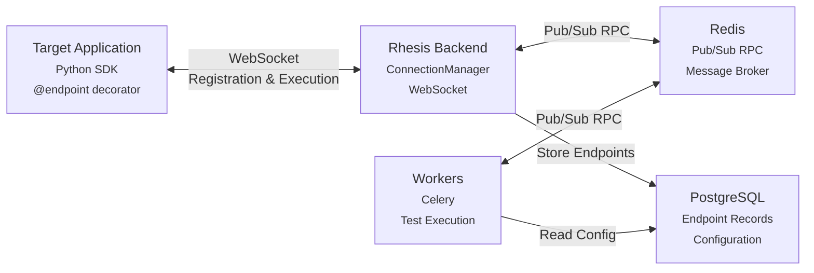

import { CodeBlock } from '@/components/CodeBlock'

# Connector

The connector enables bidirectional communication between your application (via the Rhesis SDK), the Rhesis backend, and worker processes. It allows remote function execution and automatic endpoint registration without manual configuration.

## System Architecture

The connector connects three main components: your target application (via the SDK), the Rhesis backend, and worker processes.

**Target Application (SDK)**:
- Decorates functions with `@endpoint`
- Maintains WebSocket connection to backend
- Executes functions when requested
- Sends results back via WebSocket

**Rhesis Backend**:
- Manages WebSocket connections from SDK clients
- Receives function registrations
- Creates/updates endpoint records in database
- Forwards test execution requests to SDK
- Publishes responses to Redis for workers

**Workers**:
- Execute tests asynchronously via Celery
- Use Redis RPC to invoke SDK functions
- Cannot directly access backend's in-memory WebSocket connections
- Subscribe to Redis channels for SDK responses

### Connection Flow

**Initial Connection**:
1. Target app starts → SDK initializes `RhesisClient` with `project_id` and `environment`
2. SDK establishes WebSocket connection to backend (`/ws/connector`)
3. SDK sends registration message with function metadata
4. Backend stores connection and creates endpoint records

**Test Execution Flow**:
1. Worker receives test execution task
2. Worker publishes RPC request to Redis (`ws:rpc:requests`)
3. Backend subscribes to Redis and forwards request to SDK via WebSocket
4. SDK executes function in target app
5. SDK sends result back via WebSocket
6. Backend publishes result to Redis (`ws:rpc:response:{test_run_id}`)
7. Worker subscribes and receives result

## Backend Components

### Connection Manager

Manages WebSocket connections and RPC routing:

<CodeBlock filename="connection-manager.py" language="python">
{`from rhesis.backend.app.services.connector.manager import ConnectionManager

# Store connections (in-memory + Redis)
await connection_manager.connect(project_id, environment, websocket)

# Check connection status
is_connected = await connection_manager.is_connected(project_id, environment)

# Listen for RPC requests from workers
asyncio.create_task(connection_manager._listen_for_rpc_requests())`}
</CodeBlock>

### Message Handlers

- **`registration.py`**: Processes SDK function registration, syncs endpoints
- **`test_result.py`**: Handles test execution results, triggers validation
- **`pong.py`**: Keepalive message handling

### Mapping System

4-tier priority for request/response mapping:

1. **SDK Manual**: Explicit mappings from `@endpoint` decorator
2. **Existing DB**: Preserved manual edits from UI
3. **Auto-Mapping**: Pattern-based heuristics (confidence >= 0.7)
4. **LLM Fallback**: GPT-4 generates mappings (confidence < 0.7)

<CodeBlock filename="mapping-service.py" language="python">
{`from rhesis.backend.app.services.connector.mapping import MappingService

mapping_service = MappingService()
result = mapping_service.generate_or_use_existing(
    function_data=function_data,
    existing_mappings=endpoint.mappings
)`}
</CodeBlock>

## RPC Architecture

### Problem

Workers run in separate processes and cannot access backend's in-memory connection dictionary.

### Solution: Redis Pub/Sub RPC

**Flow**:
1. Worker publishes request to Redis channel
2. Backend subscribes and forwards to WebSocket
3. SDK executes function and returns result
4. Backend publishes response to Redis
5. Worker subscribes and receives result

<CodeBlock filename="rpc-usage.py" language="python">
{`from rhesis.backend.app.services.connector.rpc_client import SDKRpcClient

# Initialize in worker
rpc_client = SDKRpcClient()
await rpc_client.initialize()

# Check connection
if await rpc_client.is_connected(project_id, environment):
    # Invoke function
    result = await rpc_client.send_and_await_result(
        project_id=project_id,
        environment=environment,
        test_run_id=test_run_id,
        function_name="chat",
        inputs={"input": "Hello"},
        timeout=30.0
    )`}
</CodeBlock>

## WebSocket Protocol

### Message Types

- **`register`**: SDK registers functions with metadata
- **`execute_test`**: Backend requests function execution
- **`test_result`**: SDK returns execution result
- **`pong`**: Keepalive response

### Registration Message

<CodeBlock filename="registration-message.json" language="json">
{`{
  "type": "register",
  "project_id": "project_123",
  "environment": "development",
  "sdk_version": "1.0.0",
  "functions": [
    {
      "name": "chat",
      "parameters": {
        "input": {
          "type": "str"
        }
      },
      "return_type": "dict",
      "metadata": {
        "description": "Chat handler"
      }
    }
  ]
}`}
</CodeBlock>

## Endpoint Synchronization

When SDK registers functions, backend automatically:

1. Creates/updates endpoint records
2. Generates or applies mappings
3. Validates mappings via test execution
4. Updates endpoint status (Active/Error/Inactive)

<CodeBlock filename="endpoint-sync.py" language="python">
{`from rhesis.backend.app.services.endpoint.sdk_sync import sync_sdk_endpoints

stats = await sync_sdk_endpoints(
    db=db,
    project_id=project_id,
    environment=environment,
    functions_data=functions_data,
    organization_id=org_id,
    user_id=user_id
)
# Returns: {"created": 2, "updated": 1, "marked_inactive": 0}`}
</CodeBlock>

## Key Files

**Backend** (`apps/backend/src/rhesis/backend/app/`):
- `services/connector/manager.py` - Connection management
- `services/connector/handlers/` - Message handlers
- `services/connector/mapping/` - Mapping logic
- `services/connector/rpc_client.py` - Worker RPC client
- `services/connector/redis_client.py` - Redis connection
- `routers/connector.py` - WebSocket and REST endpoints

**SDK** (`sdk/src/rhesis/sdk/`):
- `connector/manager.py` - SDK connector manager
- `connector/connection.py` - WebSocket connection
- `decorators.py` - `@endpoint` decorator

---

<Callout type="default">
  **Related Documentation** - [Backend](./backend) - [Worker](./worker) - [SDK Connector](/sdk/connector)
</Callout>
