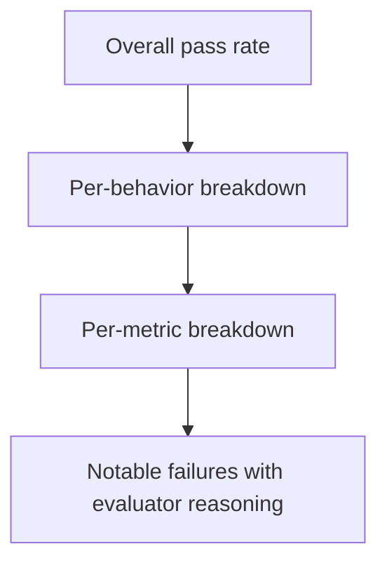

# Running and Analyzing

After you approve the plan, Architect runs the tests and presents results in a structured format. You can also ask it to analyze existing runs or compare two runs directly.

## Running tests

When creation is complete, Architect offers to run the tests. Confirm, and it submits the test set to your endpoint. The mode chip switches to `executing` while it waits.

You don't need to create a test configuration manually. Architect handles the setup and monitors the run automatically — there is no polling or waiting on your part.

When the run completes, Architect presents the results.

## Results format

Results come in three layers, each more specific than the last:



**Overall** — a single pass/fail percentage for the full run. Sets the context before diving in.

**Per-behavior** — pass rate for each behavior you tested. Behaviors with a rate below threshold are flagged immediately.

**Per-metric** — within each behavior, how each metric scored. Lets you see whether a behavior failed on one specific criterion (e.g., tone) while passing others (e.g., accuracy).

**Notable failures** — the worst-performing tests, with the evaluator's stated reason for marking them as failing. This tells you *why* something failed, not just *that* it did.

## Interpreting failure patterns

Architect categorizes failure patterns and surfaces likely causes:

| Pattern | What it means | What to do |
| --- | --- | --- |
| All tests fail (0%) | Endpoint unreachable, response format changed, or auth issue | Check connectivity and endpoint response format |
| Most tests fail in one behavior | That specific behavior needs attention — the endpoint may be inconsistent in this area | Tighten the behavior description or review the endpoint's handling |
| Single metric fails across behaviors | The evaluation criteria may be miscalibrated, or there's a genuine weakness | Review the metric threshold; check if failures cluster on a topic |
| Tests fail on a narrow topic cluster | The endpoint has a knowledge gap | Consider targeted improvements or additional training data |
| Borderline pass rates (50–70%) | The endpoint is inconsistent — working sometimes but not reliably | Re-run with more tests to confirm; look for input patterns that trigger the inconsistency |

## Comparing two runs

Ask Architect to compare any two runs to see what changed:

```text
"How does the latest run compare to the previous one?"
"Compare run A to run B."
```

Architect retrieves both run results and shows:

- **Overall trend** — improved, regressed, or unchanged
- **Per-behavior changes** — which behaviors got better or worse
- **Per-metric changes** — which specific metrics drove the change
- **Notable regressions** — tests that were passing and now fail
- **Notable improvements** — tests that were failing and now pass

## Analyzing an existing run

You don't need to run a test yourself to get an analysis. Ask Architect about any past run:

```text
"Analyze run 42."
"What do the results of the last test run look like?"
```

Architect fetches the results and presents the same three-layer summary — overall, behavior breakdown, metric breakdown — plus actionable suggestions based on what it finds.

<Callout type="info">
  Architect refers to runs by name or index. You don't need to supply a run ID.
</Callout>
