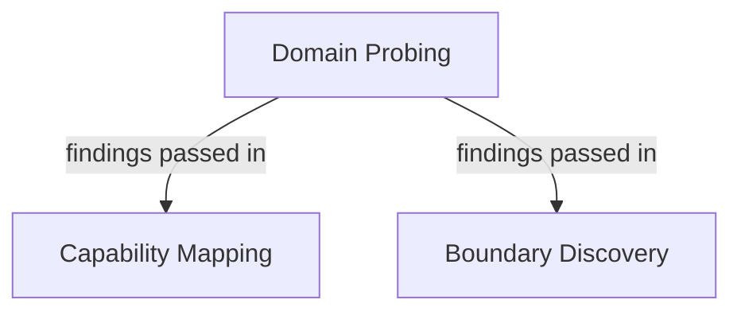

# Endpoint Exploration

Before designing a test suite, Architect explores your endpoint — running real conversations against it to understand what it does and how it behaves.

## Choosing a mode

When you mention an endpoint, Architect asks which mode you prefer:

| Mode | What it runs | Best when |
| --- | --- | --- |
| **Quick** | Domain probing only | You know your endpoint, or just want to get started fast |
| **Comprehensive** | Domain probing → capability mapping → boundary discovery | You're testing an unfamiliar endpoint, or want full coverage |

If you say "just go ahead" or don't express a preference, Architect defaults to **Quick**.

<Callout type="info">
  You can always deepen exploration after a Quick run. Ask Architect to "dig into capabilities" or "check the boundary behavior" and it will run the relevant follow-up strategy.
</Callout>

## What each strategy finds



**Comprehensive mode** chains all three, passing what it learned in each step into the next.

### Domain probing

Discovers the endpoint's core identity:

- What domain does it operate in?
- What is its purpose and persona?
- What terminology does it use?
- Which topics does it cover?

### Capability mapping

Enumerates what the endpoint can actually do:

- Supported query types and interaction patterns
- Multi-turn conversation support
- Functional features and limitations

### Boundary discovery

Finds where the endpoint draws the line:

- Refusal patterns and trigger phrases
- Domain boundaries (what it redirects away from)
- Safety guardrails and how consistently they're enforced

## What you get after exploration

Architect never dumps raw output. It synthesizes findings into a structured summary:

- **Domain and purpose** — what it does and which domain it serves
- **Capabilities** — what it can handle
- **Restrictions** — what it refuses or redirects
- **Response patterns** — tone, length, consistency
- **Areas worth testing** — concrete dimensions to base the test suite on

Then it asks 2–3 targeted follow-up questions based on what it found — not generic questions like "what does your chatbot do?", but specific ones tied to actual observations.

**Example:**

```text
I noticed it handles cancellation requests but seems uncertain about
partial cancellations. Should I include edge cases like split orders
or refund-only scenarios in the test suite?
```

## Connectivity check

Before exploring, Architect checks that your endpoint is reachable. If the connection fails, it reports the error and stops — it won't attempt exploration against an unreachable target.
