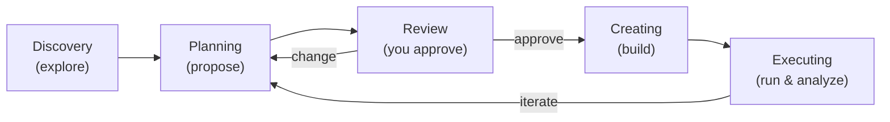

# Workflow

An Architect session follows four phases — discovery, planning, creating, executing — with an explicit review gate before anything is created. You stay in control throughout: Architect proposes and waits; it never creates or modifies anything without your confirmation.

## Discovery

Architect explores your endpoint first — before asking you questions. It figures out the domain, capabilities, and refusal behavior on its own, then summarizes what it found.

**What you see:** The mode chip reads `discovery`. Tool activity streams in real time as Architect probes the endpoint.

**What you do:** Choose between Quick (fast, domain-only) or Comprehensive (full capability and boundary scan) exploration. You can also skip exploration if you already know your endpoint well — just describe what you want to test.

→ [Endpoint Exploration](/docs/architect/exploration) has the full breakdown of modes and strategies.

## Planning

Architect proposes a structured plan: behaviors to test, test sets to generate, metrics to evaluate with, and how they connect. It checks what already exists on the platform and reuses it where possible.

**What you see:** The plan panel appears between the chat and the input. Behaviors and metrics are labelled **(reuse)**, **(improve)**, or **(new)**.

**What you do:** Read the plan. Ask for changes — "add a robustness test set", "use the existing Accuracy metric instead". Architect updates the plan and waits again.

→ [Planning Test Suites](/docs/architect/planning) covers the plan structure and reuse logic.

## Review (confirmation)

Before creating anything, Architect presents its proposal and asks for your explicit go-ahead. **Accept** runs the plan. **Change** returns focus to the input so you can redirect.

<Callout type="info">
  You can turn on **Auto-approve** in the chat header to skip per-action confirmation until you turn it off. See [Chat Features](/docs/architect/chat-features#auto-approve).
</Callout>

## Creating

Architect creates entities in order: behaviors first, then metrics, then behavior-metric links — and generates test sets last, once every prerequisite is in place. It reports each step as it completes.

**What you see:** The plan panel checkboxes tick off as each item is done. The mode chip reads `creating`.

**What you do:** Watch progress. If something fails (endpoint unreachable, name conflict), Architect stops and explains — it won't silently skip.

## Executing and analyzing

Once everything is set up, Architect offers to run the tests. Confirm, and it executes them against your endpoint and waits for results automatically.

**What you see:** The mode chip reads `executing`. When the run completes, Architect presents a structured summary: overall pass rate, behavior breakdown, metric breakdown, and notable failures with the evaluator's reasoning.

→ [Running and Analyzing](/docs/architect/execution-and-analysis) covers the result format and comparison workflow.

→ The [mode chip](/docs/architect/chat-features#mode-chip) in the chat header shows the current phase at a glance.
