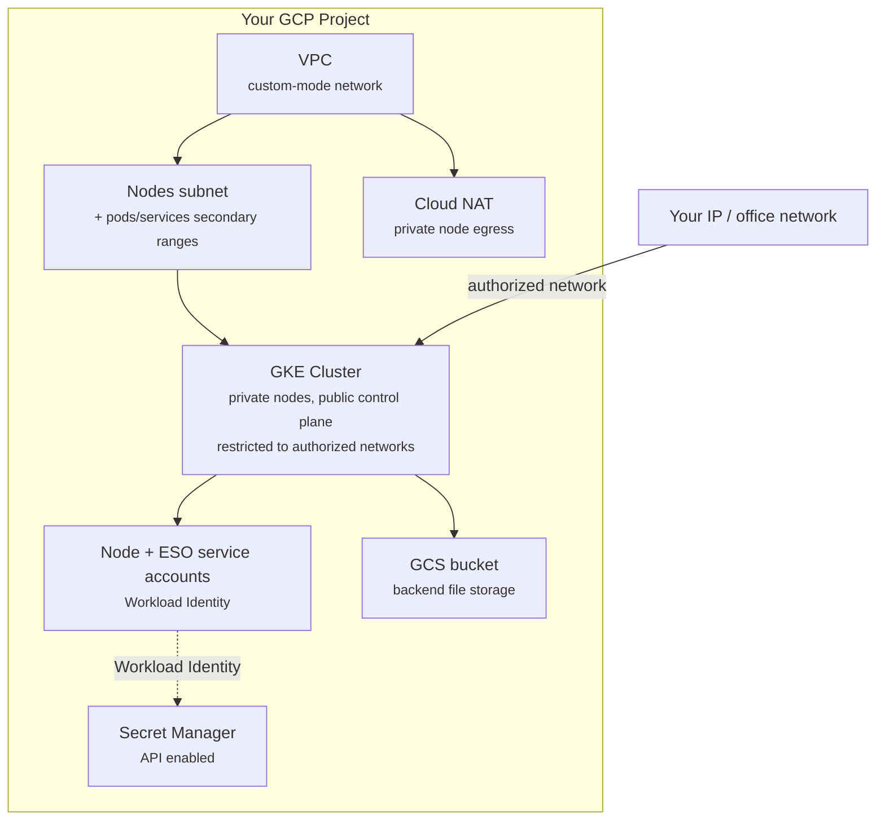

import { CodeBlock } from '@/components/CodeBlock'
import { Table } from '@/components/Table'
import { FileTree } from '@/components/FileTree'

# GCP (Terraform)

Provision the GCP infrastructure Rhesis runs on (a GKE cluster, networking, and
supporting services) using the same Terraform modules Rhesis uses internally.

<Callout type="info">
**Part 1 of 2**

This guide provisions infrastructure only. Once your cluster is up, continue to the
[Kubernetes (Helm)](/docs/deployment/kubernetes-helm) guide to deploy the Rhesis application onto it.
</Callout>

## Overview

Rhesis itself runs across three GCP projects (dev/stg/prd) plus a fourth project that hosts a
WireGuard VPN gating access to the private GKE control planes and an internal-only DNS zone. That
split exists for Rhesis's own multi-environment team operations. It is not a requirement to run
the application. This guide provisions the same building blocks in a **single GCP project**, with
the GKE control plane reachable directly from an IP range you choose instead of through a VPN.
Every piece Rhesis's own environments add on top (the WireGuard VPN, Cloudflare-based DNS
automation, self-hosted internal DNS) is covered further down as an optional section, so you can
adopt as much or as little of the full setup as you want.

**What this provisions:**

- A VPC with a nodes subnet (plus secondary ranges for pod/service IPs)
- Cloud NAT so private nodes can reach the internet (pulling images, calling AI providers)
- A private-nodes GKE cluster with Workload Identity enabled
- A GCS bucket for Rhesis's file storage backend
- A service account for External Secrets Operator (ESO), which the
  [Kubernetes (Helm)](/docs/deployment/kubernetes-helm) guide uses to sync application secrets

**Rhesis's own environments add, on top of this, all optional and covered later on this page:**

- A WireGuard VPN gating access to the GKE control plane, for teams running multiple clusters.
  See [Gate control-plane access with a VPN](#optional-gate-control-plane-access-with-a-wireguard-vpn)
- Cloudflare-managed public DNS via ExternalDNS. See
  [Automate public DNS](#optional-automate-public-dns-with-cloudflare)
- Self-hosted internal DNS (BIND9) for VPN-only hostnames. See
  [Add internal DNS](#optional-add-self-hosted-internal-dns)
- The multi-project dev/stg/prd split; this guide uses one project throughout
- GitHub Actions Runner Controller (ARC) secrets, for running self-hosted CI runners in-cluster:
  out of scope for this guide

ArgoCD itself is bootstrapped in the [Kubernetes (Helm)](/docs/deployment/kubernetes-helm) guide, not
here; this page stops once you have a working cluster.

## Prerequisites

<Table
  headers={["Requirement", "Notes"]}
  rows={[
    ["GCP project", "With billing enabled"],
    ["`gcloud` CLI", "Authenticated: `gcloud auth login` + `gcloud config set project <id>`"],
    ["Terraform CLI", "Any version compatible with the `hashicorp/google ~> 6.0` provider"],
    ["IAM permissions", "Project Editor, or equivalent granular roles for networking/GKE/IAM/storage/Secret Manager"],
  ]}
  align={["left", "left"]}
/>

Enable the required APIs:

<CodeBlock filename="Terminal" language="bash">
{`gcloud services enable \\
  compute.googleapis.com \\
  container.googleapis.com \\
  iam.googleapis.com \\
  secretmanager.googleapis.com \\
  storage.googleapis.com`}
</CodeBlock>

## Decisions before you start

- **Region**: any GCP region works; the examples below use `europe-west4`.
- **Control-plane access**: this guide uses a **public endpoint restricted to authorized
  networks** (no VPN required). You supply the CIDR(s) allowed to reach the GKE API, typically
  your office network or a static egress IP. Nodes themselves are always private (no public IPs),
  regardless of this setting. If you'd rather gate access through a VPN the way Rhesis does, see
  [Gate control-plane access with a VPN](#optional-gate-control-plane-access-with-a-wireguard-vpn).
- **Public-facing ingress IP**: the in-repo `ingress/gcp` module reserves an *internal* static
  IP, for an internal-only ingress class (Rhesis uses this for admin surfaces like ArgoCD and
  Grafana; see [Add internal DNS](#optional-add-self-hosted-internal-dns)). For a public-facing
  deployment, skip that module: the Kubernetes (Helm) guide's `ingress-nginx` `LoadBalancer`
  Service provisions its own external IP automatically.

## Get the Terraform code

Clone the repository and work from the shared modules directly, rather than Rhesis's own
`terraform/infrastructure/envs/*` stacks; those are wired for Rhesis's specific multi-project,
WireGuard-connected layout via remote-state lookups.

<CodeBlock filename="Terminal" language="bash">
{`git clone https://github.com/rhesis-ai/rhesis.git
cd rhesis/terraform/infrastructure`}
</CodeBlock>

<FileTree
  title="Modules you'll use"
  data={[
    { name: 'modules/network/gcp', type: 'folder', description: 'VPC, subnets, Cloud NAT' },
    { name: 'modules/kubernetes/gcp', type: 'folder', description: 'GKE cluster + node pool' },
    { name: 'modules/storage-buckets/gcp', type: 'folder', description: 'File storage GCS bucket' },
    { name: 'modules/external-secrets/gcp', type: 'folder', description: 'ESO service account + Secret Manager API' },
  ]}
/>

Create a new directory alongside `envs/` (e.g. `envs/customer/`) for your own root module:

<CodeBlock filename="Terminal" language="bash">
{`mkdir -p envs/customer
cd envs/customer`}
</CodeBlock>

<CodeBlock filename="envs/customer/main.tf" language="hcl">
{`terraform {
  required_providers {
    google = {
      source  = "hashicorp/google"
      version = "~> 6.0"
    }
  }
  backend "gcs" {
    prefix = "terraform/infrastructure/envs/customer"
  }
}

provider "google" {
  project = var.project_id
  region  = var.region
}

module "network" {
  source = "../../modules/network/gcp"

  project_id         = var.project_id
  environment        = var.environment
  region             = var.region
  network_cidr       = "10.2.0.0/15"
  create_gke_subnets = true
  node_cidr          = "10.2.0.0/23"
  ilb_cidr           = "10.2.2.0/23"
  master_cidr        = "10.2.4.0/28"
  pod_cidr           = "10.3.0.0/17"
  service_cidr       = "10.3.128.0/17"
}

module "gke" {
  source = "../../modules/kubernetes/gcp"

  project_id             = var.project_id
  environment            = var.environment
  region                 = var.region
  vpc_name               = module.network.vpc_name
  nodes_subnet_self_link = module.network.subnet_self_links["nodes"]
  master_cidr            = "10.2.4.0/28"
  node_cidr              = "10.2.0.0/23"
  pod_cidr               = "10.3.0.0/17"
  service_cidr           = "10.3.128.0/17"

  # Named "wireguard_cidr" because Rhesis's own environments reach the control
  # plane through a WireGuard VPN on this CIDR. You don't have one; pass
  # the network you actually want to authorize instead (e.g. your office IP).
  wireguard_cidr = var.admin_cidr

  machine_type        = "e2-standard-2"
  min_node_count      = 2
  max_node_count      = 6
  deletion_protection = var.gke_deletion_protection

  # Public control-plane endpoint, restricted to admin_cidr above.
  enable_private_endpoint = false

  depends_on = [module.network]
}

module "eso" {
  source = "../../modules/external-secrets/gcp"

  project_id  = var.project_id
  environment = var.environment

  depends_on = [module.gke]
}

module "storage" {
  source = "../../modules/storage-buckets/gcp"

  project_id  = var.project_id
  environment = var.environment
  location    = var.region

  file_storage_bucket_name = var.file_storage_bucket_name
  cnpg_backup_bucket_name  = null
  force_destroy            = var.force_destroy
  file_storage_iam_members = [
    {
      member = "serviceAccount:\${google_service_account.storage_identity.email}"
      role   = "roles/storage.objectAdmin"
    }
  ]
}

# Dedicated GSA the Rhesis pods use (via Workload Identity) to read/write the
# file storage bucket. Bound to the "default" KSA in the "rhesis" namespace,
# since the Helm chart does not define a custom ServiceAccount per component.
resource "google_service_account" "storage_identity" {
  project      = var.project_id
  account_id   = "rhesis-\${var.environment}-app"
  display_name = "Rhesis app (file storage) - \${var.environment}"
}

resource "google_service_account_iam_member" "storage_identity_workload_identity" {
  service_account_id = google_service_account.storage_identity.name
  role                = "roles/iam.workloadIdentityUser"
  member              = "serviceAccount:\${var.project_id}.svc.id.goog[rhesis/default]"
}

output "storage_identity_email" {
  value = google_service_account.storage_identity.email
}`}
</CodeBlock>

<CodeBlock filename="envs/customer/variables.tf" language="hcl">
{`variable "project_id" {
  type = string
}

variable "region" {
  type    = string
  default = "europe-west4"
}

variable "environment" {
  type    = string
  default = "customer"
}

variable "admin_cidr" {
  description = "CIDR allowed to reach the GKE control plane (e.g. your office IP as a /32)"
  type        = string
}

variable "gke_deletion_protection" {
  type    = bool
  default = false
}

variable "file_storage_bucket_name" {
  type = string
}

variable "force_destroy" {
  type    = bool
  default = false
}`}
</CodeBlock>

<Callout type="warning">
The CIDR blocks above (`10.2.0.0/15`, etc.) are examples taken from Rhesis's own dev environment
IP plan. Adjust them if they conflict with networks you already peer with, but the pattern
(one `/15` split into nodes/ilb/master/pods/services) works as-is for a standalone deployment.
</Callout>

## Configure your backend

Create a GCS bucket to hold Terraform state (if you don't already have one), then point
Terraform at it:

<CodeBlock filename="Terminal" language="bash">
{`gsutil mb -l europe-west4 gs://your-terraform-state-bucket
cp ../../backend.conf.example backend.conf`}
</CodeBlock>

<CodeBlock filename="envs/customer/backend.conf" language="properties">
{`bucket = "your-terraform-state-bucket"`}
</CodeBlock>

## Configure variables

<CodeBlock filename="envs/customer/terraform.tfvars" language="hcl">
{`project_id               = "your-gcp-project-id"
region                   = "europe-west4"
admin_cidr               = "203.0.113.4/32"
file_storage_bucket_name = "your-rhesis-files-bucket"`}
</CodeBlock>

## Initialize, plan, apply

<CodeBlock filename="Terminal" language="bash">
{`terraform init -backend-config=backend.conf
terraform plan
terraform apply`}
</CodeBlock>

A first apply typically takes 10–15 minutes, mostly waiting on GKE cluster creation. On success,
Terraform reports the new VPC, subnets, GKE cluster, ESO service account, and GCS bucket.

## Connect to your cluster

<CodeBlock filename="Terminal" language="bash">
{`gcloud container clusters get-credentials gke-customer \\
  --region europe-west4 \\
  --project your-gcp-project-id

kubectl get nodes`}
</CodeBlock>

If `kubectl` times out, double-check that `admin_cidr` includes the public IP you're connecting
from (`curl -s ifconfig.me`).

## Optional: automate public DNS with Cloudflare

Rhesis's own environments run [ExternalDNS](https://github.com/kubernetes-sigs/external-dns) in
the cluster, which watches `Ingress`/`Service` objects and writes matching `A`/`TXT` records
straight to a DNS provider: no manual DNS updates when an ingress hostname changes. Rhesis uses
Cloudflare; ExternalDNS supports most major providers if you use a different one.

The Terraform side needs a place to hold the Cloudflare API token so External Secrets
Operator can sync it into the cluster; the ExternalDNS deployment itself is covered in the
[Kubernetes (Helm)](/docs/deployment/kubernetes-helm#automate-public-dns) guide.

<CodeBlock filename="envs/customer/main.tf" language="hcl">
{`module "external_dns" {
  source = "../../modules/external-dns/gcp"

  project_id  = var.project_id
  environment = var.environment

  depends_on = [module.eso]
}`}
</CodeBlock>

This creates a Secret Manager secret named `cloudflare-api-token-customer` with a placeholder
value. Replace it with a real [Cloudflare API token](https://dash.cloudflare.com/profile/api-tokens)
scoped to `Zone.DNS: Edit` for your domain's zone:

<CodeBlock filename="Terminal" language="bash">
{`echo -n "your-cloudflare-api-token" | gcloud secrets versions add cloudflare-api-token-customer --data-file=-

gcloud secrets add-iam-policy-binding cloudflare-api-token-customer \\
  --member="serviceAccount:eso-customer@your-gcp-project-id.iam.gserviceaccount.com" \\
  --role="roles/secretmanager.secretAccessor"`}
</CodeBlock>

## Optional: gate control-plane access with a WireGuard VPN

The `admin_cidr` approach above is simplest for a single admin or a static office IP. Rhesis
instead runs a small WireGuard VM in its own GCP project, VPC-peered to each environment, so
multiple engineers can each get their own tunnel with per-peer, per-subnet access rules.
Worthwhile once more than one or two people need cluster access, or your admin IP isn't static.

<CodeBlock filename="envs/wireguard/main.tf" language="hcl">
{`module "wireguard_network" {
  source = "../../modules/network/gcp"

  project_id         = var.wireguard_project_id
  environment        = "wireguard"
  region             = var.region
  network_cidr       = "10.0.0.0/24"
  create_gke_subnets = false
}

module "wireguard_server" {
  source = "../../modules/wireguard/gcp"

  project_id          = var.wireguard_project_id
  region              = var.region
  vpc_name            = module.wireguard_network.vpc_name
  subnet_self_link    = module.wireguard_network.subnet_self_links["main"]
  deletion_protection = true
  machine_type        = "e2-medium"

  # One entry per person who needs access, and which environment(s) they can reach.
  wireguard_peers = [
    { identifier = "admin-you", ip = "10.0.0.2", subnets = ["customer"] },
  ]

  subnet_cidrs         = { customer = "10.2.0.0/15" }
  master_cidrs         = { customer = "10.2.4.0/28" }
  gke_public_endpoints = { customer = module.gke.cluster_endpoint }
}

resource "google_compute_network_peering" "wireguard_to_customer" {
  name         = "peering-wireguard-to-customer"
  network      = module.wireguard_network.vpc_self_link
  peer_network = module.network.vpc_self_link
}`}
</CodeBlock>

The customer-side cluster's `main.tf` needs the matching return peering and, once the WireGuard
project's plan is applied, an `extra_authorized_cidrs` entry for the WireGuard server's public IP
instead of your own:

<CodeBlock filename="envs/customer/main.tf" language="hcl">
{`# In module "gke", replace wireguard_cidr / enable_private_endpoint with:
extra_authorized_cidrs = ["\${module.wireguard_server.server_external_ip}/32"]

resource "google_compute_network_peering" "customer_to_wireguard" {
  name         = "peering-customer-to-wireguard"
  network      = module.network.vpc_self_link
  peer_network = module.wireguard_network.vpc_self_link
}`}
</CodeBlock>

Both sides of a peering must exist before it goes `ACTIVE`: apply the customer cluster first
(creating the inactive return-side peering), then the WireGuard project.

Retrieve each peer's client config from Terraform output and import it into a WireGuard client:

<CodeBlock filename="Terminal" language="bash">
{`terraform output -json peer_configs | jq -r '.["admin-you"].config' > admin-you.conf`}
</CodeBlock>

Connecting sets your machine's DNS resolver to the WireGuard server's tunnel IP
(`10.0.0.1`), which matters once you add internal DNS below.

## Optional: add self-hosted internal DNS

Once you're gating access through the WireGuard VM above, Rhesis takes it a step further: a
second ExternalDNS deployment (`provider: rfc2136`) writes internal-only hostnames (for things
like a private ArgoCD or Grafana) to a **BIND9** zone running on the WireGuard VM itself,
authenticated with a TSIG key. It's a second, independent instance of the same ExternalDNS
mechanism as the public-DNS setup above, pointed at a different provider.

<CodeBlock filename="envs/customer/main.tf" language="hcl">
{`module "internal_dns" {
  source = "../../modules/internal-dns/gcp"

  project_id  = var.project_id
  environment = var.environment

  depends_on = [module.eso]
}`}
</CodeBlock>

This generates a random TSIG key and stores it in Secret Manager
(`internal-dns-tsig-key-customer`). Pass the same key into the WireGuard module so BIND9 accepts
updates signed with it:

<CodeBlock filename="envs/wireguard/main.tf" language="hcl">
{`# Add to module "wireguard_server":
bind9_tsig_keys = {
  customer = {
    keyname = module.internal_dns.tsig_keyname   # from the customer-side plan's output
    secret  = module.internal_dns.tsig_secret
  }
}
bind9_allowed_names = {
  customer = ["argocd.internal.yourdomain.com", "grafana.internal.yourdomain.com"]
}`}
</CodeBlock>

`bind9_allowed_names` scopes the TSIG key so it can only create records under the hostnames you
list, not the whole zone. The [Kubernetes (Helm)](/docs/deployment/kubernetes-helm#add-internal-dns)
guide covers deploying the in-cluster `internal-dns` ExternalDNS instance and pointing an internal
ingress class at these hostnames.

## Next step

Continue to [Kubernetes (Helm)](/docs/deployment/kubernetes-helm) to bootstrap ArgoCD and deploy the
Rhesis application onto this cluster.

## Tearing down

<CodeBlock filename="Terminal" language="bash">
{`terraform destroy`}
</CodeBlock>

<Callout type="warning">
Set `gke_deletion_protection = false` and `force_destroy = true` (in `terraform.tfvars`) before
destroying, or Terraform will refuse to delete the cluster and a non-empty storage bucket.
</Callout>

## Troubleshooting

**"API not enabled" errors on `apply`**: re-run the `gcloud services enable` command above; API
enablement can take a minute to propagate.

**Quota errors creating the node pool**: GKE node pools need available regional CPU quota;
check *IAM & Admin → Quotas* in the GCP console for the target region, or lower
`min_node_count`/`machine_type`.

**"Permission denied" on first apply**: the identity running Terraform needs, at minimum,
Compute Network Admin, Kubernetes Engine Admin, Service Account Admin, Storage Admin, and
Secret Manager Admin on the project (or the broader Editor role).

**WireGuard peering stuck `INACTIVE`**: both sides of a `google_compute_network_peering` must
exist before it activates; apply the side without the peer yet first, then the other.
