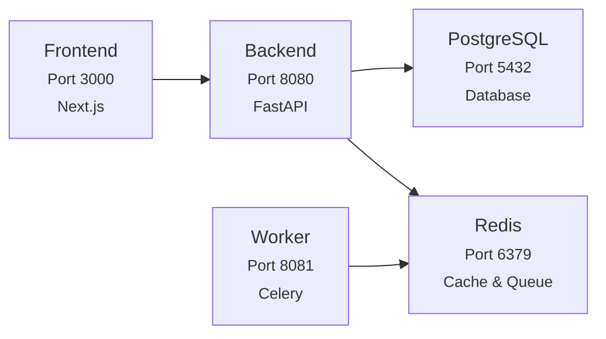

import { NextStepCard, NextStepCardGrid } from '@/components/NextStepCard'
import { Table } from '@/components/Table'

# Deployment

You can deploy Rhesis on your own infrastructure. We provide rich guides from very easy quick start 
with one command, to more advanced configurations like Kubernetes and cloud environments.

<Callout type="info">
  **Want the easiest path?**
  Skip the infrastructure management and start testing immediately with [Rhesis Cloud](https://app.rhesis.ai). We handle the hosting, scaling, and updates so you can focus on building and testing your AI apps.
</Callout>

## Available Options

<NextStepCardGrid>
  <NextStepCard
    emoji="⚡"
    title="Quick Start"
    link="/docs/deployment/quick-start"
    description="Get running in minutes with a single command. No configuration required."
    linkText="Quick Start Guide →"
  />
  <NextStepCard
    emoji="🐳"
    title="Docker Compose"
    link="/docs/deployment/docker-compose"
    description="Production-ready deployment with Docker Compose. Configure authentication, encryption, and scaling."
    linkText="Docker Compose Guide →"
  />
  <NextStepCard
    emoji="☸️"
    title="Kubernetes"
    link="/docs/deployment/kubernetes"
    description="Deploy to a local Kubernetes cluster with Minikube and the bundled Helm chart."
    linkText="Kubernetes Guide →"
  />
</NextStepCardGrid>

## Architecture Overview

### Services

The Rhesis platform consists of several interconnected services:

<Table
  headers={["Service", "Port", "Description", "Health Check"]}
  rows={[
    ["PostgreSQL", "5432", "Primary database", "`pg_isready`"],
    ["Redis", "6379", "Cache & message broker", "`redis-cli ping`"],
    ["Backend", "8080", "FastAPI application", "`curl /health`"],
    ["Worker", "8081", "Celery background tasks", "`curl /health/basic`"],
    ["Frontend", "3000", "Next.js application", "`curl /api/auth/session`"],
  ]}
  align={["left", "center", "left", "left"]}
/>

### Service Dependencies

