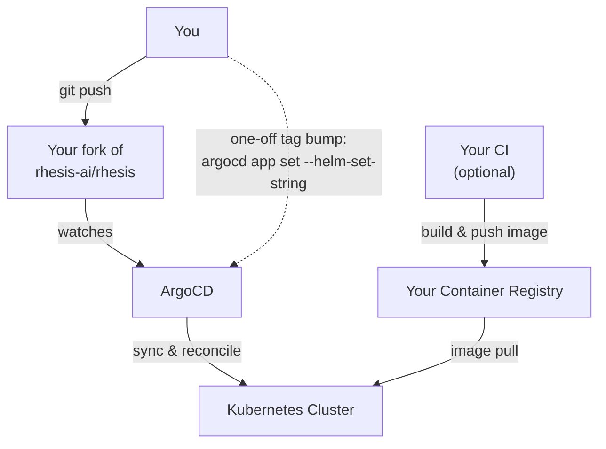
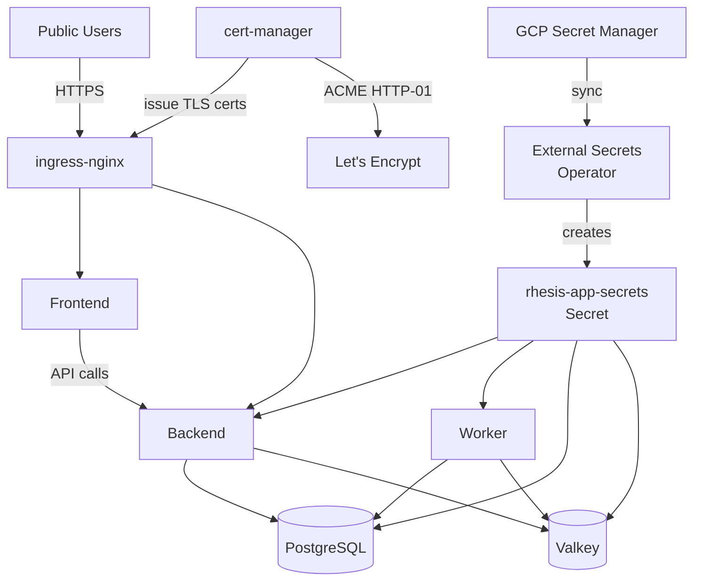

import { CodeBlock } from '@/components/CodeBlock'
import { Table } from '@/components/Table'
import { FileTree } from '@/components/FileTree'

# Kubernetes (Helm)

Deploy the Rhesis application onto a Kubernetes cluster using ArgoCD and the `charts/rhesis`
Helm chart — the same GitOps pattern Rhesis uses for its own dev/stg/prd environments.

<Callout type="info">
**Part 2 of 2**

This guide assumes a working cluster from [GCP (Terraform)](/deployment/gcp-terraform) — or
any GKE cluster with Workload Identity enabled. It deploys the app; it does not provision
infrastructure.
</Callout>

## Overview

Rather than a bare `helm install`, this guide bootstraps ArgoCD and lets it manage everything
declaratively: platform add-ons first (cert-manager, External Secrets Operator, ingress-nginx),
then the Rhesis Helm chart itself, ordered by ArgoCD sync-waves.

<Callout type="warning">
**If you've seen Rhesis's own architecture diagrams elsewhere**, note two differences from any
design docs written before the current implementation: traffic here is routed by
**ingress-nginx**, not a Kubernetes Gateway API ("kGateway") setup, and this guide runs a
**single GCP project** rather than Rhesis's own multi-project dev/stg/prd split. Both diagrams
above match what's actually in this repository today.
</Callout>

**What the chart deploys:**

<Table
  headers={["Component", "Required?", "Notes"]}
  rows={[
    ["Backend", "Required", "FastAPI application"],
    ["Frontend", "Required", "Next.js UI"],
    ["Worker", "Required", "Celery background tasks"],
    ["Valkey (Redis)", "Required", "Bundled subchart — cache + Celery broker"],
    ["PostgreSQL", "Required", "Bundled subchart (recommended to start) or your own external instance"],
    ["Chatbot", "Optional", "Test-the-tests chatbot"],
    ["Polyphemus", "Optional", "Adversarial test-data model"],
    ["Docs", "Optional", "Self-hosted copy of this documentation site"],
    ["OTel Collector / Telemetry Processor", "Optional", "Usage telemetry pipeline"],
  ]}
  align={["left", "left", "left"]}
/>

## Prerequisite: your own git repository

ArgoCD's `Application` resources declare a `source.repoURL` it pulls from and reconciles
against. Rhesis's own manifests point at `github.com/rhesis-ai/rhesis.git`, which you cannot
push to. **Fork the repository** so you have a `repoURL` you control — you'll commit your
cluster overlay and your Helm values file into that fork, in the same layout Rhesis uses
internally (`kubernetes/clusters/<env>/` and `charts/rhesis/values-<env>.yaml`).

<CodeBlock filename="Terminal" language="bash">
{`gh repo fork rhesis-ai/rhesis --clone
cd rhesis`}
</CodeBlock>

Replace `<your-org>/rhesis` in every manifest below with your fork's path.

## Other prerequisites

<Table
  headers={["Requirement", "Notes"]}
  rows={[
    ["`kubectl`", "Pointed at your cluster (see the Terraform guide's connect step)"],
    ["A Kubernetes cluster", "From the GCP (Terraform) guide, or any cluster with Workload Identity"],
    ["ESO service account", "From the Terraform guide's `external-secrets/gcp` module output"],
    ["A domain (optional)", "For public ingress hostnames; skip if you'll smoke-test via port-forward only"],
  ]}
  align={["left", "left"]}
/>

## Bootstrap ArgoCD

<CodeBlock filename="Terminal" language="bash">
{`kubectl create namespace argocd
kubectl apply -n argocd -k kubernetes/bootstrap/argocd/

# Wait for ArgoCD's pods to become ready
kubectl -n argocd wait --for=condition=available --timeout=300s deployment/argocd-server`}
</CodeBlock>

Retrieve the initial admin password and access the UI:

<CodeBlock filename="Terminal" language="bash">
{`kubectl -n argocd get secret argocd-initial-admin-secret \\
  -o jsonpath="{.data.password}" | base64 -d; echo

kubectl -n argocd port-forward svc/argocd-server 8080:443`}
</CodeBlock>

Open `https://localhost:8080` and log in as `admin` with the password above.

## Set up your cluster overlay

In your fork, create `kubernetes/clusters/customer/` following the shape of Rhesis's own
`kubernetes/clusters/dev/`, but trimmed to what a first deployment needs — cert-manager,
external-secrets, ingress-nginx, and the `rhesis` app itself. Skip `external-dns`,
`internal-dns`, `arc`, and the monitoring stack (see [Where to go from here](#where-to-go-from-here)).

<FileTree
  title="kubernetes/clusters/customer/"
  data={[
    { name: 'base.yaml', type: 'file', description: 'Root Application — the one thing you apply by hand' },
    { name: 'kustomization.yaml', type: 'file', description: 'Lists every sub-Application synced by base.yaml' },
    { name: 'external-secrets.yaml', type: 'file', description: 'Application: ESO Helm chart + ClusterSecretStore' },
    { name: 'external-secrets/', type: 'folder', description: 'ClusterSecretStore + your ExternalSecret manifest' },
    { name: 'cert-manager.yaml', type: 'file', description: 'Application: cert-manager Helm chart' },
    { name: 'cert-manager/', type: 'folder', description: 'ClusterIssuer for Let’s Encrypt' },
    { name: 'ingress-nginx.yaml', type: 'file', description: 'Application: ingress-nginx Helm chart' },
    { name: 'rhesis/', type: 'folder', description: 'Namespace + the rhesis Helm chart Application' },
  ]}
/>

<CodeBlock filename="kubernetes/clusters/customer/base.yaml" language="yaml">
{`apiVersion: argoproj.io/v1alpha1
kind: Application
metadata:
  name: customer-base
  namespace: argocd
spec:
  project: default
  source:
    repoURL: https://github.com/<your-org>/rhesis.git
    targetRevision: main
    path: kubernetes/clusters/customer
    kustomize: {}
  destination:
    server: https://kubernetes.default.svc
  syncPolicy:
    automated:
      prune: true
      selfHeal: true
      allowEmpty: true`}
</CodeBlock>

<CodeBlock filename="kubernetes/clusters/customer/kustomization.yaml" language="yaml">
{`apiVersion: kustomize.config.k8s.io/v1beta1
kind: Kustomization
resources:
  - external-secrets.yaml
  - cert-manager.yaml
  - ingress-nginx.yaml
  - rhesis/namespace.yaml
  - rhesis/rhesis-application.yaml`}
</CodeBlock>

<CodeBlock filename="kubernetes/clusters/customer/external-secrets.yaml" language="yaml">
{`apiVersion: argoproj.io/v1alpha1
kind: Application
metadata:
  name: external-secrets
  namespace: argocd
  annotations:
    argocd.argoproj.io/sync-wave: "-1"
spec:
  project: default
  source:
    repoURL: https://charts.external-secrets.io
    chart: external-secrets
    targetRevision: 0.12.1
    helm:
      valuesObject:
        serviceAccount:
          annotations:
            iam.gke.io/gcp-service-account: eso-customer@your-gcp-project-id.iam.gserviceaccount.com
  destination:
    server: https://kubernetes.default.svc
    namespace: external-secrets
  syncPolicy:
    automated:
      prune: true
      selfHeal: true
    syncOptions:
      - CreateNamespace=true`}
</CodeBlock>

<CodeBlock filename="kubernetes/clusters/customer/external-secrets/cluster-secret-store-gcp.yaml" language="yaml">
{`apiVersion: external-secrets.io/v1beta1
kind: ClusterSecretStore
metadata:
  name: gcp-secret-manager
  annotations:
    argocd.argoproj.io/sync-wave: "1"
    argocd.argoproj.io/sync-options: SkipDryRunOnMissingResource=true
spec:
  provider:
    gcpsm:
      projectID: your-gcp-project-id`}
</CodeBlock>

The `iam.gke.io/gcp-service-account` value above is the `eso` service account email output by
the Terraform guide's `external-secrets/gcp` module — check it with
`terraform output eso_service_account_email` (add that output if you haven't already) or
`gcloud iam service-accounts list --filter="displayName:eso*"`.

<CodeBlock filename="kubernetes/clusters/customer/cert-manager.yaml" language="yaml">
{`apiVersion: argoproj.io/v1alpha1
kind: Application
metadata:
  name: cert-manager
  namespace: argocd
spec:
  project: default
  source:
    repoURL: https://charts.jetstack.io
    chart: cert-manager
    targetRevision: v1.17.1
    helm:
      valuesObject:
        crds:
          enabled: true
          keep: true
  destination:
    server: https://kubernetes.default.svc
    namespace: cert-manager
  syncPolicy:
    automated:
      prune: true
      selfHeal: true
    syncOptions:
      - CreateNamespace=true`}
</CodeBlock>

<CodeBlock filename="kubernetes/clusters/customer/cert-manager/cluster-issuer.yaml" language="yaml">
{`apiVersion: cert-manager.io/v1
kind: ClusterIssuer
metadata:
  name: letsencrypt-prod
spec:
  acme:
    email: you@yourdomain.com
    server: https://acme-v02.api.letsencrypt.org/directory
    privateKeySecretRef:
      name: letsencrypt-prod-key
    solvers:
      - http01:
          ingress:
            ingressClassName: nginx`}
</CodeBlock>

<Callout type="info">
This uses an HTTP-01 challenge, which needs no DNS provider API — it just requires your domain's
DNS to point at the ingress-nginx `LoadBalancer` IP (created below) before certificates can
issue. Rhesis's own environments use Cloudflare + DNS-01 instead, which isn't required here.
</Callout>

<CodeBlock filename="kubernetes/clusters/customer/ingress-nginx.yaml" language="yaml">
{`apiVersion: argoproj.io/v1alpha1
kind: Application
metadata:
  name: ingress-nginx
  namespace: argocd
spec:
  project: default
  source:
    repoURL: https://kubernetes.github.io/ingress-nginx
    chart: ingress-nginx
    targetRevision: "4.14.3"
    helm:
      valuesObject:
        controller:
          service:
            type: LoadBalancer
  destination:
    server: https://kubernetes.default.svc
    namespace: ingress-nginx
  syncPolicy:
    automated:
      prune: true
      selfHeal: true
    syncOptions:
      - CreateNamespace=true`}
</CodeBlock>

<CodeBlock filename="kubernetes/clusters/customer/rhesis/namespace.yaml" language="yaml">
{`apiVersion: v1
kind: Namespace
metadata:
  name: rhesis
  annotations:
    argocd.argoproj.io/sync-wave: "0"`}
</CodeBlock>

<CodeBlock filename="kubernetes/clusters/customer/rhesis/rhesis-application.yaml" language="yaml">
{`apiVersion: argoproj.io/v1alpha1
kind: Application
metadata:
  name: rhesis
  namespace: argocd
  annotations:
    # Runs after ESO (-1), ClusterSecretStore (1), and the ExternalSecret (5) below.
    argocd.argoproj.io/sync-wave: "10"
spec:
  project: default
  source:
    repoURL: https://github.com/<your-org>/rhesis.git
    targetRevision: main
    path: charts/rhesis
    helm:
      valueFiles:
        - values.yaml
        - values-customer.yaml
  destination:
    server: https://kubernetes.default.svc
    namespace: rhesis
  syncPolicy:
    automated:
      prune: true
      selfHeal: true
    syncOptions:
      - CreateNamespace=true
      - ServerSideApply=true`}
</CodeBlock>

## Minimal vs. full deployment

Only 4 of the 8 chart components have public images. Rhesis publishes
`ghcr.io/rhesis-ai/{backend,worker,frontend,chatbot}:latest` (manually built, not continuously
updated). **`docs`, `polyphemus`, `otel-collector`, and `telemetry-processor` have no public
image** — the repo has Dockerfiles for all of them, but you must build and push them to your
own registry to use them.

Start with those four disabled so your first deploy only needs the public images:

<CodeBlock filename="charts/rhesis/values-customer.yaml" language="yaml">
{`docs:
  enabled: false
polyphemus:
  enabled: false
otelCollector:
  enabled: false
telemetryProcessor:
  enabled: false`}
</CodeBlock>

## Choose your database/cache strategy

**Recommended for a first deployment: the bundled subcharts.** Valkey (Redis) is enabled by
default; enable the bundled PostgreSQL subchart too:

<CodeBlock filename="charts/rhesis/values-customer.yaml" language="yaml">
{`postgresql:
  enabled: true
  primary:
    persistence:
      enabled: true
      size: 10Gi

valkey:
  enabled: true`}
</CodeBlock>

<Callout type="info">
Rhesis's own dev environment swaps in a `pgvector/pgvector` image and custom init scripts for
vector-search support — see `charts/rhesis/values-dev.yaml` for that pattern if you need it. The
config above uses the chart's default Bitnami PostgreSQL image, which is simpler to reason about
for a first deployment but does not include the `vector` extension.
</Callout>

For production scale, Rhesis's own stg/prd environments instead run
[CloudNativePG](https://cloudnative-pg.io/) as a separate ArgoCD-managed operator and point the
chart at it via `externalDatabase.host` + `database.existingSecret` — treat that as a follow-up
once your first deployment is working (see [Where to go from here](#where-to-go-from-here)).

## Populate secrets

The chart only requires one Kubernetes `Secret` to exist, named `rhesis-app-secrets`
(`existingSecret` in `values.yaml`). Create the minimum set of entries in GCP Secret Manager,
then sync them into the cluster with an `ExternalSecret`.

<Table
  headers={["Secret Manager key", "Maps to", "How to generate"]}
  rows={[
    ["customer-app-db-user", "APP_DB_USER", "e.g. `rhesis-user`"],
    ["customer-app-db-pass", "APP_DB_PASS", "Random string"],
    ["customer-db-encryption-key", "DB_ENCRYPTION_KEY", "`python -c \"from cryptography.fernet import Fernet; print(Fernet.generate_key().decode())\"`"],
    ["customer-jwt-secret-key", "JWT_SECRET_KEY", "Random string, 32+ chars"],
    ["customer-nextauth-secret", "NEXTAUTH_SECRET", "`openssl rand -base64 32`"],
    ["customer-session-secret-key", "SESSION_SECRET_KEY", "Random string, 32+ chars"],
    ["customer-redis-password", "REDIS_PASSWORD", "Random string"],
    ["customer-rhesis-api-key", "RHESIS_API_KEY", "From https://app.rhesis.ai/tokens (or configure your own AI provider instead)"],
  ]}
  align={["left", "left", "left"]}
/>

<CodeBlock filename="Terminal" language="bash">
{`echo -n "rhesis-user" | gcloud secrets create customer-app-db-user --data-file=-
echo -n "$(openssl rand -base64 24)" | gcloud secrets create customer-app-db-pass --data-file=-
# ...repeat for each key in the table above

# Grant the ESO service account access to every secret you created:
for key in customer-app-db-user customer-app-db-pass customer-db-encryption-key \\
  customer-jwt-secret-key customer-nextauth-secret customer-session-secret-key \\
  customer-redis-password customer-rhesis-api-key; do
  gcloud secrets add-iam-policy-binding "$key" \\
    --member="serviceAccount:eso-customer@your-gcp-project-id.iam.gserviceaccount.com" \\
    --role="roles/secretmanager.secretAccessor"
done`}
</CodeBlock>

<CodeBlock filename="kubernetes/clusters/customer/external-secrets/rhesis-app-secrets.yaml" language="yaml">
{`apiVersion: external-secrets.io/v1beta1
kind: ExternalSecret
metadata:
  name: rhesis-app-secrets
  namespace: rhesis
  annotations:
    argocd.argoproj.io/sync-wave: "5"
    argocd.argoproj.io/sync-options: SkipDryRunOnMissingResource=true
spec:
  refreshInterval: 1h
  secretStoreRef:
    name: gcp-secret-manager
    kind: ClusterSecretStore
  target:
    name: rhesis-app-secrets
    creationPolicy: Owner
  data:
    - secretKey: APP_DB_USER
      remoteRef: { key: customer-app-db-user }
    - secretKey: APP_DB_PASS
      remoteRef: { key: customer-app-db-pass }
    - secretKey: DB_ENCRYPTION_KEY
      remoteRef: { key: customer-db-encryption-key }
    - secretKey: JWT_SECRET_KEY
      remoteRef: { key: customer-jwt-secret-key }
    - secretKey: NEXTAUTH_SECRET
      remoteRef: { key: customer-nextauth-secret }
    - secretKey: SESSION_SECRET_KEY
      remoteRef: { key: customer-session-secret-key }
    - secretKey: REDIS_PASSWORD
      remoteRef: { key: customer-redis-password }
    - secretKey: RHESIS_API_KEY
      remoteRef: { key: customer-rhesis-api-key }`}
</CodeBlock>

<Callout type="info">
This is a minimal set. Optional features documented on the
[Self-Hosting](/deployment/self-hosting#environment-configuration) page — OAuth sign-in, SMTP,
your own AI provider instead of `RHESIS_API_KEY`, SSO — each add their own keys to this same
`ExternalSecret`. See `kubernetes/clusters/dev/external-secrets/rhesis-app-secrets.yaml` in the
repo for the full ~50-key reference Rhesis's own environments use.
</Callout>

Add the required references to `kustomization.yaml`:

<CodeBlock filename="kubernetes/clusters/customer/external-secrets/kustomization.yaml" language="yaml">
{`apiVersion: kustomize.config.k8s.io/v1beta1
kind: Kustomization
resources:
  - cluster-secret-store-gcp.yaml
  - rhesis-app-secrets.yaml`}
</CodeBlock>

And point `external-secrets.yaml` at this directory too — add
`- kubernetes/clusters/customer/external-secrets` as a second `kustomization.yaml` entry, or
apply it as its own Application the way `kubernetes/clusters/dev/external-secrets.yaml` does in
the reference implementation.

## Apply the root Application

<CodeBlock filename="Terminal" language="bash">
{`kubectl apply -f kubernetes/clusters/customer/base.yaml`}
</CodeBlock>

ArgoCD syncs in sync-wave order: External Secrets Operator and cert-manager first, then the
`ClusterSecretStore` and your `ExternalSecret`, then ingress-nginx, and finally the `rhesis`
Helm chart Application.

## Verify

<CodeBlock filename="Terminal" language="bash">
{`argocd app list
kubectl get pods -n rhesis
kubectl get externalsecret -n rhesis
kubectl get pods -n ingress-nginx`}
</CodeBlock>

Point your domain's DNS `A` record at the ingress-nginx `LoadBalancer` external IP
(`kubectl get svc -n ingress-nginx`), then, once TLS certificates issue:

<CodeBlock filename="Terminal" language="bash">
{`curl -I https://your-api-domain/health`}
</CodeBlock>

Or skip DNS/ingress entirely for a first smoke test:

<CodeBlock filename="Terminal" language="bash">
{`kubectl -n rhesis port-forward svc/backend 8080:8080 &
curl http://localhost:8080/health`}
</CodeBlock>

## Enabling the rest

To bring up `docs`, `polyphemus`, `otel-collector`, and `telemetry-processor`:

1. Build and push each image to your own registry (Dockerfiles: `apps/polyphemus`,
   `docs/src`, `apps/otel-collector`, `apps/telemetry-processor`).
2. Set `global.registry` in `values-customer.yaml` to that registry, and set each component's
   `.enabled: true`.
3. Commit and push — ArgoCD's `selfHeal: true` picks up the change automatically. To force it
   immediately: `argocd app sync rhesis`.

## Upgrade / Uninstall

**Upgrade** by editing `values-customer.yaml` and pushing — ArgoCD reconciles automatically. For
a one-off image tag bump without a commit (matching how Rhesis's own CI deploys):

<CodeBlock filename="Terminal" language="bash">
{`argocd app set rhesis --helm-set-string backend.image.tag=<new-tag>
argocd app sync rhesis`}
</CodeBlock>

**Uninstall:**

<CodeBlock filename="Terminal" language="bash">
{`argocd app delete rhesis
kubectl delete -f kubernetes/clusters/customer/base.yaml`}
</CodeBlock>

## Troubleshooting

**ArgoCD app stuck `OutOfSync` or `Degraded`** — check `argocd app get rhesis` for the specific
resource; a common cause is the `ExternalSecret` not having synced yet (see below).

**`ImagePullBackOff`** — for the GHCR images, no registry auth is needed (public images). For
images in your own registry, confirm the GKE node service account or a dedicated pull secret has
`artifactregistry.reader` on the repo.

**`ExternalSecret` stuck, secret never appears** — check
`kubectl describe externalsecret rhesis-app-secrets -n rhesis`; the usual cause is the ESO
service account missing `secretmanager.secretAccessor` on one of the referenced keys, or a typo
in a `remoteRef.key`.

**Pods stuck `Pending`** — usually an unbound `PersistentVolumeClaim`; check
`kubectl get pvc -n rhesis` and confirm your cluster has a default `StorageClass`
(`kubectl get storageclass`) — GKE provides one by default.

## Where to go from here

Beyond this first deployment, Rhesis's own production environment adds, all optional and
independently adoptable:

- **CloudNativePG** for managed Postgres backups (replaces the bundled `postgresql` subchart) —
  see `kubernetes/clusters/prd/cnpg-cluster/`
- **Horizontal Pod Autoscaling** — already wired into the chart (`*.hpa.enabled`), just needs
  turning on per component
- **Monitoring** — `kube-prometheus-stack`, Loki, and Alloy, also managed as ArgoCD Applications
  in `kubernetes/base/`
- **External DNS / dedicated internal ingress** — if you want automated DNS record management
  or a VPN-only internal surface alongside the public one

None of these are required to run Rhesis — they're the same building blocks Rhesis itself adds
on top of the deployment you just completed.
