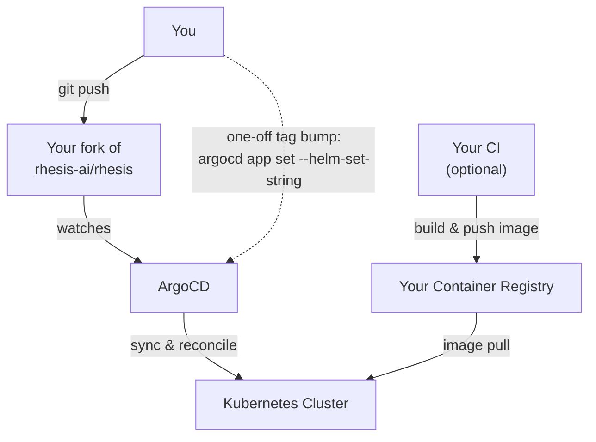
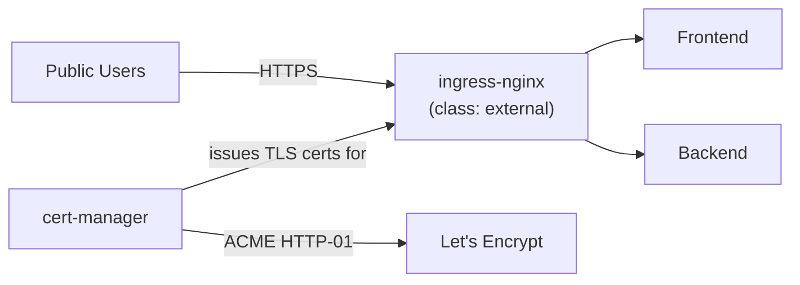
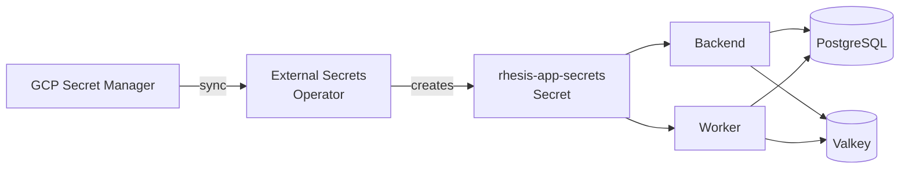

import { CodeBlock } from '@/components/CodeBlock'
import { Table } from '@/components/Table'
import { FileTree } from '@/components/FileTree'

# Kubernetes (Helm)

Deploy the Rhesis application onto a Kubernetes cluster using ArgoCD and the `charts/rhesis`
Helm chart (the same GitOps pattern, and the same ArgoCD bootstrap command, Rhesis uses for its
own dev/stg/prd environments).

<Callout type="info">
**Part 2 of 2**

This guide assumes a working cluster from [GCP (Terraform)](/docs/deployment/gcp-terraform), or
any GKE cluster with Workload Identity enabled. It deploys the app; it does not provision
infrastructure.
</Callout>

## Overview

Rather than a bare `helm install`, this guide bootstraps ArgoCD and lets it manage everything
declaratively: platform add-ons first (cert-manager, External Secrets Operator, ingress-nginx),
then the Rhesis Helm chart itself, ordered by ArgoCD sync-waves.



**What the chart deploys:**

<Table
  headers={["Component", "Required?", "Notes"]}
  rows={[
    ["Backend", "Required", "FastAPI application"],
    ["Frontend", "Required", "Next.js UI"],
    ["Worker", "Required", "Celery background tasks"],
    ["Valkey (Redis)", "Required", "Bundled subchart: cache + Celery broker"],
    ["PostgreSQL", "Required", "Bundled subchart (recommended to start) or your own external instance"],
    ["Chatbot", "Optional", "Test-the-tests chatbot"],
    ["Polyphemus", "Optional", "Adversarial test-data model"],
    ["Docs", "Optional", "Self-hosted copy of this documentation site"],
  ]}
  align={["left", "left", "left"]}
/>

## Prerequisite: your own git repository

ArgoCD's `Application` resources declare a `source.repoURL` it pulls from and reconciles
against. Rhesis's own manifests point at `github.com/rhesis-ai/rhesis.git`, which you cannot
push to. **Fork the repository** so you have a `repoURL` you control. You'll commit your
cluster overlay and your Helm values file into that fork, in the same layout Rhesis uses
internally (`kubernetes/clusters/<env>/` and `charts/rhesis/values-<env>.yaml`).

<CodeBlock filename="Terminal" language="bash">
{`gh repo fork rhesis-ai/rhesis --clone
cd rhesis`}
</CodeBlock>

Replace `<your-org>/rhesis` in every manifest below with your fork's path.

## Other prerequisites

<Table
  headers={["Requirement", "Notes"]}
  rows={[
    ["`kubectl`", "Pointed at your cluster (see the Terraform guide's connect step)"],
    ["`argocd` CLI", "[Install](https://argo-cd.readthedocs.io/en/stable/cli_installation/) it; used for verification, upgrades, and troubleshooting later in this guide"],
    ["A Kubernetes cluster", "From the GCP (Terraform) guide, or any cluster with Workload Identity"],
    ["ESO service account", "From the Terraform guide's `external-secrets/gcp` module output"],
    ["A domain (optional)", "For public ingress hostnames; skip if you'll smoke-test via port-forward only"],
  ]}
  align={["left", "left"]}
/>

## Bootstrap ArgoCD

<CodeBlock filename="Terminal" language="bash">
{`kubectl create namespace argocd
kubectl apply -n argocd -k kubernetes/bootstrap/argocd/
kubectl -n argocd wait --for=condition=available --timeout=300s deployment/argocd-server`}
</CodeBlock>

This is the exact command Rhesis's own environments run: ArgoCD is bootstrapped by hand once
per cluster (`kubectl apply -k kubernetes/bootstrap/argocd/`, not a Terraform module), then
manages itself and everything else declaratively from there.

Retrieve the initial admin password, then port-forward and log in with the `argocd` CLI (also
used for verification and upgrades later in this guide):

<CodeBlock filename="Terminal" language="bash">
{`kubectl -n argocd get secret argocd-initial-admin-secret \\
  -o jsonpath="{.data.password}" | base64 -d; echo

kubectl -n argocd port-forward svc/argocd-server 8080:443 &
argocd login localhost:8080 --username admin --password <password-from-above> --insecure`}
</CodeBlock>

Open `https://localhost:8080` in a browser to use the UI, or continue with `argocd` CLI commands
against this same port-forward.

## Set up your cluster overlay

Your fork already has the manifests you need under `kubernetes/base/`: cert-manager,
external-secrets, and both ingress-nginx variants are pre-built there, each with a `PLACEHOLDER`
wherever a value has to be per-cluster. Rhesis's own `kubernetes/clusters/dev/` wires these into
a running cluster with ArgoCD's app-of-apps pattern: a small wrapper `Application` per component
points at a per-cluster kustomize overlay, which composes the matching `kubernetes/base/`
directory and fills in only the handful of values that differ. Build
`kubernetes/clusters/customer/` the same way; you're reusing the existing base manifests, not
recreating them.

<FileTree
  title="kubernetes/clusters/customer/"
  data={[
    { name: 'base.yaml', type: 'file', description: 'Root Application: the one thing you apply by hand' },
    { name: 'kustomization.yaml', type: 'file', description: 'Lists every sub-Application synced by base.yaml' },
    { name: 'external-secrets.yaml', type: 'file', description: 'Wrapper Application → external-secrets/' },
    { name: 'external-secrets/', type: 'folder', description: 'Overlay: base/external-secrets + your ExternalSecret' },
    { name: 'cert-manager.yaml', type: 'file', description: 'Wrapper Application → cert-manager/' },
    { name: 'cert-manager/', type: 'folder', description: 'Overlay: base/cert-manager with your ACME email' },
    { name: 'ingress-nginx-external.yaml', type: 'file', description: 'Wrapper Application → ingress-nginx-external/' },
    { name: 'ingress-nginx-external/', type: 'folder', description: 'Overlay: base/ingress-nginx-external, unchanged' },
    { name: 'rhesis/', type: 'folder', description: 'Namespace + the rhesis Helm chart Application' },
  ]}
/>

<CodeBlock filename="kubernetes/clusters/customer/base.yaml" language="yaml">
{`apiVersion: argoproj.io/v1alpha1
kind: Application
metadata:
  name: customer-base
  namespace: argocd
spec:
  project: default
  source:
    repoURL: https://github.com/<your-org>/rhesis.git
    targetRevision: main
    path: kubernetes/clusters/customer
    kustomize: {}
  destination:
    server: https://kubernetes.default.svc
  syncPolicy:
    automated:
      prune: true
      selfHeal: true
      allowEmpty: true`}
</CodeBlock>

<CodeBlock filename="kubernetes/clusters/customer/kustomization.yaml" language="yaml">
{`apiVersion: kustomize.config.k8s.io/v1beta1
kind: Kustomization
resources:
  - external-secrets.yaml
  - cert-manager.yaml
  - ingress-nginx-external.yaml
  - rhesis/namespace.yaml
  - rhesis/rhesis-application.yaml`}
</CodeBlock>

Every wrapper `Application` has the identical shape; it just points ArgoCD at its own overlay
folder:

<CodeBlock filename="kubernetes/clusters/customer/cert-manager.yaml" language="yaml">
{`apiVersion: argoproj.io/v1alpha1
kind: Application
metadata:
  name: cert-manager
  namespace: argocd
spec:
  project: default
  source:
    repoURL: https://github.com/<your-org>/rhesis.git
    targetRevision: main
    path: kubernetes/clusters/customer/cert-manager
  destination:
    server: https://kubernetes.default.svc
  syncPolicy:
    automated:
      prune: true
      selfHeal: true`}
</CodeBlock>

`external-secrets.yaml` and `ingress-nginx-external.yaml` are the same file with `name` and
`path` swapped to match (`external-secrets`, `ingress-nginx-external`).

### external-secrets overlay

`kubernetes/base/external-secrets` already defines the namespace, the `ClusterSecretStore`, and
the ESO Helm chart `Application`, with `PLACEHOLDER` for your GCP project ID and ESO service
account email. Compose it and fill those in, the same way
`kubernetes/clusters/dev/external-secrets/kustomization.yaml` does for dev:

<CodeBlock filename="kubernetes/clusters/customer/external-secrets/kustomization.yaml" language="yaml">
{`apiVersion: kustomize.config.k8s.io/v1beta1
kind: Kustomization
resources:
  - ../../../base/external-secrets
  - rhesis-app-secrets.yaml   # your app's secrets, see "Populate secrets" below

configMapGenerator:
  - name: eso-config
    literals:
      - gcp-project-id=your-gcp-project-id
      - eso-service-account-email=eso-customer@your-gcp-project-id.iam.gserviceaccount.com
    options:
      annotations: { config.kubernetes.io/local-config: "true" }
      disableNameSuffixHash: true

replacements:
  - source: { kind: ConfigMap, name: eso-config, fieldPath: data.gcp-project-id }
    targets:
      - select: { kind: ClusterSecretStore, name: gcp-secret-manager }
        fieldPaths: [spec.provider.gcpsm.projectID]
  - source: { kind: ConfigMap, name: eso-config, fieldPath: data.eso-service-account-email }
    targets:
      - select: { kind: Application, name: external-secrets }
        fieldPaths: [spec.source.helm.valuesObject.serviceAccount.annotations.[iam.gke.io/gcp-service-account]]`}
</CodeBlock>

The service account email is the `eso` service account output by the Terraform guide's
`external-secrets/gcp` module: check it with `terraform output eso_service_account_email` (add
that output if you haven't already) or `gcloud iam service-accounts list --filter="displayName:eso*"`.

### cert-manager overlay

`kubernetes/base/cert-manager` bundles a working HTTP-01 `letsencrypt-prod` `ClusterIssuer`,
alongside two others Rhesis's own environments use (`letsencrypt-staging`, and
`letsencrypt-prod-dns01` for Cloudflare; see
[Match Rhesis's own setup](#optional-match-rhesiss-own-setup)). Point the HTTP-01 issuer at your
own email and ingress class:

<CodeBlock filename="kubernetes/clusters/customer/cert-manager/kustomization.yaml" language="yaml">
{`apiVersion: kustomize.config.k8s.io/v1beta1
kind: Kustomization
resources:
  - ../../../base/cert-manager

configMapGenerator:
  - name: cert-manager-config
    literals:
      - acme-email=you@yourdomain.com
      - ingress-class=external
    options:
      annotations: { config.kubernetes.io/local-config: "true" }
      disableNameSuffixHash: true

replacements:
  - source: { kind: ConfigMap, name: cert-manager-config, fieldPath: data.acme-email }
    targets:
      - select: { kind: ClusterIssuer, name: letsencrypt-prod }
        fieldPaths: [spec.acme.email]
  - source: { kind: ConfigMap, name: cert-manager-config, fieldPath: data.ingress-class }
    targets:
      - select: { kind: ClusterIssuer, name: letsencrypt-prod }
        fieldPaths: [spec.acme.solvers.0.http01.ingress.class]`}
</CodeBlock>

<Callout type="info">
This is an HTTP-01 challenge, which needs no DNS provider API: just your domain's DNS pointing
at the ingress-nginx `LoadBalancer` IP (created below) before certificates can issue.
</Callout>

### ingress-nginx overlay

Use `kubernetes/base/ingress-nginx-external` as-is, a plain public `LoadBalancer` ingress-nginx
install with no per-cluster values to fill in:

<CodeBlock filename="kubernetes/clusters/customer/ingress-nginx-external/kustomization.yaml" language="yaml">
{`apiVersion: kustomize.config.k8s.io/v1beta1
kind: Kustomization
resources:
  - ../../../base/ingress-nginx-external`}
</CodeBlock>

Together, cert-manager and ingress-nginx get traffic to the app over HTTPS:



Rhesis's own environments also run a second, VPN-only `internal` ingress class for admin
surfaces like ArgoCD and Grafana (optional, covered in
[Match Rhesis's own setup](#optional-match-rhesiss-own-setup)).

### The rhesis app itself

<CodeBlock filename="kubernetes/clusters/customer/rhesis/namespace.yaml" language="yaml">
{`apiVersion: v1
kind: Namespace
metadata:
  name: rhesis
  annotations:
    argocd.argoproj.io/sync-wave: "0"`}
</CodeBlock>

`kubernetes/clusters/dev/rhesis/rhesis-application.yaml` is the Application that deploys the
Helm chart itself. Copy it to `kubernetes/clusters/customer/rhesis/rhesis-application.yaml` and
change two fields: `source.repoURL` to your fork, and `source.helm.valueFiles` to
`[values.yaml, values-customer.yaml]`.

## Configure public hostnames

The chart's default values (`charts/rhesis/values.yaml`) disable ingress and default to the
`internal` class: Rhesis's own components stay VPN-only unless a values file explicitly
publishes them (compare `values-dev.yaml`, which doesn't, against `values-prd.yaml`, which sets
`className: external` per component). Enable ingress and switch to `external` for the two
components the public needs to reach:

<CodeBlock filename="charts/rhesis/values-customer.yaml" language="yaml">
{`backend:
  ingress:
    enabled: true
    className: external
    host: your-api-domain.com

frontend:
  ingress:
    enabled: true
    className: external
    host: your-app-domain.com`}
</CodeBlock>

## Rebrand the frontend

Set your colours, icon and product name under `config`. They go into the chart's ConfigMap, which
every deployment already loads — nothing to add to Secret Manager, since none of them is a secret
(all four end up in the served HTML).

<CodeBlock filename="charts/rhesis/values-customer.yaml" language="yaml">
{`config:
  brandPrimaryColor: "#6A1B9A"
  brandSecondaryColor: "#C2185B"
  brandFaviconUrl: "https://www.example.com/favicon.png"
  brandProductName: "Acme"`}
</CodeBlock>

Quote the colours — an unquoted `#` starts a YAML comment. See
[Environment Variables](/docs/deployment/environment-variables) for what each one covers and how
malformed values are handled.

ConfigMap changes don't restart pods on their own:

```bash
kubectl rollout restart deployment frontend -n rhesis
```

## Minimal vs. full deployment

Only 4 of the 6 chart components have public images. Rhesis publishes
`ghcr.io/rhesis-ai/{backend,worker,frontend,chatbot}:latest` (manually built, not continuously
updated). **`docs` and `polyphemus` have no public image**: the repo has Dockerfiles for both,
but you must build and push them to your own registry to use them.

Start with those two disabled so your first deploy only needs the public images:

<CodeBlock filename="charts/rhesis/values-customer.yaml" language="yaml">
{`docs:
  enabled: false
polyphemus:
  enabled: false`}
</CodeBlock>

## Choose your database/cache strategy

**Recommended for a first deployment: the bundled subcharts.** Valkey (Redis) is enabled by
default; enable the bundled PostgreSQL subchart too:

<CodeBlock filename="charts/rhesis/values-customer.yaml" language="yaml">
{`postgresql:
  enabled: true
  primary:
    persistence:
      enabled: true
      size: 10Gi

valkey:
  enabled: true`}
</CodeBlock>

<Callout type="info">
Rhesis's own dev environment swaps in a `pgvector/pgvector` image and custom init scripts for
vector-search support; see `charts/rhesis/values-dev.yaml` for that pattern if you need it. The
config above uses the chart's default Bitnami PostgreSQL image, which is simpler to reason about
for a first deployment but does not include the `vector` extension.
</Callout>

For production scale, Rhesis's own stg/prd environments instead run
[CloudNativePG](https://cloudnative-pg.io/) as a separate ArgoCD-managed operator and point the
chart at it via `externalDatabase.host` + `database.existingSecret`; treat that as a follow-up
once your first deployment is working (see [Where to go from here](#where-to-go-from-here)).

## Populate secrets

The chart only requires one Kubernetes `Secret` to exist, named `rhesis-app-secrets`
(`existingSecret` in `values.yaml`). Create the minimum set of entries in GCP Secret Manager,
then sync them into the cluster with an `ExternalSecret`.

<Table
  headers={["Secret Manager key", "Maps to", "How to generate"]}
  rows={[
    ["customer-app-db-user", "APP_DB_USER", "e.g. `rhesis-user`"],
    ["customer-app-db-pass", "APP_DB_PASS", "Random string"],
    ["customer-db-encryption-key", "DB_ENCRYPTION_KEY", "`python -c \"from cryptography.fernet import Fernet; print(Fernet.generate_key().decode())\"`"],
    ["customer-jwt-secret-key", "JWT_SECRET_KEY", "Random string, 32+ chars"],
    ["customer-nextauth-secret", "NEXTAUTH_SECRET", "`openssl rand -base64 32`"],
    ["customer-session-secret-key", "SESSION_SECRET_KEY", "Random string, 32+ chars"],
    ["customer-redis-password", "REDIS_PASSWORD", "Random string"],
    ["customer-rhesis-api-key", "RHESIS_API_KEY", "From https://app.rhesis.ai/tokens (or configure your own AI provider instead)"],
  ]}
  align={["left", "left", "left"]}
/>

<CodeBlock filename="Terminal" language="bash">
{`echo -n "rhesis-user" | gcloud secrets create customer-app-db-user --data-file=-
echo -n "$(openssl rand -base64 24)" | gcloud secrets create customer-app-db-pass --data-file=-
# ...repeat for each key in the table above

# Grant the ESO service account access to every secret you created:
for key in customer-app-db-user customer-app-db-pass customer-db-encryption-key \\
  customer-jwt-secret-key customer-nextauth-secret customer-session-secret-key \\
  customer-redis-password customer-rhesis-api-key; do
  gcloud secrets add-iam-policy-binding "$key" \\
    --member="serviceAccount:eso-customer@your-gcp-project-id.iam.gserviceaccount.com" \\
    --role="roles/secretmanager.secretAccessor"
done`}
</CodeBlock>

<CodeBlock filename="kubernetes/clusters/customer/external-secrets/rhesis-app-secrets.yaml" language="yaml">
{`apiVersion: external-secrets.io/v1beta1
kind: ExternalSecret
metadata:
  name: rhesis-app-secrets
  namespace: rhesis
  annotations:
    argocd.argoproj.io/sync-wave: "5"
    argocd.argoproj.io/sync-options: SkipDryRunOnMissingResource=true
spec:
  refreshInterval: 1h
  secretStoreRef:
    name: gcp-secret-manager
    kind: ClusterSecretStore
  target:
    name: rhesis-app-secrets
    creationPolicy: Owner
  data:
    - secretKey: APP_DB_USER
      remoteRef: { key: customer-app-db-user }
    - secretKey: APP_DB_PASS
      remoteRef: { key: customer-app-db-pass }
    - secretKey: DB_ENCRYPTION_KEY
      remoteRef: { key: customer-db-encryption-key }
    - secretKey: JWT_SECRET_KEY
      remoteRef: { key: customer-jwt-secret-key }
    - secretKey: NEXTAUTH_SECRET
      remoteRef: { key: customer-nextauth-secret }
    - secretKey: SESSION_SECRET_KEY
      remoteRef: { key: customer-session-secret-key }
    - secretKey: REDIS_PASSWORD
      remoteRef: { key: customer-redis-password }
    - secretKey: RHESIS_API_KEY
      remoteRef: { key: customer-rhesis-api-key }`}
</CodeBlock>

ESO watches this `ExternalSecret`, reads the referenced keys from Secret Manager, and keeps the
resulting `rhesis-app-secrets` Secret in sync:



<Callout type="info">
This is a minimal set. Optional features documented on the
[Environment Variables](/docs/deployment/environment-variables) page (OAuth sign-in, SMTP,
your own AI provider instead of `RHESIS_API_KEY`, SSO) each add their own keys to this same
`ExternalSecret`. See `kubernetes/clusters/dev/external-secrets/rhesis-app-secrets.yaml` in the
repo for the full ~50-key reference Rhesis's own environments use.
</Callout>

This file is already listed as a resource in the `external-secrets/kustomization.yaml` overlay
from [Set up your cluster overlay](#set-up-your-cluster-overlay); nothing else to wire up.

## Apply the root Application

<CodeBlock filename="Terminal" language="bash">
{`kubectl apply -f kubernetes/clusters/customer/base.yaml`}
</CodeBlock>

ArgoCD syncs in sync-wave order: External Secrets Operator and cert-manager first, then the
`ClusterSecretStore` and your `ExternalSecret`, then ingress-nginx, and finally the `rhesis`
Helm chart Application.

## Verify

<CodeBlock filename="Terminal" language="bash">
{`argocd app list
kubectl get pods -n rhesis
kubectl get externalsecret -n rhesis
kubectl get pods -n ingress-nginx`}
</CodeBlock>

Point your domain's DNS `A` record at the ingress-nginx `LoadBalancer` external IP
(`kubectl get svc -n ingress-nginx`), then, once TLS certificates issue:

<CodeBlock filename="Terminal" language="bash">
{`curl -I https://your-api-domain.com/health`}
</CodeBlock>

Or skip DNS/ingress entirely for a first smoke test:

<CodeBlock filename="Terminal" language="bash">
{`kubectl -n rhesis port-forward svc/backend 8080:8080 &
curl http://localhost:8080/health`}
</CodeBlock>

## Optional: match Rhesis's own setup

Everything above is enough to run Rhesis. Rhesis's own dev/stg/prd environments add four more
pieces on top, each independently adoptable; pick the ones you need rather than all four.

### Split ingress into public and internal classes

Add a second wrapper Application, `ingress-nginx-internal`, reusing
`kubernetes/base/ingress-nginx-internal` (same shape as `cert-manager.yaml`, with `name` and
`path` swapped). It needs two per-cluster values: the reserved internal IP and the ILB subnet name, both
created by the Terraform guide's `ingress/gcp` module, filled in the same way
`kubernetes/clusters/dev/ingress-nginx-internal/kustomization.yaml` does for dev:

<CodeBlock filename="kubernetes/clusters/customer/ingress-nginx-internal/kustomization.yaml" language="yaml">
{`apiVersion: kustomize.config.k8s.io/v1beta1
kind: Kustomization
resources:
  - ../../../base/ingress-nginx-internal

configMapGenerator:
  - name: ingress-internal-config
    literals:
      - internal-lb-ip=10.2.2.10
      - ilb-subnet-name=your-ilb-subnet-name
    options:
      annotations: { config.kubernetes.io/local-config: "true" }
      disableNameSuffixHash: true

replacements:
  - source: { kind: ConfigMap, name: ingress-internal-config, fieldPath: data.internal-lb-ip }
    targets:
      - select: { kind: Application, name: ingress-nginx-internal }
        fieldPaths: [spec.source.helm.valuesObject.controller.service.internal.loadBalancerIP]
  - source: { kind: ConfigMap, name: ingress-internal-config, fieldPath: data.ilb-subnet-name }
    targets:
      - select: { kind: Application, name: ingress-nginx-internal }
        fieldPaths: [spec.source.helm.valuesObject.controller.service.internal.annotations.[networking.gke.io/internal-load-balancer-subnet]]`}
</CodeBlock>

`internal` is this base manifest's default `IngressClass`: anything without an explicit class
lands there. Set `className: external` explicitly (as in
[Configure public hostnames](#configure-public-hostnames)) on anything you want publicly
reachable; leave ArgoCD, Grafana, or a monitoring dashboard unset and they stay VPN-only. See
[Add internal DNS](#add-internal-dns) below for making those hostnames resolvable.

### Automate public DNS

`kubernetes/base/external-dns` already bundles the namespace, the Cloudflare `ExternalSecret`,
and the ExternalDNS Application; add it as a wrapper Application the same way as
`cert-manager.yaml`, with an overlay that fills in your Secret Manager key, domain, and TXT owner
ID, mirroring `kubernetes/clusters/dev/external-dns/kustomization.yaml`:

<CodeBlock filename="kubernetes/clusters/customer/external-dns/kustomization.yaml" language="yaml">
{`apiVersion: kustomize.config.k8s.io/v1beta1
kind: Kustomization
resources:
  - ../../../base/external-dns

configMapGenerator:
  - name: external-dns-config
    literals:
      - cloudflare-api-token-gcp-secret=cloudflare-api-token-customer
      - domain-filter=yourdomain.com
      - txt-owner-id=customer-external-dns
    options:
      annotations: { config.kubernetes.io/local-config: "true" }
      disableNameSuffixHash: true

replacements:
  - source: { kind: ConfigMap, name: external-dns-config, fieldPath: data.cloudflare-api-token-gcp-secret }
    targets:
      - select: { kind: ExternalSecret, name: cloudflare-api-token }
        fieldPaths: [spec.data.0.remoteRef.key]
  - source: { kind: ConfigMap, name: external-dns-config, fieldPath: data.domain-filter }
    targets:
      - select: { kind: Application, name: external-dns }
        fieldPaths: [spec.source.helm.valuesObject.domainFilters.0]
  - source: { kind: ConfigMap, name: external-dns-config, fieldPath: data.txt-owner-id }
    targets:
      - select: { kind: Application, name: external-dns }
        fieldPaths: [spec.source.helm.valuesObject.txtOwnerId]`}
</CodeBlock>

The base Application already sets `ingressClassFilters: [external]`, so it only publishes records
for the ingress class from [Configure public hostnames](#configure-public-hostnames); anything
on `internal` stays unpublished. `cloudflare-api-token-customer` is the Secret Manager key from
the [Terraform guide](/docs/deployment/gcp-terraform#optional-automate-public-dns-with-cloudflare).

### Add internal DNS

For hostnames on the `internal` ingress class to resolve to anything, you need a DNS server that
answers for them: Rhesis's BIND9-on-the-WireGuard-VM, covered in the
[Terraform guide](/docs/deployment/gcp-terraform#optional-gate-control-plane-access-with-a-wireguard-vpn).
`kubernetes/base/internal-dns` bundles a second, independent ExternalDNS instance that keeps that
zone in sync; overlay it the same way as
`kubernetes/clusters/dev/internal-dns/kustomization.yaml`:

<CodeBlock filename="kubernetes/clusters/customer/internal-dns/kustomization.yaml" language="yaml">
{`apiVersion: kustomize.config.k8s.io/v1beta1
kind: Kustomization
resources:
  - ../../../base/internal-dns

configMapGenerator:
  - name: internal-dns-config
    literals:
      - tsig-secret-gcp-key=internal-dns-tsig-key-customer
      - rfc2136-host=10.0.0.10   # WireGuard VM's VPC IP
      - tsig-keyname=tsig-customer
      - domain-filter=yourdomain.com
      - txt-owner-id=customer-internal-dns
    options:
      annotations: { config.kubernetes.io/local-config: "true" }
      disableNameSuffixHash: true

replacements:
  - source: { kind: ConfigMap, name: internal-dns-config, fieldPath: data.tsig-secret-gcp-key }
    targets:
      - select: { kind: ExternalSecret, name: internal-dns-tsig-key }
        fieldPaths: [spec.data.0.remoteRef.key]
  - source: { kind: ConfigMap, name: internal-dns-config, fieldPath: data.rfc2136-host }
    targets:
      - select: { kind: Application, name: internal-dns }
        fieldPaths: [spec.source.helm.valuesObject.env.0.value]
  - source: { kind: ConfigMap, name: internal-dns-config, fieldPath: data.tsig-keyname }
    targets:
      - select: { kind: Application, name: internal-dns }
        fieldPaths: [spec.source.helm.valuesObject.env.3.value]
  - source: { kind: ConfigMap, name: internal-dns-config, fieldPath: data.domain-filter }
    targets:
      - select: { kind: Application, name: internal-dns }
        fieldPaths: [spec.source.helm.valuesObject.domainFilters.0]
  - source: { kind: ConfigMap, name: internal-dns-config, fieldPath: data.txt-owner-id }
    targets:
      - select: { kind: Application, name: internal-dns }
        fieldPaths: [spec.source.helm.valuesObject.txtOwnerId]`}
</CodeBlock>

The TSIG key comes from the Terraform guide's
[internal DNS module](/docs/deployment/gcp-terraform#optional-add-self-hosted-internal-dns).

### Put ArgoCD behind the internal ingress

With the internal class and internal DNS in place, expose ArgoCD's own UI the way Rhesis does:
reachable only over the VPN, instead of `kubectl port-forward`. Copy
`kubernetes/clusters/dev/argocd/argocd-ingress.yaml` to
`kubernetes/clusters/customer/argocd/argocd-ingress.yaml`, changing only the `host` field, and
add it as one more resource in your top-level `kustomization.yaml`.

It references `letsencrypt-prod-dns01`, already bundled in `kubernetes/base/cert-manager`, using
Cloudflare DNS-01 instead of HTTP-01 (needed since an internal-only host can't complete an
HTTP-01 challenge). Extend the [cert-manager overlay](#cert-manager-overlay) you already wrote to
also fill in that issuer's email and Cloudflare token secret:

<CodeBlock filename="kubernetes/clusters/customer/cert-manager/kustomization.yaml" language="yaml">
{`# Add to the existing configMapGenerator literals:
      - cloudflare-gcp-secret=cloudflare-cert-api-token-customer

# Add to the existing replacements:
  - source: { kind: ConfigMap, name: cert-manager-config, fieldPath: data.acme-email }
    targets:
      - select: { kind: ClusterIssuer, name: letsencrypt-prod-dns01 }
        fieldPaths: [spec.acme.email]
  - source: { kind: ConfigMap, name: cert-manager-config, fieldPath: data.cloudflare-gcp-secret }
    targets:
      - select: { kind: ExternalSecret, name: cloudflare-cert-api-token }
        fieldPaths: [spec.data.0.remoteRef.key]`}
</CodeBlock>

`cloudflare-cert-api-token-customer` is a separate Cloudflare token (scoped to `Zone.DNS: Edit`)
from the one ExternalDNS uses above; Rhesis's own environments give cert-manager and ExternalDNS
their own token/secret pair, even though both call the same Cloudflare API.

## Enabling the rest

To bring up `docs` and `polyphemus`:

1. Build and push each image to your own registry (Dockerfiles: `apps/polyphemus`, `docs/src`).
2. Set `global.registry` in `values-customer.yaml` to that registry, and set each component's
   `.enabled: true`.
3. Commit and push: ArgoCD's `selfHeal: true` picks up the change automatically. To force it
   immediately: `argocd app sync rhesis`.

## Upgrade / Uninstall

**Upgrade** by editing `values-customer.yaml` and pushing: ArgoCD reconciles automatically. For
a one-off image tag bump without a commit (matching how Rhesis's own CI deploys):

<CodeBlock filename="Terminal" language="bash">
{`argocd app set rhesis --helm-set-string backend.image.tag=<new-tag>
argocd app sync rhesis`}
</CodeBlock>

**Uninstall:**

<CodeBlock filename="Terminal" language="bash">
{`argocd app delete rhesis
kubectl delete -f kubernetes/clusters/customer/base.yaml`}
</CodeBlock>

## Troubleshooting

**ArgoCD app stuck `OutOfSync` or `Degraded`**: check `argocd app get rhesis` for the specific
resource; a common cause is the `ExternalSecret` not having synced yet (see below).

**`ImagePullBackOff`**: for the GHCR images, no registry auth is needed (public images). For
images in your own registry, confirm the GKE node service account or a dedicated pull secret has
`artifactregistry.reader` on the repo.

**`ExternalSecret` stuck, secret never appears**: check
`kubectl describe externalsecret rhesis-app-secrets -n rhesis`; the usual cause is the ESO
service account missing `secretmanager.secretAccessor` on one of the referenced keys, or a typo
in a `remoteRef.key`.

**Pods stuck `Pending`**: usually an unbound `PersistentVolumeClaim`; check
`kubectl get pvc -n rhesis` and confirm your cluster has a default `StorageClass`
(`kubectl get storageclass`); GKE provides one by default.

## Where to go from here

Beyond this first deployment, Rhesis's own production environment adds, all optional and
independently adoptable:

- **Switch to CloudNativePG** for managed Postgres backups, replacing the bundled `postgresql`
  subchart; see `kubernetes/clusters/prd/cnpg-cluster/`
- **Turn on autoscaling**: set `*.hpa.enabled: true` per component; already wired into the chart
- **Add monitoring**: `kube-prometheus-stack`, Loki, and Alloy, deployed the same way as ArgoCD
  Applications in `kubernetes/base/`
- **Match the rest of Rhesis's own setup**: see [above](#optional-match-rhesiss-own-setup) for
  the internal/external ingress split, DNS automation, and internal-only ArgoCD

None of these are required to run Rhesis; they're the same building blocks Rhesis itself adds
on top of the deployment you just completed.
