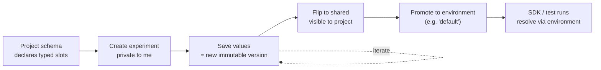

import { CodeBlock } from '@/components/CodeBlock'

# Experiments

An **experiment** is one attempt at a parameter configuration. **Versions** are its immutable history; **environments** are how running code and test runs find a version.

## The mental model

Experiments follow a specific lifecycle from private drafting to production deployment:

1. **Schema:** The project's [Parameter Schema](/docs/experiments/parameter-schema) defines the typed slots available to configure.
2. **Author:** You create a new experiment. By default, it is private to you, providing a safe sandbox.
3. **Commit:** You fill in values for the parameter slots and save. Every save mints a new, immutable *Version* with a sequential identifier (v1, v2, v3, ...).
4. **Share:** Once the experiment is ready, you flip its visibility to shared, making it visible to your team.
5. **Promote:** You promote a specific version of your shared experiment to an *Environment* (like `default` or `production`).
6. **Resolve:** Application code and test runs request parameters by environment, automatically receiving the newly promoted configuration.

## Vocabulary

- **Parameter Schema** — A project-scoped, typed *contract*. Declares what knobs exist (slot name + type + default).
- **Parameter** (or *slot*) — One named entry in the schema.
- **Experiment** — A named, owned attempt at a configuration. Holds values for the schema's slots.
- **Version** — An immutable snapshot of an experiment's values at a moment in time, identified by a sequential label (v1, v2, ...).
- **Environment** — A movable, project-scoped pointer at a specific `(experiment, version)` pair.
- **Visibility** — A per-experiment flag (`private` vs `shared`).
- **Promoting** — Moving an environment to point at a different version.
- **Pinning** — Fetching configuration by `version` instead of by environment.
- **Snapshotting** — Capturing resolved values at run-queue time to guarantee test reproducibility.

## Why immutable versions?

Versions are immutable so a test run can be re-run six months from now and produce bit-identical inputs.

If versions were mutable, changing a parameter would silently invalidate historical test results. Because each version is immutable and sequentially numbered, the audit trail is exact: "this run used `v3`".

## Why movable environments?

Production code shouldn't hardcode version identifiers — it asks for `environment="production"`.

Environments separate *what's running* from *what was running*. Promoting an environment is the deployment step. Tying environments to versions (not to experiments) means you can promote the same experiment to multiple environments (for example staging a change before rolling it out to production).

## Visibility: private vs shared

Private experiments are your personal sandboxes — your colleagues can't accidentally use yours, and you can't accidentally affect theirs.

Sharing an experiment is the explicit act of saying "this is ready to be a team artifact". As a safety mechanism, only `shared` experiments can be promoted onto an environment, ensuring a stray draft can't accidentally hit production.

## Promoting (the deployment primitive)

*Promoting* is the act of moving an environment.

The mechanics are simple: pick a `shared` experiment, select a version, and click "Promote to default" (or any other environment name).

<Callout type="warning">
  **Deployment Impact:** Moving an environment immediately impacts all consumers resolving against that environment (after their short TTL cache expires). Promoting the `production` environment is a true deployment and should be treated as a deliberate action.
</Callout>

## Well-known environments

Rhesis provides four well-known environment names out of the box: `default`, `development`, `staging`, and `production`.

- `default` is the implicit pointer. It's what the SDK returns when no environment is explicitly requested.
- `development`, `staging`, and `production` mirror a typical promotion path so you can fan out deployments without copying experiments between projects.

You can also create custom environment names at will for your own workflows.

## Reproducibility: snapshotting

When a test run is queued, Rhesis *snapshots* the resolved parameter values.

This means that if an environment is moved *after* a run is queued, the test run is not perturbed. The worker only reads from the snapshot. This guarantees that test runs remain reproducible even as your environments point to newer configurations over time.

For the most reproducible production deployments, you can *pin* a version in the SDK (`version="v3"`) to bypass environment resolution entirely.

## UI Walkthrough

### Running a test set against an experiment

When executing a Test Set, you can optionally target it against an experiment:

1. Open the Execute drawer for a Test Set.
2. Select an **Experiment** from the dropdown.
3. (Optional) Pin to a specific version.
4. Review the resolved-values preview (secret references are masked).
5. Click Run.

### The Latest Results panel

The bottom of the Experiment detail page features the Latest Results panel. This fetches recent test runs that executed against versions of this experiment.

It offers two toggleable views:

1. **By run:** A flat list providing a pass/fail summary per run with deep links to the test run details.
2. **By version (config-diff):** Runs grouped by `parameter_version`, ordered newest first. For each pair of adjacent versions, a compact diff row shows:
   - The changed parameter slots and their before/after values (for example `temperature: 0.7 → 1.4`).
   - The pass-rate before vs after, and the delta (for example `82% → 70% (-12pp)`).

The config-diff view is your primary regression-finder: it surfaces exactly which edit broke things without requiring manual reasoning.

## Comparisons

To help anchor the mental model, here is how Rhesis parameter management compares to systems you may already know:

| Rhesis | Git | Feature Flags | MLflow |
| --- | --- | --- | --- |
| Version | Commit (immutable) | Rule Snapshot | Run |
| Environment | Branch Tip / Tag | Environment | Tag |
| Experiment | Branch | Flag | Experiment |
