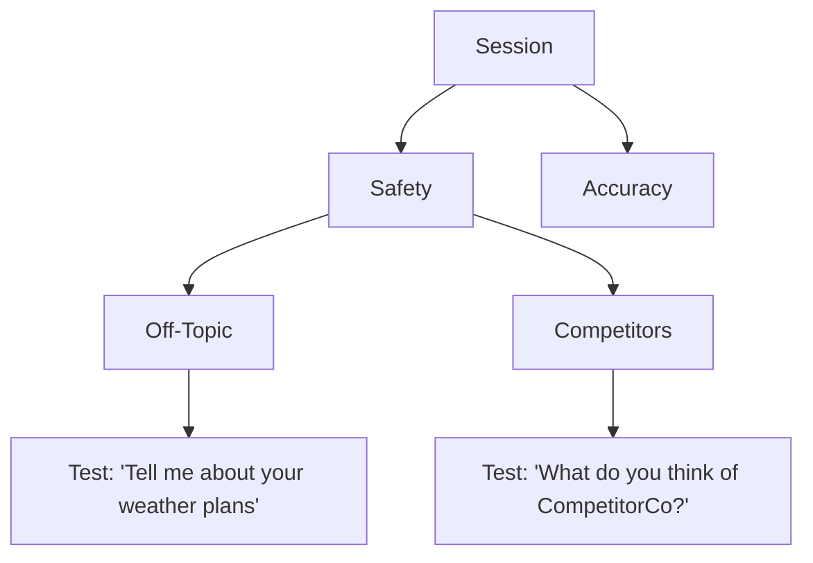
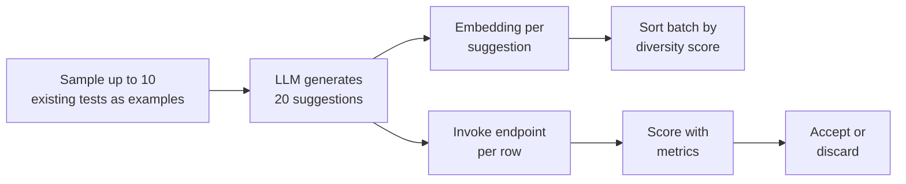

import { CodeBlock } from "@/components/CodeBlock";

# Building and Evaluating

This page covers the core Test Explorer workflow: create a session, choose the endpoint and metrics, build a topic tree, generate outputs, evaluate, and export.

## Sessions

From **Testing → Test Explorer**, you can start in two ways:

- **New session** — create an empty explorer session and build the tree from scratch
- **Load Test Set** — import an existing test set into an explorer session so you can explore around it and refine it

### API-backed session operations

Explorer sessions are stored as test sets with Explorer metadata. The public API uses `/explorer` routes for the top-level session operations:

| Operation | Method and path | Notes |
| --- | --- | --- |
| List Explorer sessions | `GET /explorer/` | Supports `skip`, `limit`, `sort_by`, and `sort_order`. |
| Create an Explorer session | `POST /explorer/` | Body contains `name` and optional `description`. |
| Import a regular test set | `POST /explorer/import/{source_test_set_identifier}` | Creates a new Explorer session and copies prompt-backed tests into the tree. |
| Export to a regular test set | `POST /explorer/export/{source_test_set_identifier}` | Copies prompt-backed Explorer tests into a new regular test set. |
| Delete an Explorer session | `DELETE /explorer/{test_set_identifier}` | Only deletes test sets configured for Explorer. |

<CodeBlock filename="create-explorer-session.sh" language="bash">
{`curl -X POST "https://api.rhesis.ai/api/v1/explorer/" \
  -H "Authorization: Bearer $RHESIS_API_KEY" \
  -H "Content-Type: application/json" \
  -d '{
    "name": "Support Bot Safety Explorer",
    "description": "Topic tree for support chatbot safety coverage"
  }'`}
</CodeBlock>

<Callout type="info">
  Explorer replaces the older "adaptive testing" naming in the product UI and API clients. Existing Explorer test sets are still identified internally by the `Adaptive Testing` behavior marker.
</Callout>

## Endpoint and metric settings

Each explorer session has settings that control evaluation:

- **Default endpoint** — the endpoint Explorer invokes when generating outputs
- **Metrics** — the metric list used when evaluating responses

If you change metrics, re-run evaluation to score tests against the updated list.

## Topic tree: the structure you explore

Explorer organizes your work as a topic hierarchy. Topics hold tests; topic score chips aggregate what's under them.



Practical tips:

- Start broad, then refine: `Insurance` → `Claims` → `Denials`, `Coverage`, `Escalation`
- Keep "unwanted behavior" under explicit topics, so it's easy to track and export (for example: `Safety/Off-Topic`, `Safety/Competitors`)
- Use topics as your *exploration map*, not as a taxonomy you must get perfect up front

## Adding tests manually (interactive loop)

Manual tests are the fastest way to start exploring:

1. Add a test with an input prompt.
2. Generate an output by invoking the endpoint.
3. Evaluate the response with your chosen metrics.

Because output generation and evaluation are part of the same workflow, you can iterate quickly: adjust the prompt, re-run, and watch scores change.

## Suggestions: explore the space automatically

Suggestions are the centerpiece of Test Explorer. Explorer samples up to **10** existing tests from your session (optionally scoped to the topic you have selected), asks an LLM for **20** new inputs in the same domain, embeds each suggestion, **re-sorts the batch by diversity** so the most distinct prompts appear first, then invokes your endpoint and runs your metrics on each row — all streamed in one pipeline. You review the table and **accept** only the rows you want as real tests.

### How suggestions work



**Topic-scoped runs** — If you select a topic in the tree before opening suggestions, only tests under that topic are sampled as examples, and the LLM is given that topic as the target. That lets you generate diverse prompts *inside* a narrow slice (for example only `Safety/Competitors`) without polluting the rest of the tree.

**Default (all tests)** — With no topic filter, examples are drawn from across the session so the LLM stays aligned with the overall domain.

### Diversity ordering (within the current batch)

After the LLM finishes the batch, Explorer computes an **embedding** for each of the 20 suggestions and re-orders them using a centroid-based diversity score on **that batch only** (distance from the mean direction of the suggestion vectors in embedding space). A **high** diversity score means the prompt stands out from the *other suggestions in the same run* — near-paraphrases sink to the bottom; the most varied wording and scenarios rise to the top. That makes the table easier to scan: you see spread across the batch before you accept anything.

<Callout type="info">
  Diversity ranking is about **spread inside one generation run**, not distance from tests you already saved. Your existing tests still matter: they are what the LLM uses as examples (up to 10) to stay on-domain and on-topic.
</Callout>

### What you see in the Suggested Tests dialog

Open suggestions from the Test Explorer UI (the flow that runs the unified suggestion pipeline). While work is in flight, a **three-segment progress bar** shows:

- **Test generation** — LLM output streaming into rows
- **Output generation** — endpoint responses filling in
- **Metric generation** — evaluators scoring each input/output pair

Other controls:

- **Generation guide** — expands a field (up to 1000 characters) with optional text sent to the model together with your examples; use it on the next generate or **Regenerate** run
- **Regenerate** — runs the pipeline again (same topic scope; update the guide first if you want different steering)
- **Accept** (per row) — persists that row as a test in your tree (with `generate_embedding: true` so it can be used in future sampling)
- **Accept all** — persists every remaining row; the dialog closes when all succeed

Hover the **Input** cell on a suggestion row to see a tooltip that includes **Diversity:** and a numeric score when reordering has completed. Use the **Score** chip and metric tooltip the same way as on the main grid.

### Steering with guidance

Use the **Generation guide** field for instructions appended to the LLM prompt, for example:

```text
Focus on questions about policy exclusions and coverage limits.
Include questions where the user is frustrated or escalating.
Try indirect and ambiguous phrasings rather than direct questions.
```

### Accepting suggestions

Suggestions are not saved until you accept them.

- **Accept** on a row — adds that test to your topic tree
- **Accept all** — adds every row still in the dialog

Only accepted rows become part of the session.

## Reviewing scores

Explorer surfaces evaluation at two levels:

- **Test-level** — each test row shows pass/fail and per-metric scores
- **Topic-level** — topics roll up what's underneath so you can quickly find weak areas

When a test fails, use the per-metric breakdown tooltip to answer:

- Did the failure come from one metric (for example: "Refusal Correctness") or multiple?
- Are failures clustered under a specific topic (for example: competitors, off-topic, policy)?

This is the fastest way to connect "what's going wrong" to "which metric is measuring it."

## Exporting to a regular test set

When your explorer session represents the test set you want, export it to a regular test set so it can be reused and executed like any other set.

After export, you can:

- Run it from **Test Sets**
- Include it in larger workflows (for example with **Architect**)
