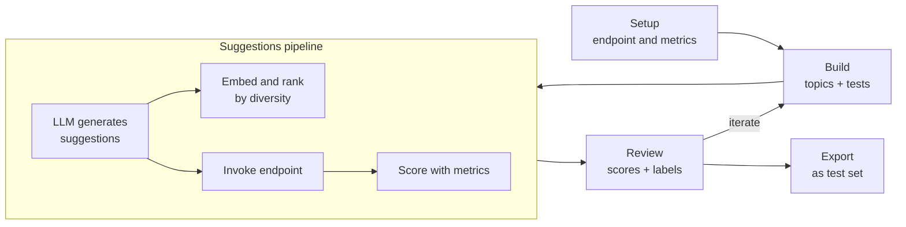

# Workflow

Test Explorer combines manual iteration with a **suggestions pipeline**: you organize tests and topics, then optionally generate a batch of new prompts, embed and rank them by diversity, invoke your endpoint, and evaluate — before you accept anything into the tree.

## Two benefits of Test Explorer

Test Explorer is built around two things:

1. **Interactive endpoint play** — author a prompt, invoke the endpoint, evaluate against your metrics, all in one place; iterate until the metric passes.
2. **Exploration via suggestions** — given the tests you already have, an LLM generates a batch of new ones, embeddings rank that batch by diversity so the most varied prompts surface first, and the endpoint plus metrics run concurrently to score each row. You review the ranked results and accept only what is worth keeping.

For the full mechanics (10 example tests, 20 suggestions, topic scope, dialog controls), see [Building and Evaluating — Suggestions](/docs/explorer/building-and-evaluating#suggestions-explore-the-space-automatically).

## Setup

Create a new explorer session (or load an existing test set), then choose:

- A **default endpoint** to invoke
- A list of **metrics** to evaluate responses

These settings determine what happens when you run generation and evaluation.

## Build

Structure your work as a topic tree:

- Create topics to reflect the dimensions you want to explore (for example: `Insurance/Coverage`, `Safety/Off-Topic`)
- Add tests manually for targeted probing
- Open **Suggestions** when you want breadth: the pipeline samples existing tests as examples, generates new inputs, ranks the batch by diversity, then invokes and scores each candidate — see the diagram above

## Run and evaluate

**On the main grid** — for each saved test, Explorer can invoke the endpoint to fill in an output and run your metrics on the stored input/output pair.

**Inside the suggestions dialog** — the same invoke and evaluate steps run automatically for each generated row as the streamed pipeline progresses. You do not set up a separate test run.

Because everything happens inside the same session, you can spot failures immediately and keep iterating without switching tools.

## Review

Use the score chips and per-metric breakdown to answer two questions quickly:

- Which topics are weakest overall?
- Which metric is driving the failures?

From there, you can edit tests, move them between topics, or run suggestions again with a narrower topic selection or an updated generation guide.

## Export

When the session reflects the test set you want, export it as a regular test set so it can be reused and executed like any other set (for example from **Test Sets** or **Architect**).
