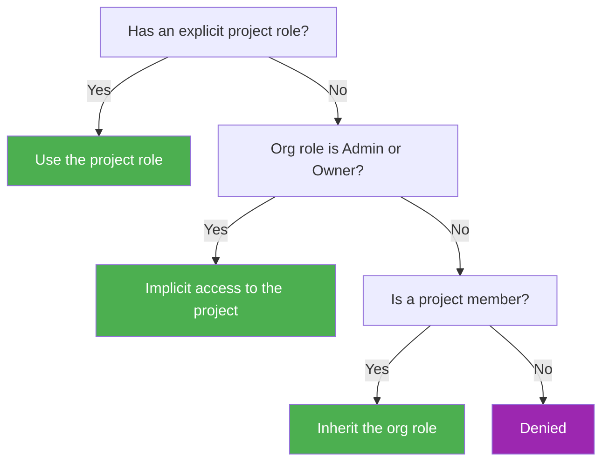

import { CodeBlock } from '@/components/CodeBlock'

# Roles & Permissions

Rhesis controls what each member can do through roles, assigned at the organization level and, optionally, overridden per project.

<Callout type="info">
  Roles & Permissions is an Enterprise Edition feature. Community installations use a simpler model: the organization owner can do anything, and any project member can act within their project.
</Callout>

## Community vs. Enterprise

| Capability | Community | Enterprise |
|---|---|---|
| Organization owner has full control | Yes | Yes |
| Any project member can perform any action within their project | Yes | Only if their role grants it |
| Built-in graded roles (Owner, Admin, Member, Viewer, None) | No | Yes |
| Custom roles with hand-picked permissions | No | Yes |
| Per-project role override (different access per project) | No | Yes |
| API token permission scoping | No | Yes |

## Built-in roles

| Role | Level | Access |
|---|---|---|
| Owner | 100 | Full control, including billing, deletion, and ownership transfer |
| Admin | 80 | Manage members, roles, projects, and org settings. Cannot delete the org |
| Member | 60 | Create, edit, and run evaluations across their projects. Manage own API tokens |
| Viewer | 40 | Read-only access. Can browse and export but not change anything |
| None | 0 | No access. Used to explicitly revoke a member while keeping them in the org |

Built-in roles are fixed and cannot be edited or deleted.

## Organization roles vs. project roles

- A project-level role, if assigned, fully overrides the org role for that project (not additive).
- Org Members and Viewers need to be added to a project to inherit their org role there.

**Examples**

- A contractor is added to one project only, with a Member role on that project. They have no access to any other project, regardless of their org role.
- An org Viewer is promoted to Admin on a single project. They keep Viewer access everywhere else and gain full Admin access on that one project.
- An org Admin never needs to be added to a project explicitly. Admin and Owner get implicit access to every project.

## Custom roles

Owners can create custom roles with a hand-picked set of permissions (`role:manage` is Owner-only by default, Admin is excluded).

- A role's permissions and level can never exceed the creator's own access.
- New capabilities added in future releases do not automatically appear in existing custom roles. An admin must add them explicitly (fail-closed by design).
- Deleting a custom role reassigns org-level holders to **None** and clears project-level holders back to their org role.

## Managing roles in the UI

1. Go to Organization Settings, **Roles** tab.
2. Review the Built-in Roles card (read-only "Details" view) and the Custom Roles table.
3. Click "New role": name it, add a description, optionally copy permissions from a built-in template, then set access per area (**Test Resources**, **Observability**, **Infrastructure**, **Administration**) using the View / Edit / Manage graded control. A live "This role can" summary shows the effective permissions.
4. Assign roles from the Team page (role column or member drawer for org roles), from a project's Members tab (project-level roles), or inline during the invite flow.

## Manage roles via API

| Endpoint | Purpose |
|---|---|
| `GET /rbac/roles` | List built-in and custom roles |
| `GET /rbac/roles/{role_id}` | Read one role and its permissions |
| `POST /rbac/roles` | Create a custom role |
| `PUT /rbac/roles/{role_id}` | Update a custom role |
| `DELETE /rbac/roles/{role_id}` | Delete a custom role |
| `GET /rbac/organization-members` | List org-level role assignments |
| `PUT /rbac/organization-members/{user_id}/role` | Assign or change a user's org role |
| `DELETE /rbac/organization-members/{user_id}` | Remove a user's org role |
| `GET /rbac/projects/{project_id}/members` | List a project's role assignments |
| `PUT /rbac/projects/{project_id}/members/{user_id}/role` | Assign or change a user's project role |

<CodeBlock filename="create_custom_role.sh" language="bash">
{`curl -X POST "https://api.example.com/rbac/roles" \
  -H "Authorization: Bearer $RHESIS_API_KEY" \
  -H "Content-Type: application/json" \
  -d '{
    "name": "qa-lead",
    "display_name": "QA Lead",
    "description": "Full access to test resources, read-only elsewhere",
    "scope": "organization",
    "permission_names": ["test_set:read", "test_set:create", "test_set:update", "test_run:read"]
  }'`}
</CodeBlock>

## Revoking access

Assign the **None** role at the org tier to revoke a member while keeping them in the organization. **None** is not a valid project-tier assignment (the API returns a 422 error), since it has no meaning there.

## Notes

- Role changes can take up to 45 seconds to propagate (permission cache TTL). Not a bug.
- Create and edit controls may appear a moment after the page renders while permissions are still loading. Not a bug.
- The org's last remaining Owner cannot be demoted or removed.

## Related pages

- [Single Sign-On](/docs/organizations/sso)
- [API Clients](/docs/organizations/api-clients)
- [Organizations & Team](/docs/organizations)
- [Self-Hosting](/docs/deployment/self-hosting)
