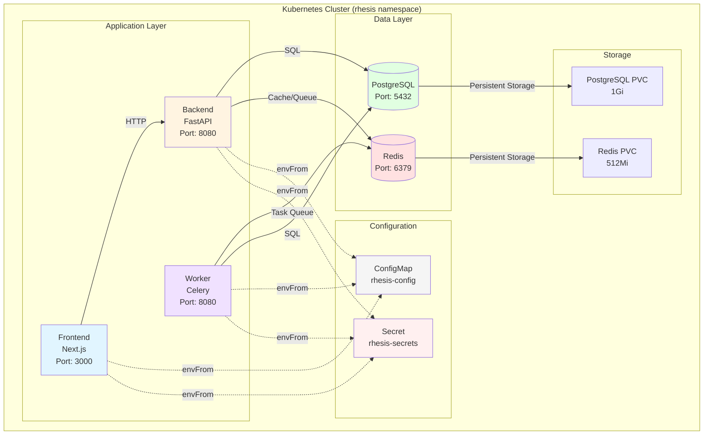
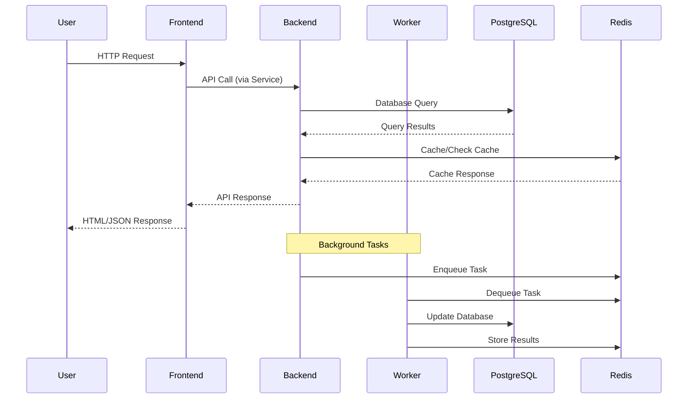
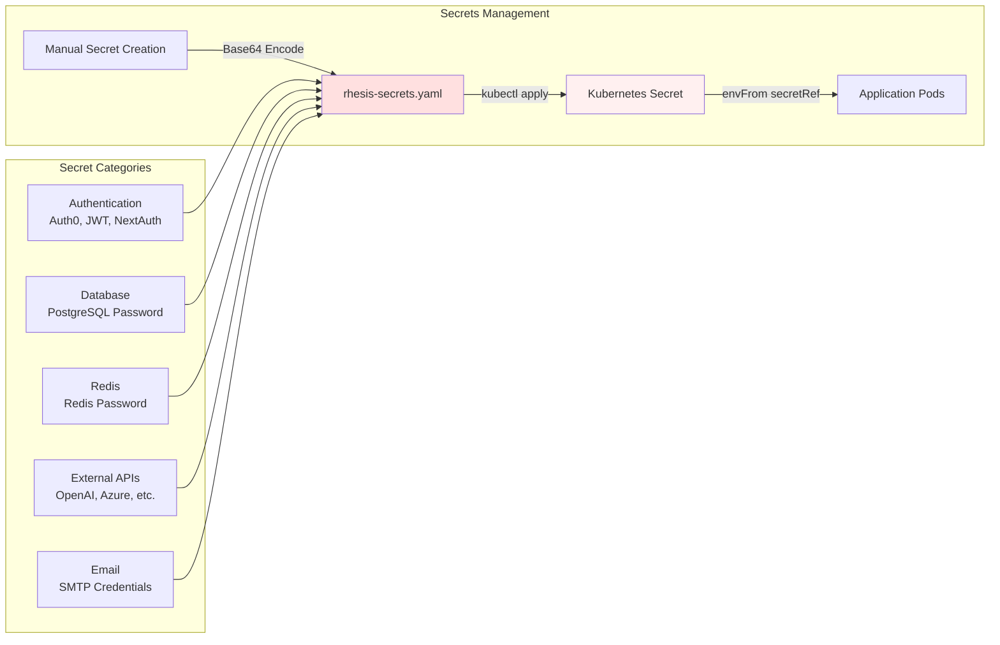
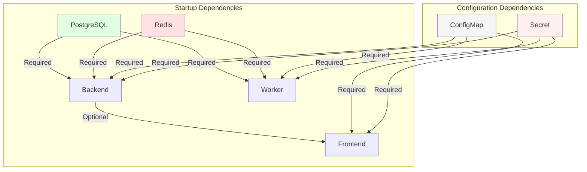
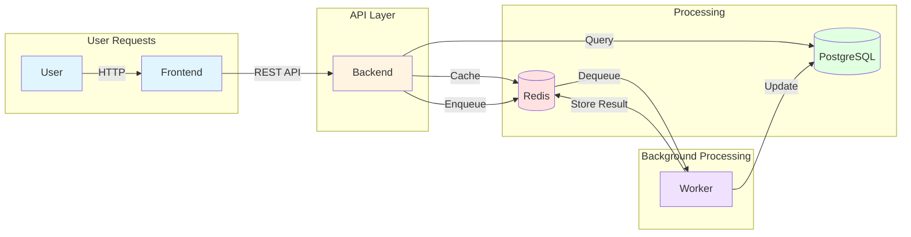

# Kubernetes Deployment Overview

This document provides a high-level overview of the current Rhesis Kubernetes deployment setup. It covers the architecture, components, secrets management, and component interactions to help guide enterprise production-level improvements.

## Current Status

**Deployment Type**: Local development using Helm charts  
**Target Environment**: Currently optimized for Minikube/local clusters  
**Production Readiness**: Basic setup complete, enterprise features pending

## Architecture Overview



## Components

### Application Services

| Component | Technology | Replicas | Purpose | Port |
|-----------|-----------|----------|---------|------|
| **Frontend** | Next.js | 1 | Web UI application | 3000 |
| **Backend** | FastAPI (Python) | 1 | REST API server | 8080 |
| **Worker** | Celery (Python) | 1 | Background task processing | 8080 |

### Infrastructure Services

| Component | Technology | Replicas | Purpose | Port |
|-----------|-----------|----------|---------|------|
| **PostgreSQL** | PostgreSQL 16-alpine | 1 | Primary database | 5432 |
| **Redis** | Redis 7-alpine | 1 | Cache & message broker | 6379 |

### Configuration Resources

| Resource Type | Name | Purpose |
|--------------|------|---------|
| **ConfigMap** | `rhesis-config` | Non-sensitive configuration (URLs, ports, feature flags) |
| **Secret** | `rhesis-secrets` | Sensitive data (passwords, API keys, tokens) |
| **PVC** | `postgres-pvc` | PostgreSQL persistent storage (1Gi) |
| **PVC** | `redis-pvc` | Redis persistent storage (512Mi) |

## Component Interactions



### Service Communication Flow

1. **User → Frontend**: Users access the Next.js frontend via port-forward or ingress
2. **Frontend → Backend**: Frontend makes API calls to the Backend service (ClusterIP)
3. **Backend → PostgreSQL**: Backend queries PostgreSQL for data persistence
4. **Backend → Redis**: Backend uses Redis for caching and session storage
5. **Backend → Worker**: Backend enqueues background tasks to Redis
6. **Worker → Redis**: Worker processes tasks from Redis queue
7. **Worker → PostgreSQL**: Worker updates database with task results

## Secrets Management

### Current Approach

**Storage Method**: Kubernetes native Secrets (base64 encoded)



### Secret Structure

| Category | Examples | Storage Location |
|----------|----------|------------------|
| **Authentication** | `AUTH0_DOMAIN`, `JWT_SECRET_KEY`, `NEXTAUTH_SECRET` | `rhesis-secrets` |
| **Database** | `SQLALCHEMY_DB_PASS` | `rhesis-secrets` |
| **Redis** | `REDIS_PASSWORD` | `rhesis-secrets` |
| **External APIs** | `OPENAI_API_KEY`, `AZURE_OPENAI_API_KEY` | `rhesis-secrets` |
| **Email** | `SMTP_PASSWORD`, `SMTP_USER` | `rhesis-secrets` |

### Secret Injection Method

All application pods receive secrets via `envFrom`:

```yaml
envFrom:
  - configMapRef:
      name: rhesis-config
  - secretRef:
      name: rhesis-secrets
```

**Current Limitations**:
- ❌ Manual base64 encoding required
- ❌ No automatic secret rotation
- ❌ No integration with external secret managers (Vault, AWS Secrets Manager, etc.)
- ❌ Secrets stored in plain YAML files (though not committed to git)

## Resource Configuration

### Current Resource Allocation (Local Development)

| Component | CPU Request | CPU Limit | Memory Request | Memory Limit |
|-----------|-------------|-----------|----------------|--------------|
| Frontend | 1000m | 2000m | 2 Gi | 4 Gi |
| Backend | 500m | 1000m | 1 Gi | 2 Gi |
| Worker | 500m | 1000m | 1 Gi | 2 Gi |
| PostgreSQL | 250m | 500m | 512 Mi | 1 Gi |
| Redis | 100m | 200m | 128 Mi | 256 Mi |
| **Total** | **2.35 cores** | **4.7 cores** | **4.6 Gi** | **9.2 Gi** |

### Storage Configuration

| Component | Storage Type | Size | Storage Class |
|-----------|-------------|------|---------------|
| PostgreSQL | PersistentVolumeClaim | 1 Gi | Default |
| Redis | PersistentVolumeClaim | 512 Mi | Default |

## Deployment Method

### Helm Chart Structure

```
infrastructure/k8s/charts/rhesis/
├── Chart.yaml              # Chart metadata
├── values.yaml             # Default values
├── values-local.yaml       # Local development overrides
└── templates/
    ├── backend-deployment.yaml
    ├── frontend-deployment.yaml
    ├── worker-deployment.yaml
    ├── postgresql-deployment.yaml
    ├── redis-deployment.yaml
    ├── services.yaml
    ├── postgresql-pvc.yaml
    └── redis-pvc.yaml
```

### Deployment Process

1. **Build Docker Images**: Frontend, Backend, Worker
2. **Load Images**: Into Minikube (local) or push to registry (production)
3. **Create Secrets/ConfigMaps**: Apply `rhesis-secrets.yaml` and `rhesis-config.yaml`
4. **Deploy with Helm**: `helm install rhesis . --values values-local.yaml`

## Current Features

### ✅ Implemented

- **Basic Helm Chart**: Complete Helm chart with all core components
- **Health Checks**: Liveness and readiness probes for all services
- **Resource Limits**: CPU and memory requests/limits configured
- **Persistent Storage**: PVCs for PostgreSQL and Redis
- **Service Discovery**: ClusterIP services for internal communication
- **Configuration Management**: ConfigMaps for non-sensitive config
- **Secrets Management**: Kubernetes Secrets for sensitive data
- **Namespace Isolation**: All resources in `rhesis` namespace

### ⚠️ Partially Implemented

- **Security Contexts**: Defined but disabled for some components due to permission issues
- **Image Pull Policy**: Configured but varies by environment

### ❌ Not Implemented (Enterprise Requirements)

- **Ingress Controller**: No external access configuration
- **Network Policies**: No network isolation between components
- **RBAC**: No role-based access control
- **Service Accounts**: No dedicated service accounts per component
- **Horizontal Pod Autoscaling (HPA)**: No automatic scaling
- **Pod Disruption Budgets (PDB)**: No availability guarantees
- **Monitoring**: No Prometheus/Grafana integration
- **Logging**: No centralized logging solution
- **Secret Management**: No integration with external secret managers
- **Backup/Recovery**: No backup strategy for databases
- **Multi-Environment**: No staging/production value files
- **CI/CD Integration**: Manual deployment process
- **Resource Quotas**: No namespace resource limits
- **Limit Ranges**: No pod resource constraints
- **TLS/SSL**: No certificate management
- **Service Mesh**: No service mesh (Istio, Linkerd)

## Component Dependencies



## Network Architecture

### Current Network Setup

- **Service Type**: All services use `ClusterIP` (internal only)
- **Access Method**: Port-forwarding for local development
- **No Ingress**: External access not configured
- **No Load Balancer**: No external IP assignment

### Service Endpoints

| Service | Type | Port | Access |
|---------|------|------|--------|
| frontend | ClusterIP | 3000 | Port-forward: `kubectl port-forward svc/frontend 3000:3000` |
| backend | ClusterIP | 8080 | Port-forward: `kubectl port-forward svc/backend 8080:8080` |
| worker | ClusterIP | 8080 | Port-forward: `kubectl port-forward svc/worker 8080:8080` |
| postgres | ClusterIP | 5432 | Internal only (via service name) |
| redis | ClusterIP | 6379 | Internal only (via service name) |

## Data Flow



## Current Limitations & Gaps

### Security

- ❌ No network policies for traffic isolation
- ❌ No RBAC for fine-grained access control
- ❌ Secrets stored as base64 manually (not encrypted at rest by default)
- ❌ Security contexts disabled for some components
- ❌ No pod security policies/admission controllers

### Reliability

- ❌ No pod disruption budgets
- ❌ No health check endpoints for all services
- ❌ No graceful shutdown handling
- ❌ No database backup/restore strategy
- ❌ Single replica for all components (no high availability)

### Scalability

- ❌ No horizontal pod autoscaling
- ❌ No vertical pod autoscaling
- ❌ Fixed resource limits (not dynamic)
- ❌ No cluster autoscaling configuration

### Observability

- ❌ No metrics collection (Prometheus)
- ❌ No centralized logging
- ❌ No distributed tracing
- ❌ No alerting system
- ❌ Limited health check visibility

### Operations

- ❌ Manual deployment process
- ❌ No CI/CD pipeline integration
- ❌ No blue-green or canary deployments
- ❌ No rollback automation
- ❌ No multi-environment support (dev/staging/prod)

## Next Steps for Enterprise Production

### Priority Areas for Discussion

1. **Security Hardening**
   - Network policies implementation
   - RBAC configuration
   - Secret management integration (Vault, etc.)
   - TLS/SSL certificate management
   - Pod security standards

2. **High Availability**
   - Multi-replica deployments
   - Pod disruption budgets
   - Database replication/backup
   - Health check improvements

3. **Scalability**
   - Horizontal Pod Autoscaler (HPA)
   - Resource optimization
   - Cluster autoscaling

4. **Observability**
   - Monitoring stack (Prometheus/Grafana)
   - Centralized logging (ELK, Loki)
   - Distributed tracing
   - Alerting rules

5. **Operations**
   - CI/CD pipeline
   - GitOps (ArgoCD, Flux)
   - Multi-environment management
   - Disaster recovery plan

## Questions for Discussion

1. **Secrets Management**: What's the recommended approach for enterprise secret management? (Vault, AWS Secrets Manager, etc.)

2. **Network Security**: How should we implement network policies for production? What's the recommended traffic flow?

3. **High Availability**: What's the minimum replica count and pod disruption budget strategy for production?

4. **Monitoring**: What monitoring stack would you recommend? (Prometheus + Grafana, Datadog, etc.)

5. **Scaling Strategy**: What autoscaling approach should we use? (HPA, VPA, cluster autoscaling)

6. **Backup & Recovery**: What's the recommended backup strategy for PostgreSQL in Kubernetes?

7. **Multi-Environment**: How should we structure Helm values for dev/staging/prod environments?

8. **CI/CD Integration**: What's the recommended deployment pipeline for Kubernetes?

9. **Service Mesh**: Should we consider a service mesh (Istio, Linkerd) for production?

10. **Resource Optimization**: How should we right-size resources for production workloads?

---

**Note**: This document provides a high-level overview. Detailed implementation plans will be developed based on the specialist's recommendations and enterprise requirements.

