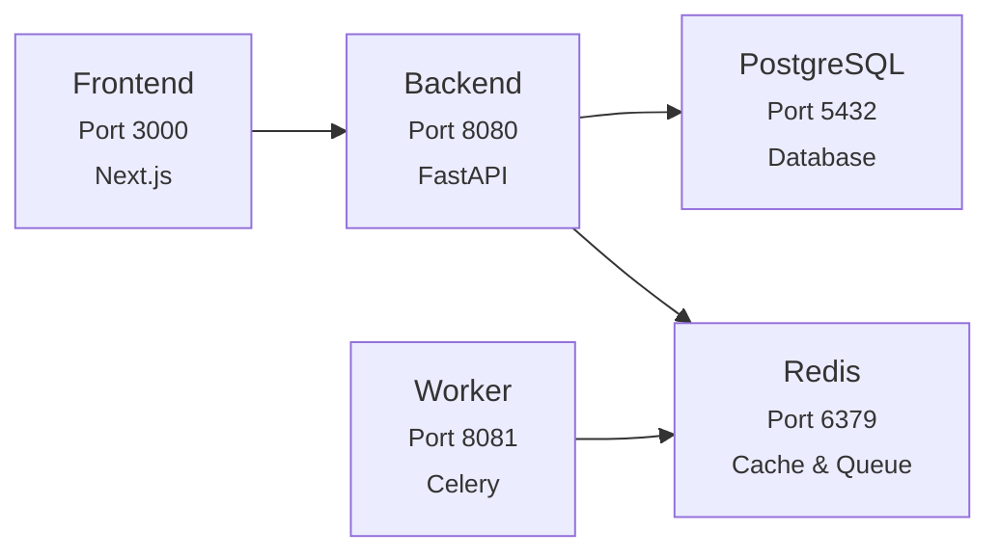

import { CodeBlock } from '@/components/CodeBlock'
import { Table } from '@/components/Table'
import { FileTree } from '@/components/FileTree'

# Self-Hosting

Deploy Rhesis on your own infrastructure with proper security, authentication, and production configuration.

## Overview

This guide covers deploying Rhesis for production use with:

- **[Secure authentication](#authentication--security)** - Native authentication with JWT token management
- **[Database encryption](#database-encryption)** - Field-level encryption for sensitive data
- **[Email notifications](#email-configuration-optional)** - SMTP configuration for system emails
- **[AI model providers](#ai-model-configuration)** - Gemini, OpenAI, and Azure OpenAI configuration
- **[Service monitoring](#monitoring-and-logs)** - Health checks, logging, and status management
- **[Automated setup](#automated-database-setup)** - Database initialization and migrations

<Callout type="warning">
**Production Deployment**

This guide is for production environments. For quick local testing, see the [Running Locally](/getting-started/running-locally) guide.
</Callout>

## Prerequisites

- Docker Desktop installed and running (Docker Compose V2)
- Git (to clone the repository)
- Ports 3000, 8080, 8081, 5432, and 6379 available on your system
- (Optional) OAuth provider credentials for Google and/or GitHub sign-in
- AI provider account (Gemini, OpenAI, or Azure OpenAI)

> **Important**: This guide uses Docker Compose V2 syntax (`docker compose` without hyphen). If you're using an older version of Docker, you may need to install Docker Compose V2 or use the legacy `docker-compose` command.

## System Requirements

### Production Environment

For production deployment with real users:

<Table
  headers={["Resource", "Minimum", "Recommended", "High-Scale"]}
  rows={[
    ["RAM", "8 GB", "16 GB", "32 GB+"],
    ["Storage", "20 GB SSD", "50 GB SSD", "100 GB+ SSD"],
    ["CPU", "4 cores", "8 cores", "16+ cores"],
    ["Network", "50 Mbps", "100 Mbps", "1 Gbps+"],
  ]}
  align={["left", "center", "center", "center"]}
/>

**Production Notes:**

- Optimized builds without development overhead
- Higher concurrent user capacity
- Production logging levels
- Database connection pooling

### Detailed Resource Breakdown

**Memory Usage by Service:**

<Table
  headers={["Service", "Production"]}
  rows={[
    ["PostgreSQL", "~1-2 GB"],
    ["Redis", "~500 MB - 1 GB"],
    ["Backend", "~500 MB - 1 GB"],
    ["Worker", "~1-2 GB"],
    ["Frontend", "~200-400 MB"],
    ["Docker Overhead", "~500 MB - 1 GB"],
    ["**Total Estimated**", "**~3.7-7.1 GB**"],
  ]}
  align={["left", "right"]}
/>

**Storage Requirements:**

<Table
  headers={["Component", "Production"]}
  rows={[
    ["Application Code", "~2 GB"],
    ["Database", "~5-50 GB+"],
    ["Docker Images", "~3-4 GB"],
    ["Logs & Cache", "~2-10 GB"],
    ["Working Space", "~3-5 GB"],
    ["**Total Estimated**", "**~15-75 GB+**"],
  ]}
  align={["left", "right"]}
/>

### Performance Characteristics

**CPU Usage Patterns:**

- **High Load**: AI processing, bulk data operations, migrations
- **Normal Load**: API requests, background tasks, web serving
- **Idle**: Minimal CPU during low activity periods

**Scaling Factors:**

- **AI Operations**: Memory spikes during model inference
- **Concurrent Users**: ~50-100 MB RAM per active user
- **Database Growth**: Storage scales with user data and analytics
- **Background Tasks**: CPU-intensive during batch processing

## Quick Start

### 1. Clone the repository

<CodeBlock filename="Terminal" language="bash">
{`git clone https://github.com/rhesis-ai/rhesis.git
cd rhesis`}
</CodeBlock>

### 2. Copy environment variables

<CodeBlock filename="Terminal" language="bash">
{`cp .env.example .env.docker`}
</CodeBlock>

### 3. Configure environment variables

Edit the `.env.docker` file and update all required configurations (see [Environment Configuration](#environment-configuration) below).

### 4. Start all services

<CodeBlock filename="Terminal" language="bash">
{`docker compose --env-file .env.docker up -d`}
</CodeBlock>

### 5. Access the applications

- **Frontend**: http://localhost:3000
- **Backend API**: http://localhost:8080/docs
- **Worker Health**: http://localhost:8081/health/basic

## Architecture Overview

### Services

The Rhesis platform consists of several interconnected services:

<Table
  headers={["Service", "Port", "Description", "Health Check"]}
  rows={[
    ["PostgreSQL", "5432", "Primary database", "`pg_isready`"],
    ["Redis", "6379", "Cache & message broker", "`redis-cli ping`"],
    ["Backend", "8080", "FastAPI application", "`curl /health`"],
    ["Worker", "8081", "Celery background tasks", "`curl /health/basic`"],
    ["Frontend", "3000", "Next.js application", "`curl /api/auth/session`"],
  ]}
  align={["left", "center", "left", "left"]}
/>

### Service Dependencies

## Automated Database Setup

**No manual database setup required!** The system automatically handles:

- PostgreSQL database and user creation
- Database ownership and permissions setup
- Automatic Alembic migration execution
- Table and relationship creation
- Migration status checking (prevents duplicate migrations)

The backend container startup process:

1. Waits for PostgreSQL to be ready
2. Sets proper database ownership
3. Runs all pending migrations
4. Starts the FastAPI application

## Environment Configuration

### Required Environment Variables

Update your `.env.docker` file with the following configurations:

#### Authentication & Security

These variables configure user authentication and security for the platform:

<CodeBlock filename=".env.docker" language="bash">
{`# JWT Configuration
# Used for secure token generation and validation
JWT_SECRET_KEY=your-jwt-secret-key
JWT_ALGORITHM=HS256
JWT_ACCESS_TOKEN_EXPIRE_MINUTES=15

# NextAuth Configuration
# Required for Next.js authentication integration
NEXTAUTH_SECRET=your-nextauth-secret
NEXTAUTH_URL=https://your-domain.com

# Frontend URL (used for email links and OAuth redirects)
FRONTEND_URL=https://your-domain.com`}
</CodeBlock>

#### Database Encryption

<CodeBlock filename=".env.docker" language="bash">
{`# Database Field Encryption
# Generate with: python -c "from cryptography.fernet import Fernet; print(Fernet.generate_key().decode())"
DB_ENCRYPTION_KEY=your-generated-encryption-key`}
</CodeBlock>

#### OAuth Providers (Optional)

Additional authentication providers for social login. If no OAuth credentials are provided, only email/password authentication is available.

<CodeBlock filename=".env.docker" language="bash">
{`# Google OAuth (Optional)
# Enables Google sign-in for users
GOOGLE_CLIENT_ID=your-google-client-id
GOOGLE_CLIENT_SECRET=your-google-client-secret

# GitHub OAuth (Optional)
# Enables GitHub sign-in for users
GH_CLIENT_ID=your-github-client-id
GH_CLIENT_SECRET=your-github-client-secret`}
</CodeBlock>

#### Email Configuration (Optional)

Required for sending system emails, notifications, and user communications:

<CodeBlock filename=".env.docker" language="bash">
{`# SMTP Configuration (Optional)
# Used for sending emails (notifications, invitations, etc.)
SMTP_HOST=your_smtp_host
SMTP_PORT=465
SMTP_USER=your_smtp_user
SMTP_PASSWORD=your_smtp_password
FROM_EMAIL=your_from_email`}
</CodeBlock>

#### AI Model Configuration

Configure AI providers for natural language processing and content generation:

<CodeBlock filename=".env.docker" language="bash">
{`# Gemini AI Configuration
# Google's Gemini AI for advanced language processing
GEMINI_API_KEY=your-gemini-api-key
GOOGLE_API_KEY=your-google-api-key
GEMINI_MODEL_NAME=gemini-2.0-flash-001

# Azure OpenAI Configuration
# Microsoft Azure's OpenAI service for GPT models
AZURE_OPENAI_ENDPOINT=YOUR_AZURE_OPENAI_API_ENDPOINT
AZURE_OPENAI_API_KEY=YOUR_AZURE_OPENAI_API_KEY
AZURE_OPENAI_DEPLOYMENT_NAME=gpt-4o
AZURE_OPENAI_API_VERSION=YOUR_AZURE_OPENAI_API_VERSION

# OpenAI Configuration
# Direct OpenAI API integration for GPT models
OPENAI_API_KEY=YOUR_OPENAI_API_KEY
OPENAI_MODEL_NAME=gpt-4o`}
</CodeBlock>

> **Note**: At least one AI provider configuration is required for full platform functionality. You can choose between Gemini, Azure OpenAI, or OpenAI based on your preferences and requirements.

## Telemetry & Privacy

<Callout type="info">
**Transparency First**

Rhesis collects anonymous usage data by default to improve the platform. All telemetry is privacy-focused and transparent. You can opt-out anytime.
</Callout>

### Telemetry Status

**For self-hosted deployments: Telemetry is ENABLED by default** (opt-out).
**For cloud deployments: Telemetry is ALWAYS enabled** (user consent via Terms & Conditions).

Telemetry helps us improve Rhesis by understanding:
- Which features are most valuable
- Performance bottlenecks
- Common error patterns

### What We Collect

✅ **Anonymous usage data:**
- Feature usage patterns (which features are used, how often)
- API performance metrics (response times, error rates)
- Deployment information (self-hosted vs cloud, version)
- Hashed user/org IDs (SHA-256, irreversible, 16-char truncated)

### What We DON'T Collect

❌ **Your private data is NEVER collected:**
- Your prompts, responses, or generated content
- Document contents or uploaded files
- API keys, passwords, or credentials
- Personal information (names, emails, etc.)
- IP addresses or organization names
- Any identifiable or sensitive data

### Data Usage

- **Usage**: Only by Rhesis team for product improvement
- **Sharing**: Never sold or shared with third parties
- **Storage**: Separate analytics database (isolated from your data)

### How to Disable Telemetry (Opt-Out)

Telemetry is **enabled by default**. To opt-out, add to your `.env.docker` file:

<CodeBlock filename=".env.docker" language="bash">
{`# Disable telemetry (opt-out)
OTEL_RHESIS_TELEMETRY_ENABLED=false`}
</CodeBlock>

Then restart your services:

<CodeBlock filename="Terminal" language="bash">
{`docker compose --env-file .env.docker restart`}
</CodeBlock>

### Telemetry Configuration (Optional)

If telemetry is enabled (default), you can optionally configure these settings:

<CodeBlock filename=".env.docker" language="bash">
{`# Telemetry configuration (optional - these are the defaults)
OTEL_DEPLOYMENT_TYPE=self-hosted
OTEL_EXPORTER_OTLP_ENDPOINT=https://telemetry.rhesis.ai
OTEL_SERVICE_NAME=rhesis`}
</CodeBlock>

<Callout type="default">
**Learn More**: For technical details about the telemetry architecture, see [Telemetry System Documentation](/development/telemetry).
</Callout>

## Management Commands

### Service Management

**Start services:**

<CodeBlock filename="Terminal" language="bash">
{`# Start all services in detached mode
docker compose --env-file .env.docker up -d

# Start with logs visible
docker compose --env-file .env.docker up`}
</CodeBlock>

**Stop services:**

<CodeBlock filename="Terminal" language="bash">
{`# Stop all services
docker compose down

# Stop and remove volumes (WARNING: deletes all data)
docker compose down -v`}
</CodeBlock>

**Restart services:**

<CodeBlock filename="Terminal" language="bash">
{`# Restart all services
docker compose --env-file .env.docker restart

# Restart specific service
docker compose --env-file .env.docker restart backend`}
</CodeBlock>

### Monitoring and Logs

**View logs:**

<CodeBlock filename="Terminal" language="bash">
{`# All services
docker compose logs

# Specific service
docker compose logs backend
docker compose logs frontend
docker compose logs worker

# Follow logs in real-time
docker compose logs -f backend`}
</CodeBlock>

**Check service status:**

<CodeBlock filename="Terminal" language="bash">
{`# View running containers and their status
docker compose ps`}
</CodeBlock>

### Building and Updates

**Rebuild services:**

<CodeBlock filename="Terminal" language="bash">
{`# Rebuild all services
docker compose --env-file .env.docker build

# Rebuild specific service
docker compose --env-file .env.docker build backend

# Rebuild and restart
docker compose --env-file .env.docker up -d --build`}
</CodeBlock>

### Database Operations

The database is automatically managed, but you can access it directly if needed:

<CodeBlock filename="Terminal" language="bash">
{`# Connect to PostgreSQL
docker exec -it rhesis-postgres psql -U rhesis-user -d rhesis-db

# Check current migration status
docker exec rhesis-backend bash -c "cd src/rhesis/backend && alembic current"

# Run migrations manually (if needed)
docker exec rhesis-backend bash -c "cd src/rhesis/backend && alembic upgrade head"

# View migration history
docker exec rhesis-backend bash -c "cd src/rhesis/backend && alembic history"`}
</CodeBlock>

## Troubleshooting

### Common Issues

**Database Migration Problems:**

1. Check migration status:

<CodeBlock filename="Terminal" language="bash">
{`docker exec rhesis-backend bash -c "cd src/rhesis/backend && alembic current"`}
</CodeBlock>

2. View migration logs:

<CodeBlock filename="Terminal" language="bash">
{`docker compose logs backend | grep -i migration`}
</CodeBlock>

3. Reset database (WARNING: deletes all data):

<CodeBlock filename="Terminal" language="bash">
{`docker compose down -v
docker compose --env-file .env.docker up -d`}
</CodeBlock>

**Service Health Issues:**

1. Check service status:

<CodeBlock filename="Terminal" language="bash">
{`docker compose ps`}
</CodeBlock>

2. Verify environment variables:

<CodeBlock filename="Terminal" language="bash">
{`docker exec rhesis-backend env | grep JWT`}
</CodeBlock>

3. Check resource usage:

<CodeBlock filename="Terminal" language="bash">
{`docker stats`}
</CodeBlock>

**Port Conflicts:**

If you encounter port conflicts, you can modify the ports in `docker-compose.yml` or stop conflicting services:

<CodeBlock filename="Terminal" language="bash">
{`# Check what's using a port (e.g., port 3000)
lsof -i :3000

# Kill process using the port
kill -9 <PID>`}
</CodeBlock>

### Performance Optimization

**Resource Allocation:**

- Ensure Docker has at least 8GB RAM allocated for production
- Monitor disk space usage with `docker system df`
- Clean up unused resources with `docker system prune`

**Database Performance:**

- Monitor PostgreSQL logs: `docker compose logs postgres`
- Check connection counts and slow queries
- Consider PostgreSQL tuning for production workloads

### Security Considerations

<Callout type="warning">
**Production Security Checklist**

- ✅ Change all default passwords and secrets
- ✅ Use strong JWT secrets (minimum 32 characters)
- ✅ Configure proper firewall rules
- ✅ Keep environment variables secure (never commit `.env.docker`)
- ✅ Regularly update Docker images
- ✅ Enable HTTPS/TLS for all external connections
- ✅ Configure proper authentication settings and strong JWT secrets
- ✅ Implement backup and disaster recovery procedures
</Callout>

## Backup and Recovery

### Database Backup

<CodeBlock filename="Terminal" language="bash">
{`# Create database backup
docker exec rhesis-postgres pg_dump -U rhesis-user rhesis-db > backup.sql

# Restore from backup
docker exec -i rhesis-postgres psql -U rhesis-user -d rhesis-db < backup.sql`}
</CodeBlock>

### Full System Backup

<CodeBlock filename="Terminal" language="bash">
{`# Stop services
docker compose down

# Backup volumes
docker run --rm -v rhesis_postgres_data:/data -v $(pwd):/backup alpine tar czf /backup/postgres_backup.tar.gz -C /data .
docker run --rm -v rhesis_redis_data:/data -v $(pwd):/backup alpine tar czf /backup/redis_backup.tar.gz -C /data .

# Restart services
docker compose --env-file .env.docker up -d`}
</CodeBlock>

## Support and Resources

### Getting Help

If you encounter issues:

1. Check the logs: `docker compose logs`
2. Verify environment variables are set correctly
3. Ensure Docker has sufficient resources
4. Check if ports are available and not in use
5. Review the [documentation](https://docs.rhesis.ai) for additional guidance

### Additional Resources

- [Backend Documentation](/development/backend)
- [Frontend Documentation](/development/frontend)
- [Worker Documentation](/development/worker)
- [Environment Setup Guide](/development/environment-setup)
- [Running Locally](/getting-started/running-locally) - For local development and testing

## Docker Compose Version Note

**Why `docker compose` instead of `docker-compose`?**

- **`docker-compose` (V1)**: The original standalone tool written in Python, **deprecated as of June 2023**
- **`docker compose` (V2)**: The modern version integrated into Docker CLI, written in Go with better performance

If you encounter errors with `docker-compose`, you're likely using the deprecated V1. Switch to `docker compose` (V2) for:

- Better performance and reliability
- Active maintenance and security updates
- Support for newer Docker features
- Improved integration with Docker CLI
