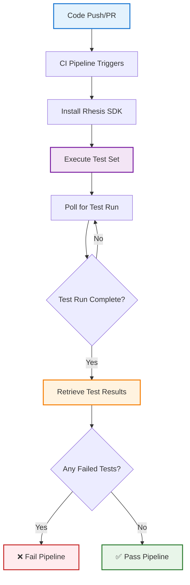

import { CodeBlock } from '@/components/CodeBlock'

# How to Integrate Rhesis SDK into Your CI/CD Pipeline

Automate LLM testing in your CI/CD pipeline to catch quality issues before they reach production. This guide shows you how to set up automated test execution, quality gates, and failure detection in your continuous integration workflow.

## What You'll Achieve

- **Automated Testing**: Run LLM tests on every commit or pull request
- **Quality Gates**: Block deployments when tests fail
- **Early Detection**: Catch regressions and quality issues before production
- **Test Reports**: Get detailed test results in your CI/CD logs

## Use Cases

- **Chatbot Testing**: Validate conversational AI responses
- **API Validation**: Test LLM-powered API endpoints
- **Regression Prevention**: Detect when changes break existing behaviors

## Prerequisites

Before integrating Rhesis into your CI/CD pipeline, ensure you have:

- Python 3.10+ available in your CI environment
- A Rhesis account at [app.rhesis.ai](https://app.rhesis.ai)
- An **Endpoint** configured in Rhesis with your LLM application URL
- A **Test Set** created with test scenarios to run
- Basic familiarity with GitHub Actions, GitLab CI, or similar tools

<Callout type="info">
This guide uses GitHub Actions as the example, but the principles apply to any CI/CD platform (GitLab CI, Jenkins, CircleCI, etc.).
</Callout>

<Callout type="tip">
**Quick Start:** All example files are available in the [`examples/ci-cd/`](https://github.com/rhesis-ai/rhesis/tree/main/examples/ci-cd) directory. Copy the workflow and script files to your repository to get started quickly.
</Callout>

## How It Works

The CI/CD integration follows this workflow:



## Setup Steps

<Steps>

### Get Your API Credentials

1. Log in to [app.rhesis.ai](https://app.rhesis.ai)
2. Navigate to **API Tokens**
3. Generate a new API Token
4. Copy the Token (you'll need it in the next step)

<Callout type="warning">
Keep your API Token secure. Never commit it directly to your repository.
</Callout>

### Configure CI/CD Secrets

Store your Rhesis credentials as environment variables in your CI/CD platform:

**For GitHub Actions:**

1. Go to your repository **Settings** → **Secrets and variables** → **Actions**
2. Click **New repository secret**
3. Add these secrets:

| Secret Name | Value | Description |
|------------|-------|-------------|
| `RHESIS_API_KEY` | Your API key | Authentication for Rhesis API |
| `RHESIS_ENDPOINT_NAME` | Your endpoint name | The endpoint to test |
| `RHESIS_TEST_SET_NAME` | Your test set name | Test scenarios to run |

<Callout type="info">
Find your Endpoint and Test Set names in the Rhesis dashboard. **Important:** Names must be unique for the SDK to identify the correct resources. While the platform allows duplicate names, this should be avoided when using the SDK for CI/CD automation.
</Callout>

**Optional:** Set the base URL if using self-hosted Rhesis:

```bash
RHESIS_BASE_URL=https://your-rhesis-instance.com
```

### Create the Workflow File

Create `.github/workflows/rhesis-tests.yml` in your repository. The workflow includes these key steps:

<Callout type="info">
**Full workflow file available:** See the complete workflow at [`examples/ci-cd/rhesis-tests.yml`](https://github.com/rhesis-ai/rhesis/blob/main/examples/ci-cd/rhesis-tests.yml)
</Callout>

**1. Define triggers** - Run tests on pushes and pull requests:

<CodeBlock filename="rhesis-tests.yml" language="yaml">
{`on:
  push:
    branches: [main, develop]
  pull_request:
    branches: [main, develop]`}
</CodeBlock>

**2. Set up environment** - Install Python and Rhesis SDK:

<CodeBlock filename="rhesis-tests.yml" language="yaml">
{`- name: Set up Python
  uses: actions/setup-python@v5
  with:
    python-version: '3.11'

- name: Install Rhesis SDK
  run: pip install rhesis-sdk`}
</CodeBlock>

**3. Run tests** - Execute the test runner with environment variables from secrets:

<CodeBlock filename="rhesis-tests.yml" language="yaml">
{`- name: Run Rhesis Tests
  env:
    RHESIS_API_KEY: # Reference secrets.RHESIS_API_KEY
    RHESIS_ENDPOINT_NAME: # Reference secrets.RHESIS_ENDPOINT_NAME
    RHESIS_TEST_SET_NAME: # Reference secrets.RHESIS_TEST_SET_NAME
  run: python .github/scripts/run_rhesis_tests.py`}
</CodeBlock>

<Callout type="info">
The GitHub Actions secret syntax uses `${{ secrets.SECRET_NAME }}`. See the complete workflow file for the exact syntax.
</Callout>

**4. Upload results** - Save test results as artifacts:

<CodeBlock filename="rhesis-tests.yml" language="yaml">
{`- name: Upload Test Results
  if: always()
  uses: actions/upload-artifact@v4
  with:
    name: rhesis-test-results
    path: test-results.json`}
</CodeBlock>

Copy the complete workflow file from [`examples/ci-cd/rhesis-tests.yml`](https://github.com/rhesis-ai/rhesis/blob/main/examples/ci-cd/rhesis-tests.yml) to your `.github/workflows/` directory.

### Create the Test Runner Script

Create `.github/scripts/run_rhesis_tests.py`. The script follows these key steps:

<Callout type="info">
**Full implementation available:** See the complete script at [`examples/ci-cd/run_rhesis_tests.py`](https://github.com/rhesis-ai/rhesis/blob/main/examples/ci-cd/run_rhesis_tests.py)
</Callout>

**Step 1: Get endpoint** - Retrieve the endpoint configuration:

<CodeBlock filename="run_rhesis_tests.py" language="python">
{`endpoint = Endpoints.pull(name=endpoint_name)`}
</CodeBlock>

**Step 2: Get test set** - Fetch the test set to execute:

<CodeBlock filename="run_rhesis_tests.py" language="python">
{`test_set = TestSets.pull(name=test_set_name)`}
</CodeBlock>

**Step 3: Execute test set** - Run the test set against the endpoint:

<CodeBlock filename="run_rhesis_tests.py" language="python">
{`execution_response = test_set.execute(endpoint=endpoint)
test_configuration_id = execution_response.get('test_configuration_id')`}
</CodeBlock>

**Step 4: Poll for test run** - Wait for the test run to appear:

<CodeBlock filename="run_rhesis_tests.py" language="python">
{`test_run_id = poll_for_test_run(test_configuration_id)`}
</CodeBlock>

**Step 5: Wait for completion** - Monitor the test run until it finishes:

<CodeBlock filename="run_rhesis_tests.py" language="python">
{`test_run = TestRun(id=test_run_id)
wait_for_completion(test_run)`}
</CodeBlock>

**Step 6: Get results** - Retrieve and analyze test results:

<CodeBlock filename="run_rhesis_tests.py" language="python">
{`summary = get_test_results(test_run_id)
print_summary(summary)
save_results(summary)`}
</CodeBlock>

**Step 7: Check for failures** - Fail the pipeline if any tests failed:

<CodeBlock filename="run_rhesis_tests.py" language="python">
{`if summary["failed"] > 0:
    print("❌ CI/CD PIPELINE FAILED")
    sys.exit(1)
else:
    print("✅ CI/CD PIPELINE PASSED")
    sys.exit(0)`}
</CodeBlock>

The script includes helper functions for polling, waiting, and result analysis. Copy the complete implementation from [`examples/ci-cd/run_rhesis_tests.py`](https://github.com/rhesis-ai/rhesis/blob/main/examples/ci-cd/run_rhesis_tests.py) to your `.github/scripts/` directory.

### Test Your Integration

1. Copy the files to your repository:
   - Copy `examples/ci-cd/rhesis-tests.yml` → `.github/workflows/rhesis-tests.yml`
   - Copy `examples/ci-cd/run_rhesis_tests.py` → `.github/scripts/run_rhesis_tests.py`

2. Commit and push your changes:

<CodeBlock filename="Terminal" language="bash">
{`git add .github/
git commit -m "Add Rhesis LLM testing to CI/CD"
git push origin your-branch`}
</CodeBlock>

3. Monitor the workflow in the **Actions** tab of your GitHub repository.

</Steps>


## Customization Options

### Adjust Timeouts

Modify timeouts based on your test set size:

<CodeBlock filename="run_rhesis_tests.py" language="python">
{`# Poll for test run (default: 600s / 10 minutes)
test_run_id = poll_for_test_run(test_configuration_id, timeout=900)

# Wait for completion (default: 1800s / 30 minutes)
wait_for_completion(test_run, timeout=3600)`}
</CodeBlock>

### Set Failure Threshold

Allow a percentage of test failures:

<CodeBlock filename="run_rhesis_tests.py" language="python">
{`# Allow up to 5% failure rate
failure_threshold = 0.05
failure_rate = summary["failed"] / summary["total"]

if failure_rate > failure_threshold:
    print(f"❌ Failure rate {failure_rate:.1%} exceeds threshold {failure_threshold:.1%}")
    sys.exit(1)`}
</CodeBlock>

### Run on Specific Events

Run tests only on pull requests to main:

<CodeBlock filename=".github/workflows/rhesis-tests.yml" language="yaml">
{`on:
  pull_request:
    branches: [main]
    types: [opened, synchronize, reopened]`}
</CodeBlock>


## Next Steps

<Callout type="success">
**You're ready to automate LLM testing!** Your CI/CD pipeline now catches quality issues before production.
</Callout>

- **Learn More:** [Rhesis SDK Documentation](/sdk/installation)
- **Advanced Testing:** [Building Custom Metrics](/guides/custom-metrics)
- **Multi-Turn Testing:** [Penelope Agent Testing](/penelope)
- **Get Help:** Join our [Discord community](https://discord.rhesis.ai)

---

Need help with integration? Reach out on [Discord](https://discord.rhesis.ai) or email support@rhesis.ai.

