import { CodeBlock } from '@/components/CodeBlock'

# How to Integrate Rhesis SDK into Your CI/CD Pipeline

Automate LLM testing in your CI/CD pipeline to catch quality issues before they reach production. This guide shows you how to set up automated test execution, quality gates, and failure detection in your continuous integration workflow.

## What You'll Achieve

- **Automated Testing**: Run LLM tests on every commit or pull request
- **Quality Gates**: Block deployments when tests fail
- **Early Detection**: Catch regressions and quality issues before production
- **Test Reports**: Get detailed test results in your CI/CD logs

## Use Cases

- **Chatbot Testing**: Validate conversational AI responses
- **API Validation**: Test LLM-powered API endpoints
- **Regression Prevention**: Detect when changes break existing behaviors

## Prerequisites

Before integrating Rhesis into your CI/CD pipeline, ensure you have:

- Python 3.10+ available in your CI environment
- A Rhesis account at [app.rhesis.ai](https://app.rhesis.ai)
- An **Endpoint** configured in Rhesis with your LLM application URL
- A **Test Set** created with test scenarios to run
- Basic familiarity with GitHub Actions, GitLab CI, or similar tools

<Callout type="info">
This guide uses GitHub Actions as the example, but the principles apply to any CI/CD platform (GitLab CI, Jenkins, CircleCI, etc.).
</Callout>

## How It Works

The CI/CD integration follows this workflow:

```mermaid
graph TD
    A[Code Push/PR] --> B[CI Pipeline Triggers]
    B --> C[Install Rhesis SDK]
    C --> D[Execute Test Set]
    D --> E[Poll for Test Run]
    E --> F{Test Run Complete?}
    F -->|No| E
    F -->|Yes| G[Retrieve Test Results]
    G --> H{Any Failed Tests?}
    H -->|Yes| I[❌ Fail Pipeline]
    H -->|No| J[✅ Pass Pipeline]
    
    style A fill:#e3f2fd,stroke:#1976d2,stroke-width:2px
    style D fill:#f3e5f5,stroke:#7b1fa2,stroke-width:2px
    style G fill:#fff3e0,stroke:#f57c00,stroke-width:2px
    style I fill:#ffebee,stroke:#c62828,stroke-width:2px
    style J fill:#e8f5e9,stroke:#2e7d32,stroke-width:2px
```



## Setup Steps

<Steps>

### Get Your API Credentials

1. Log in to [app.rhesis.ai](https://app.rhesis.ai)
2. Navigate to **API Tokens**
3. Generate a new API Token
4. Copy the Token (you'll need it in the next step)

<Callout type="warning">
Keep your API Token secure. Never commit it directly to your repository.
</Callout>

### Configure CI/CD Secrets

Store your Rhesis credentials as environment variables in your CI/CD platform:

**For GitHub Actions:**

1. Go to your repository **Settings** → **Secrets and variables** → **Actions**
2. Click **New repository secret**
3. Add these secrets:

| Secret Name | Value | Description |
|------------|-------|-------------|
| `RHESIS_API_KEY` | Your API key | Authentication for Rhesis API |
| `RHESIS_ENDPOINT_ID` | Your endpoint ID | The endpoint to test |
| `RHESIS_TEST_SET_ID` | Your test set ID | Test scenarios to run |

<Callout type="info">
Find your Endpoint ID and Test Set ID in the Rhesis dashboard URL or via the API.
</Callout>

**Optional:** Set the base URL if using self-hosted Rhesis:

```bash
RHESIS_BASE_URL=https://your-rhesis-instance.com
```

### Create the Workflow File

Create `.github/workflows/rhesis-tests.yml` in your repository:

<CodeBlock filename=".github/workflows/rhesis-tests.yml" language="yaml">
{`name: Rhesis LLM Testing

on:
  push:
    branches: [main, develop]
  pull_request:
    branches: [main, develop]

jobs:
  llm-tests:
    runs-on: ubuntu-latest
    timeout-minutes: 30
    
    steps:
      - name: Checkout code
        uses: actions/checkout@v4
      
      - name: Set up Python
        uses: actions/setup-python@v5
        with:
          python-version: '3.11'
          cache: 'pip'
      
      - name: Install Rhesis SDK
        run: |
          pip install rhesis-sdk
      
      - name: Run Rhesis Tests
        env:
          RHESIS_API_KEY: \${{ secrets.RHESIS_API_KEY }}
          RHESIS_ENDPOINT_ID: \${{ secrets.RHESIS_ENDPOINT_ID }}
          RHESIS_TEST_SET_ID: \${{ secrets.RHESIS_TEST_SET_ID }}
          RHESIS_BASE_URL: \${{ secrets.RHESIS_BASE_URL }}
        run: |
          python .github/scripts/run_rhesis_tests.py
      
      - name: Upload Test Results
        if: always()
        uses: actions/upload-artifact@v4
        with:
          name: rhesis-test-results
          path: test-results.json
          retention-days: 30`}
</CodeBlock>

### Create the Test Runner Script

Create `.github/scripts/run_rhesis_tests.py`:

<CodeBlock filename=".github/scripts/run_rhesis_tests.py" language="python">
{`#!/usr/bin/env python3
"""
Rhesis CI/CD Test Runner
Executes test sets and validates results for CI/CD pipelines.
"""
import os
import sys
import time
import json
from datetime import datetime

from rhesis.sdk.entities import Endpoint, TestSet, TestRun
from rhesis.sdk.client import Client, Endpoints, Methods


def poll_for_test_run(test_configuration_id, timeout=600):
    """Poll for test run to appear after execution."""
    print(f"⏳ Polling for test run (timeout: {timeout}s)...")
    client = Client()
    start_time = time.time()
    poll_count = 0
    
    while time.time() - start_time < timeout:
        poll_count += 1
        response = client.send_request(
            endpoint=Endpoints.TEST_RUNS,
            method=Methods.GET,
            params={"$filter": f"test_configuration_id eq '{test_configuration_id}'"}
        )
        
        test_runs = response.get('value', []) if isinstance(response, dict) else response
        
        if test_runs and len(test_runs) > 0:
            test_run_id = test_runs[0].get('id') if isinstance(test_runs[0], dict) else test_runs[0].id
            print(f"✓ Test run found: {test_run_id}")
            return test_run_id
        
        print(f"  Poll {poll_count}: Waiting for test run...")
        time.sleep(10)
    
    raise TimeoutError(f"No test run appeared after {timeout} seconds")


def wait_for_completion(test_run, timeout=1800):
    """Wait for test run to complete."""
    print(f"⏳ Waiting for test run completion (timeout: {timeout}s)...")
    start_time = time.time()
    poll_count = 0
    
    completion_statuses = ["completed", "finished", "done", "failed", "error", "success"]
    
    while time.time() - start_time < timeout:
        poll_count += 1
        test_run.pull()
        status = str(test_run.status_id or "").lower()
        
        print(f"  Poll {poll_count}: Status = {status}")
        
        if any(complete in status for complete in completion_statuses):
            print(f"✓ Test run completed with status: {status}")
            return
        
        if status not in ["running", "pending", "queued", "in_progress"]:
            print(f"✓ Test run finished with status: {status}")
            return
        
        time.sleep(30)
    
    raise TimeoutError(f"Test run did not complete after {timeout} seconds")


def get_test_results(test_run_id):
    """Retrieve and analyze test results."""
    print(f"📊 Retrieving test results...")
    client = Client()
    
    response = client.send_request(
        endpoint=Endpoints.TEST_RESULTS,
        method=Methods.GET,
        params={"$filter": f"test_run_id eq '{test_run_id}'"}
    )
    
    test_results = response.get('value', []) if isinstance(response, dict) else response
    
    if not test_results:
        print("⚠️  No test results found")
        return {"total": 0, "passed": 0, "failed": 0, "success_rate": 0.0, "failed_tests": []}
    
    total = len(test_results)
    failed_tests = []
    passed_tests = []
    
    for result in test_results:
        status_id = result.get('status_id') if isinstance(result, dict) else result.status_id
        test_id = result.get('test_id', result.get('id', 'unknown')) if isinstance(result, dict) else result.test_id
        
        is_failed = any(fail_word in str(status_id).lower() for fail_word in ["fail", "error"])
        
        if is_failed:
            failed_tests.append({
                "test_id": test_id,
                "status": status_id
            })
        else:
            passed_tests.append(test_id)
    
    passed = len(passed_tests)
    failed = len(failed_tests)
    success_rate = (passed / total * 100) if total > 0 else 0.0
    
    return {
        "total": total,
        "passed": passed,
        "failed": failed,
        "success_rate": success_rate,
        "failed_tests": failed_tests
    }


def print_summary(summary):
    """Print test results summary."""
    print("\\n" + "="*60)
    print("📋 TEST RESULTS SUMMARY")
    print("="*60)
    print(f"Total tests:    {summary['total']}")
    print(f"Passed:         {summary['passed']} ✓")
    print(f"Failed:         {summary['failed']} ✗")
    print(f"Success rate:   {summary['success_rate']:.1f}%")
    print("="*60)
    
    if summary['failed_tests']:
        print("\\n❌ FAILED TESTS:")
        for ft in summary['failed_tests'][:10]:
            print(f"  • Test ID: {ft['test_id']} (Status: {ft['status']})")
        
        if len(summary['failed_tests']) > 10:
            print(f"  ... and {len(summary['failed_tests']) - 10} more")
    print()


def save_results(summary, filename="test-results.json"):
    """Save test results to file for artifacts."""
    results = {
        "timestamp": datetime.utcnow().isoformat(),
        "summary": summary
    }
    
    with open(filename, 'w') as f:
        json.dump(results, f, indent=2)
    
    print(f"💾 Results saved to {filename}")


def main():
    """Main CI/CD test execution workflow."""
    print("\\n🚀 Starting Rhesis CI/CD Test Execution")
    print("="*60)
    
    # Get configuration from environment
    endpoint_id = os.getenv("RHESIS_ENDPOINT_ID")
    test_set_id = os.getenv("RHESIS_TEST_SET_ID")
    
    if not endpoint_id or not test_set_id:
        print("❌ Error: RHESIS_ENDPOINT_ID and RHESIS_TEST_SET_ID must be set")
        sys.exit(1)
    
    try:
        # Step 1: Get endpoint
        print(f"\\n📍 Step 1: Retrieving endpoint {endpoint_id}")
        endpoint = Endpoint(id=endpoint_id)
        endpoint.pull()
        print(f"✓ Endpoint retrieved: {endpoint.name}")
        
        # Step 2: Get test set
        print(f"\\n📦 Step 2: Retrieving test set {test_set_id}")
        client = Client()
        test_set_data = client.send_request(
            endpoint=Endpoints.TEST_SETS,
            method=Methods.GET,
            url_params=test_set_id
        )
        test_set = TestSet(
            id=test_set_data.get('id', test_set_id),
            name=test_set_data.get('name', 'Test Set'),
            description=test_set_data.get('description', ''),
            short_description=test_set_data.get('short_description', ''),
            test_set_type=None
        )
        print(f"✓ Test set retrieved: {test_set.name}")
        
        # Step 3: Execute test set
        print(f"\\n▶️  Step 3: Executing test set against endpoint")
        execution_response = test_set.execute(endpoint=endpoint)
        test_configuration_id = execution_response.get('test_configuration_id') if isinstance(execution_response, dict) else execution_response.test_configuration_id
        print(f"✓ Test execution initiated (config: {test_configuration_id})")
        
        # Step 4: Poll for test run
        print(f"\\n🔍 Step 4: Polling for test run")
        test_run_id = poll_for_test_run(test_configuration_id)
        
        # Step 5: Wait for completion
        print(f"\\n⏰ Step 5: Monitoring test run completion")
        test_run = TestRun(id=test_run_id)
        wait_for_completion(test_run)
        
        # Step 6: Get results
        print(f"\\n📊 Step 6: Retrieving test results")
        summary = get_test_results(test_run_id)
        
        # Print and save results
        print_summary(summary)
        save_results(summary)
        
        # Step 7: Check for failures
        if summary["failed"] > 0:
            print(f"\\n❌ CI/CD PIPELINE FAILED")
            print(f"   {summary['failed']}/{summary['total']} tests failed")
            print(f"   Success rate: {summary['success_rate']:.1f}% (Required: 100%)")
            sys.exit(1)
        
        print("\\n✅ CI/CD PIPELINE PASSED")
        print(f"   All {summary['total']} tests passed!")
        sys.exit(0)
        
    except Exception as e:
        print(f"\\n❌ ERROR: {str(e)}")
        sys.exit(1)


if __name__ == "__main__":
    main()`}
</CodeBlock>

### Test Your Integration

Push your changes and watch the workflow run:

<CodeBlock filename="Terminal" language="bash">
{`git add .github/
git commit -m "Add Rhesis LLM testing to CI/CD"
git push origin your-branch`}
</CodeBlock>

Monitor the workflow in **Actions** tab of your GitHub repository.

</Steps>


## Customization Options

### Adjust Timeouts

Modify timeouts based on your test set size:

<CodeBlock filename="run_rhesis_tests.py" language="python">
{`# Poll for test run (default: 600s / 10 minutes)
test_run_id = poll_for_test_run(test_configuration_id, timeout=900)

# Wait for completion (default: 1800s / 30 minutes)
wait_for_completion(test_run, timeout=3600)`}
</CodeBlock>

### Set Failure Threshold

Allow a percentage of test failures:

<CodeBlock filename="run_rhesis_tests.py" language="python">
{`# Allow up to 5% failure rate
failure_threshold = 0.05
failure_rate = summary["failed"] / summary["total"]

if failure_rate > failure_threshold:
    print(f"❌ Failure rate {failure_rate:.1%} exceeds threshold {failure_threshold:.1%}")
    sys.exit(1)`}
</CodeBlock>

### Run on Specific Events

Run tests only on pull requests to main:

<CodeBlock filename=".github/workflows/rhesis-tests.yml" language="yaml">
{`on:
  pull_request:
    branches: [main]
    types: [opened, synchronize, reopened]`}
</CodeBlock>


## Next Steps

<Callout type="success">
**You're ready to automate LLM testing!** Your CI/CD pipeline now catches quality issues before production.
</Callout>

- **Learn More:** [Rhesis SDK Documentation](/sdk/installation)
- **Advanced Testing:** [Building Custom Metrics](/guides/custom-metrics)
- **Multi-Turn Testing:** [Penelope Agent Testing](/penelope)
- **Get Help:** Join our [Discord community](https://discord.rhesis.ai)

---

Need help with integration? Reach out on [Discord](https://discord.rhesis.ai) or email support@rhesis.ai.

