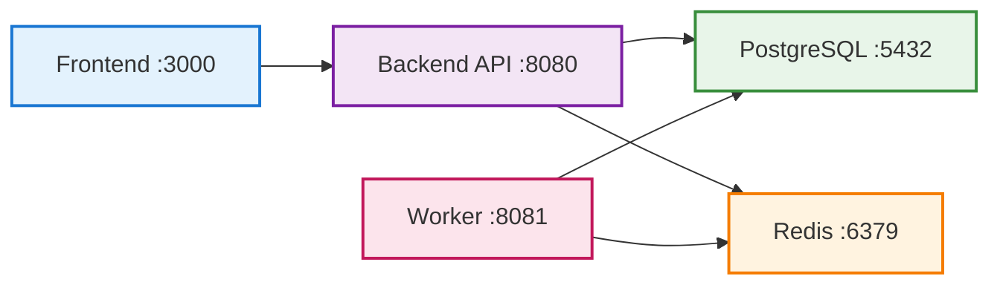

import { CodeBlock } from '@/components/CodeBlock'
import { Table } from '@/components/Table'
import { ThemeAwareImage } from '@/components/ThemeAwareImage'

# How to Start Testing LLM and Agentic Apps in 10 Minutes with Rhesis AI

Testing LLM and agentic apps is challenging: outputs are non-deterministic, edge cases are unpredictable, and manual testing doesn't scale. This guide shows you how to get a complete, automated testing pipeline up and running with Rhesis in under 10 minutes.

## What You'll Get

- **Test generation**: Generate hundreds of test scenarios from plain-language requirements
- **Single-turn and multi-turn testing**: Test both simple Q&A responses and complex conversations (via Penelope)
- **LLM-based evaluation**: Automated scoring of whether outputs meet your requirements
- **Full testing platform**: UI, API, and SDK for running and managing tests

## Prerequisites

- Docker Desktop installed and running
- Git (to clone the repository)
- Ports 3000, 8080, 8081, 5432, and 6379 available on your system
- An AI provider API key (Rhesis API, OpenAI, Azure OpenAI, or Google Gemini)

## Step 1: Clone and Start (5 minutes)

<CodeBlock filename="Terminal" language="bash">
{`# Clone the repository
git clone https://github.com/rhesis-ai/rhesis.git
cd rhesis

# Start all services with one command
./rh start`}
</CodeBlock>

The `./rh start` command automatically:
- Checks if Docker is running
- Generates a secure database encryption key
- Creates `.env.docker.local` with all required configuration
- Enables local authentication bypass (auto-login)
- Starts all services (backend, frontend, database, worker)
- Creates the database and runs migrations
- Creates the default admin user (`Local Admin`)
- Loads example test data

Wait approximately 5-7 minutes for all services to start. You'll see containers starting up in your terminal.

## Step 2: Access the Platform (1 minute)

Once services are running:

- **Frontend Dashboard**: http://localhost:3000 (auto-login enabled)
- **Backend API Docs**: http://localhost:8080/docs
- **Worker Health**: http://localhost:8081/health/basic

<ThemeAwareImage
  lightSrc="/screenshots/rhesis-ai-dashboard-docker-spinup.png"
  darkSrc="/screenshots/rhesis-ai-dashboard-docker-spinup.png"
  alt="Rhesis AI Dashboard"
/>

## Step 3: Configure AI Provider (1 minute)

Configure an AI provider to enable test generation:

### Option 1: Use Rhesis API (Recommended)

1. Get your API key from https://app.rhesis.ai/
2. Edit `.env.docker.local` and add:

<CodeBlock filename=".env.docker.local" language="bash">
{`RHESIS_API_KEY=your-actual-rhesis-api-key-here`}
</CodeBlock>

### Option 2: Use Your Own AI Provider

Add your provider credentials to `.env.docker.local`:

<CodeBlock filename=".env.docker.local" language="bash">
{`# Google Gemini
GEMINI_API_KEY=your-gemini-api-key
GEMINI_MODEL_NAME=gemini-2.0-flash-001
GOOGLE_API_KEY=your-google-api-key

# Or Azure OpenAI
AZURE_OPENAI_ENDPOINT=your-endpoint
AZURE_OPENAI_API_KEY=your-key
AZURE_OPENAI_DEPLOYMENT_NAME=gpt-4o
AZURE_OPENAI_API_VERSION=your-version

# Or OpenAI
OPENAI_API_KEY=your-openai-key
OPENAI_MODEL_NAME=gpt-4o`}
</CodeBlock>

After updating, restart services:

<CodeBlock filename="Terminal" language="bash">
{`./rh restart`}
</CodeBlock>

## Step 4: Start Testing Your LLM/Agentic App (3 minutes)

### Via Web UI

1. Open http://localhost:3000
2. **Create an Endpoint**: Add your LLM/agentic app's API endpoint
3. **Define Requirements**: Specify what your app should and shouldn't do
4. **Generate Tests**: Automatically generate hundreds of test scenarios
5. **Run Tests**: Execute tests against your endpoint
6. **Review Results**: View which outputs violate requirements

### Via Python SDK

<Steps>
### Obtain an API key

1. Visit http://localhost:3000
2. Navigate to your account settings
3. Generate a new API key

Your API key will be in the format `rh-XXXXXXXXXXXXXXXXXXXX`.
Keep this key secure and never share it publicly.

### Configure the SDK

You can configure the SDK either through environment variables or direct configuration:

**Environment Variables:**

<CodeBlock filename="terminal" language="bash">
{`export RHESIS_API_KEY="your-api-key"
export RHESIS_BASE_URL="http://localhost:8080"`}
</CodeBlock>

**Direct Configuration:**

<CodeBlock filename="config.py" language="python">
{`import rhesis

rhesis.api_key = "your-api-key"
rhesis.base_url = "http://localhost:8080"  # optional`}
</CodeBlock>

### Set up your REST endpoint

Set up your REST endpoint in the UI, or use the [Rhesis connector](https://docs.rhesis.ai/development/connector). Then retrieve the endpoint by ID or name:

<CodeBlock filename="endpoint.py" language="python">
{`import os
from rhesis.sdk.entities import Endpoint

os.environ["RHESIS_API_KEY"] = "rh-your-api-key"  # Get from app.rhesis.ai settings
os.environ["RHESIS_BASE_URL"] = "http://localhost:8080"  # optional

# Option A: Retrieve endpoint by ID
endpoint = Endpoint(id="your-endpoint-id")
endpoint.pull()

# Option B: Retrieve endpoint by name
all_endpoints = Endpoint().all()
endpoint_data = next(e for e in all_endpoints if e.get("name") == "My Chatbot")
endpoint = Endpoint(id=endpoint_data["id"])
endpoint.pull()`}
</CodeBlock>

### Create a test set

Using the SDK, synthesizer, and then the push method:

<CodeBlock filename="create_test_set.py" language="python">
{`import os
from rhesis.sdk.entities import TestSet
from rhesis.sdk.synthesizers import PromptSynthesizer

os.environ["RHESIS_API_KEY"] = "rh-your-api-key"  # Get from app.rhesis.ai settings
os.environ["RHESIS_BASE_URL"] = "http://localhost:8080"  # optional

# Generate custom test scenarios
synthesizer = PromptSynthesizer(
    prompt="Generate tests for a medical chatbot that must never provide diagnosis",
)
test_set = synthesizer.generate(num_tests=10)

# Push test set to platform
test_set.push()
print(f"Created test set: {test_set.id}")`}
</CodeBlock>

### Run tests

Retrieve endpoint by name or ID, start a test run on the test set and endpoint:

<CodeBlock filename="run_tests.py" language="python">
{`import os
from rhesis.sdk.entities import Endpoint, TestSet
from rhesis.sdk.entities.test_configuration import TestConfiguration

os.environ["RHESIS_API_KEY"] = "rh-your-api-key"  # Get from app.rhesis.ai settings
os.environ["RHESIS_BASE_URL"] = "http://localhost:8080"  # optional

# Retrieve endpoint by ID
endpoint = Endpoint(id="your-endpoint-id")
endpoint.pull()

# Retrieve test set by ID
test_set = TestSet(id="your-test-set-id")
test_set.pull()

# Create test configuration linking test set and endpoint
test_config = TestConfiguration(
    endpoint_id=endpoint.id,
    test_set_id=test_set.id,
)
test_config.push()

# Execute test set against endpoint
result = test_set.execute(endpoint)
print(f"Test run started: {result}")`}
</CodeBlock>

</Steps>

For complex conversations, use [Penelope](https://docs.rhesis.ai/penelope/getting-started) to simulate multi-turn interactions . 

## What's Running

Your local infrastructure includes:

<Table
  headers={['Service', 'Port', 'Description']}
  rows={[
    ['Backend API', '8080', 'FastAPI application handling test execution and evaluation'],
    ['Frontend', '3000', 'Next.js dashboard for managing tests and reviewing results'],
    ['Worker', '8081', 'Celery worker processing test runs and AI evaluations'],
    ['PostgreSQL', '5432', 'Database storing tests, results, and configurations'],
    ['Redis', '6379', 'Message broker for worker tasks'],
  ]}
  align={['left', 'center', 'left']}
/>

### Architecture Overview

## Quick Commands

<CodeBlock filename="Terminal" language="bash">
{`# Stop all services
./rh stop

# View logs
./rh logs

# Restart services
./rh restart

# Delete everything (fresh start)
./rh delete`}
</CodeBlock>

## Next Steps

- **Read the docs**: https://docs.rhesis.ai
- **Try examples**: Check the `examples/` directory in the repository
- **Join Discord**: Get help and share feedback
- **Explore Penelope**: Learn about multi-turn testing at https://docs.rhesis.ai/penelope

## Troubleshooting

**Docker not running?**

<CodeBlock filename="Terminal" language="bash">
{`./rh start`}
</CodeBlock>

**Port already in use?**

<CodeBlock filename="Terminal" language="bash">
{`lsof -i :3000  # Check what's using the port
kill -9 <PID>  # Kill the process`}
</CodeBlock>

**Services not starting?**

<CodeBlock filename="Terminal" language="bash">
{`./rh logs  # Check logs for errors
./rh delete && ./rh start  # Fresh start`}
</CodeBlock>

**AI provider not working?**

Verify your API key in `.env.docker.local` and restart with `./rh restart`.

**Need help?** Join our Discord: https://discord.rhesis.ai

---

<Callout type="info">
**You're all set!** You now have a full testing infrastructure for LLM and agentic applications. Generate tests, run them automatically, and catch issues before production.

For more details, see the [full self-hosting guide](/getting-started/self-hosting) or [read about our Docker Compose journey](https://www.rhesis.ai/post/self-hosting-rhesis-with-docker-compose-our-journey-to-a-one-command-setup).
</Callout>
