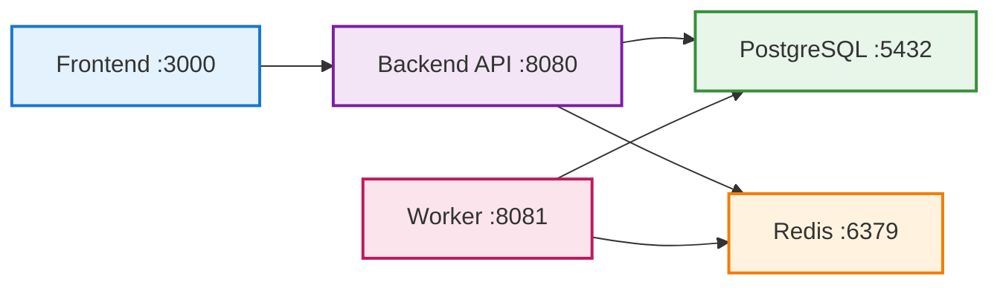

import { CodeBlock } from '@/components/CodeBlock'
import { Table } from '@/components/Table'
import { ThemeAwareImage } from '@/components/ThemeAwareImage'

# How to Start Testing LLM and Agentic Apps in 10 Minutes with Rhesis AI

Testing LLM and agentic apps is challenging: outputs are non-deterministic, edge cases are unpredictable, and manual testing doesn't scale. This guide gets a complete, automated testing pipeline running with Rhesis in under 10 minutes — self-hosted via Docker, driven from the UI or the Python SDK.

## Prerequisites

- Docker running, and ports 3000, 8080, 8081, 5432, and 6379 free
- An AI provider API key (Rhesis API, OpenAI, Azure OpenAI, or Google Gemini)

## Step 1: Clone and Start (5 minutes)

<CodeBlock filename="Terminal" language="bash">
{`git clone https://github.com/rhesis-ai/rhesis.git
cd rhesis

./rh start                # pulls prebuilt images from GHCR
# ./rh start --build      # build images locally instead`}
</CodeBlock>

`./rh start` generates local configuration, starts all services, runs migrations, seeds an admin user with auto-login, and loads example data. First run takes a few minutes while images download.

## Step 2: Access the Platform (1 minute)

Once services are running:

- **Frontend Dashboard**: http://localhost:3000 (auto-login enabled)
- **Backend API Docs**: http://localhost:8080/docs
- **Worker Health**: http://localhost:8081/health/basic

<ThemeAwareImage
  lightSrc="/screenshots/rhesis-ai-dashboard-docker-spinup.png"
  darkSrc="/screenshots/rhesis-ai-dashboard-docker-spinup.png"
  alt="Rhesis AI Dashboard"
/>

## Step 3: Configure AI Provider (1 minute)

Configure an AI provider to enable test generation:

### Option 1: Use Rhesis API (Recommended)

1. Get your API key from https://app.rhesis.ai/
2. Edit `.env.docker.local` and add:

<CodeBlock filename=".env.docker.local" language="bash">
{`RHESIS_API_KEY=your-actual-rhesis-api-key-here`}
</CodeBlock>

### Option 2: Use Your Own AI Provider

Add your provider's credentials **and set the default models** to use that provider in `.env.docker.local`:

<CodeBlock filename=".env.docker.local" language="bash">
{`# Google Gemini
GEMINI_API_KEY=your-gemini-api-key
GOOGLE_API_KEY=your-google-api-key
DEFAULT_GENERATION_MODEL=gemini/gemini-2.0-flash-001
DEFAULT_EVALUATION_MODEL=gemini/gemini-2.0-flash-001

# Or Azure OpenAI
AZURE_OPENAI_ENDPOINT=your-endpoint
AZURE_OPENAI_API_KEY=your-key
AZURE_OPENAI_DEPLOYMENT_NAME=gpt-4o
AZURE_OPENAI_API_VERSION=your-version
DEFAULT_GENERATION_MODEL=azure/gpt-4o
DEFAULT_EVALUATION_MODEL=azure/gpt-4o

# Or OpenAI
OPENAI_API_KEY=your-openai-key
DEFAULT_GENERATION_MODEL=openai/gpt-4o
DEFAULT_EVALUATION_MODEL=openai/gpt-4o`}
</CodeBlock>

After updating, restart services:

<CodeBlock filename="Terminal" language="bash">
{`./rh restart`}
</CodeBlock>

## Step 4: Start Testing Your LLM/Agentic App (3 minutes)

### Via Web UI

1. Open http://localhost:3000
2. **Create an Endpoint**: Add your LLM/agentic app's API endpoint
3. **Define Requirements**: Specify what your app should and shouldn't do
4. **Generate Tests**: Automatically generate hundreds of test scenarios
5. **Run Tests**: Execute tests against your endpoint
6. **Review Results**: View which outputs violate requirements

### Via Python SDK

<Steps>
### Installation

<CodeBlock filename="terminal" language="bash">
{`pip install rhesis-sdk`}

</CodeBlock>
### Obtain an API key

1. Visit http://localhost:3000
2. Navigate to API Tokens
3. Generate a new API key

Your API key will be in the format `rh-XXXXXXXXXXXXXXXXXXXX`.
Keep this key secure and never share it publicly.

### Configure the SDK

Point the SDK at your local instance with environment variables:

<CodeBlock filename="terminal" language="bash">
{`export RHESIS_API_KEY="your-api-key"
export RHESIS_BASE_URL="http://localhost:8080"`}
</CodeBlock>

### Set up your REST endpoint

Set up your REST endpoint in the UI, or use the [Rhesis connector](/sdk/connector). Then retrieve the endpoint by ID:

<CodeBlock filename="endpoint.py" language="python">
{`import os
from rhesis.sdk.entities import Endpoint

os.environ["RHESIS_API_KEY"] = "rh-your-api-key"  # Get from http://localhost:3000
os.environ["RHESIS_BASE_URL"] = "http://localhost:8080"

# Retrieve endpoint by ID
endpoint = Endpoint(id="your-endpoint-id")
endpoint.pull()`}
</CodeBlock>

### Create a test set

Using the SDK, synthesizer, and then the push method:

<CodeBlock filename="create_test_set.py" language="python">
{`import os
from rhesis.sdk.entities import TestSet
from rhesis.sdk.synthesizers import PromptSynthesizer

os.environ["RHESIS_API_KEY"] = "rh-your-api-key"  # Get from http://localhost:3000
os.environ["RHESIS_BASE_URL"] = "http://localhost:8080"

# Generate custom test scenarios
synthesizer = PromptSynthesizer(
    prompt="Generate tests for a medical chatbot that must never provide diagnosis",
)
test_set = synthesizer.generate(num_tests=10)

# Push test set to platform
test_set.push()
print(f"Created test set: {test_set.id}")`}
</CodeBlock>

### Run tests

Retrieve endpoint by ID, start a test run on the test set and endpoint:

<CodeBlock filename="run_tests.py" language="python">
{`import os
from rhesis.sdk.entities import Endpoint, TestSet
from rhesis.sdk.entities.test_configuration import TestConfiguration

os.environ["RHESIS_API_KEY"] = "rh-your-api-key"  # Get from http://localhost:3000
os.environ["RHESIS_BASE_URL"] = "http://localhost:8080"

# Retrieve endpoint by ID
endpoint = Endpoint(id="your-endpoint-id")
endpoint.pull()

# Retrieve test set by ID
test_set = TestSet(id="your-test-set-id")
test_set.pull()

# Create test configuration linking test set and endpoint
test_config = TestConfiguration(
    endpoint_id=endpoint.id,
    test_set_id=test_set.id,
)
test_config.push()

# Execute test set against endpoint
result = test_set.execute(endpoint)
print(f"Test run started: {result}")`}
</CodeBlock>

</Steps>

For complex conversations, use [Penelope](/docs/tests/conversation-simulation/getting-started) to simulate multi-turn interactions.

## What's Running

Your local infrastructure includes:

<Table
  headers={['Service', 'Port', 'Description']}
  rows={[
    ['Backend API', '8080', 'FastAPI application handling test execution and evaluation'],
    ['Frontend', '3000', 'Next.js dashboard for managing tests and reviewing results'],
    ['Worker', '8081', 'Celery worker processing test runs and AI evaluations'],
    ['PostgreSQL', '5432', 'Database storing tests, results, and configurations'],
    ['Redis', '6379', 'Message broker for worker tasks'],
  ]}
  align={['left', 'center', 'left']}
/>

### Architecture Overview

```mermaid
graph LR
    Frontend[Frontend :3000]
    Backend[Backend API :8080]
    Worker[Worker :8081]
    PostgreSQL[PostgreSQL :5432]
    Redis[Redis :6379]

    Frontend --> Backend
    Backend --> PostgreSQL
    Backend --> Redis
    Worker --> Redis
    Worker --> PostgreSQL

    style Frontend fill:#e3f2fd,stroke:#1976d2,stroke-width:2px
    style Backend fill:#f3e5f5,stroke:#7b1fa2,stroke-width:2px
    style Worker fill:#fce4ec,stroke:#c2185b,stroke-width:2px
    style PostgreSQL fill:#e8f5e9,stroke:#388e3c,stroke-width:2px
    style Redis fill:#fff3e0,stroke:#f57c00,stroke-width:2px
```

## Quick Commands

<CodeBlock filename="Terminal" language="bash">
{`# Stop all services
./rh stop

# View logs
./rh logs

# Restart services
./rh restart

# Restart and rebuild images from local Dockerfiles
# ./rh restart --build

# Delete everything (fresh start)
./rh delete`}
</CodeBlock>

## Next Steps

- Simulate multi-turn conversations with [Penelope](/docs/tests/conversation-simulation).
- Wire test runs into your pipeline with [CI/CD Integration](/guides/ci-cd-integration).
- Write evaluation criteria for your use case with [Custom Metrics](/guides/custom-metrics).

## Troubleshooting

- **Port already in use**: `lsof -i :3000` to find the process, then `kill -9 <PID>`.
- **Services not starting**: check `./rh logs`, or `./rh delete && ./rh start` for a clean slate.
- **AI provider not working**: verify the key in `.env.docker.local`, then `./rh restart`.

For self-hosting details beyond this quickstart, see the [Docker Compose deployment guide](/docs/deployment/docker-compose).
