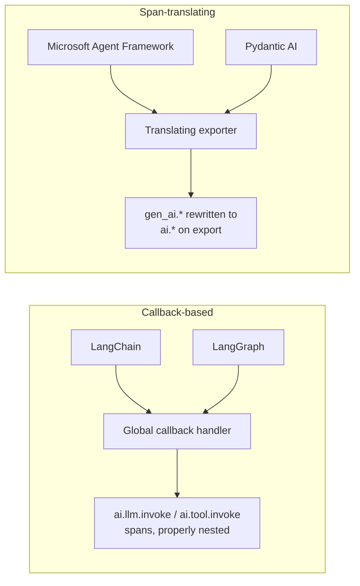

import { CodeBlock } from '@/components/CodeBlock'
import { Table } from '@/components/Table'

# Configure Telemetry: Auto-Instrumentation

Auto-instrumentation traces every LLM call, tool invocation, and chain or graph execution in supported frameworks without touching your application code. If you're building on LangChain, LangGraph, Microsoft Agent Framework, or Pydantic AI, this is the fastest path to a working trace.

## What You'll Achieve

- Traces for every LLM call, tool call, and (for LangGraph/MAF) agent/graph step
- No decorators, no manual span creation
- One line of code: `auto_instrument()`

## Prerequisites

- `RhesisClient` initialized — see [Configuring Telemetry](/guides/telemetry-configuration#prerequisites)
- The pip extra for your framework installed

## Supported Frameworks

<Table
  headers={['Framework', 'auto_instrument key', 'pip extra', 'Mechanism']}
  rows={[
    ['LangChain', '`langchain`', '`langchain`', 'Callback handler + tool patching'],
    ['LangGraph', '`langgraph`', '`langgraph`', 'Shared LangChain callback + graph method patching'],
    ['Microsoft Agent Framework', '`agent_framework` (alias `maf`)', '`agent-framework`', 'OTel span translation (gen_ai.* → ai.*)'],
    ['Pydantic AI', '`pydantic_ai`', '`pydantic-ai`', 'OTel span translation'],
  ]}
/>

Using a different framework? Auto-instrumentation won't cover it — go to [Decorators](/guides/telemetry-configuration/decorators) instead.

## Setup

<Steps>

### Install the framework extra

<CodeBlock filename="terminal" language="bash">
{`pip install "rhesis-sdk[langchain]>=0.6.0"
# or: [langgraph], [agent-framework], [pydantic-ai]`}
</CodeBlock>

### Initialize the client

<CodeBlock filename="app.py" language="python">
{`from rhesis.sdk import RhesisClient

client = RhesisClient(
    api_key="your-api-key",
    project_id="your-project-id",
)`}
</CodeBlock>

### Enable auto-instrumentation

<CodeBlock filename="app.py" language="python">
{`from rhesis.sdk.telemetry import auto_instrument

# Auto-detect every installed framework
enabled = auto_instrument()
print(f"Tracing enabled for: {enabled}")

# Or be explicit
auto_instrument("langchain", "langgraph")
auto_instrument("agent_framework")   # alias: "maf"
auto_instrument("pydantic_ai")`}
</CodeBlock>

<Callout type="info">
Call `auto_instrument()` once, right after creating `RhesisClient`, before your framework code runs. It patches the framework's entry points, so anything constructed beforehand (e.g. a chain built at import time) is still traced — the patching targets invocation, not construction.
</Callout>

### Use your framework normally

<CodeBlock filename="app.py" language="python">
{`from langchain_google_genai import ChatGoogleGenerativeAI

llm = ChatGoogleGenerativeAI(model="gemini-2.0-flash-exp")
response = llm.invoke("Explain quantum computing")
# Traced automatically — no changes to this call`}
</CodeBlock>

### Verify traces are arriving

Open the Rhesis dashboard's trace view for your project. A single `llm.invoke` call should appear as an `ai.llm.invoke` span with model name, provider, and token counts populated within a few seconds (traces flush every 5s by default).

</Steps>

## How It Works

**Callback-based (LangChain/LangGraph):** the SDK registers a global callback handler that intercepts `on_chat_model_start`, `on_tool_start`, `on_chain_start`, and equivalents, creating properly-nested Rhesis-convention spans directly. LangGraph reuses the LangChain callback rather than creating its own, so `auto_instrument("langgraph")` alone already covers chains, tools, and LLM calls invoked from graph nodes.

**Span-translating (MAF/Pydantic AI):** these frameworks already emit standard OpenTelemetry GenAI spans (`gen_ai.*`). The SDK wraps the OTLP exporter with a translating exporter that rewrites span names and attributes into the Rhesis `ai.*` schema at export time, and synthesizes `ai.agent.handoff` spans from `handoff_to_*` tool-call patterns.

## Combining with Decorators

Auto-instrumentation and `@observe`/`@endpoint` work together — the SDK deduplicates so you never get two spans for the same LLM call:

<CodeBlock filename="app.py" language="python">
{`from rhesis.sdk import RhesisClient, endpoint
from rhesis.sdk.telemetry import auto_instrument

client = RhesisClient()
auto_instrument()

@endpoint()
def chat_handler(input: str) -> dict:
    # This function traced by @endpoint as the root span
    # Internal LangChain calls traced by auto-instrumentation
    chain = prompt | llm
    return {"output": chain.invoke({"message": input})}`}
</CodeBlock>

## Disabling

<CodeBlock filename="teardown.py" language="python">
{`from rhesis.sdk.telemetry import disable_auto_instrument

disable_auto_instrument()  # turns off every previously-enabled framework`}
</CodeBlock>

<Callout type="success">
**You have working traces.** Multi-agent system? See [Multi-Agent Tracing](/docs/tracing/multi-agent). Multi-turn chat? See [Tracking Multi-Turn Conversations](/guides/telemetry-configuration#tracking-multi-turn-conversations).
</Callout>

<Callout type="info">
  **Related:**
  - [Auto-Instrumentation Reference](/docs/tracing/auto-instrumentation) — full API surface and per-framework examples
  - [Microsoft Agent Framework](/docs/tracing/agent-framework) — handoff tracing and content-capture options
  - [Configuring Telemetry](/guides/telemetry-configuration) — back to the mode overview
</Callout>
