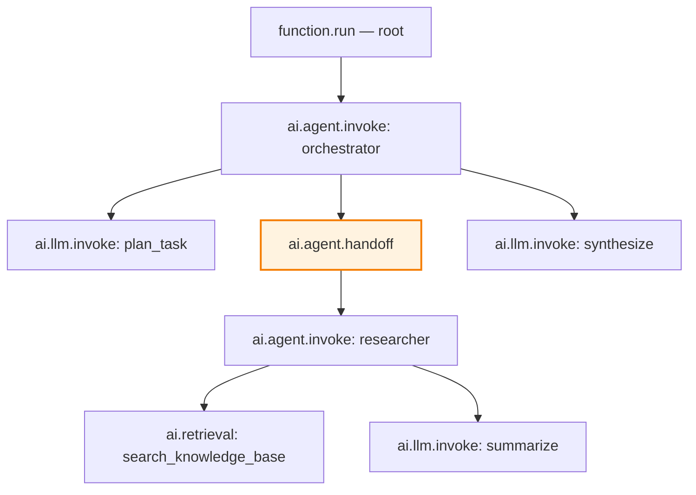

import { CodeBlock } from '@/components/CodeBlock'
import { Table } from '@/components/Table'

# Configure Telemetry: Decorators

Decorators are the sweet spot between zero-code auto-instrumentation and manual span creation. Wrap any function with `@observe` (or a typed variant) and the SDK handles span naming, I/O capture, and attribute stamping for you. Use this mode for frameworks not covered by [auto-instrumentation](/guides/telemetry-configuration/auto-instrumentation) — CrewAI, OpenAI Agents SDK, or your own hand-rolled pipeline.

## What You'll Achieve

- A traced entry point (`@endpoint`) that's also registered for remote testing
- Typed spans (`ai.llm.invoke`, `ai.tool.invoke`, `ai.retrieval`, …) around your internal functions
- Correct parent-child nesting with zero manual OpenTelemetry code

## Prerequisites

- `RhesisClient` initialized — see [Configuring Telemetry](/guides/telemetry-configuration#prerequisites)

## Setup

<Steps>

### Decorate your entry point

`@endpoint` registers the function for remote testing via the Rhesis connector and traces it as the root span:

<CodeBlock filename="app.py" language="python">
{`from rhesis.sdk import RhesisClient, endpoint

client = RhesisClient()

@endpoint()
def chat(input: str) -> dict:
    context = build_context(input)
    response = generate(input, context)
    return {"output": response}`}
</CodeBlock>

### Decorate internal steps with typed spans

Each typed decorator maps to a specific span name and stamps the matching semantic attributes:

<CodeBlock filename="app.py" language="python">
{`from rhesis.sdk import observe

@observe.retrieval(backend="chroma", top_k=5)
def build_context(query: str) -> list:
    return vectorstore.similarity_search(query, k=5)

@observe.llm(provider="anthropic", model="claude-sonnet-4-20250514")
def generate(query: str, context: list) -> str:
    return anthropic.messages.create(
        model="claude-sonnet-4-20250514",
        messages=[{"role": "user", "content": f"Context: {context}\\n\\nQuestion: {query}"}]
    ).content[0].text`}
</CodeBlock>

### Verify the trace tree

Run the endpoint once and check the dashboard. You should see:

<CodeBlock filename="trace" language="text">
{`function.chat (root)
├── ai.retrieval (build_context)
└── ai.llm.invoke (generate)`}
</CodeBlock>

</Steps>

## Typed Decorator Reference

<Table
  headers={['Decorator', 'Span Name', 'Required Params']}
  rows={[
    ['`@observe()`', '`function.<name>`', 'none'],
    ['`@observe.llm()`', '`ai.llm.invoke`', '`provider`, `model`'],
    ['`@observe.tool()`', '`ai.tool.invoke`', '`name`, `tool_type`'],
    ['`@observe.retrieval()`', '`ai.retrieval`', '`backend`'],
    ['`@observe.embedding()`', '`ai.embedding.generate`', '`model`'],
    ['`@observe.rerank()`', '`ai.rerank`', '`model`'],
    ['`@observe.agent()`', '`ai.agent.invoke`', '`name`'],
    ['`@observe.evaluation()`', '`ai.evaluation`', '`metric`, `evaluator`'],
    ['`@observe.guardrail()`', '`ai.guardrail`', '`guardrail_type`, `provider`'],
    ['`@observe.transform()`', '`ai.transform`', '`transform_type`, `operation`'],
    ['`@endpoint()`', '`function.<name>`', 'none'],
  ]}
/>

## Multi-Agent Example

Agent handoffs are ordinary nested spans plus an explicit `ai.agent.handoff` span:

<CodeBlock filename="agents.py" language="python">
{`from rhesis.sdk import observe, endpoint
from opentelemetry import trace

tracer = trace.get_tracer("multi-agent")

@endpoint()
def run(task: str) -> dict:
    return orchestrator(task)

@observe.agent(name="orchestrator")
def orchestrator(task: str) -> dict:
    plan = plan_task(task)

    if plan["needs_research"]:
        with tracer.start_as_current_span("ai.agent.handoff") as span:
            span.set_attribute("ai.agent.handoff.from", "orchestrator")
            span.set_attribute("ai.agent.handoff.to", "researcher")
            research = researcher(plan["research_query"])
    else:
        research = None

    return synthesize(task, plan, research)

@observe.agent(name="researcher")
def researcher(query: str) -> dict:
    docs = search_knowledge_base(query)
    return {"docs": docs, "summary": summarize(query, docs)}`}
</CodeBlock>

For frameworks with native handoff support, see [Multi-Agent Tracing](/docs/tracing/multi-agent).

## Tracking Multi-Turn Conversations

If you're instrumenting a custom chat server (not using `@endpoint`'s automatic `session_id` handling), manage conversation context explicitly so turns are grouped into one trace:

<CodeBlock filename="chat_server.py" language="python">
{`from rhesis.sdk import observe
from rhesis.sdk.telemetry.context import (
    set_conversation_id,
    set_conversation_trace_id,
    set_conversation_mapped_input,
    get_root_trace_id,
    set_root_trace_id,
)

sessions = {}  # session_id -> trace_id

@observe()
def handle_message(session_id: str, user_message: str) -> str:
    set_conversation_id(session_id)
    set_conversation_mapped_input(user_message)

    if session_id in sessions:
        set_conversation_trace_id(sessions[session_id])

    try:
        return generate_response(user_message, session_id)
    finally:
        trace_id = get_root_trace_id()
        if trace_id and session_id not in sessions:
            sessions[session_id] = trace_id

        set_conversation_id(None)
        set_conversation_trace_id(None)
        set_conversation_mapped_input(None)
        set_root_trace_id(None)`}
</CodeBlock>

<Callout type="tip">
Prefer `@endpoint()` with a returned `session_id` field when you can — the Rhesis connector manages this context for you automatically. Manual context management is only needed for custom chat servers outside the connector.
</Callout>

## Combining with Auto-Instrumentation

<CodeBlock filename="app.py" language="python">
{`from rhesis.sdk import RhesisClient, endpoint
from rhesis.sdk.telemetry import auto_instrument

client = RhesisClient()
auto_instrument("langchain")

@endpoint()
def chat(input: str) -> dict:
    # This function traced by @endpoint
    # Internal LangChain LLM/tool calls traced by auto-instrumentation
    chain = prompt | llm | output_parser
    return {"output": chain.invoke({"message": input})}`}
</CodeBlock>

The SDK deduplicates automatically — `@observe.llm()` sets a context flag that tells the auto-instrumentation callback to skip creating a duplicate span for the same call.

<Callout type="success">
**You have working traces.** Need finer control over attributes or events than the typed decorators expose? See [Raw OpenTelemetry](/guides/telemetry-configuration/raw-opentelemetry).
</Callout>

<Callout type="info">
  **Related:**
  - [Decorators Reference](/docs/tracing/decorators) — full `@observe` and `@endpoint` API
  - [Conversation Tracing](/docs/tracing/conversation-tracing) — deep reference on turn management
  - [Configuring Telemetry](/guides/telemetry-configuration) — back to the mode overview
</Callout>
