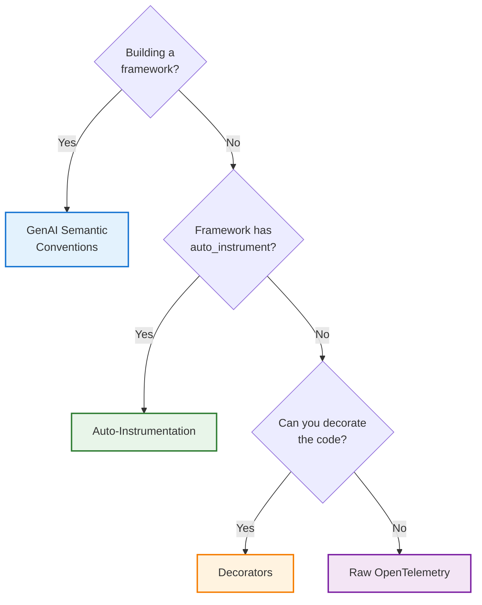

import { CodeBlock } from '@/components/CodeBlock'
import { NextStepCard, NextStepCardGrid } from '@/components/NextStepCard'

# Configuring Telemetry for Your AI Application

Rhesis traces every LLM call, tool invocation, retrieval, and agent handoff your application makes, then renders them as a navigable trace tree in the dashboard. This guide helps you pick the right way to wire that up and points you to a focused subguide for each mode.

## Prerequisites

Every mode below builds on the same client initialization:

<CodeBlock filename="app.py" language="python">
{`from rhesis.sdk import RhesisClient

client = RhesisClient(
    api_key="your-api-key",
    project_id="your-project-id",
    environment="development",
)`}
</CodeBlock>

Or via environment variables, so `RhesisClient()` needs no arguments:

<CodeBlock filename="terminal" language="bash">
{`export RHESIS_API_KEY="your-api-key"
export RHESIS_PROJECT_ID="your-project-id"
export RHESIS_ENVIRONMENT="development"`}
</CodeBlock>

Initializing `RhesisClient` wires up the full export pipeline behind the scenes: see [How Telemetry Flows](#how-telemetry-flows) below.

<Callout type="info">
Already using the SDK to run tests? `RhesisClient()` is likely initialized somewhere already. You do not need a second instance for telemetry; the same client wires up tracing.
</Callout>

## Which Mode Fits Your Stack?

The table below has the full detail (which frameworks, which code changes); the diagram only needs to carry the decision logic.

| Mode | Best for | Code changes | Guide |
|---|---|---|---|
| **Auto-instrumentation** | LangChain, LangGraph, Microsoft Agent Framework, Pydantic AI apps | None | [Auto-Instrumentation](/guides/telemetry-configuration/auto-instrumentation) |
| **Decorators** | Custom code, unsupported frameworks (CrewAI, OpenAI Agents SDK, …) | Add `@observe` / `@endpoint` | [Decorators](/guides/telemetry-configuration/decorators) |
| **Raw OpenTelemetry** | Third-party code you can't decorate, or full control over span attributes | Manual span creation | [Raw OpenTelemetry](/guides/telemetry-configuration/raw-opentelemetry) |
| **GenAI semantic conventions** | Framework/runtime authors who want backend-neutral telemetry | Emit `gen_ai.*` spans | [GenAI Semantic Conventions](/guides/telemetry-configuration/genai-conventions) |

<Callout type="tip">
These modes compose. Most real applications mix at least two: for example `auto_instrument("langchain")` for the framework layer plus `@observe.guardrail()` around a hand-rolled safety check.
</Callout>

## How Telemetry Flows

Regardless of which mode you pick, every span ends up funneled through the same pipeline:

<Mermaid chart={`flowchart LR
    App["Your application (spans)"] --> BSP["BatchSpanProcessor (queue: 2048, batch: 512, flush: 5s)"]
    BSP --> Exp["RhesisOTLPExporter (JSON over HTTP, authenticated)"]
    Exp --> API["POST /telemetry/traces"]
    API --> UI["Rhesis Dashboard"]`} />

`RhesisClient()` creates this pipeline once as a process-wide singleton (`get_tracer_provider()`), registers it as the global OpenTelemetry `TracerProvider`, and every `trace.get_tracer(...)` call afterward feeds into it automatically. You only need to set this up manually if you skip `RhesisClient()` entirely: see [Raw OpenTelemetry](/guides/telemetry-configuration/raw-opentelemetry#the-export-pipeline).

## Tracking Multi-Turn Conversations

Single-shot calls need no extra configuration: each gets its own trace. Chat and agent applications that span multiple turns need two additional pieces of context so the dashboard groups turns into one conversation:

- **`conversation_id`**: a stable identifier shared across turns (your session ID)
- **`conversation_trace_id`**: the shared `trace_id` all turns reuse, so the whole conversation renders as a single trace with turn markers

The easiest path is returning a `session_id` from an `@endpoint`-decorated function: the Rhesis connector manages trace continuity for you automatically. Manual context management (for `@observe` or raw OTel) is covered in each subguide's conversation section. For the full reference, see [Conversation Tracing](/docs/tracing/conversation-tracing).

## Next Steps

<NextStepCardGrid>
  <NextStepCard
    emoji="⚡"
    title="Auto-Instrumentation"
    description="Zero-code tracing for LangChain, LangGraph, Microsoft Agent Framework, and Pydantic AI."
    link="/guides/telemetry-configuration/auto-instrumentation"
    linkText="Set up auto-instrumentation →"
  />
  <NextStepCard
    emoji="🎯"
    title="Decorators"
    description="Trace custom code and unsupported frameworks with @observe and @endpoint."
    link="/guides/telemetry-configuration/decorators"
    linkText="Set up decorators →"
  />
  <NextStepCard
    emoji="🔧"
    title="Raw OpenTelemetry"
    description="Full control over span creation for third-party code and advanced cases."
    link="/guides/telemetry-configuration/raw-opentelemetry"
    linkText="Set up raw OpenTelemetry →"
  />
  <NextStepCard
    emoji="📡"
    title="GenAI Semantic Conventions"
    description="Building a framework? Emit spec-native spans Rhesis translates automatically."
    link="/guides/telemetry-configuration/genai-conventions"
    linkText="Implement the spec →"
  />
</NextStepCardGrid>

<Callout type="info">
  **Related:**
  - [Tracing Overview](/docs/tracing) - concepts and terminology
  - [Multi-Agent Tracing](/docs/tracing/multi-agent) - agent and handoff spans
  - [Semantic Conventions Reference](/docs/tracing/semantic-conventions) - full `ai.*` attribute reference
</Callout>
