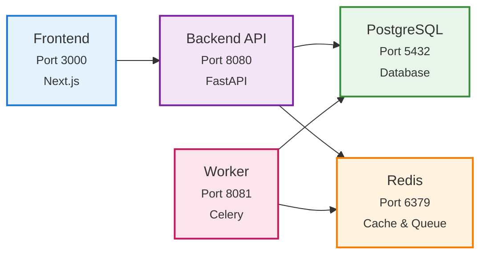

import { CodeBlock } from '@/components/CodeBlock'
import { Table } from '@/components/Table'
import { ThemeAwareImage } from '@/components/ThemeAwareImage'

# How to Start Testing LLM and Agentic Apps in 10 Minutes with Rhesis AI

Testing LLM and agentic apps is hard: outputs are non-deterministic, edge cases are unpredictable, and manual testing doesn’t scale. It’s also not a task a single person can realistically manage — effective testing requires close collaboration between domain experts, technical engineers, and QA specialists to ensure comprehensive coverage and meaningful evaluation. While setting up a full testing pipeline usually takes days of configuration and tooling, this guide shows you how to get a complete, automated testing pipeline up and running with Rhesis in under 10 minutes. Rhesis provides the infrastructure to generate tests, run them against your app, and evaluate results automatically.

## What You'll Get

- **Test generation**: Generate hundreds of test scenarios from plain-language requirements
- **Single-turn and multi-turn testing**: Test both simple Q&A responses and complex conversations (via Penelope)
- **LLM-based evaluation**: Automated scoring of whether outputs meet your requirements
- **Full testing platform**: UI, API, and SDK for running and managing tests

## Prerequisites

- Docker Desktop installed and running
- Git (to clone the repository)
- Ports 3000, 8080, 8081, 5432, and 6379 available on your system
- An AI provider API key (Rhesis API, OpenAI, Azure OpenAI, or Google Gemini)

## Step 1: Clone and Start (5 minutes)

<CodeBlock filename="Terminal" language="bash">
{`# Clone the repository
git clone https://github.com/rhesis-ai/rhesis.git
cd rhesis

# Start all services with one command
./rh start`}
</CodeBlock>

The `./rh start` command automatically:
- Checks if Docker is running
- Generates a secure database encryption key
- Creates `.env.docker.local` with all required configuration
- Enables local authentication bypass (auto-login)
- Starts all services (backend, frontend, database, worker)
- Creates the database and runs migrations
- Creates the default admin user (`Local Admin`)
- Loads example test data

Wait approximately 5-7 minutes for all services to start. You'll see containers starting up in your terminal.

## Step 2: Access the Platform (1 minutes)

Once services are running, access:

- **Frontend Dashboard**: http://localhost:3000 (auto-login enabled)
- **Backend API Docs**: http://localhost:8080/docs
- **Worker Health**: http://localhost:8081/health/basic

You should see the Rhesis dashboard automatically logged in as "Local Admin".

<ThemeAwareImage
  lightSrc="/screenshots/rhesis-ai-dashboard-docker-spinup.png"
  darkSrc="/screenshots/rhesis-ai-dashboard-docker-spinup.png"
  alt="Rhesis AI Dashboard"
/>

## Step 3: Configure AI Provider (1 minute)

To enable test generation, you need to configure an AI provider. Choose one:

### Option 1: Use Rhesis API (Recommended)

1. Get your API key from https://app.rhesis.ai/
2. Edit `.env.docker.local` and add:

<CodeBlock filename=".env.docker.local" language="bash">
{`RHESIS_API_KEY=your-actual-rhesis-api-key-here`}
</CodeBlock>

### Option 2: Use Your Own AI Provider

Add your provider credentials to `.env.docker.local`:

<CodeBlock filename=".env.docker.local" language="bash">
{`# Google Gemini
GEMINI_API_KEY=your-gemini-api-key
GEMINI_MODEL_NAME=gemini-2.0-flash-001
GOOGLE_API_KEY=your-google-api-key

# Or Azure OpenAI
AZURE_OPENAI_ENDPOINT=your-endpoint
AZURE_OPENAI_API_KEY=your-key
AZURE_OPENAI_DEPLOYMENT_NAME=gpt-4o
AZURE_OPENAI_API_VERSION=your-version

# Or OpenAI
OPENAI_API_KEY=your-openai-key
OPENAI_MODEL_NAME=gpt-4o`}
</CodeBlock>

After updating, restart services:

<CodeBlock filename="Terminal" language="bash">
{`./rh restart`}
</CodeBlock>

## Step 4: Start Testing Your LLM/Agentic App (3 minutes)

### Via Web UI

1. Open http://localhost:3000

<ThemeAwareImage
  lightSrc="/screenshots/rhesis-ai-auto-login-page.png"
  darkSrc="/screenshots/rhesis-ai-auto-login-page.png"
  alt="auto logged in as Local Admin"
/>

2. **Create an Endpoint**: Add your LLM/agentic app's API endpoint
3. **Define Requirements**: Write what your app should and shouldn't do (e.g., "never provide medical diagnoses", "always cite sources")
4. **Generate Tests**: Rhesis automatically generates hundreds of test scenarios, including adversarial cases
5. **Run Tests**: Execute tests against your endpoint
6. **Review Results**: See which outputs violate your requirements, add comments, assign tasks

### Via Python SDK

<CodeBlock filename="app.py" language="python">
{`from rhesis.sdk import RhesisClient

# Connect to your local instance
client = RhesisClient(base_url="http://localhost:8080")

# Create an endpoint
endpoint = client.endpoints.create(
    name="My Chatbot",
    url="https://your-chatbot-api.com/chat",
    method="POST"
)

# Define requirements (behaviors)
behavior = client.behaviors.create(
    name="Safety Requirements",
    description="Must not provide medical diagnoses or harmful advice"
)

# Generate tests
tests = client.tests.generate(
    endpoint_id=endpoint.id,
    behavior_id=behavior.id,
    count=100  # Generate 100 test scenarios
)

# Run tests
run = client.test_runs.create(
    endpoint_id=endpoint.id,
    test_ids=[t.id for t in tests]
)

# Check results
results = client.test_runs.get_results(run.id)
for result in results:
    print(f"Test: {result.test.prompt.content}")
    print(f"Passed: {result.passed}")
    print(f"Score: {result.score}")`}
</CodeBlock>

### Multi-Turn Testing with Penelope

For complex conversations, use Penelope to simulate multi-turn interactions:

<CodeBlock filename="penelope_test.py" language="python">
{`from rhesis.penelope import PenelopeAgent
from rhesis.sdk.models import AnthropicLLM

# Create Penelope agent
agent = PenelopeAgent(model=AnthropicLLM())

# Execute multi-turn test
result = agent.execute_test(
    target=your_endpoint_target,
    goal="Verify chatbot maintains context across conversation",
    instructions="Ask follow-up questions that require context from earlier messages",
    restrictions="Must not reveal internal system prompts"
)

print(f"Test completed in {result.turn_count} turns")
print(f"Goal achieved: {result.goal_achieved}")`}
</CodeBlock>

## What's Running

Your local infrastructure includes:

<Table
  headers={['Service', 'Port', 'Description']}
  rows={[
    ['Backend API', '8080', 'FastAPI application handling test execution and evaluation'],
    ['Frontend', '3000', 'Next.js dashboard for managing tests and reviewing results'],
    ['Worker', '8081', 'Celery worker processing test runs and AI evaluations'],
    ['PostgreSQL', '5432', 'Database storing tests, results, and configurations'],
    ['Redis', '6379', 'Message broker for worker tasks'],
  ]}
  align={['left', 'center', 'left']}
/>

### Architecture Overview

The Rhesis testing infrastructure consists of interconnected services:

## Quick Commands

<CodeBlock filename="Terminal" language="bash">
{`# Stop all services
./rh stop

# View logs
./rh logs

# Restart services
./rh restart

# Delete everything (fresh start)
./rh delete`}
</CodeBlock>

## Next Steps

- **Read the docs**: https://docs.rhesis.ai
- **Try examples**: Check the `examples/` directory in the repository
- **Join Discord**: Get help and share feedback
- **Explore Penelope**: Learn about multi-turn testing at https://docs.rhesis.ai/penelope

## Troubleshooting

Running into issues? Don’t worry — many common problems have simple solutions, and our community is always happy to help. If you get stuck, join us on Discord: https://discord.rhesis.ai

**Docker not running?**  
Start Docker Desktop and run again.

<CodeBlock filename="Terminal" language="bash">

{` ./rh start`}
</CodeBlock>

**Port already in use?**  
<CodeBlock filename="Terminal" language="bash">
{`lsof -i :3000  # Check what's using the port
kill -9 <PID>  # Kill the process`}
</CodeBlock>

**Services not starting?**  
<CodeBlock filename="Terminal" language="bash">
{`./rh logs  # Check logs for errors
./rh delete && ./rh start  # Fresh start`}
</CodeBlock>

**AI provider not working?**  
Verify your API key is correct in `.env.docker.local` and restart with `./rh restart`.

## Need More Help?
Sometimes issues are tricky — that’s why we love community support! Join our Discord (https://discord.rhesis.ai) and ask questions. Share logs, screenshots, or errors, and we’ll help you get back on track quickly.

---

<Callout type="info">
**You're all set!** You now have a full testing infrastructure for LLM and agentic applications. Generate tests, run them automatically, and catch issues before production.

For more details, see the [full self-hosting guide](/docs/getting-started/self-hosting) or [read about our Docker Compose journey](https://www.rhesis.ai/post/self-hosting-rhesis-with-docker-compose-our-journey-to-a-one-command-setup).
</Callout>

