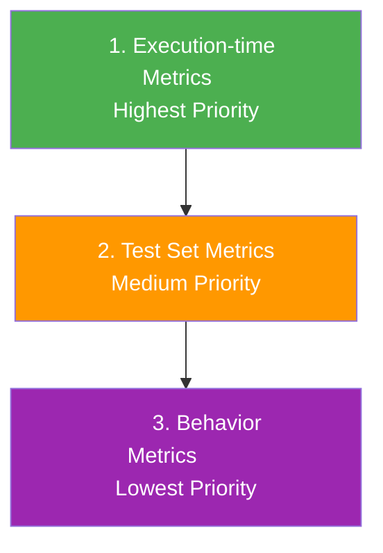

# Test Execution

Execute test sets against your AI endpoints to evaluate model performance, safety, and reliability. This guide explains the different configuration options available when running tests.

<Callout type="default">
  **What is Test Execution?** Test execution is the process of running a test set against an endpoint to evaluate your AI system. Each execution creates a test run containing all individual test results with detailed metrics and evaluation data.
</Callout>

## Execution Overview

When you execute a test set, Rhesis:

1. Sends each test prompt to your configured endpoint
2. Captures the model's response
3. Evaluates responses against configured metrics
4. Records results in a test run for analysis

## Starting a Test Execution

To execute a test set:

1. Navigate to **Test Sets** in the sidebar
2. Select the test set you want to execute
3. Click the **Execute Test Set** button
4. Configure execution options in the drawer
5. Click **Execute Test Set** to start

## Execution Target

The execution target defines where your tests will run.

### Project

Select the project containing your endpoint configuration. Projects organize related endpoints and their settings.

### Endpoint

Choose the specific endpoint to test against. The endpoint defines:

- The AI model or service URL
- Authentication credentials
- Request/response formatting
- Rate limiting settings

<Callout type="info">
  Only endpoints from the selected project are shown in the dropdown. Create endpoints in the **Endpoints** section before executing tests.
</Callout>

## Configuration Options

### Execution Mode

Choose how tests are processed:

| Mode | Description | Best For |
|------|-------------|----------|
| **Parallel** | Tests run simultaneously for faster execution | Large test sets, CI/CD pipelines |
| **Sequential** | Tests run one after another | Rate-limited APIs, debugging |

## Test Run Metrics

Metrics define how test responses are evaluated. Rhesis supports a flexible hierarchy that allows you to configure metrics at different levels.

### Metrics Sources

When executing a test set, you can choose from three metrics sources:

| Source | Description |
|--------|-------------|
| **Behavior Metrics** | Use default metrics defined on each test's behavior. This is the standard configuration. |
| **Test Set Metrics** | Use metrics configured on the test set. Overrides behavior-level defaults. |
| **Custom Metrics** | Define specific metrics for this execution only. Completely overrides other levels. |

Rhesis resolves which metrics to use based on a priority hierarchy. When a test execution starts, the system checks for metrics at each level in order, using the first level that has metrics configured.

The priority order ensures maximum flexibility: you can define sensible defaults at the behavior level, customize them for specific test sets, and still override everything for individual executions when needed.

<Callout type="warning">
  There is no merging between levels. If execution-time metrics are specified, they completely replace test set and behavior metrics.
</Callout>

### Defining Custom Metrics

To use custom metrics for a single execution:

1. In the **Metrics Source** dropdown, select **Custom Metrics**
2. Click **Add Metric** to open the metric selection dialog
3. Select the metrics you want to use
4. Only metrics applicable to your test set type (Single-Turn or Multi-Turn) are shown

<Callout type="info">
  Custom execution-time metrics are not saved to the test set. They only apply to the current test run.
</Callout>

### When to Use Each Level

| Level | Use Case |
|-------|----------|
| **Behavior Metrics** | Standard testing with default evaluation criteria per behavior type |
| **Test Set Metrics** | Specialized test sets like Garak security tests with custom detectors |
| **Execution-time Metrics** | Quick experiments, A/B testing evaluation criteria, one-off validations |

## Test Run Tags

Add tags to organize and filter test runs:

- Type tag names and press Enter or comma to add
- Tags help categorize runs by purpose, sprint, or feature
- Filter test runs by tags in the Test Runs overview

## Re-running Tests

You can re-run a test from the test run detail view:

1. Navigate to **Test Runs** and select a test run
2. Click the **Re-run** button
3. The re-run drawer opens with pre-filled settings:
   - Project, endpoint, and test set are fixed
   - Metrics source defaults to what the original run used
   - You can modify metrics source and tags
4. Click **Re-run Test** to start a new execution

<Callout type="default">
  Re-running creates a new test run with the same test set and endpoint. This is useful for regression testing or validating fixes.
</Callout>

## Best Practices

### Choosing Metrics

- **Start with behavior defaults**: Let behavior metrics provide consistent evaluation across test sets
- **Use test set metrics for specialization**: Configure metrics on test sets with specific requirements
- **Use execution-time metrics sparingly**: Best for experiments, not production workflows

### Organizing Test Runs

- **Use meaningful tags**: Tag runs with sprint names, feature branches, or experiment IDs
- **Compare against baselines**: Regularly compare new runs against established baselines
- **Review failed tests**: Don't just look at pass rates - review individual failures

### Performance Considerations

- **Use parallel mode** for large test sets (100+ tests)
- **Use sequential mode** when debugging or with rate-limited APIs
- **Monitor endpoint health** during execution

---

<Callout type="default">
  **Related Pages**
  - [Test Sets](/platform/test-sets) - Create and manage test collections
  - [Test Runs](/platform/test-runs) - View and analyze execution results
  - [Endpoints](/platform/endpoints) - Configure AI endpoints
  - [Metrics](/platform/metrics) - Define evaluation criteria
</Callout>
