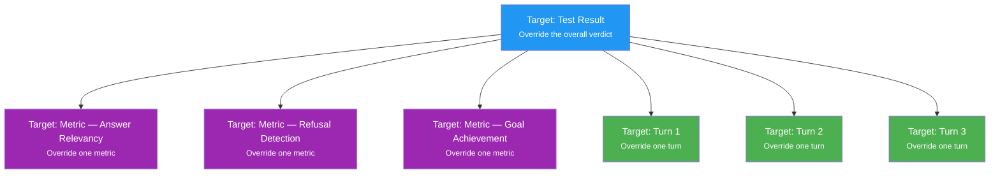

# Test Reviews

Override automated test evaluations with human judgement. When a test run produces results you disagree with, reviews let you correct them at the target that matters — the overall result, a specific metric, or an individual conversation turn.

<Callout type="default">
  **What are Test Reviews?** A test review is a human judgement that overrides the automated pass/fail verdict for a test result. The original automated outcome is kept for reference, so you always know what the system scored before a human weighed in.
</Callout>

## Why Use Reviews

Automated metrics are a strong signal, but they are not infallible. A model response might be technically correct but stylistically wrong for your brand, or a refusal that looks like a failure might actually be the right behavior in a specific context.

Reviews let you:

- Correct automated verdicts that missed important context
- Document the reasoning behind a human judgement for your team
- Distinguish between automated and human-verified results at a glance
- Work at the right target of granularity — overall, per metric, or per turn

When you submit a review, it becomes the effective verdict for that test result. The original automated result is preserved alongside it so you always have a record of what the system scored before human input.

## Review Targets

When adding a review, you choose a **target** — the part of the test result the review applies to. There are three targets available.

### Test Result Target

The broadest target. A test result review applies a single Pass or Fail verdict to the entire test outcome.

Use this when you want to mark a test as passing or failing overall, without commenting on individual metrics or turns. This is the most common review target and suitable for quick assessments.

### Metric Target

A metric review targets one specific evaluation criterion within a test result. For example, if a result failed on "Answer Relevancy" but you believe the response was actually relevant, you can override that metric in isolation without affecting any other metrics.

Use this when you agree with most of the automated evaluation but want to correct a specific metric that was scored incorrectly.

### Turn Target

Available for multi-turn tests only. A turn review targets a single conversation turn within a multi-turn test result. Each turn in a conversation can receive its own Pass or Fail verdict independently of the others.

Use this when a multi-turn conversation contains a mix of good and poor turns, and you want to record precise feedback at the turn target rather than painting the whole result with one verdict.

---

## Adding a Review

### Reviewing a Test Result

1. Open a **Test Run** from the [Test Runs](/platform/test-runs) page
2. Find the test result you want to review and click on it
3. In the test detail view, under **Reviews**, click **Add Review**
4. Select **Pass** or **Fail** as the verdict
5. Add a comment explaining your decision
6. Click **Save**

The test result will immediately reflect your review verdict. The original automated result is kept for reference and visible in the detail panel.

### Reviewing a Specific Metric

1. Open a test result detail
2. Navigate to the **Metrics** tab
3. Locate the metric you want to override
4. Click the **Review** icon on the metric row in the grid — this opens a review modal
5. Select **Pass** or **Fail**
6. Optionally type `@` in your comment and select a metric from the suggestions to reference it
7. Click **Save**

Your review applies only to that metric target. Other metrics retain their automated verdicts.

### Reviewing a Conversation Turn

1. Open a multi-turn test result
2. Navigate to the **Conversation** tab
3. Each turn shows its automated Pass or Fail label
4. Click the **Review** icon on the turn you want to assess — this opens a review modal
5. Select **Pass** or **Fail**
6. Add a comment — type `@` to select a specific turn from the suggestions picker
7. Click **Save**

Turn target reviews let you capture fine-grained feedback on exactly where a multi-turn conversation succeeded or fell short.

---

## Updating and Removing Reviews

To update an existing review, open the test result detail and click the edit icon on the review. You can change the verdict, update the comment, or both. The original automated result remains on record regardless of how the review changes.

To remove a review, click the delete icon on the review. Removing a review restores the display to show the original automated result. All other reviews on the same test result remain unchanged.

---

## Review Indicators

After a review is added, the platform shows clear visual indicators so you can tell at a glance which results have human feedback:

- A green **Confirmed** chip (with a checkmark icon) appears next to the status on any test result that has been reviewed
- The status chip updates to reflect the human verdict — the original automated result is still visible in the detail panel for comparison
- In the **Metrics** tab, reviewed metric rows are highlighted and display the overridden status alongside the automated score
- In the **Conversation** tab, reviewed turn rows show the human verdict next to the automated turn result
- A review icon on each metric and turn row lets you open the review drawer directly from the list

---

## Tips

- Use the **metric target** when the automated scoring of a specific criterion is wrong, but the overall evaluation is mostly correct.
- Use the **turn target** in multi-turn tests to pinpoint exactly which step in a conversation went wrong.
- Always add a **comment** to your review. It creates an audit trail and helps teammates understand why the verdict was changed.
- Reviews are per-user and timestamped. If multiple team members review the same result, each review is stored and attributed to its author.

---

<Callout type="default">
  **Next Steps** - Run a test set from [Test Execution](/platform/test-execution) - Explore results in [Test Runs](/platform/test-runs) - Learn how metrics are configured in [Metrics](/platform/metrics)
</Callout>
