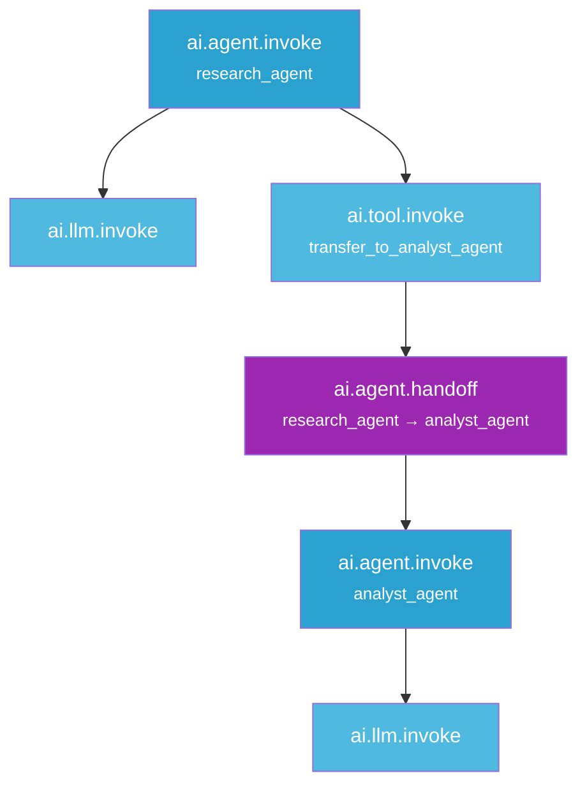

import { CodeBlock } from "@/components/CodeBlock";

# Multi-Agent Tracing

Multi-agent tracing captures how agents in a system interact — which agent ran, what it received and produced, and when control passed from one agent to another. Each agent becomes a distinct span in the trace, with handoffs recorded as first-class events.

<YouTubeEmbed videoId="KWnFfA-K2YA" />

## Quick Start

Add one call at application startup:

<CodeBlock filename="app.py" language="python">
{`from rhesis.sdk import RhesisClient
from rhesis.sdk.telemetry import auto_instrument

client = RhesisClient(
    api_key="your-api-key",
    project_id="your-project-id",
)

auto_instrument("langgraph")  # patches all graph.invoke / astream calls`}
</CodeBlock>

After this, every `graph.invoke()`, `graph.ainvoke()`, `graph.stream()`, and `graph.astream()` call is automatically traced. No changes to your graph code are required.

## Agent Detection

Not every LangGraph node becomes an agent span. A node is treated as an agent if its name contains one of the following keywords (case-insensitive):

| Keyword | Example node name |
|---|---|
| `agent` | `research_agent`, `agent_node` |
| `specialist` | `billing_specialist` |
| `orchestrator` | `main_orchestrator` |
| `coordinator` | `task_coordinator` |
| `supervisor` | `supervisor` |

Nodes that don't match any keyword are traced as regular spans (LLM calls, tool invocations, etc.) but do not produce `ai.agent.invoke` spans.

### Explicit Agent Marking

If your node name doesn't follow the keyword convention, you can mark it explicitly via metadata:

<CodeBlock filename="app.py" language="python">
{`# Option 1: set agent_name in metadata — also controls the display name
result = graph.invoke(state, config={"metadata": {"agent_name": "researcher"}})

# Option 2: set is_agent=True if the name doesn't match the keywords
result = graph.invoke(state, config={"metadata": {"is_agent": True}})`}
</CodeBlock>

## Handoffs

A handoff span (`ai.agent.handoff`) records when control passes from one agent to another. Two mechanisms detect handoffs automatically.

### Explicit: `transfer_to_*` tool naming

Name any handoff tool with the `transfer_to_` prefix. The target agent is parsed directly from the tool name:

<CodeBlock filename="app.py" language="python">
{`from langchain_core.tools import tool

@tool
def transfer_to_billing_specialist(context: str) -> str:
    """Transfer to the billing specialist agent."""
    ...`}
</CodeBlock>

This produces a span with `ai.agent.handoff.from = <current agent>` and `ai.agent.handoff.to = "billing_specialist"`.

### Implicit: sequential agent detection

When one agent finishes and a different agent starts immediately after, a handoff span is created automatically between them — no tool naming convention required. The span is a point-in-time event with the same `from` / `to` attributes.

## Complete Example

<CodeBlock filename="multi_agent.py" language="python">
{`from rhesis.sdk import RhesisClient
from rhesis.sdk.telemetry import auto_instrument
from langgraph.graph import StateGraph, START, END
from langchain_core.tools import tool
from typing_extensions import TypedDict, Annotated
from langgraph.graph.message import add_messages

client = RhesisClient(api_key="your-api-key", project_id="your-project-id")
auto_instrument("langgraph")

class State(TypedDict):
    messages: Annotated[list, add_messages]

@tool
def transfer_to_analyst_agent(summary: str) -> str:
    """Hand off research findings to the analyst."""
    return summary

def research_agent(state: State):
    # Traced as ai.agent.invoke (name contains "agent")
    response = llm.invoke(state["messages"])
    return {"messages": [response]}

def analyst_agent(state: State):
    # Traced as ai.agent.invoke (name contains "agent")
    response = llm.invoke(state["messages"])
    return {"messages": [response]}

workflow = StateGraph(State)
workflow.add_node("research_agent", research_agent)
workflow.add_node("analyst_agent", analyst_agent)
workflow.add_edge(START, "research_agent")
workflow.add_edge("research_agent", "analyst_agent")
workflow.add_edge("analyst_agent", END)

app = workflow.compile()
result = app.invoke({"messages": ["Summarize recent AI research"]})`}
</CodeBlock>

This produces a trace with:

## Span Reference

### `ai.agent.invoke`

| Attribute | Key | Description |
|---|---|---|
| Operation type | `ai.operation.type` | `agent.invoke` |
| Agent name | `ai.agent.name` | Node name or explicit `agent_name` metadata |
| Event: input | `ai.agent.input` | Last human message or full input |
| Event: output | `ai.agent.output` | Last AI message or tool call names |

### `ai.agent.handoff`

| Attribute | Key | Description |
|---|---|---|
| Operation type | `ai.operation.type` | `agent.handoff` |
| From agent | `ai.agent.handoff.from` | Agent initiating the handoff |
| To agent | `ai.agent.handoff.to` | Agent receiving control |

See [Semantic Conventions](/tracing/semantic-conventions#agent-operations) for the full attribute reference.

---

<Callout type="info">
  **Related:** [Auto-Instrumentation](/tracing/auto-instrumentation) — zero-config tracing for LangChain and LangGraph
</Callout>
