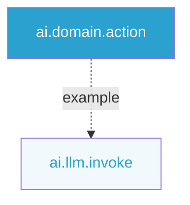
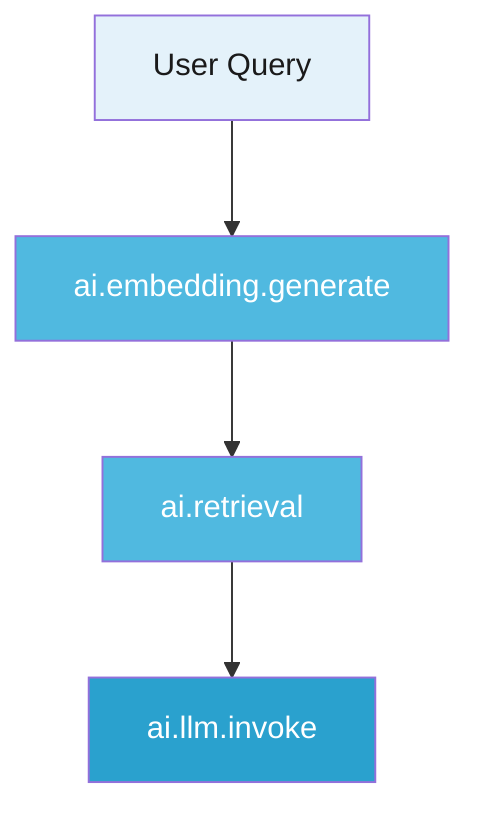
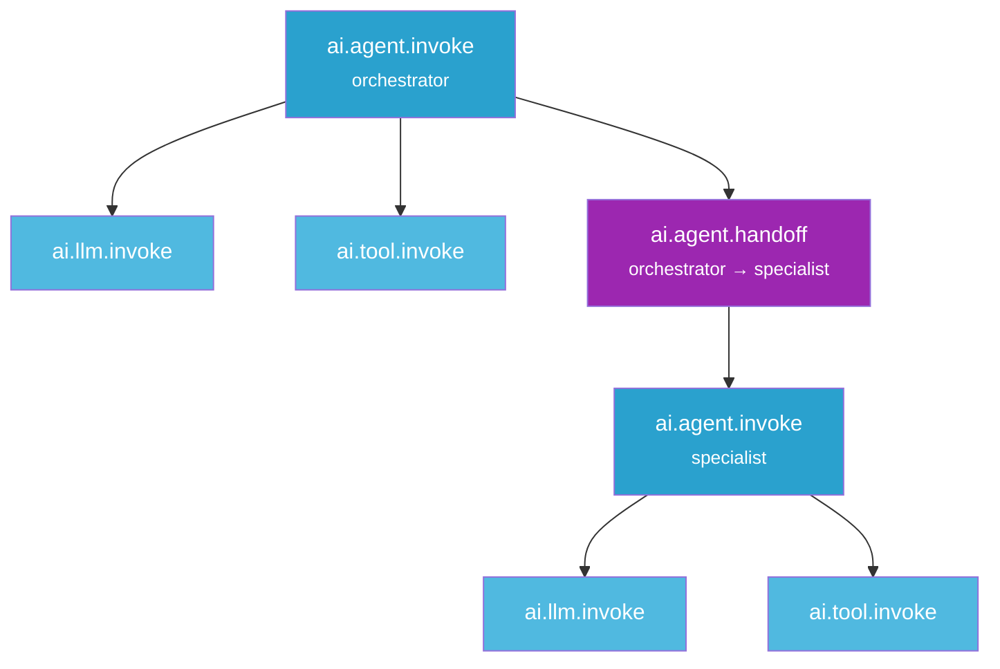

import { CodeBlock } from "@/components/CodeBlock";

# Semantic Conventions

Rhesis uses a semantic layer for consistent, framework-agnostic span naming across all AI operations.

Semantic conventions answer a specific question: *what actually happened inside this span?* Rather than naming spans after framework constructs like chains, pipelines, or agents, Rhesis names spans after the **primitive operation** they perform — an LLM call, a tool execution, a retrieval. This makes traces readable regardless of which framework or orchestration layer produced them, and lets Rhesis correctly interpret, visualize, and evaluate spans across different stacks.

The same span from LangChain, LlamaIndex, or a custom implementation looks identical in the trace viewer as long as it follows the convention.

## Naming Pattern

All span names follow the pattern: `ai.<domain>.<action>`

## Valid Span Names

### Primitive Operations

| Span Name | Constant | Description |
|-----------|----------|-------------|
| `ai.llm.invoke` | `AIOperationType.LLM_INVOKE` | LLM API call |
| `ai.tool.invoke` | `AIOperationType.TOOL_INVOKE` | Tool/function execution |
| `ai.retrieval` | `AIOperationType.RETRIEVAL` | Information retrieval |
| `ai.embedding.generate` | `AIOperationType.EMBEDDING_GENERATE` | Generate embeddings |
| `ai.rerank` | `AIOperationType.RERANK` | Reranking operation |
| `ai.evaluation` | `AIOperationType.EVALUATION` | Evaluation operation |
| `ai.guardrail` | `AIOperationType.GUARDRAIL` | Safety check |
| `ai.transform` | `AIOperationType.TRANSFORM` | Data transformation |

### Agent Operations

| Span Name | Constant | Description |
|-----------|----------|-------------|
| `ai.agent.invoke` | `AIOperationType.AGENT_INVOKE` | Agent execution |
| `ai.agent.handoff` | `AIOperationType.AGENT_HANDOFF` | Transition between agents |

## Using Constants

<CodeBlock filename="app.py" language="python">
{`from rhesis.sdk.telemetry.schemas import AIOperationType

# Primitive operations
AIOperationType.LLM_INVOKE          # "ai.llm.invoke"
AIOperationType.TOOL_INVOKE         # "ai.tool.invoke"
AIOperationType.RETRIEVAL           # "ai.retrieval"
AIOperationType.EMBEDDING_GENERATE  # "ai.embedding.generate"
AIOperationType.RERANK              # "ai.rerank"
AIOperationType.EVALUATION          # "ai.evaluation"
AIOperationType.GUARDRAIL           # "ai.guardrail"
AIOperationType.TRANSFORM           # "ai.transform"

# Agent operations
AIOperationType.AGENT_INVOKE        # "ai.agent.invoke"
AIOperationType.AGENT_HANDOFF       # "ai.agent.handoff"`}
</CodeBlock>

## Forbidden Span Names

Framework composition concepts are **rejected** with HTTP 422:

| Invalid Name | Reason |
|--------------|--------|
| `ai.chain.execute` | "Chain" is an orchestration pattern |
| `ai.workflow.start` | "Workflow" is a composition |
| `ai.pipeline.process` | "Pipeline" is infrastructure |

Note: `ai.agent.*` spans are valid — see [Agent Operations](#agent-operations) above.

## Attribute Constants

Use `AIAttributes` for span attributes:

<CodeBlock filename="app.py" language="python">
{`from rhesis.sdk.telemetry.attributes import AIAttributes

span.set_attribute(AIAttributes.MODEL_PROVIDER, "openai")
span.set_attribute(AIAttributes.MODEL_NAME, "gpt-4")
span.set_attribute(AIAttributes.LLM_TOKENS_INPUT, 150)
span.set_attribute(AIAttributes.LLM_TOKENS_OUTPUT, 200)`}
</CodeBlock>

### Model Attributes

| Constant | Key | Description |
|----------|-----|-------------|
| `MODEL_PROVIDER` | `ai.model.provider` | Provider (openai, anthropic) |
| `MODEL_NAME` | `ai.model.name` | Model identifier (gpt-4) |

### LLM Attributes

| Constant | Key | Description |
|----------|-----|-------------|
| `LLM_TOKENS_INPUT` | `ai.llm.tokens.input` | Input token count |
| `LLM_TOKENS_OUTPUT` | `ai.llm.tokens.output` | Output token count |
| `LLM_TOKENS_TOTAL` | `ai.llm.tokens.total` | Total token count |
| `LLM_TEMPERATURE` | `ai.llm.temperature` | Temperature parameter |
| `LLM_MAX_TOKENS` | `ai.llm.max_tokens` | Max tokens parameter |

### Tool Attributes

| Constant | Key | Description |
|----------|-----|-------------|
| `TOOL_NAME` | `ai.tool.name` | Name of the tool |
| `TOOL_TYPE` | `ai.tool.type` | Type (http, function, database) |

### Retrieval Attributes

| Constant | Key | Description |
|----------|-----|-------------|
| `RETRIEVAL_BACKEND` | `ai.retrieval.backend` | Backend (pinecone, weaviate) |
| `RETRIEVAL_TOP_K` | `ai.retrieval.top_k` | Number of results |

### Embedding Attributes

| Constant | Key | Description |
|----------|-----|-------------|
| `EMBEDDING_MODEL` | `ai.embedding.model` | Model name |
| `EMBEDDING_VECTOR_SIZE` | `ai.embedding.vector.size` | Vector dimensions |

### Agent Attributes

| Constant | Key | Description |
|----------|-----|-------------|
| `AGENT_NAME` | `ai.agent.name` | Name of the agent |
| `AGENT_HANDOFF_FROM` | `ai.agent.handoff.from` | Agent initiating the handoff |
| `AGENT_HANDOFF_TO` | `ai.agent.handoff.to` | Agent receiving the handoff |
| `AGENT_INPUT_CONTENT` | `ai.agent.input` | Agent input |
| `AGENT_OUTPUT_CONTENT` | `ai.agent.output` | Agent output |

### Operation Type Values

| Constant | Value | Description |
|----------|-------|-------------|
| `OPERATION_LLM_INVOKE` | `llm.invoke` | LLM operation |
| `OPERATION_TOOL_INVOKE` | `tool.invoke` | Tool operation |
| `OPERATION_RETRIEVAL` | `retrieval` | Retrieval operation |
| `OPERATION_EMBEDDING_CREATE` | `embedding.create` | Embedding operation |
| `OPERATION_RERANK` | `rerank` | Rerank operation |
| `OPERATION_EVALUATION` | `evaluation` | Evaluation operation |
| `OPERATION_GUARDRAIL` | `guardrail` | Guardrail operation |
| `OPERATION_TRANSFORM` | `transform` | Transform operation |
| `OPERATION_AGENT_INVOKE` | `agent.invoke` | Agent invocation |
| `OPERATION_AGENT_HANDOFF` | `agent.handoff` | Agent handoff |

## Events

Use `AIEvents` for span events:

<CodeBlock filename="app.py" language="python">
{`from rhesis.sdk.telemetry.attributes import AIEvents, AIAttributes

with tracer.start_as_current_span("ai.llm.invoke") as span:
    # Prompt event
    span.add_event(
        name=AIEvents.PROMPT,
        attributes={
            AIAttributes.PROMPT_ROLE: "user",
            AIAttributes.PROMPT_CONTENT: prompt_text,
        }
    )
    
    response = llm.invoke(prompt_text)
    
    # Completion event
    span.add_event(
        name=AIEvents.COMPLETION,
        attributes={
            AIAttributes.COMPLETION_CONTENT: response.text,
        }
    )`}
</CodeBlock>

### Event Names

| Constant | Value | Description |
|----------|-------|-------------|
| `AIEvents.PROMPT` | `ai.prompt` | Prompt sent to LLM |
| `AIEvents.COMPLETION` | `ai.completion` | LLM completion |
| `AIEvents.TOOL_INPUT` | `ai.tool.input` | Tool input |
| `AIEvents.TOOL_OUTPUT` | `ai.tool.output` | Tool output |
| `AIEvents.RETRIEVAL_QUERY` | `ai.retrieval.query` | Retrieval query |
| `AIEvents.RETRIEVAL_RESULTS` | `ai.retrieval.results` | Retrieval results |
| `AIEvents.AGENT_INPUT` | `ai.agent.input` | Agent input |
| `AIEvents.AGENT_OUTPUT` | `ai.agent.output` | Agent output |

## Trace Hierarchy

Spans nest inside each other to represent how operations compose at runtime. The examples below show two common shapes — a RAG pipeline and a multi-agent system.

### Single-Agent (RAG)

A retrieval-augmented generation flow: the user query is first embedded, the embedding is used to retrieve relevant context, and then a single LLM call synthesizes the final response.

### Multi-Agent

An orchestrator agent plans and delegates. When it needs a specialist, it hands off via `ai.agent.handoff` — the specialist then runs its own set of operations independently.

---

<Callout type="info">
  **Next:** Learn about [auto-instrumentation](/tracing/auto-instrumentation) for zero-config tracing.
</Callout>
