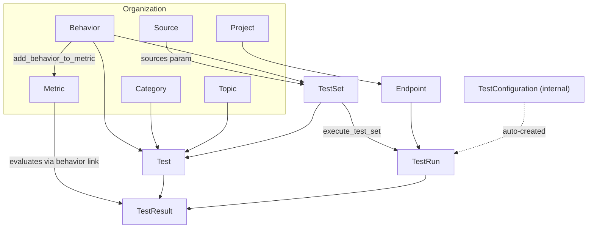

# Rhesis Platform Entity Model

How platform entities relate to each other and which MCP tools operate on them.

> When `mcp_tools.yaml` changes, keep this file and `tool-catalog.md` in sync.

---

## Entity graph

---

## Key relations

| Relation | Meaning | Tools |
|----------|---------|-------|
| Behavior ↔ Metric | Many-to-many; **required before test generation** | `add_behavior_to_metric`, `get_metric_behaviors`, `remove_behavior_from_metric` |
| TestSet → Test | Tests belong to a set | `generate_test_set`, `list_test_set_tests`, `get_test_set` |
| Source → TestSet | Sources ground **single-turn** generation only | `list_sources`, `create_source` → `generate_test_set` |
| TestSet + Endpoint → TestRun | Execution is always a pair | `execute_test_set` |
| TestRun → TestResult | Results scoped to a run | `list_test_results` with `$filter=test_run_id eq '…'` |
| Metric → TestResult | Scores when metric is linked to the test's behavior | `get_test_result`, `get_test_result_stats` |

**Resolution pattern:** `list_*` + `$filter` by name → use `id` in `get_*` / mutate / execute tools.

---

## Tool chains by intent

### Register and explore an endpoint

1. `list_projects` (if creating new endpoint)
2. `create_endpoint` → `check_endpoint`
3. `explore_endpoint` → `get_job_status` until SUCCESS

### Ground tests in documentation

1. `list_sources` with `$filter=contains(tolower(title), 'keyword')`
2. If no match: `create_source` (Manual + `content`, or Website + `url`)
3. `generate_test_set` with `sources: [{"id": "<uuid>"}]` (Single-Turn only)

### Create a full test suite

1. `list_behaviors`, `list_metrics` (reuse check)
2. `create_behavior` (new behaviors only)
3. `create_metric` or reuse existing
4. `add_behavior_to_metric` for every mapping (**all must complete before step 5**)
5. `generate_test_set` → `get_job_status` → `get_test_set` + `list_test_set_tests` (verify)
6. Offer `execute_test_set`

### Run and analyze

1. `execute_test_set` (test_set_identifier + endpoint_id)
2. `get_test_run` (accurate totals)
3. `get_test_result_stats` with `mode=all` and `test_run_id`
4. `list_test_results` filtered to failures
5. `get_test_result` on top 2–3 failures (read `reason` field)

### Fix a metric

1. `list_metrics` → resolve by name
2. `get_metric` (read `evaluation_prompt` and thresholds)
3. `update_metric` for precise field edits, OR `improve_metric` for NL instructions
4. `get_metric_behaviors` to confirm behavior links

### Undo a behavior–metric link

1. `get_metric_behaviors`
2. `remove_behavior_from_metric`

---

## Entity → tools quick reference

| Entity | List | Get | Create | Update | Other |
|--------|------|-----|--------|--------|-------|
| Project | `list_projects` | — | `create_project` | — | — |
| Endpoint | `list_endpoints` | `get_endpoint` | `create_endpoint` | `update_endpoint` | `check_endpoint`, `explore_endpoint` |
| Behavior | `list_behaviors` | — | `create_behavior` | `update_behavior` | — |
| Metric | `list_metrics` | `get_metric` | `create_metric`, `generate_metric` | `update_metric`, `improve_metric` | `add_behavior_to_metric`, `remove_behavior_from_metric`, `get_metric_behaviors` |
| TestSet | `list_test_sets` | `get_test_set` | `generate_test_set`, `create_test_set_bulk` | `update_test_set` | `list_test_set_tests`, `execute_test_set` |
| Test | `list_tests`, `list_test_set_tests` | — | (via test set tools) | — | — |
| Source | `list_sources` | — | `create_source` | — | — |
| TestRun | `list_test_runs` | `get_test_run` | (via `execute_test_set`) | — | `get_test_run_stats` |
| TestResult | `list_test_results` | `get_test_result` | — | — | `get_test_result_stats` |
